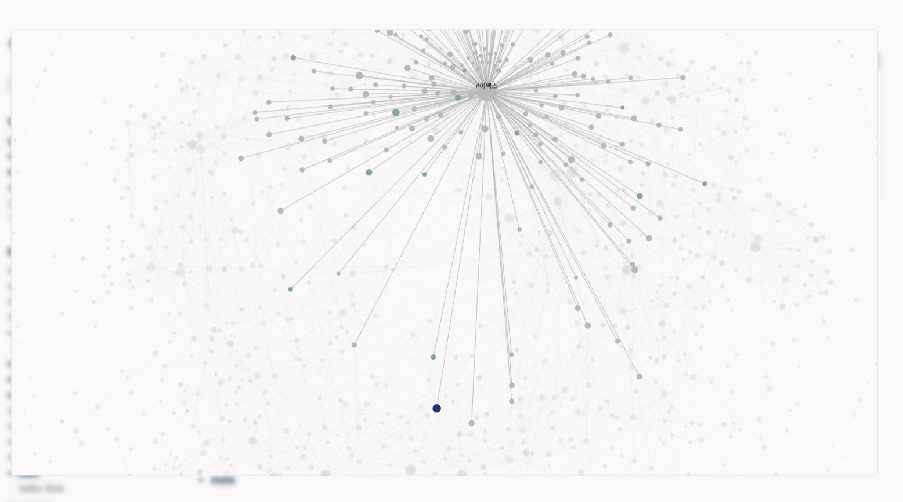
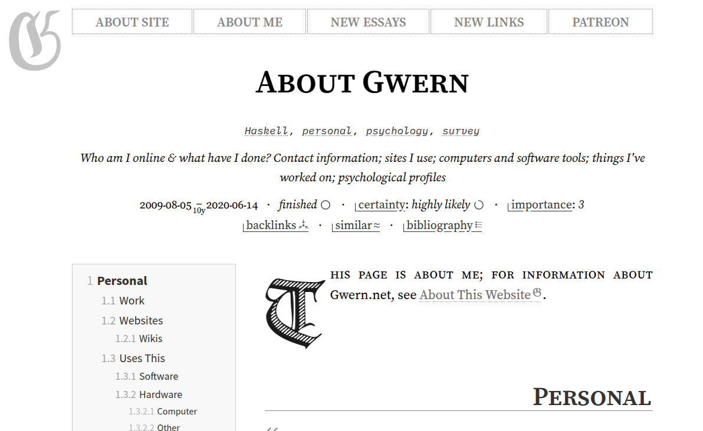
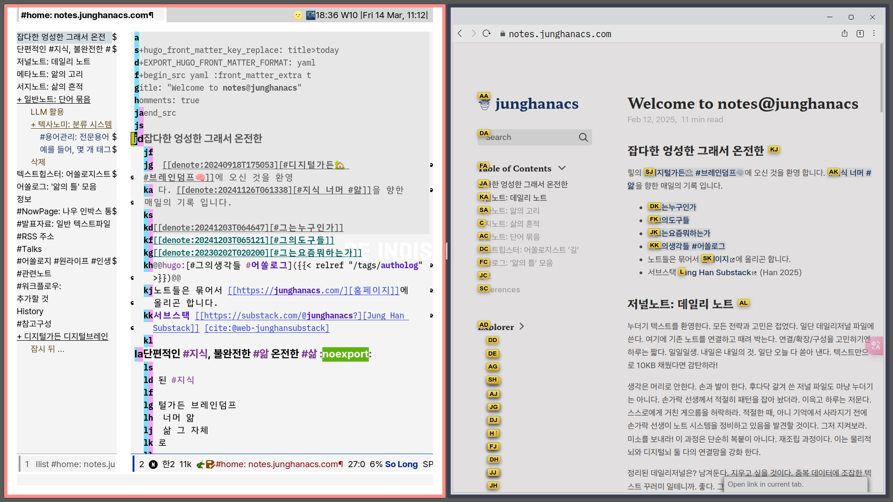

<!-- gid:20250314T152111 -->
[TOC]

[[TIP("이 노트에 대하여")]]
완성된 산출물이 아니라 미완의 흔적과 불완전함 속에서 창조가 솟아난다는 관점으로 디지털가든을 바라본다. 정리보다 생성의 공간으로서 가든의 의미를 선명하게 말하는 노트다.
[[/TIP]]

## 히스토리

-   [2026-06-25 Thu 13:30] 표준 구조 수선 — 관련메타 _관련노트_ 한 줄을 전면 배치하고, 본문 heading을 level-1로 정리.
-   [2025-05-19 Mon 11:23] 서브스택 이제 안한다.
-   [2025-03-18 Tue 09:48] 이미지 추가 및 글 수정 - 일단 가든 버전을 만들고 나서 업로드를 해야겠다.
-   [2025-03-14 Fri 15:21] 서브스택 뉴스래터 업로드
-   [2025-03-14 Fri 12:30] 서브스택 notes 초안 업로드
-   [힣: 어쏠로지스트: 뉴스레터](https://wikidocs.net/381365) 에 반영하라
-   [2025-03-14 Fri 15:21] 그래. 그래. <https://www.zotero.org/groups/5570207/junghanacs/search/%ED%97%A4%EB%B0%8D/titleCreatorYear/items/UHQQFQJ8/item-details>

## 관련메타

-   [디지털가든 브레인덤프 아날로그가든](https://wikidocs.net/380674) — 완성품이 아니라 자라는 정원으로서의 공개 공간.
-   [불완전주의자](https://wikidocs.net/380733) — 완벽주의를 내려놓고 불완전함 자체를 창조의 조건으로 보는 축.
-   [창조 창의 창발](https://wikidocs.net/380584) — 부족함에서 보충과 발명이 솟는 창조성의 자석.
-   [뉴스레터](https://wikidocs.net/380543) — 서브스택 시절 흔적과 authologist/newsletter 표면.
-   [어쏠로그](https://wikidocs.net/380758) — 힣의 발화 원석과 해설본을 가든에 회수하는 큰 흐름.
-   [메타도구 대장장이 호모파베르](https://wikidocs.net/380804) — 도구의 도구를 만드는 대장장이/호모 파베르 감각.

## BIBLIOGRAPHY

  에릭 호퍼. 1973. <i>인간의 조건 - 인간과 자연에 대한 아포리즘</i>. [https://www.yes24.com/Product/Goods/12245838](https://www.yes24.com/Product/Goods/12245838).

## 관련노트

-   [힣: 아무도 읽지 않는 블로그 디지털가든 왜 공개 하는가](https://wikidocs.net/381520) — 이 글의 직접 전사. 아무도 읽지 않아도 공개하는 이유.
-   [힣: 어쏠로지스트: 뉴스레터](https://wikidocs.net/381365) — 서브스택/뉴스레터 시절의 authologist 흔적.
-   [에릭호퍼 1902 길 위의 철학자 - 아포리즘 노동 인간 조건 영혼 연금술](https://wikidocs.net/382307) — 호퍼와 노동·불완전함·창조의 서지 앵커.
-   [GwernBranwen Gwern 위키 블로그 디지털가든 구루 장인](https://wikidocs.net/382300) — 아무도 읽지 않는 블로그 장인의 대표 사례.
-   [힣: 원석 날것을 휘갈긴다 — POSSE 너머 ROSSE, 그리고 일일일생으로의 회귀](https://wikidocs.net/381617) — 날것과 가든 회수의 후속 운영 원칙.
-   [힣: 링크드인 날것 공개면 — AI 크롤러 시대의 손가락 프롬프트](https://wikidocs.net/381631) — 불완전한 손가락 글이 공개면에서 프롬프트가 되는 다음 국면.

## 한 줄

> 디지털가든은 완성된 글의 전시장보다, 불완전한 손맛과 연결의 흔적에서 창조가 계속 솟는 정원이다.

## 시작 — 에릭 호퍼 Human Creativity에 대한 아포리즘

글이 안 나와서 그냥 서브스택에 편하게 쓴다. 말년의 헤밍웨이가 "글이 이제 써지지 않아!!!"라고 하고 얼마 뒤 생을 마무리 했다고 본 것 같은데. 파리 기행문에서 봤나? 아! 스콧 제랄드의 기행이 떠오른다. 아니, 아니야. 끝없는 꼬꼬무다. 하던 이야기 하자.

돌아와서!! 사실 어제 밤에 충격을 받았다. 알고리즘에게 추천 받을 일이 없는데 크레마클럽 NEW 전자책 목록에서 에릭 호퍼를 만난 것이다. 쓰고 보니 알고리즘이 아니네? 예스24 디스 같다. 사락에 메모 많이 썼다고 선물도 받은 사이잖아.

힣은 책을 귀로 듣기데 노하우가 있다. 노트에 간단히 써놓았는데 디지털가든에 퍼블리시는 안 했다. 아무도 안 보니까 이런 건 마음이 편하다. 누가 달라는 것도 아니다. 너무 좋은 방법인데 말이야.

다시 돌아와서, 에릭 호퍼한테 돌아가자! 그의 삶을 보니 이런! 헉! 만났어야 할 분 같다. 힣도 일용직 노동자 아닌가! 그래서 오늘 디지털가든 업데이트 중에 만난 문제를 해결하면서 TTS로 듣기를 시작했다. 요즘 힣이 사용 중인 디지털가든 엔진에 업데이트가 아주 많다. 반가운 일이다. 엔진 업데이트 하면서 꼬인 실타래를 풀면서 흘려 듣는 중에 뭔가 확 왔다. 확 오면 일단 멈춰야 한다. 딱 잡아야 한다. 이제 눈으로 보면서 듣는다 (눈으로 볼 때도 듣는다). 옮겨 보자. 평소에 맛은 잘 알지만 설명할 수 없는 그 것이다.

[[TIP("인용")]]
인간의 창조성의 원천은 그 불완전함에 있다. 인간은 자신에게 부족한 것을 보충하기 위해 창조력을 발휘한다. 특화된 기관이 없기 때문에 호모 파베르(무기와 도구의 제작자)가 되었고, 타고난 기술이 없기 때문에 이를 보완하기 위해 호모 루덴스(연주가, 장인, 예술가)가 되었다. 동물의 의사소통 수단인 텔레파시 능력이 없어 말을 하게 되었고, 본능의 무력함을 보완하기 위해 사색가가 되었다.

― 에릭 호퍼, 『인간의 조건』(에릭 호퍼 1973)
[[/TIP]]

오디오 듣기를 멈추고 심호흡을 한 뒤에 이 부분을 터치로 하이라이트 메모를 한다. 이렇게 하면 사락 독서 메모 목록에 들어간다. 기다릴 수 없기에 바로 맥스(텍스트 편집기 이맥스)로 텍스트를 보냈다.

힣은 전생이 있다면 아마 대장장이였을 거라고 떠들지 않는가? 대장장이가 누군가? 도구의 도구를 만들어 쓰는 특별한 장인이 아닌가?

호퍼가 말하는 도구, 예술, 그리고 불완전함에 깃든 창조는 디지털가든의 바탕이 아닌가? 힣에게 디지털가든은 블로그와는 다르다. 디지털가든은 구경하는 집이다. 노트들의 정원이다. 쓸적 구경하고 떠날 곳이다. 멀리서 볼 때 아름다운 것 같지만 막상 다가가면 보면 벌레 투성이로 보일 것이다. 오타와 띄어쓰기 오류는 내용을 더욱 엉성하게 보이게 할 것이다.

여기에 노트는 몇 줄 안되는데 이리저리 연결 링크는 왜 이렇게 많은가? 태그는 왜 했으며? 도대체 뭐가 애매하단 말인가? 이렇듯 디지털가든의 전체 상은 작성자만 알 수 있다. 이는 분명 AI한테 요청했다면 이렇게 안했을 것이다. 어쩌겠는가? 본인의 도구로 쌓아 올린 텍스트 창고인 것을. 예전에 힣은 이런 곳에 방문하면 주인장의 명성만 듣고는 정답이 여기있네! 하고 따라하기 바빴다.

[2025-03-16 Sun 05:11] 그들은 지금도 진화 중이다. 그들의 지금의 완성을 한번에 품을 수 있는가? 불가능한 일이다. 그저 시작을 해야 한다. 오늘의 완성에서 시작을 해야 한다. '도구'를 믿고 일단 삶을 담기를 시작해야 한다.

## 그렇다면 디지털가든을 공개하는 것의 의미는 무엇인가?

**(1) 텍스트 워크플로우의 완성** 을 의미한다.자기만의 도구들과 이 것들을 이용해서 읽고 쓰고 퍼블리싱하는 전체 워크플로우가 생겼다는 말이다. 꼭 편집기로 이맥스를 사용할 필요도 없으며, 조테로로 서지관리할 필요도 없다. 최신이 아니라 최적의 도구 모음을 지니게 되는 것이다. 자기만 쓰는 도구의 도구도 만들 수도 있다. 대장장이가 되는 것이며 호모 파베르 임을 드러내는 것이다.

**(2) 두 번째로 호모 루덴스의 측면** 에서 보자. 여기에 힣은 '기예가'라는 단어를 사용해왔다. 피아니스트는 공연 때 악보를 보지 않는다. 악보 보면서 예술을 담을 여유가 있을까? 없다. 의식적인 노력을 비워야, 즉 자기를 잊어야 혼이 담긴다 (무슨 소리냐고? 드라마 주인공이 하는 그거 말하는 건데).

아무튼 숙달의 지점에 이르러야 한다. 손이 알아서 써준다는 말. 손맛. 이게 무엇인가? 디지털가든에 글을 쓰면서 뭔가 연결의 흔적을 남기고 오타를 수정하고 등을 의식하지 않아도 자연스럽게 그렇게 되는 것이다. 요즘 노트 앱에는 자동으로 해준다는게 참 많다. 자동으로 해줄 테니까 중요한 일 하세요? 앗! 다음 말이 생각이 난다.

[[TIP("공부만 할 수 있도록 알아서 다 해주는데 왜 공부를 안하는거니?")]]
[[/TIP]]

쓰고 나니까 딱 맞는 예는 아닌 것 같다. 느낌 알 것이다. 디지털가든의 관점에서 본다면 손맛이 주는 리듬감을 해치는 것이다. 권투 선수도 스텝 맞춰서 주먹을 지르지 않던가? 물류 창고에서 박스에 물건 넣는 일도 한참 하면 리듬에 맞춰서 뭔가 자기만의 덧칠이 나오더라.

**(3) 마지막으로 불완전함을 받아들인다는 의미** 가 있다. 정말 어렵다. 우리는 얼마나 타인의 평가에 취약한가? 물론 머리로는 알고 있다. 다른 사람은 나에게 관심 없다는 것 말이다. 그럼에도 '나'는 다른 이들의 관심을 받기를 바라지 않는가? 꼬리에 꼬리를 물고 있다.

아무도 읽지 않는 블로그를 왜 운영하는가?라는 질문은 힣이 만든게 아니다. 그 질문을 던진 사람들은 그냥 블로거가 아니라 장인 수준에 오른 사람들이다. 경험을 통해서 본질에 대한 고민이 흘러 나온 것이다. 본인의 과거로 돌아가서 아무도 안 보는 블로그를 쓰고 있는 자기와 대면 한 것이다.

 지금 생각나는 장인 gwern.net&nbsp;[^fn:1]

그들이 AI를 안 쓸까? 아니다. 본인 도구에 AI 연동해서 아주 잘 활용 하고 있을 것이다. 새롭게 광고하는 그 AI 앱 없이도 이미 그 이상으로 활용하고 있을 것이다. 반대로 AI 앱 만든 사람이 따라한 것일 수도 있다. 어떻게 아냐고? 그들의 그렇게 쓰고 있으니까. 그들은 대부분 공개한다. 유명해져서 공개하는 것일까? 아니다. 기록을 쭉 따라가 보면, 그들의 허접함을 보게 될 것이다. 앞에 가서 면전에서 말해보라. 괜찮다. 그들은 웃을 것이다. 오히려 고맙다고 할 것이다.

## 조건 없이 불완전함을 받아들이는 것

좋아! 불완전함을 받아들일 테다. 창조가 이제 터져 나오겠지? 이렇게 생각한다면 창조의 영감이 오기 바로 직전에 때려 치게 될 것이다. 불완전함을 받아들이는 데에 조건은 붙일 필요가 없다.

[[TIP("인용")]]
창조의 영감이 오면 좋겠지만 오지 않더라도 상관 없어. 디지털가든을 가꾸는 과정에서 이미 많이 행복했거든. 정원을 가꾸며 격하게 분노가 터지던 그 일도 흘려 보낼 수 있었잖아. 가벼워졌어. 힣이란 놈이 지식도구를 떠들어 대서 뭔가 나올 거라 기대는 했지만 괜찮아. 이것으로도 충분해.
[[/TIP]]

오! 힣은 뿌듯하다. 조금 더 이야기를 들어보자.

[[TIP("인용")]]
사실. 영감이 지금 온다고 해도 알아볼 수 없을지 모르잖아. 흠... 힣이 대규모 업데이트했다고? 짜식. 잘하고 있군. 요즘도 충만하게 살고 있네. 앗. 보인다. 개떡 같은 그의 글이 읽혀진다. 그의 연결들이 보인다. 그의 생각이 읽힌다. 어떻게 된 거지? 다른 노트를 봐볼까?
[[/TIP]]

(랜덤노트 버튼을 누른다) 이건 뭐지?

고개를 들어 제목을 본다.

[하.산.하.라.](https://wikidocs.net/380809)

## 스크린샷

[^fn:1]: [About Gwern · Gwern.net - gwern.net](https://gwern.net/me)
