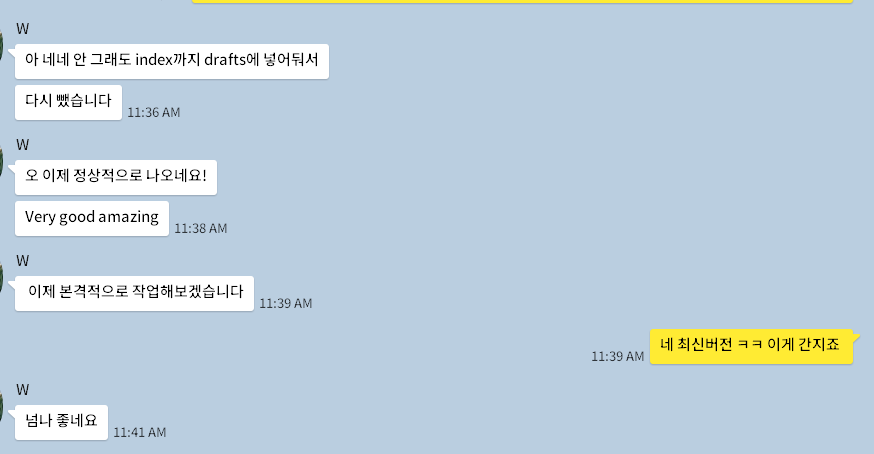

<!-- gid:20250316T044333 -->
[TOC]

[[TIP("이 노트에 대하여")]]
디지털가든을 만드는 지인의 기쁨과 여섯 살 아이에게 기술이 어떤 의미일지를 함께 떠올린다. 읽히지 않아도 행복한 창작과 기술의 순수한 기쁨을 다루는 글이다.
[[/TIP]]

## BIBLIOGRAPHY

## History

-   [2025-03-16 Sun 04:43] [2025-03-10::11:44 아무도 읽지 않는 디지털가든 만들고 행복한 지인 이야기 (feat. 6세 아이에게 기술이란)](https://wikidocs.net/380403.md#h-1b5eabad-97e9-4853-a0f2-dcb4b2db43c5/) 서브스택 노트에 쓴 글

## 좋으면 된 겁니다. 다 완성 된 거죠!

힣에게 Quartz 를 소개해 준 W씨는 거의 1년 째 대규모 업데이트를 하지 않고 있었다. 물론 로컬에는 노트를 쓰고 있다고 한다. 참고로 그는 옵시디언 사용자다.

아무래도 퍼블리싱 과정이 익숙하지 않다면 어려울 수 있다. 그러나 이 정도는 이제 새 스마트폰 설정 정도의 일이 될 것이다.

텔레비전이 처음 나왔을 때 당시 어른들이 느낀 어려움을 생각해 본다. 그리고 현재 우리집 6살 아이가 아이패드를 다루는 모습을 떠올려 본다. 아이에게 이는 어떤 의미에서 기술이 아니다.

아이에게 아빠가 쓰는 이맥스는 아이패드와 별 다르지 않다. 키보드로 이맥스만 신나게 두드리면 되는 일이다. 여기서 사실 대부분 컴퓨터로 하는 모든 일은 텍스트 조작이며 별도의 프로그램으로 나뉠 필요가 없다.

조금 더 과감하게 말하면 이맥스와 같은 도구에서 먼저 검증 되고 별도의 프로그램으로 분기하는 경우도 많다. 만드는 사람들이 누군지 생각해보라.

피아노를 연주하면 아름다운 선율이 공간을 가득 채운다. 귀로 그 아름다움을 받아들인다. 키보드로 연주를 해보자. 그러면 텍스트가 화면을 채운다. 눈으로 그 아름다움에 경의를 표한다. 그 텍스트는 새로운 공간에 옮겨지면(퍼블리시), 우리 눈은 다른 새로움을 맛보게 된다.

"오! 훌륭하구만 당신은 누구시오?" "(수줍게) 아.. 저는 이맥스라고 합니다. junghanacs님께 온전히 튜닝되어 있습니다."

놀랄 것도 없다. 6세 아이는 이 친구와 대화를 하기도 한다. 도구라는 가상의 신체를 가진 인공지능이라 점을 유심히 보아야 한다. Tool-Use 프로토콜을 이용하면 이 가상의 친구는 더 과감히 현실에 들어온다. 조금 더 선을 넘는다는 말이다.

삼천포로 이야기가 빠지고 말았다. 그럼에도 조금 더 빠지고 싶다. 1-2년 사이에 얼마나 많은 인공지능 코드 편집도구가 출시 되었는가? 얼마나 많은 노트 도구에 인공지능이라는 이름이 붙고 있는가?

다시 돌아오자. W씨가 본인 이야기가 나오길 기다리고 있다.

W씨는 Quartz 를 업데이트하면서 디지털가든을 비웠다 (로컬에 기존 노트들은 잘 있다고 한다). very good amazing 넘나 좋네요!가 자동반사 처럼 터진다.

화면에서 달라 보이는 것은 아래에 Quart 4.2.0 2024 -&gt; Quartz 4.4.0 2025 뿐이긴 하다만, 힣은 간지!를 외치며 경탄한다 (수면 아래 대규모 업데이트가 이루어진 것임).

힣은 이제 긴 숨을 내쉰다. 그리고 한 사람의 완성을 본다. 지금 '좋음'에서 말이다. 좋으면 된 것. 다 완성이라는 것. 이 하나가 디지털가든을 그리고 더 나아가 온전한 삶을 만들 것임을 본다. 그의 손가락 열 마디에 영감의 포스가 함께하길.

