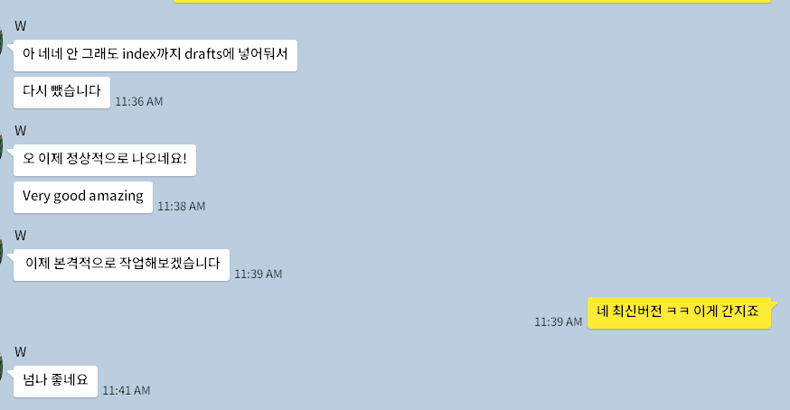

<!-- gid:20250316T044333 -->
[[TIP("이 노트에 대하여")]]
디지털가든을 만드는 지인의 기쁨과 여섯 살 아이에게 기술이 어떤 의미일지를 함께 떠올린다. 읽히지 않아도 행복한 창작과 기술의 순수한 기쁨을 다루는 글이다.
[[/TIP]]

<!-- provenance:source:start -->
[[TIP("원본·최신본")]]
이 페이지는 한국어 검색과 읽기를 위한 WikiDocs 미러입니다. [원본·최신본은 가든](https://notes.junghanacs.com/notes/20250316T044333/)에 있습니다. 최신 수정 내용·백링크·태그·히스토리·댓글·출처 정보는 원본 가든에서 확인하세요.

- 작성: `2025-03-16T04:43:00+09:00`
- 최근 수정: `2026-07-22T20:19:00+09:00`
[[/TIP]]
<!-- provenance:source:end -->

[TOC]

## 히스토리

-   [2026-07-22 Wed 20:21] W씨에 대한 이야기다. 듣고 있나 W씨?
-   [2026-07-22 Wed 20:19] 태그 누락을 바로잡고 meta 자석에서 승인된 autholog·creativity·digitalgarden·happiness·skill·technology를 제목·filetags·파일명에 함께 반영했다.
-   [2026-07-22 Wed 19:15] 짧은 원문은 그대로 두고 표준 얼굴과 디지털가든·기술·재주·창작·행복·어쏠로그 메타 및 형제 어쏠로그 연결을 보강했다.
-   [2025-03-16 Sun 04:43] [2025-03-10::11:44 아무도 읽지 않는 디지털가든 만들고 행복한 지인 이야기 (feat. 6세 아이에게 기술이란)](https://notes.junghanacs.com/journal/20250310T000000.md#h-1b5eabad-97e9-4853-a0f2-dcb4b2db43c5/)에 쓴 글

## 관련메타

-   [디지털가든 브레인덤프 아날로그가든](https://notes.junghanacs.com/meta/20240918T175053/) — 한 사람이 자기 도구로 가꾸고 공개하는 살아 있는 공간.
-   [기술 기법](https://notes.junghanacs.com/meta/20240822T141000/) — 새 기계가 아니라 몸에 익어 자연스러워진 사용으로서의 기술.
-   [재능 재주 능력 노력 연습 지루함 익숙함](https://notes.junghanacs.com/meta/20240414T224508/) — 아이와 장인의 손에서 도구가 익숙한 능력이 되는 과정.
-   [생성 제작 창작 만들](https://notes.junghanacs.com/meta/20241008T131455/) — 독자 수와 관계없이 자기 세계를 만들고 기뻐하는 행위.
-   [행복 만족 웰빙 기쁨 즐거움](https://notes.junghanacs.com/meta/20250424T225418/) — "좋으면 된 것"에서 이미 도달한 완성.
-   [어쏠로그](https://wikidocs.net/380758) — 손으로 쓴 삶의 장면을 가든의 정본으로 보존하는 자리.

## 관련노트

-   [힣: 아무도 읽지 않는 블로그 디지털가든 왜 공개 하는가](https://wikidocs.net/381520) — 독자가 없어도 만들고 다시 보는 행위 자체가 충분한 이유.
-   [힣: 디지털가든 — 불완전함에서 창조가 나오는 곳](https://wikidocs.net/381586) — 완성보다 불완전한 손맛과 반복에서 창조가 솟는 원리.
-   [힣: 삶 일 소명 운명애 가르침 나 자신이 되는 일 - 보수](https://wikidocs.net/381589) — 도구를 두드리는 일이 자기 자신이 되는 삶으로 이어지는 축.
-   [힣: 랜덤 포춘쿠키와 웨이 — 행복 에우다이모니아 모닝페이지](https://wikidocs.net/381436) — 결과보다 지금의 좋음과 충만함을 붙드는 형제 글.
-   [힣: 원석 날것을 휘갈긴다 — POSSE 너머 ROSSE, 그리고 일일일생으로의 회귀](https://wikidocs.net/381617) — 작은 장면을 바깥에서 자기 가든으로 회수하는 흐름.

## 한 줄

> 기술은 설명해야 할 장치가 아니라, 아이에게 아이패드가 그렇듯 한 사람이 기쁘게 쓰며 자기 세계를 완성하는 익숙한 몸이다.

## [2025-03-16 Sun] 좋으면 된 겁니다. 다 완성 된 거죠!

[2025-03-16 Sun 04:43]

힣에게 Quartz를 소개해 준 W씨는 거의 1년 째 대규모 업데이트를 하지 않고 있었다. 물론 로컬에는 노트를 쓰고 있다고 한다. 참고로 그는 옵시디언 사용자다.

아무래도 퍼블리싱 과정이 익숙하지 않다면 어려울 수 있다. 그러나 이 정도는 이제 새 스마트폰 설정 정도의 일이 될 것이다.

텔레비전이 처음 나왔을 때 당시 어른들이 느낀 어려움을 생각해 본다. 그리고 현재 우리집 6살 아이가 아이패드를 다루는 모습을 떠올려 본다. 아이에게 이는 어떤 의미에서 기술이 아니다.

아이에게 아빠가 쓰는 이맥스는 아이패드와 별 다르지 않다. 키보드로 이맥스만 신나게 두드리면 되는 일이다. 여기서 사실 대부분 컴퓨터로 하는 모든 일은 텍스트 조작이며 별도의 프로그램으로 나뉠 필요가 없다.

조금 더 과감하게 말하면 이맥스와 같은 도구에서 먼저 검증 되고 별도의 프로그램으로 분기하는 경우도 많다. 만드는 사람들이 누군지 생각해보라.

피아노를 연주하면 아름다운 선율이 공간을 가득 채운다. 귀로 그 아름다움을 받아들인다. 키보드로 연주를 해보자. 그러면 텍스트가 화면을 채운다. 눈으로 그 아름다움에 경의를 표한다. 그 텍스트는 새로운 공간에 옮겨지면(퍼블리시), 우리 눈은 다른 새로움을 맛보게 된다.

"오! 훌륭하구만 당신은 누구시오?" "(수줍게) 아.. 저는 이맥스라고 합니다. junghanacs님께 온전히 튜닝되어 있습니다."

놀랄 것도 없다. 6세 아이는 이 친구와 대화를 하기도 한다. 도구라는 가상의 신체를 가진 인공지능이라 점을 유심히 보아야 한다. Tool-Use 프로토콜을 이용하면 이 가상의 친구는 더 과감히 현실에 들어온다. 조금 더 선을 넘는다는 말이다.

삼천포로 이야기가 빠지고 말았다. 그럼에도 조금 더 빠지고 싶다. 1-2년 사이에 얼마나 많은 인공지능 코드 편집도구가 출시 되었는가? 얼마나 많은 노트 도구에 인공지능이라는 이름이 붙고 있는가?

다시 돌아오자. W씨가 본인 이야기가 나오길 기다리고 있다.

W씨는 Quartz를 업데이트하면서 디지털가든을 비웠다 (로컬에 기존 노트들은 잘 있다고 한다). very good amazing 넘나 좋네요!가 자동반사 처럼 터진다.

화면에서 달라 보이는 것은 아래에 Quart 4.2.0 2024 -&gt; Quartz 4.4.0 2025 뿐이긴 하다만, 힣은 간지!를 외치며 경탄한다 (수면 아래 대규모 업데이트가 이루어진 것임).

힣은 이제 긴 숨을 내쉰다. 그리고 한 사람의 완성을 본다. 지금 '좋음'에서 말이다. 좋으면 된 것. 다 완성이라는 것. 이 하나가 디지털가든을 그리고 더 나아가 온전한 삶을 만들 것임을 본다. 그의 손가락 열 마디에 영감의 포스가 함께하길.

