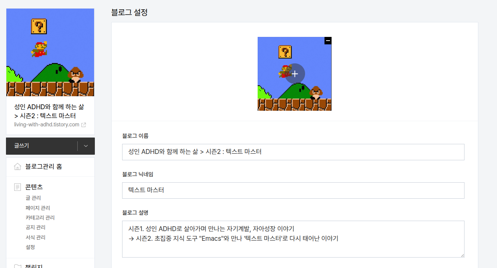
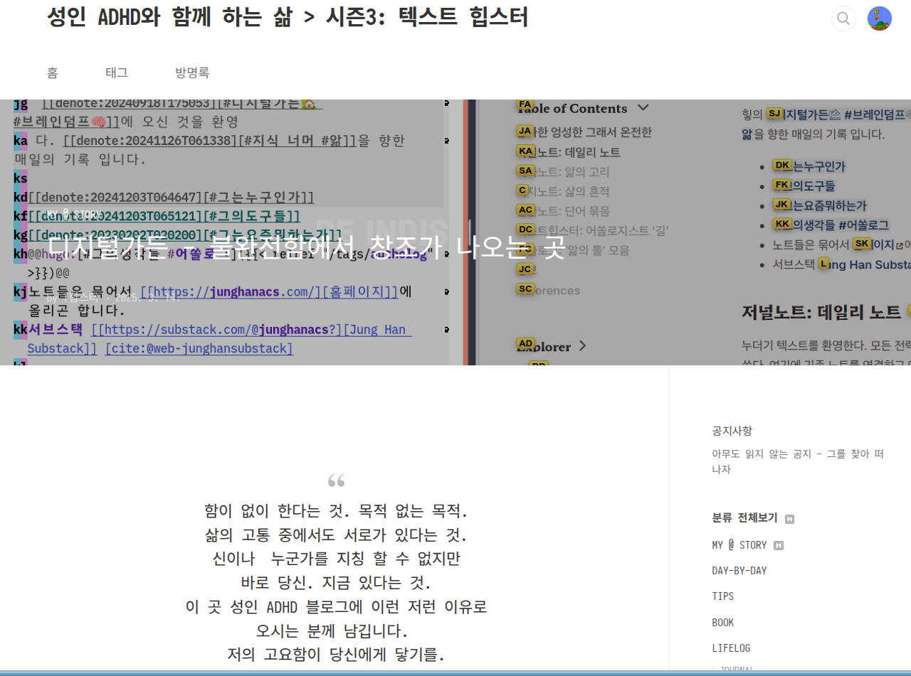

<!-- gid:20250316T044555 -->
[TOC]

[[TIP("이 노트에 대하여")]]
성인 ADHD라는 오래된 주제를 다시 어떻게 써 나갈지 시즌3라는 이름으로 재시작하려는 노트다. 자기 경험과 공개 글쓰기의 다음 리듬을 모색하는 기록이다.
[[/TIP]]

## BIBLIOGRAPHY

  junghanacs. n.d. “성인 Adhd와 함께 하는 삶 : 티스토리.” Accessed September 22, 2024. [https://living-with-adhd.tistory.com](https://living-with-adhd.tistory.com).

## History

-   [2025-03-16 Sun 04:45] [티스토리](https://notes.junghanacs.com/meta/20240322T053641/) 블로그. 시즌3. 노트가 없네. 파놓아야겠다.

## 성인 ADHD와 함께 하는 삶 시즌1 시즌2

(junghanacs n.d.)

-   

-   junghanacs
-   시즌1. 성인 ADHD로 살아가며 만나는 자기계발, 자아성장 이야기 → 시즌2. 초집중 지식 도구 "Emacs"와 만나 '텍스트 마스터'로 다시 태어난 이야기
-   2024-09-20 내보내기 하면 좋을 것

-   내 블로그로 내보내고 그 다음에 완전 자동화 해서 티스토리로 내보내야 한다. 그래야

시퀀스가 맞다. 데이터도 마찬가지다.

### 스크린샷

## 성인 ADHD와 함께 하는 삶 시즌3: 텍스트 힙스터

→ 시즌3. 텍스트 힙스터를 알리기 위해 산에서 내려온 텍마. 위버멘쉬를 외치다! Übermensch

시즌2. 초집중 지식 도구 "Emacs"와 만나 '텍스트 마스터'로 다시 태어난 이야기 시즌1. 성인 ADHD로 살아가며 만나는 자기계발, 자아성장 이야기 블로그 설정

<https://living-with-adhd.tistory.com/m/>

<https://substack.com/profile/151500132-jung-han/note/c-99625007>

### [아무도 읽지 않는 공지 - 그를 찾아 떠나자](https://notes.junghanacs.com/notes/20250313T105007/)

### [소명이 어떻게 급료 대장에 오를 수 있는가](https://notes.junghanacs.com/notes/20250316T044013/)

[[TIP("인용")]] 여기 적는 ADHD를 위한 한 마디. 어때? 미친듯 집중해서 살고 있어 보니까 완전 아래 이야기에 백퍼센트 공감 돼. 분명 세상의 눈으로 보기엔 힣은 실패일지 몰라. 근데 그게 뭐가 중요해? 어짜피 그런 말 들을 짬도 없어 왜? 하이퍼포커스 모드라서. 인간의 진화라 생각하고 받아들여. 거부하지 말고. 아. 책읽기? 힣은 읽지 않아 귀로 들어. 읽으면 지루하잖아 - 힣 ― 저자명, 『책』 [[/TIP]] [디지털가든 - 불완전함에서 창조가 나오는 곳](https://notes.junghanacs.com/notes/20250314T152111/)

포스팅을 하고 여기에 하나를 붙인다.

[[TIP("인용")]]
함이 없이 한다는 것. 목적 없는 목적.  삶의 고통 중에서도 서로가 있다는 것.  신이나 누군가를 지칭 할 수 없지만  바로 당신. 지금 있다는 것.  이 곳 성인 ADHD 블로그에 이런 저런 이유로  오시는 분께 남깁니다.  저의 고요함이 당신에게 닿기를. 
[[/TIP]]

해줄 수 있는 말 뿐.

