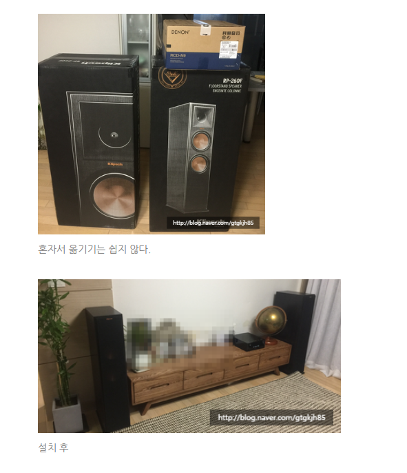
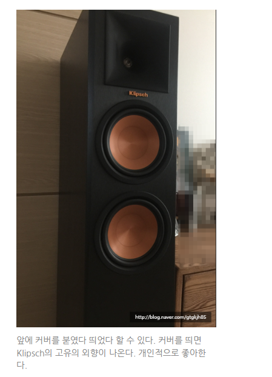
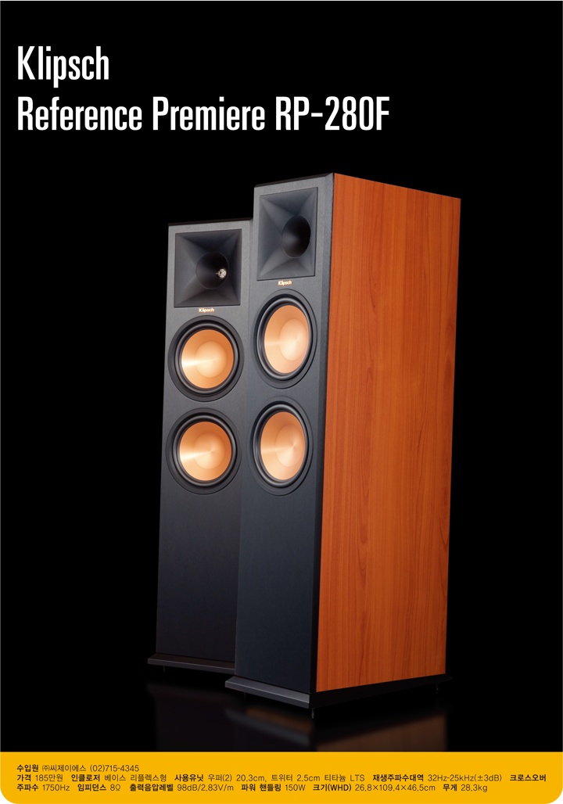

<!-- gid:20250319T054757 -->
[[TIP("이 노트에 대하여")]]
Denon과 Klipsch 같은 기기를 떠올리며 톨보이 기반 하이파이 오디오 시스템의 감각을 그려 본다. 도구를 기능을 넘어 삶의 분위기와 연결하는 힣식 취향 노트다.
[[/TIP]]

## BIBLIOGRAPHY

  김갑수. 1998. <i>삶이 괴로워서 음악을 듣는다</i>. [https://www.yes24.com/product/goods/20635](https://www.yes24.com/product/goods/20635).
  조윤범. 2008. <i>조윤범의 파워클래식 1</i>. [https://www.yes24.com/product/goods/3070391](https://www.yes24.com/product/goods/3070391).

## History

-   [2025-06-15 Sun 12:10] 어쏠로그로 옮김 - [2025-03-19 Wed 05:47] 2017년도에 구입한 오디오 시스템. 수리하는 겸 노트 옮김 2025 왜 어쏠로그인가 [2025-06-15 Sun 12:12] 초등학생 힣은 왜 클래식을 사랑했는가? 삶이 괴로워서 음악을 듣는다란 책은 무엇인가? 왜 이 기록은 버려지지 않고 남았는가? 남은 대부분 노트는 사라졌거나 이 곳에 옮기지 않았는데 말이다. 그래 음악. 경외. 음악은 다 들을 필요가 없다. 베토벤의 운명의 따다다단에 따로 이미 완성 된 것이다. 따오. 따따오. 2018 우리집 오디오 구입 후기 [2018-02-10 Sat 05:55] 작년 이맘 때에 구입한 오디오 시스템. 살 때는 이것저것 알아보고 열과 성을 다했었는데, 막상 구입하고 나니 거의 잊고 살았다. 모델명까지 잊었었다니 믿을 수가 없다. 그래서 적어 놓는다. - 데논 RCD-N9 <https://is.gd/4Mg6y3> 최저가 525,000원 - 클립쉬 레퍼런스 프리미어 RP-260F <https://is.gd/GkjlrV> 최저가 1,168,600원 토요일에 시간을 내어 아내와 함께 가서 청음도 해보고 샀는데, 역시 오디오는 직접 가서 들어보고 사야된다. 가기 전에 나름대로 기준을 잡는게 중요하다. [[TIP("노트")]] 합리적인 가격대 (총알을 고려한다) 거실 테이블과의 인테리어 조화 CD 플레이어 가능 (보유 중인 클래식 CD 전집) 블루투스 연동 스트리밍 가능 프로젝터와 연결하여 영화 감상 시 사용 예정 AS 이슈가 적은 모델 인티 앰프는 최신 기종이면 좋을 듯 톨보이 스피커 고려 [[/TIP]] 이정도 생각을 했었다. 그리고 모 업체들에 게시판에 아래와 같이 질문도 했었다. 입문자구요, 클래식 및 재즈를 주로 들을 예정이고, 아내는 휴대폰 연결해서 스트리밍이나 영화를 보고 싶다고합니다. 어디서 보니, Klipsch(클립쉬) R-28F 이 녀석이 소리가 괜찮다고 해서요. 이 물건으로 엠프 패키지를 봤습니다. 1. 고민하고 있는 제품군 Klipsch(클립쉬) R-28F + Denon(데논) RCD-N9 오디오패키지 Klipsch(클립쉬) R-28F + Marantz(마란츠) M-CR611 오디오 패키지 1. 엠프 관련 데논이랑 마란츠 제품인데요. 스펙상으로는 비슷한 것 같고 디자인은 데논이 더 괜찮아 보입니다. 둘 중에 궁합적으로 추천하신다면 뭐가 좋을까요? 1. 청음 관련 위의 패키지 구성을 청음 가능할까요? 1. 아파트 거실 설치시 진동 및 소음 문제 거실에 설치할 경우에 민원 발생 소지가 있는지 궁금합니다. 뻔한 질문이라. 그리고 직접 가보지 않고는 평가를 하기가 쉽지 않다. 막상 가면 재고가 많거나, 싸게 들여온 제품을 추천하는 경우가 많다. 해외 리뷰를 좀 관심있게 보았는데. 아래 싸이트를 확인해보자. 오디오라는게 개인의 취향을 따라가기 때문에, 평가하기가 어렵지만. 나는 가!성!비!를 기준으로 생각했다. 사진 설명을 입력하세요. <http://www.toptenreviews.com/electronics/home-entertainment/best-floor-standing-speakers/> 다행히 차가 대형 SUV라서 싣는게 가능했다. 혼자서 옮기기는 쉽지 않다. 설치 후  앞에 커버를 붇였다 띄었다 할 수 있다. 커버를 띄면 Klipsch의 고유의 외향이 나온다. 개인적으로 좋아한다.  모아둔 클래식 CD, 뮤지컬 CD를 주로 듣는다. 평소에 켜놓을 때는 엠프에서 지원하는 인터넷 라디오 기능을 이용해서 Linn Jazz를 듣는다. The successful Label Linn Records presents on this online radio station its best jazz material, with new interpretations, the classics and original versions. / radio.net – Radio your way linnjazz.radio.net <http://linnjazz.radio.net/> 무작정 틀어 놓는 것보다는 음악을 알고 사랑하기 위해서 책을 같이 본다. 두권다 아끼는 책이다. 최근에 "삶이 괴로워서 음악을 듣는다"는 다시 보고 있다. 아마 절판되었을 거다. 오래된 책이라. 콰르텟엑스의 조윤범님의 클래식 입문서도 참 좋은 책이다. 쉽고 재미있게 읽을 수 있다. 삶에서 음악은 중요하다. 특히 힘들 때 일수록 위로가 된다. 나름의 거금을 들여서 산 오디오. 관심이 없으면 무용지물이 된다. 오디오는 사실 중요하지 않다. 사실 집에 있는 미니오디오를 더 많이 쓴다. 나름 고가의 제품인데 굳이 이정도 살필요가 있나 싶다. (내가 산것이라 아니라 당당하게 말할 수 있다) 최저가 257,010원 <https://is.gd/JQZEPZ> 그럼 매일 듣자. 2017 하이파이 시스템 조사 [2017-03-13 Mon 05:48] - 합리적인 가격대 거실 테이블과의 인테리어 - CD 플레이어 가능 (클래식 음악) - 블루투스 연동 - 스트리밍 가능 - 프로젝터와 연결하여 영화 감상 시 사용 - AS 이슈가 적은 모델 - 캐임브리지 스피커 - 인티 앰프는 최신 기종이면 좋을 듯 - 톨보이 스피커가 좋다. 2015 Klipsch RP-280F - 오랜 친구를 다시 만난 즐거움 - [2025-03-19 Wed 06:02] 링크를 잊어서 그냥 원문 붙여 놓음 출처 : 월간오디오 2015. 3월호 Cover Story 출처 카페 &gt; 클립쉬 그룹 공식 커뮤니티 .. | kk 카페지기 원문 <https://cafe.naver.com/klipschkorea/917> 개인적으로 클립쉬 스피커를 참 오랫동안 애용했다. 한 가지 모델만 쓴 것은 아니고, 포르테부터 시작해서 라 스칼라까지 두루두루 사용했다. 물론 그 중에 라 스칼라가 제일 만족스러웠지만, 설치상의 애로 사항도 많았고, 한밤중에 이웃의 불평을 사기도 했다. 나중에 기호가 변해서 내치고 말았지만, 두고두고 후회가 된다. 그런 가운데 이른바 헤리티지 시리즈로 통하는 고전적인 제품들뿐 아니라, 새롭게 만든 모델들도 상당히 좋다는 것을 깨달았다. 그 후, 오랜 기간 클립쉬와 인연이 닿지 않다가 이번에 갑작스럽게 대면하고 나니 만감이 교차한다. 우선 RP-280F라고 명명된 본 기는, 최신 기술이 동원된 내용을 갖고 있으면서, 가격적으로도 상당히 매력적이다. 솔직히 구형 혼 타입 스피커들의 공통적인 문제점 중의 하나는, 고역과 저역이 따로 논다는 데에 있다. 아무래도 당시의 기술로는 제트기처럼 빨리 움직이는 고역을 우퍼가 쫓아가지 못했던 것이다. 아주 초창기로 거슬러 올라가면, 이른바 알니코나 페라이트가 아닌 전자석을 쓰고 있는데, 이렇게 해줘야 그런대로 시간축이 맞는다. 하지만 세월이 흐르고, 드라이버의 성능이 개선되고, 신소재가 개발됨에 따라, 이런 간극은 점차 줄었다. 본기의 경우, 하등의 시간차를 느끼지 못했으니, 이 부분만 갖고도 감지덕지할 만하다. 우선 외관을 보면, 맨 위에 전통적인 혼이 나 있는데, 좀 구성이 다르다. 이른바 사각형 개구부가 아니라 원형으로 되어 있기 때문이다. 혼의 모양이 사각형이냐, 원형이냐는 상당히 민감한 문제다. 리니어리티나 공진 대책 등을 따지면 당연히 원형이 맞다. 솔직히 진동판 자체가 원형 아닌가? 참고로 트위터에 쓰인 소재는 티타늄 계열. LTS(Linear Travel Suspension)이라는 신기술이 투입되어 있다. 당연히 반응이 빠르고, 가벼우며, 민감하다. 이를 위해 혼 주변에 일종의 고무 재질을 투입해서 반사파까지 차단한 것은 여러모로 고무적이다. 한편 이와 커플링되는 우퍼의 경우, 그 진동판에 있어서 최신 기술의 덕을 톡톡히 보고 있다. 세라메탈릭이란 소재로, 그 자세한 내용은 알 수 없지만, 일체의 왜곡을 제거하고 분할 진동을 억제하며 놀라운 스피드를 구축했다는 점에서 일체 토를 달지 않게 한다. 이로써 우퍼가 완벽하게 트위터에 걸맞은 내용을 확보한 것이다. 참고로 본 기가 커버하는 것은 비교적 광대역이다. 밑으로는 32Hz나 되고, 위로는 25kHz까지 뻗는다. 과거의 혼 타입이 17kHz라는 벽을 넘어서지 못한 것을 감안하면, 정말로 놀랄 만한 스펙이다. 인클로저 자체는 투박한 직사각형 스타일로, 첫 눈에 확 다가오지 않지만, 무려 98dB에 이르는 감도라던가, 트랙트릭스 기술로 무장한 포트 등에서 나오는 자연스러운 음에 취하다 보면 솔직히 이런 디자인은 큰 문제가 되지 않는다. 본 기가 속한 RP는 'Reference Premiere'이라는, 일종의 톱 시리즈로, 그 중에서도 본 기가 최고를 점하고 있다. 당연히 최상의 기술적 배려가 되어 있을 것이다. 또 시네마틱 사운드의 재현을 목표로 삼고 있으므로, 과거 웨스턴 일렉트릭이 누렸던 극장에서의 영광을 재현하고자 하는 의욕도 숨어 있을 것이다. 참고로 본 기의 시청을 위해 플리니우스 카이타키 프리앰프와 P10파워 앰프 세트에 럭스만 D-06u SACD 플레이어를 매칭했다. 약간 오버이기는 하지만, 내용은 무척 좋았다. 나중에 기회가 되면 진공관 앰프를 걸어보고도 싶다. 첫 곡으로 들은 세자르 프랭크의 바이올린과 피아노를 위한 소나타 A장조. 피레스와 뒤메이 콤비의 연주인데, 확실히 새김이 깊고, 농도가 진하다. 피아노의 타건은 강력한 터치와 함께 긴 여운을 동반하고 있으며, 바이올린은 강약장단의 차이가 명료하게 표출된다. 과연 클립쉬에서 이렇게 아름다운 현을 들으리라 짐작이나 했던가? 마치 몇 겹의 베일을 벗긴 듯한 신선한 음이다. 대신 조금만 잘못 컨트롤하면 샛길로 빠질 수도 있다. 그만큼 민감하고 섬세한 것이다. 사용자의 노련한 요령이 필요한 제품이라 하겠다. 이어서 마르틴 그루빙거가 연주하는 'Introitus'. 과연 타악기의 펀치력이 놀랍다. 북의 진동이나 잔향, 텐션, 심지어 질감까지 정확히 포착된다. 그 파괴력에 아연 질색해버린다. 거기에 차분히 얹어지는 남성 코러스의 중후함이나 다양한 퍼커션으로 전개되는 현대 음악과 같은 진지함 등, 감상의 여러 요소들이 아낌없이 제대로 드러난다. 과연 스피커는 사이즈로 말하는 것일까? 마지막으로 오스카 피터슨 트리오의 'You Look Good to Me'. 역시 재즈에서 클립쉬 계열의 솜씨는 거의 득도한 수준. 기분 좋게 찰랑거리는 심벌즈에 바닥을 두드리는 킥 드럼, 끈끈하게 전개되는 베이스 라인, 게다가 전면에 부각되는 피아노의 강력한 타건. 그렇다. 재즈는 기본적으로 힘이 동반되어야 하고 또한 리듬이 살아있어야 한다. 문득 이 음에서 다시 한 번 재즈에 대한 열정이 되살아나고 있음을 느낀다. 오로지 재즈 재생만 갖고도 손에 넣고 싶은 스피커라 하겠다.  관련도서링크 삶이 괴로워서 음악을 듣는다 (김갑수 1998) - 김갑수 - 시인 김갑수는 휴식 시간에 음악을 듣는 것이 아니라 음악을 듣기 위해 휴식을 취하는 것 같다. 한 곡을 듣고 나면 그 음악을 듣느라 소비한 에너지를 다시 보충해야 하지 않을까 싶을 만큼 그가 보여주는 음악적 집중도는 상당하다. 그의 삶과 음악에 대한 열정과 사... - 1998 조윤범의 파워클래식 1 (조윤범 2008) - 조윤범 - 예당아트TV의 [조윤범의 파워클래식]의 진행자 바이올리니스트 조윤범의 클래식 에세이. 꽁지머리 바이올리니스트 조윤범은 \`이미 벌어질 대로 벌어진 클래식과 대중 사이의 간극을 어떻게 좁힐 것인가?\`, \`어떻게 하면 보다 많은 사람들을 클래식의 매력에 빠지게 할 ... - 2008 로그 [2025-03-19 W11](https://notes.junghanacs.com/journal/20250317T000000/)

#### @user 톨보이 스피커에 대해서 알려줘

@assistant **\*톨보이 스피커** 는 80cm 이상의 길이로 날씬한 형태의 스피커입니다. 북쉘프 스피커보다 저음과 음의 스케일이 크게 설계되어 있으며, 플로어스탠딩 스피커보다도 더 큰 저역대와 에너지를 제공합니다[1][3]. 톨보이 스피커는 공간을 적게 차지하면서도 대형 스피커와 비슷한 저역대 재생이 가능합니다[1]. 그러나 중음의 해상도는 북쉘프 스피커에 비해 떨어질 수 있으며, 튜닝이 어렵고 저역량이 과도할 경우 마스킹이 발생할 수 있습니다[3][5].

**장점:**

-   깊게 떨어지는 저역대와 에너지, 펀치력
-   공간 효율적

**단점:**

-   중음 해상도에서 북쉘프보다 떨어질 수 있음
-   튜닝 난이도 높음

**사용 환경:**

-   넓은 공간에서 저역량이 부족할 때 유리함
-   스피커 사이에 구조물이 없는 경우 이미징이 좋음[3][5].

-   Citations: [1] <https://www.wassada.com/bbs_detail.php?bbs_num=105513&tb=board_hifi&id=&num=&pg>= [2] <https://blog.naver.com/kimpy9/221649688077> [3] <https://coolenjoy.net/bbs/35/14286> [4] <https://www.youtube.com/watch?v=0L_eUyqw1Us> [5] <https://www.wassada.com/bbs_detail.php?bbs_num=137379&id=&tb=board_hifi>

#### @user
