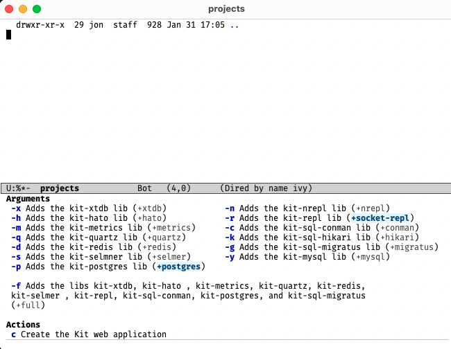

<!-- gid:20250319T172804 -->
[[TIP("이 노트에 대하여")]]
jpe90의 emacs-clj-deps를 통해 Clojure deps 기반 프로젝트를 Emacs에서 다루는 방법을 살핀다. 클로저 개발환경을 조금 더 부드럽게 만드는 보조 도구 노트다.
[[/TIP]]

<!-- provenance:source:start -->
[[TIP("원본·최신본")]]
이 페이지는 한국어 검색과 읽기를 위한 WikiDocs 미러입니다. [원본·최신본은 가든](https://notes.junghanacs.com/notes/20250319T172804/)에 있습니다. 최신 수정 내용·백링크·태그·히스토리·댓글·출처 정보는 원본 가든에서 확인하세요.

- 작성: `2025-03-19T17:28:00+09:00`
- 최근 수정: `2025-03-19T17:28:00+09:00`
[[/TIP]]
<!-- provenance:source:end -->

## BIBLIOGRAPHY

- “Jpe90/Emacs-Clj-Deps-New.” 2024. [https://github.com/jpe90/emacs-clj-deps-new](https://github.com/jpe90/emacs-clj-deps-new).

## History

-   [2025-03-19 Wed 17:28] 이용 할 만 한 것인가? 아닌가

## jpe90/emacs-clj-deps-new

(“Jpe90/Emacs-Clj-Deps-New” 2024)

-   Eskin, Jon
-   Emacs interface to deps-new and clj-new
-   2024

### 스크린샷

