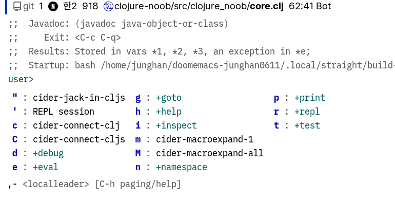

<!-- gid:20250319T190631 -->
[TOC]

[[TIP("이 노트에 대하여")]]
git 충돌 해결 시 Emacs의 smerge-mode를 Magit과 diff 흐름 안에서 어떻게 활용하는지 설명한다. 병합 충돌을 텍스트 편집으로 다루는 핵심 도구 메모다.
[[/TIP]]

## BIBLIOGRAPHY

  “Lanceberge/Elysium Ai-Generated Code Changes in Emacs #Gptel.” 2024. [https://github.com/lanceberge/elysium](https://github.com/lanceberge/elysium).

## Related Notes

-   [이맥스 클로저 통합개발환경](https://wikidocs.net/381178)
-   [LanceBergeron lanceberge/elysium 이맥스 엘리시움 지피엘 AI 코딩 플러그인](https://wikidocs.net/381629)

## History

-   [2025-03-19 Wed 19:06] (“Lanceberge/Elysium Ai-Generated Code Changes in Emacs #Gptel” 2024)에서 사용하는 툴인데 알아봐야 한다. 병합툴을 모르니까

## TODO 둠이맥스 키바인딩 충돌

## [|2025-03-19 Wed 19:06|](https://wikidocs.net/380404.md#h-2025-03-19/)

@user smerge-mode에 대해서 알려줘

@assistant `smerge-mode` 는 Emacs에서 사용되는 마이너 모드로, `diff3` 프로그램의 출력물을 편집하기 쉽게 해줍니다. 이 모드는 충돌된 부분을 쉽게 식별하고, 각 버전의 코드를 선택하거나 병합하는 기능을 제공합니다. 주요 명령어로는 `C-c ^` 로 시작하는 여러 키 바인딩이 있으며, 이를 통해 현재 버전, 기본 버전, 다른 버전의 코드를 선택하거나 병합할 수 있습니다[1].

`smerge-mode` 를 사용하면 코드 충돌을 해결하는 데 도움이 되며, 특히 여러 개발자가 협업하는 프로젝트에서 유용합니다.

-   Citations: [1] <http://doc.endlessparentheses.com/Fun/smerge-mode.html> [2] <http://media.cgland.com/media/r09media_news_view.html?no=4084&news_page>= [3] <http://babylove789.dothome.co.kr/photoshop/> [4] <https://koreascience.kr/article/JAKO201627037746769.pdf> [5] <https://helpx.adobe.com/kr/photoshop/using/smudge-image-areas.html>

@user 사용법과 이 패키지를 활용하는 다른 패키지들이 있는가?

@assistant

-   smerge-mode 사용법

`smerge-mode` 는 Emacs에서 `diff3` 프로그램의 출력물을 쉽게 편집할 수 있도록 돕는 마이너 모드입니다. 주요 사용법은 다음과 같습니다:

-   **활성화**: `M-x smerge-mode` 명령어로 활성화할 수 있습니다.
-   **키 바인딩**:
    -   `C-c ^ RET`: 현재 버전 유지 (`smerge-keep-current`)
    -   `C-c ^ m`: 내 버전 유지 (`smerge-keep-mine`)
    -   `C-c ^ b`: 기본 버전 유지 (`smerge-keep-base`)
    -   `C-c ^ o`: 다른 버전 유지 (`smerge-keep-other`)
    -   `C-c ^ n`: 다음 충돌로 이동 (`smerge-next`)
    -   `C-c ^ p`: 이전 충돌로 이동 (`smerge-prev`)

-   다른 패키지와의 활용

`smerge-mode` 는 주로 Git과 같은 버전 관리 시스템에서 충돌을 해결할 때 유용합니다. 특히, `ediff` 와 함께 사용하면 더 강력한 충돌 해결 도구가 됩니다[4]. `magit` 패키지와도 잘 어울리며, Git 작업을 더 효율적으로 관리할 수 있습니다.

`smerge-mode` 자체는 다른 패키지와의 직접적인 통합보다는 독립적으로 사용되지만, Emacs의 다양한 버전 관리 도구와 함께 사용할 때 그 효용성이 극대화됩니다.

-   Citations: [1] <http://doc.endlessparentheses.com/Fun/smerge-mode.html> [2] <https://alida.tistory.com/21> [3] <https://github.com/smihica/emmet-mode> [4] <https://protesilaos.com/codelog/2020-04-10-emacs-smerge-ediff/> [5] <https://irreal.org/blog/?p=5651>

@user smerge에 해당하는 magit의 기능은?

@assistant Magit에서 `smerge-mode` 와 관련된 기능은 충돌 해결을 위한 도구를 제공합니다. Magit 자체는 충돌 해결을 위한 별도의 도구를 제공하지 않지만, `smerge-mode` 와 `ediff` 를 통해 충돌을 쉽게 해결할 수 있도록 지원합니다[2].

Magit의 상태 버퍼에서 충돌이 있는 파일을 선택하면, 해당 파일을 방문하고 `smerge-mode` 를 활성화하여 충돌을 해결할 수 있습니다. Magit은 `smerge-mode` 의 명령어를 래핑하여, 상태 버퍼에서 직접 충돌을 해결할 수 있도록 합니다[2].

예를 들어, Magit에서 `RET` 키를 눌러 충돌 파일을 열고, `C-c ^ m` 또는 `C-c ^ o` 와 같은 `smerge-mode` 명령어를 사용하여 충돌을 해결할 수 있습니다[2].

또한, Magit은 `k` 키를 사용하여 특정 버전을 선택하거나, `e` 키를 눌러 Ediff를 통해 충돌을 해결할 수도 있습니다[2].

-   Citations: [1] <https://www.freecodecamp.org/korean/news/how-to-resolve-merge-conflicts-in-git/> [2] <https://www.magit.vc/manual/magit/Resolving-Conflicts.html> [3] <https://blog.naver.com/codeitofficial/223419920499> [4] <https://www.databricks.com/kr/blog/new-support-conflict-resolution-repos-merge-rebase-and-pull> [5] <https://github.com/magit/magit/issues/4348>

@user
