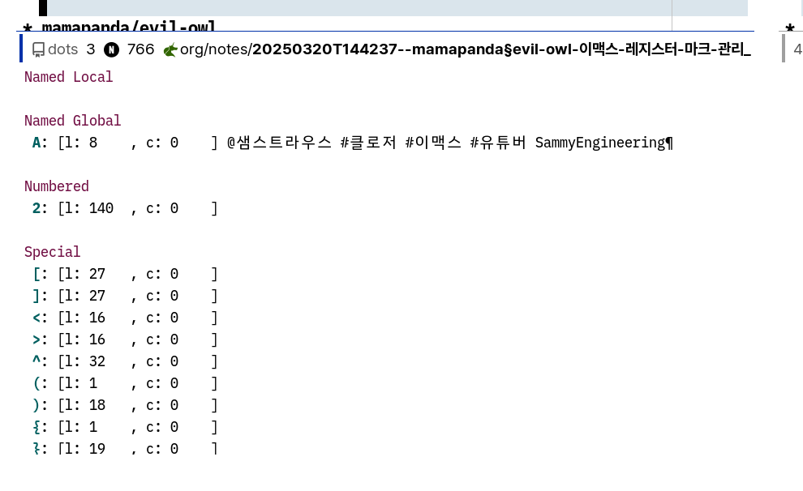

<!-- gid:20250320T144237 -->
[TOC]

[[TIP("이 노트에 대하여")]]
evil-owl가 레지스터와 마크를 화면에 어떻게 보여 주고 관리하게 돕는지 정리한다. Vim식 편집 흐름을 Emacs 안에서 더 잘 체감하게 하는 보조 패키지 노트다.
[[/TIP]]

## BIBLIOGRAPHY

- “Mamapanda/Evil-Owl.” 2024. [https://github.com/mamapanda/evil-owl](https://github.com/mamapanda/evil-owl).

## History

-   [2025-03-20 Thu 14:42] 아무튼 이게 해야돼

## mamapanda/evil-owl

(“Mamapanda/Evil-Owl” 2024)

-   Phan, Daniel
-   preview registers and marks before actually using them
-   2024

-   Press `q`, `@`, ~​"​`, ~C-r`, `m`, ~​'​`` , or ~` `` to view the popup,
-   press `C-f` or `C-b` to scroll it, and input a register or mark to make the popup disappear.

### 레지스터

-   [이맥스: 레지스터 활용법 register mark](https://wikidocs.net/381049) 연동
-   마킹 마크

### 사용예

이 정도면 아주 쉬운 것

