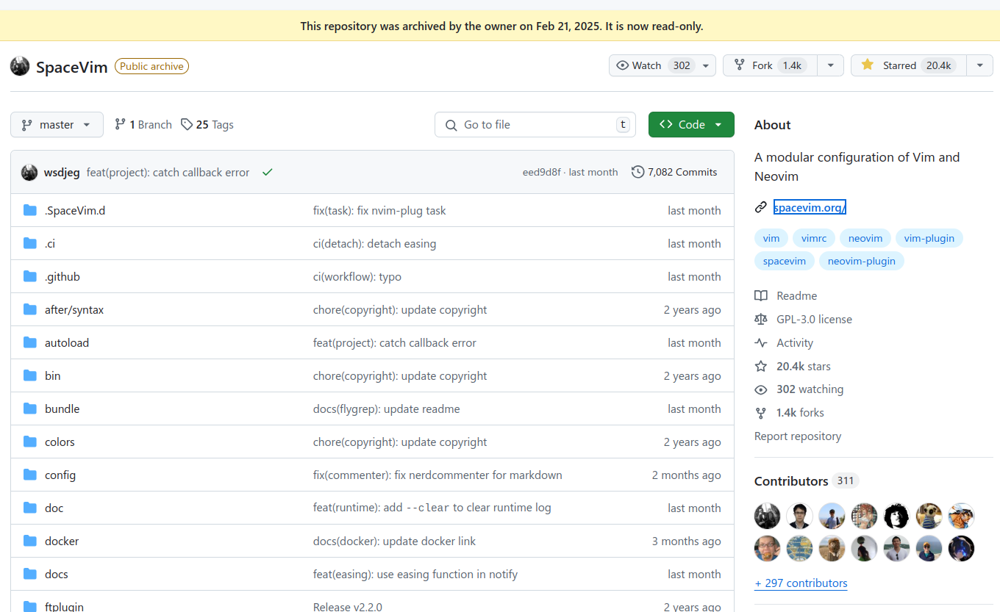

<!-- gid:20250321T064938 -->
[TOC]

[[TIP("이 노트에 대하여")]]
Emacs와 VSCode, Vim 계열이 뒤섞인 시대에 키바인딩 감각을 어떻게 통합할지 고민한다. 도구 선택보다 몸의 리듬과 학습 비용을 더 중요하게 보는 관점이 핵심이다.
[[/TIP]]

## 관련메타

-   [통합개발환경 코딩도구 개발도구](https://wikidocs.net/380799)
-   [VSCODE 마이크로소프트](https://wikidocs.net/380502)
-   [둠이맥스 스페이스맥스](https://wikidocs.net/380689)
-   [키바인딩](https://wikidocs.net/380645)
-   [이맥스 통합개발환경](https://wikidocs.net/380542)

## BIBLIOGRAPHY

- Wong, Eric. n.d. “SpaceVim - Spacemacs Vim.” Accessed March 20, 2025. [https://spacevim.org/](https://spacevim.org/).

## History

-   [2026-03-01 Sun 12:26] 지금 한번 정리할 시점인데?!
-   [2025-06-09 Mon 17:12] 2025 잠시만! 통합하는 이유가 무엇인가? 이맥스가 왜 코딩도구로 좋다는거니?
-   [2025-06-08 Sun 19:28] 춘추전국시대
-   [2025-06-06 Fri 15:14] 핵심은 vspacecode로 모인다. vscode를 거의 동일하게 쓰면 업무가 편해진다.
-   [2025-03-21 Fri 06:49] 사실 astrovim을 사용한다. 지금은. 개념은 같다. spacevim은 역사의 뒤안길로 갔구나.
-   [2023-01-28 Sat 08:23] spacevim 관련 기록

## 2026 코딩에 대하여

### 키워드 코딩도구

-   [aider 페어 프로그래밍 코딩도구](https://wikidocs.net/381524)
-   [프로젝트: 이맥스 AI 코딩도구 : 코파일럿 바이브코딩](https://wikidocs.net/381235)
-   [JetBrains IntelliJ 인텔리제이 코딩도구](https://wikidocs.net/382359)
-   [깃허브 코파일럿 개발 코딩도구](https://wikidocs.net/382085)

## 2025 #개발도구 #춘추전국 시대: 키바인딩 오직 하나 #VSpaceCode

[2025-06-08 Sun 19:28]

이렇게 되면 #VSCODE 로 업무하는데 지장이 없을 것이다. 여기에

사실상 둘 사이에 사용의 제약은 거의 없다. 그러면 왜 이맥스를 써야하지?라는 질문이 들 수도 있다. 아니다.

그 반대다. 이맥스를 쓰지 않을 이유가 없는 것이다.

근데 왜 당신은 VSCODE를 만지고 있는가? 응?! [코알라(코딩알려달라)](https://wikidocs.net/381622)라서 그렇다. 회사에서 적응하려면 단순하게 시작해야 할 것 같다. 코파일럿 에이전트까지 고민한다면 말이다.

개발환경과 언어가 거의 잡혀 있고 적응이 되면 물론 이맥스로 싹 옮길 것이다. 그 전까지는 변이를 줄이고 줄여서 간다.

그래도 키바인딩 때문에 고민할 필요는 없으니 뭐가 되든 상관 없다. 그거나 이거나 LSP로 받아서 동작하는 것이니까. 폰트도 같다. 점점 비슷해져서 어느 순간에는 차이가 거의 드러나지 않을 지도 모른다.

### 잠시만! 통합하는 이유가 무엇인가? 이맥스가 왜 코딩도구로 좋다는거니?

[2025-06-09 Mon 17:12]

다음 문서에서 답을 담아야 한다.

[프로젝트: 이맥스 AI 코딩도구 : 코파일럿 바이브코딩](https://wikidocs.net/381235)

## 2025 스페이스코드를 중심에 둘 수 있겠니?

[2025-06-06 Fri 15:47]

취업을 앞두고 어떤 일이든 쉽게 하기 위해서는 스페이스코드를 활용하는 것이 가장 효과적이다.

[VSpaceCode 통합개발환경 vscode 스페이스맥스 키바인딩 설정](https://wikidocs.net/381737)

## 2023 SpaceVim Spacemacs Vim

[2023-01-28 Sat 08:23]

재미있는 주제이다. 굉장히 비슷한 느낌의 첫인상이다. 키 바인딩도 유사하다. 그러나 태생이 다르기 때문에 텍스트 편집에 관련한 Emacs 생태계에 범접할 수가 없을 것이다. 나도 여기에 있어서 단편만 보았기 때문에 그러리 라고 보는 것일 분이다. 그리고 VIM 생태계에서는 이러한 메뉴 시스템이 필요한가? 열고 닫는 짧은 사이클의 툴에서는 굳이 필요가 없으리라 본다. Emacs 에서는 한번 실행하고 얼마나 오래 쓰는가? 관련해서 종종 글을 본다. 이 말은 이 하나에서 다 커버가 가능하기 때문이다. 터미널, 런처 등 별도로 필요한 것이 없다. 그러기에 Org-mode 가 의미가 있는 것이다. 어젠다 역시 마찬가지다. Workflow 와 Writing 전부가 이 하나로 다 담겨지기 때문이다. SpaceVim 은 VSpaceCode 와는 분명히 다른 포지션이다. 전자는 터미널에서 짧게 처리 할 텍스트 작업을 Spacemacs 와 별개로 처리 할 때 사용하면 된다. 궁극적으로는 Emacs 터미널을 사용하면 필요가 없게 된다. (내가 아직 미진해서 생기는 문제) 후자는 개발에 집중한 툴 이다. 일단 LSP 등 최신 Feature 들을 추가 설정 거의 없이 성능 걱정 덜하고 다 쓸 수 있다. 키 바인딩은 Spacemacs 와 거의 유사하게 잡혀 있기 때문에 작업의 불편함도 덜하다. 물론, 스니펫을 공유하도록 구성할 경우이다. 글쓰기도 마찬가지고 개발도 나의 경험을 누적하는 게 중요하다. 그럼에도 VSpaceCode 또한 테스트 용도 또는 Emacs 입문자 용도를 벗어나기 어렵다고 생각한다. Emacs 가 이미 충분히 좋아졌고 어느 정도 나의 구성이 안정화 되면 툴을 벗어나는 게 그 자체로 불편함을 줄 것이다. Eglot 을 도입하면서 LSP 이슈도 없어진 것과도 마찬가지다. 나의 모든 툴 은 Emacs 에 집중하기 위한 보조 도구로써 만족한다. 오늘 SpaceVim 도입은 아주 큰 의미가 있다. 비교의 기준점으로서 가져갈 수 있기 때문이다. 나는 그러니까 텍스트 에디터로써 이맥스를 쉽게 받아들이기 위해서 SpaceVim (TUI), VSpaceCode (GUI)를 적극 권장할 것이다. 여기에 익숙하게 되면 Spacemacs 는 가볍게 사용할 수 있게 된다. 여기에 Meta 키 바인딩의 노하우를 익혀가면 된다. 학생 뿐만 아니라 현업에 있는 누구나 큰 부담이 없이 나의 텍스트 에디터 환경을 구축함으로서 텍스트 지식인이 되기를 바란다. -끝-

### SpaceVim - spacemacs vim

(Wong n.d.)

-   Wong, Eric
-   SpaceVim is a modular Vim/Neovim configuration that seeks to provide layer feature.

#### 단종: SpaceVim - goodbye

thanks a lot

## 터미널 이맥스 - 키티(Kitty)

-   [키티 - 터미널 이맥스 활용법](https://wikidocs.net/381113)
