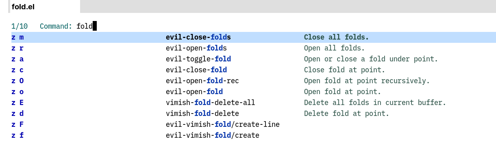

<!-- gid:20250323T073347 -->
[[TIP("이 노트에 대하여")]]
Doom Emacs에서 코드 폴딩을 어떻게 가져갈지 vimish-fold와 ts-fold, hideshow를 중심으로 검토한다. 트리시터와 전통 폴딩 방식의 차이를 가늠하는 메모다.
[[/TIP]]

<!-- provenance:source:start -->
[[TIP("원본·최신본")]]
이 페이지는 한국어 검색과 읽기를 위한 WikiDocs 미러입니다. [원본·최신본은 가든](https://notes.junghanacs.com/notes/20250323T073347/)에 있습니다. 최신 수정 내용·백링크·태그·히스토리·댓글·출처 정보는 원본 가든에서 확인하세요.

- 작성: `2025-03-23T07:33:00+09:00`
- 최근 수정: `2025-03-23T00:00:00+09:00`
[[/TIP]]
<!-- provenance:source:end -->

[TOC]

## BIBLIOGRAPHY

- “Alexmurray/Evil-Vimish-Fold.” 2024. [https://github.com/alexmurray/evil-vimish-fold](https://github.com/alexmurray/evil-vimish-fold).
- “Emacs-Tree-Sitter/Ts-Fold.” 2025. [https://github.com/emacs-tree-sitter/ts-fold](https://github.com/emacs-tree-sitter/ts-fold).
- “Emacswiki: Hide Show.” n.d. Accessed March 25, 2025. [https://www.emacswiki.org/emacs/HideShow](https://www.emacswiki.org/emacs/HideShow).

## Related Notes

-   [둠이맥스모듈에디터 editor 편집기의 하위 분류](https://wikidocs.net/381611)

## History

-   [2025-03-23 Sun 07:33] fold tree-sitter 걸린다.

## 관련 패키지

### alexmurray/evil-vimish-fold

(“Alexmurray/Evil-Vimish-Fold” 2024)

-   

-   Murray, Alex
-   

-   2024

### emacs-tree-sitter/ts-fold

(“Emacs-Tree-Sitter/Ts-Fold” 2025)

-   

-   

-   Code-folding using tree-sitter
-   2025

### EmacsWiki: Hide Show

(“Emacswiki: Hide Show” n.d.)

## z 하나의 바인딩만 활용

[2025-03-23 Sun 07:40]

둠이맥스의 경우 이미 갖춰져 있으니 공통 바인딩을 사용하면 된다. z 로 시작하는 바인딩. 능력 껏 패키지 골라서 해줄 것이다.



```elisp
;; /home/junghan/doomemacs-junghan0611/modules/editor/fold/autoload/fold.el
(defun +fold/open ()
  "Open the folded region at point.

Targets `vimmish-fold', `hideshow', `ts-fold' and `outline' folds."
  (interactive)
  (save-excursion
    (cond ((+fold--vimish-fold-p) (vimish-fold-unfold))
          ((+fold--outline-fold-p)
           (outline-show-branches)
           (outline-show-entry))
          ((+fold--hideshow-fold-p) (+fold-from-eol (hs-show-block)))
          ((+fold--ts-fold-p) (ts-fold-open)))))
```

## [|2025-03-23 Sun 07:33|](https://wikidocs.net/380404.md#h-2025-03-23/)

@user let me know about emacs's fold packags such as hideshow, vimish-fold, evil-vimish-fold, ts-fold.

@assistant Emacs에서 코드 폴딩을 위한 패키지로는 **hideshow**, **vimish-fold**, **evil-vimish-fold**, 그리고 **ts-fold** 가 있습니다. 각 패키지의 특징은 다음과 같습니다:

-   **hideshow**: 기본적으로 Emacs에서 제공되는 기능을 기반으로 하며, 주로 문법 기반의 코드 폴딩을 지원합니다.

-   **vimish-fold**: 영역 기반의 폴딩을 지원하며, 마우스와 avy 지원이 가능합니다. 영구적인 폴딩 기능도 제공합니다.

-   **evil-vimish-fold**: Vim의 폴딩 키바인딩을 Emacs의 Evil 모드에서 사용할 수 있게 해줍니다. `zf`, `zd`, `za` 등의 키를 통해 폴딩을 제어할 수 있습니다.

-   **ts-fold**: 검색 결과에 따르면, **ts-fold** 에 대한 정보는 제공되지 않았습니다. 다른 패키지와 비교하여 정보가 부족합니다.

이 외에도 **outline-indent** 와 같은 패키지도 있으며, 이는 들여쓰기 기반의 폴딩을 지원합니다[1][3].

-   Citations: [1] <https://github.com/jamescherti/outline-indent.el> [2] <https://github.com/alexmurray/evil-vimish-fold> [3] <https://wikemacs.org/wiki/Folding> [4] <https://docs.doomemacs.org/v21.12/modules/editor/fold/> [5] <https://www.gnu.org/software/emacs/manual/html_node/emacs/Foldout.html>

@user
