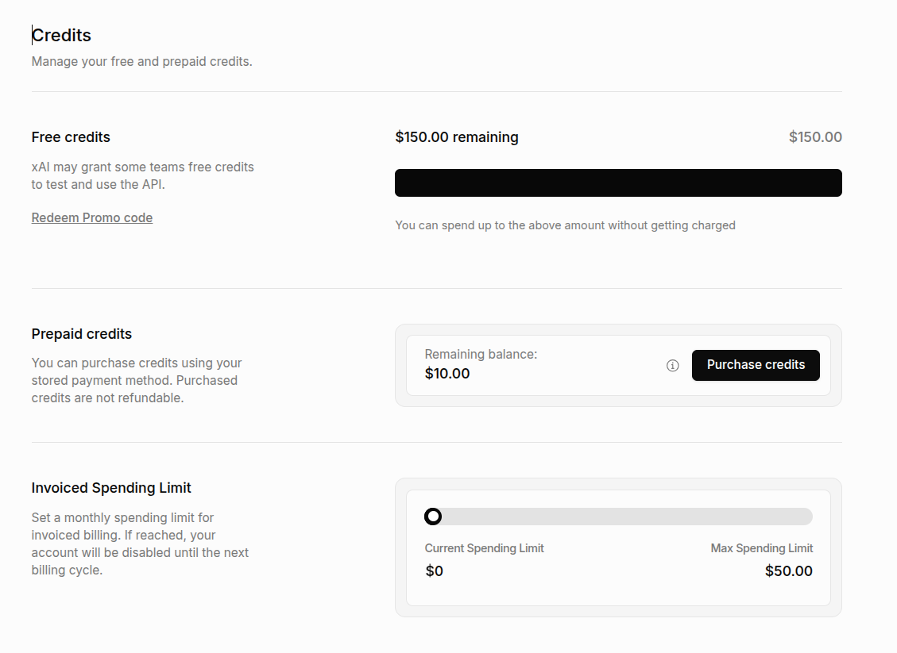

<!-- gid:20250323T161332 -->
[TOC]

[[TIP("이 노트에 대하여")]]
Grok API의 무료 크레딧 정책과 실제 활용 가능성을 점검하는 메모다. 비용과 데이터 공유, 도구 선택의 문제를 함께 생각하게 만든다.
[[/TIP]]

## BIBLIOGRAPHY

  “깊은 생각 Deep Thought - Grok - xAI.” 2022. [https://ko.wikipedia.org/w/index.php?title=%EA%B9%8A%EC%9D%80_%EC%83%9D%EA%B0%81&#38;oldid=31441415](https://ko.wikipedia.org/w/index.php?title=%EA%B9%8A%EC%9D%80_%EC%83%9D%EA%B0%81&oldid=31441415).

## Related Notes

### 깊은 생각 Deep Thought - Grok - xAI

(“깊은 생각 Deep Thought - Grok - xAI” 2022)

-   깊은 생각(Deep Thought)은 더글러스 애덤스의 과학소설 《은하수를 여행하는 히치하이커를 위한 안내서》에 등장하는 상상의 컴퓨터이다.

## History

-   [2025-03-23 Sun 16:13] 공짜 좋아하지마라 [|2025-03-23 Sun 16:13|](https://notes.junghanacs.com/journal/20250317T000000.md#h-2025-03-23/)

@user let me know "grok Redeem Promo code"

@assistant "Grok Redeem Promo code"에 대한 정보를 찾으신다면, 현재 Grok와 관련된 프로모션 코드는 여러 웹사이트에서 제공되고 있습니다. 예를 들어, Grok The World에서는 최대 70% 할인 코드를 제공하고 있으며, Grok의 경우도 최대 75% 할인 코드가 있습니다. 이러한 코드를 사용하려면 해당 웹사이트에서 코드를 복사하고, Grok의 결제 페이지에서 코드를 입력하여 할인 혜택을 받을 수 있습니다.

-   **Grok The World**: 최대 70% 할인 코드 제공
-   **Grok**: 최대 75% 할인 코드 제공

코드의 유효성과 사용 조건은 각 웹사이트에서 확인하는 것이 좋습니다.

-   Citations: [1] <https://grok-the-world.tenereteam.com/coupons> [2] <https://grok.tenereteam.com/coupons> [3] <https://x.ai/blog/grok-1212> [4] <https://www.youtube.com/watch?v=Zmu_SKLfqUY> [5] <https://www.geeky-gadgets.com/grok-2-api-public-beta/>

@user grok 홈페이지에서 다음과 같은 이야기가 있어. API 요청을 공유한다는 의미가 무엇인가?

Opt-in to share data with xAI Get 150 달러 worth of free API credits a month by sharing your API requests and help us improve Grok. Once enabled, you cannot opt-out.

@assistant Grok 홈페이지에서 "API 요청을 공유한다는 의미"는 사용자가 자신의 API 요청 데이터를 xAI와 공유하는 것을 의미합니다. 이는 xAI가 Grok의 성능을 개선하고, 더 나은 서비스를 제공하기 위해 사용자의 요청 패턴과 데이터를 분석하는 데 도움을 줍니다. 이에 대한 대가로, 사용자는 월 150달러 상당의 무료 API 크레딧을 받을 수 있습니다. 그러나 한 번 활성화하면 해제할 수 없다는 점에 주의해야 합니다.

-   Citations: [1] <https://apidog.com/blog/xai-grok-api/> [2] <http://www.chidoo.me/index.php/2016/07/13/bruteforce-scanner-based-on-logstash/> [3] <https://docs.kanaries.net/ko/topics/ChatGPT/chat-gpt-too-many-requests-in-1-hour-error> [4] <https://csexy-1365.tistory.com/362> [5] <https://themiilk.com/tags/11084>

@user xAI 데이터를 공유할 경우 크레딧을 제공한다고 한다. 여기에 대한 위험성을 분석해줘.

Confirm data share opt-in By enabling data sharing, you agree to share your prompts with xAI for training purposes. You won't be able to disable data sharing on this team after enabling it. This won't affect any other teams you're part of.

데이터 공유를 사용 설정하면 교육 목적으로 xAI와 프롬프트를 공유하는 데 동의하는 것입니다. 데이터 공유를 활성화한 후에는 이 팀에서 데이터 공유를 비활성화할 수 없습니다. 이는 소속된 다른 팀에는 영향을 미치지 않습니다.

@assistant xAI와 데이터 공유 시 주요 위험성은 다음과 같습니다:

1.  **개인정보 노출**: 프롬프트에 개인정보가 포함될 경우, 이를 통한 개인 식별 가능성이 있습니다.
2.  **데이터 무결성 손실**: 공유된 데이터가 오용되거나 잘못 해석될 가능성이 있습니다.
3.  **영구적 공유**: 데이터 공유를 비활성화할 수 없으므로, 일단 공유하면 철회가 불가능합니다.
4.  **법적 리스크**: 데이터 공유가 법적 규제를 위반할 가능성이 있습니다.

따라서 데이터 공유 전, 개인정보 및 민감한 정보가 포함되지 않도록 주의하고, 법적 검토를 거치는 것이 중요합니다.

@user 가져가는 정보가 구체적으로 무엇인가?

@assistant xAI가 가져가는 정보는 주로 사용자가 API를 통해 전송한 _프롬프트(prompt)_ 와 관련된 데이터입니다. 이는 다음과 같은 정보를 포함할 수 있습니다:

1.  **프롬프트 내용**: 사용자가 입력한 질문, 명령어, 또는 요청 텍스트.
2.  **API 요청 메타데이터**: 요청 시간, IP 주소, 사용자 에이전트 등.
3.  **응답 데이터**: Grok가 생성한 응답 텍스트.

이 데이터는 xAI가 Grok의 성능을 개선하고, 모델을 학습시키는 데 사용됩니다. 그러나 개인정보나 민감한 정보가 포함되지 않도록 주의해야 합니다.

@user

## [2025-03-23 Sun 16:18] 무료 크레딧 동의함

그래 편하게 막 써보자.

## Grok 3 API 통합 - 그록 웹에서 질의

### dd

xAI에서 제공하는 Grok API의 150달러 크레딧은 개발자들이 Grok 3와 같은 최신 AI 모델을 활용해 애플리케이션을 테스트하고 개발할 수 있도록 지원하는 프로모션입니다. 이 크레딧은 특정 조건을 만족하면 월 최대 150달러 상당의 API 사용 비용을 무료로 제공받을 수 있는 혜택으로, 2025년 3월 기준으로 여전히 유효한 정보에 기반해 설명드리겠습니다. 150달러 크레딧 받는 방법 xAI 계정 등록: 먼저 xAI 공식 웹사이트나 계정 관리 페이지(<https://accounts.x.ai/sign-in>)를 통해 계정을 생성합니다. X 또는 Google 계정으로 간편하게 로그인할 수 있습니다. 결제 정보 설정: API 사용을 위해 최소 5달러 이상의 선불 크레딧을 구매하고 결제 정보를 등록해야 합니다. 이 초기 결제는 크레딧 활성화를 위한 필수 조건입니다. 데이터 공유 동의: 무료 크레딧을 받으려면 데이터 공유 옵션에 동의해야 합니다. 이는 xAI가 API 사용 데이터를 모델 개선 및 학습 목적으로 활용할 수 있도록 허용하는 것을 의미합니다. 중요한 프로젝트라면 별도 계정을 사용하는 것이 좋을 수 있습니다. 크레딧 적용: 조건을 충족하면 매달 최대 150달러까지 API 사용료가 무료로 지원됩니다. 주요 특징 및 활용 Grok 3 지원: 이 크레딧으로 Grok 3 모델을 API를 통해 호출할 수 있으며, 코드 생성, 데이터 분석, 자연어 처리 등 다양한 작업에 활용 가능합니다. 비용 절감: 초기 5달러 투자로 매달 150달러 상당의 크레딧을 받을 수 있어, 개발자나 소규모 팀에게 경제적인 혜택을 제공합니다. 제한 사항: 국가별로 지원 여부가 다를 수 있으니, xAI 웹사이트에서 본인의 지역이 포함되는지 확인하세요. 또한, 실시간 정보 접근은 API 모델에서 지원되지 않을 수 있습니다. 주의사항 이 프로모션은 한정된 기간이나 수량으로 제공될 가능성이 있으니, 빠르게 신청하는 것이 좋습니다. 데이터 공유에 민감하다면, 동의 여부를 신중히 결정하세요.

이 크레딧은 Grok API의 강력한 기능을 부담 없이 탐색할 수 있는 좋은 기회입니다. 더 자세한 정보는 xAI 공식 문서나 콘솔(console.x.ai)을 참고하세요!

### grok api 150달러 크레딧을 소개해줘

Grok 3는 xAI에서 개발한 최신 AI 모델로, 기존 모델 대비 10~15배 강력한 컴퓨팅 파워와 고급 추론 능력을 자랑합니다. 2025년 2월 17일에 출시된 이 모델은 다양한 작업에서 뛰어난 성능을 발휘하며, 특히 수학, 과학, 코딩, 실시간 정보 검색 등에서 경쟁 모델들을 앞선다고 평가받고 있습니다. 아래는 Grok 3의 주요 기능과 특징을 상세히 정리한 내용입니다.

1.  고급 추론 능력 (Advanced Reasoning)

Think 모드: 복잡한 문제를 단계별로 나누어 사고 과정을 보여줍니다. 예를 들어, 수학 문제나 과학 질문을 풀 때 각 단계를 설명하며 오류를 자체 수정하고 최종 답변을 도출합니다. 이는 OpenAI의 o1이나 DeepSeek의 R1과 유사한 "chain-of-thought" 접근법을 따릅니다. Big Brain 모드: 더 많은 컴퓨팅 자원을 활용해 심층 분석이 필요한 작업(예: 대규모 데이터 분석, 복잡한 코딩)에 적합합니다. 처리 시간이 길어지지만 정확도와 통찰력이 향상됩니다. 자체 검증: 답변 생성 전 여러 접근법을 탐색하고 오류를 수정해 신뢰성을 높입니다.

1.  실시간 정보 검색 (DeepSearch)

웹 및 X 데이터 통합: Grok 3는 웹과 X 플랫폼에서 실시간 데이터를 끌어와 최신 정보를 반영합니다. 예를 들어, 뉴스, 시장 동향, 트렌드 분석 등에서 강점을 보입니다. 정보 종합: 상충되는 데이터나 의견을 분석해 간결하고 논리적인 요약을 제공하며, 출처를 확인하고 사고 과정을 공개합니다. 응용 예시: "스페이스X의 다음 발사 일정은?" 같은 질문에 1분 이내로 X 포스트와 웹 자료를 종합해 답변을 생성합니다.

1.  다중 모달 기능 (Multimodal Capabilities)

이미지 생성: 고품질 이미지를 빠르게 생성하며, 사용자가 추가 요청 시 세부 조정이 가능합니다. Aurora라는 이미지 생성 기술이 업그레이드되어 사진 수준의 결과물을 제공합니다. 이미지 이해: 업로드된 이미지를 분석해 설명하거나 관련 정보를 제공합니다(예: 오래된 영화 포스터의 언어 식별). 향후 확장: 음성 모드(Voice Mode)와 오디오-텍스트 변환 기능이 곧 추가될 예정으로, 대화형 인터랙션이 강화됩니다.

1.  코딩 및 기술 지원

코드 생성: HTML, JavaScript 등으로 동적 웹페이지나 게임(예: 테트리스와 보석 게임 융합)을 생성할 수 있습니다. 디버깅 및 문제 해결: 복잡한 코딩 문제를 단계별로 분석하고 해결책을 제시합니다. 벤치마크 우수성: LiveCodeBench에서 79.4% 이상의 성능을 기록하며, 코딩 능력에서 타 모델을 압도합니다.

1.  실시간 지식 및 대화 능력

최신성 유지: X와 웹에서 데이터를 실시간으로 가져와 정기적인 훈련 데이터 의존도를 줄입니다. 대화 톤: 유머와 간결함을 유지하며, 사용자가 이해하기 쉬운 방식으로 설명합니다. "최대 진실 추구"라는 xAI의 철학을 반영해 편견 없는 답변을 지향합니다.

1.  성능 벤치마크

AIME 2025: 수학 추론에서 93.3% 달성(최고 수준 컴퓨팅 사용 시). GPQA: 과학 전문성 테스트에서 84.6%. Chatbot Arena: 1400 ELO 점수를 돌파하며, 사용자 평가에서 GPT-4o, Claude 3.5 Sonnet 등을 앞섰습니다.

1.  추가 특징

효율성: Grok 3 Mini라는 경량 버전도 제공되며, 빠른 응답이 필요한 일반 대화에 적합합니다. API 지원: 개발자를 위한 API가 곧 출시될 예정으로, 외부 애플리케이션 통합이 가능합니다. 안전성: RLHF(인간 피드백 강화 학습)를 통해 오정보와 편견을 줄이고, 콘텐츠 moderation 도구를 내장했습니다. 활용 사례 연구: 실시간 데이터 기반 논문 요약, 가설 생성. 교육: 수학/과학 문제 풀이, 개념 설명. 개발: 코드 작성, 디버깅, 프로젝트 자동화. 일상: 뉴스 업데이트, 시장 분석, 창작 콘텐츠 제작. Grok 3는 현재 X Premium+ 구독자 및 SuperGrok 티어(30 달러/월)를 통해 접근 가능하며, 일부 기능은 무료 사용자에게도 제한적으로 제공됩니다. 이 모델은 특히 실시간 정보와 논리적 추론이 필요한 작업에서 강점을 발휘하며, ChatGPT나 Gemini 같은 경쟁자와 차별화된 경험을 제공합니다. 추가 질문이 있다면 언제든 물어보세요!

### 가져가는 정보가 구체적으로 무엇인가?

질문이 "Grok 3 API 통합"이나 "이미지 생성" 과정에서 xAI가 가져가는 정보에 대한 것인지 정확히 파악하기 위해, 일반적으로 Grok 3와 관련된 데이터 수집 관점을 설명드리겠습니다. xAI의 데이터 수집은 주로 API 사용 및 무료 크레딧(150달러) 프로그램과 연계된 데이터 공유 동의와 관련이 있습니다. 아래에서 구체적으로 어떤 정보가 수집되는지 정리하겠습니다.

1.  API 사용 시 수집되는 정보

Grok 3 API를 사용할 때, xAI는 다음과 같은 데이터를 가져갈 수 있습니다: 요청 데이터: 사용자가 API에 보낸 프롬프트(텍스트, 이미지 생성 요청 등)와 메타데이터(요청 시간, 모델 버전 등). 응답 데이터: Grok 3가 생성한 답변, 이미지 URL, 처리 시간 등. 사용자 식별 정보: API 키를 통해 연결된 계정 정보(이메일, IP 주소 등). 개인 식별 정보는 최소화되지만, 사용 패턴 분석에 활용될 수 있습니다. 사용량 통계: 호출 횟수, 토큰 사용량, 리소스 소비량 등으로 요금 청구 및 성능 최적화에 사용.

1.  150달러 무료 크레딧과 데이터 공유

무료 크레딧을 받기 위해 "데이터 공유 동의"를 선택한 경우, 추가 정보가 수집됩니다: 입력 데이터 상세: 프롬프트와 업로드된 파일(이미지, PDF 등)의 내용이 모델 훈련 및 개선 목적으로 저장될 수 있습니다. 상호작용 기록: 질문과 답변의 전체 대화 흐름, 사용자가 어떤 기능을 자주 활용하는지 분석. 목적: xAI는 이를 Grok 3의 추론 능력, 이미지 생성 품질, 실시간 검색 정확도를 향상시키는 데 사용한다고 공지했습니다(2025년 3월 xAI 블로그 참조).

1.  이미지 생성 시 수집되는 정보

이미지 생성 요청(Aurora 사용 시)에서 가져가는 데이터는 다음과 같습니다: 프롬프트: "붉은 용이 하늘을 나는 이미지" 같은 구체적인 요청 내용. 생성 결과: 생성된 이미지의 메타데이터(해상도, 생성 시간 등). 이미지 자체는 사용자가 다운로드 후 별도로 저장하지 않는 한 xAI 서버에 영구 보관되지 않을 가능성이 높습니다. 피드백: 사용자가 이미지를 수정하거나 재요청할 경우, 그 상호작용 데이터도 수집될 수 있습니다.

1.  수집되지 않는 정보

민감한 개인 정보: xAI는 주민번호, 신용카드 번호 등 직접적인 개인 식별 정보를 수집하지 않습니다(결제는 Stripe 같은 제3자를 통해 처리). 비동의 데이터: 데이터 공유에 동의하지 않은 경우, 요청 데이터는 서비스 제공 외에는 사용되지 않고 일정 기간 후 삭제됩니다(정확한 기간은 xAI 정책에 따라 다름).

1.  데이터 활용 목적

모델 개선: 수집된 데이터는 Grok 3의 성능 향상(예: 추론, 이미지 품질)과 새로운 기능 개발에 사용됩니다. 연구: xAI의 "인간의 과학적 발견 가속화" 미션에 따라, 익명화된 데이터가 연구에 활용될 수 있습니다. 실시간 정보: X와 웹 검색 데이터는 답변 생성에만 사용되며, 사용자의 요청과 직접 관련 없는 데이터는 수집되지 않습니다.

1.  주의 및 대처 방법

민감한 작업: 중요한 개인 정보나 기밀 프로젝트에는 데이터 공유 비활성화 계정을 사용하는 것이 안전합니다. 정책 확인: xAI 개인정보 정책에서 최신 수집 범위를 확인하세요. 최신 정보: 2025년 3월 20일 X 포스트에 따르면, xAI는 데이터 투명성을 강화하기 위해 수집 범위를 사용자에게 더 명확히 공개할 계획이라고 밝혔습니다. 구체적인 질문이 있다면? "가져가는 정보"가 API 사용, 이미지 생성, 또는 특정 기능과 관련된 것인지 더 구체적으로 알려주시면 그 부분에 맞춰 추가로 설명드릴게요! 어떤 맥락인지 알려주시면 더 정확히 답변하겠습니다.
