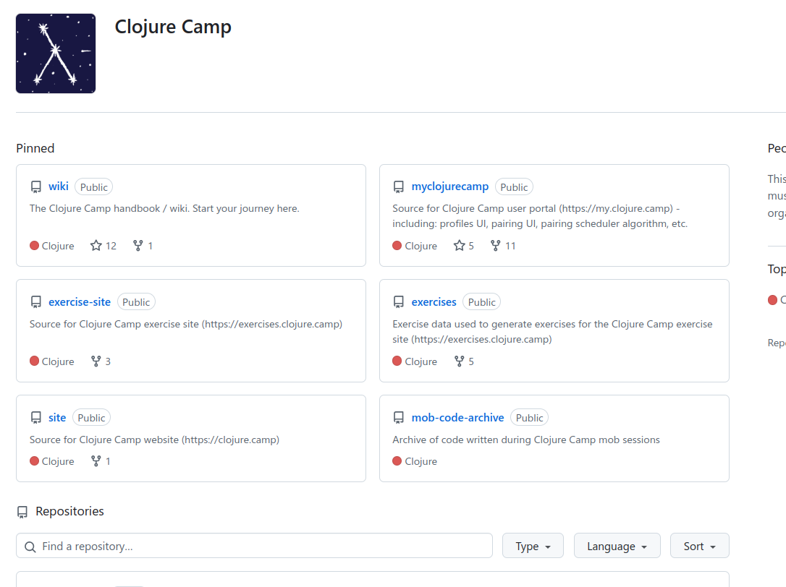

<!-- gid:20250325T201529 -->
[TOC]

[[TIP("이 노트에 대하여")]]
clojure.camp 위키와 관련 핸드북 자료를 기록해 두는 짧은 노트다. 클로저 입문과 커뮤니티 학습 자료를 찾을 때 다시 꺼내 볼 만한 기준점을 남긴다.
[[/TIP]]

## BIBLIOGRAPHY

  “Clojure Camp.” n.d. Accessed March 25, 2025. [https://github.com/clojure-camp](https://github.com/clojure-camp).
  “Clojure-Camp/Wiki Clojure Camp Handbook.” 2024. [https://github.com/clojure-camp/wiki](https://github.com/clojure-camp/wiki).

## History

-   [2025-03-25 Tue 20:15] 문득 찾음

## Related-Notes

-   [클로저](https://wikidocs.net/380504)

## Clojure Camp 대문

(“Clojure Camp” n.d.)

## clojure-camp/wiki Clojure Camp Handbook

(“Clojure-Camp/Wiki Clojure Camp Handbook” 2024)

-   2024

## 깃허브
