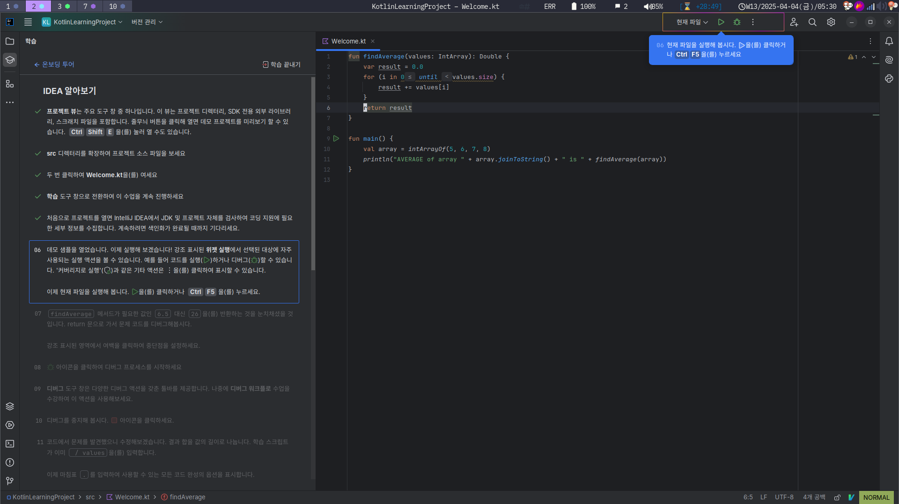

<!-- gid:20250327T110315 -->
[[TIP("이 노트에 대하여")]]
Kotlin과 Clojure가 JVM 기반 언어로서 어떤 공통점과 차이를 가지는지 정리한다. 함수형 감각과 확장성, 자바 호환성을 통해 풀스택 상상력을 넓히는 노트다.
[[/TIP]]

<!-- provenance:source:start -->
[[TIP("원본·최신본")]]
이 페이지는 한국어 검색과 읽기를 위한 WikiDocs 미러입니다. [원본·최신본은 가든](https://notes.junghanacs.com/notes/20250327T110315/)에 있습니다. 최신 수정 내용·백링크·태그·히스토리·댓글·출처 정보는 원본 가든에서 확인하세요.

- 작성: `2025-03-27T11:03:00+09:00`
- 최근 수정: `2025-03-27T00:00:00+09:00`
[[/TIP]]
<!-- provenance:source:end -->

[TOC]

## BIBLIOGRAPHY

## Related Notes

## History

-   [2025-03-27 Thu 11:03] [코틀린](https://wikidocs.net/380812)과 클로저 자바 가상머신의 미래에 대한 생각

## [|2025-03-27 Thu 11:03|](https://wikidocs.net/380405.md#h-2025-03-27/)

@user JVM 자바가상머신에서 동작하는 코틀린과 클로저 언어의 유사성에 대해서 알려줘

@assistant JVM에서 동작하는 코틀린과 클로저 언어의 유사성에 대해 설명드리겠습니다.

1.  **JVM 기반**: 코틀린은 JVM에서 실행되며, 클로저도 JVM에서 실행됩니다. 이는 두 언어가 자바와 호환되어 자바 라이브러리를 사용할 수 있음을 의미합니다.

2.  **멀티 패러다임 프로그래밍**: 코틀린은 객체지향과 함수형 프로그래밍을 지원하며, 클로저도 함수형 프로그래밍을 강조합니다. 이는 두 언어 모두 다양한 프로그래밍 스타일을 지원한다는 점에서 유사합니다.

3.  **정적 타입 체크**: 코틀린은 정적 타입 체크를 지원하며, 클로저도 동적 타입 체크와 함께 일부 정적 타입 체크 기능을 제공합니다.

4.  **함수형 프로그래밍 지원**: 두 언어 모두 함수형 프로그래밍을 지원하여 코드의 간결성과 유지보수성을 높입니다.

5.  **확장성**: 코틀린은 확장 함수를 통해 기존 클래스의 기능을 확장할 수 있으며, 클로저도 유사한 방식으로 기존 코드의 재사용성을 높일 수 있습니다.

이러한 점에서 코틀린과 클로저는 JVM 기반의 멀티 패러다임 프로그래밍 언어로서 유사성을 가지고 있습니다.

-   Citations: [1] <https://bldev2473.github.io/kotlin/basic> [2] <https://f-lab.kr/insight/kotlin-vs-java-concurrency> [3] <https://warpgate3.tistory.com/entry/Kotlin-vs-Java> [4] <https://adjh54.tistory.com/149> [5] <https://www.multicampus.com/em/enrolment/courseDetaiInfo?corsCd=FA00K9>

@user 웹 관련 프로그래밍 언어와 코틀린, 클로저와 같은 JVM 기반 언어를 비교해줘. 특히, 풀스택의 관점에서.

@assistant 웹 관련 프로그래밍 언어와 JVM 기반 언어인 코틀린, 클로저를 풀스택의 관점에서 비교해드리겠습니다.

### 웹 관련 프로그래밍 언어

-   **JavaScript**: 주로 웹 프론트엔드 개발에 사용되며, Node.js를 통해 백엔드 개발도 가능합니다. 비동기 처리와 이벤트 기반 프로그래밍에 강점이 있습니다[1][3].
-   **Python**: Django, Flask 같은 프레임워크를 사용해 웹 백엔드 개발에 많이 사용됩니다. 데이터 분석과 머신러닝에도 유용합니다[4][5].
-   **PHP**: 서버 측 스크립트 언어로, 웹 개발에 주로 사용됩니다. 보안 취약점이 있지만 빠른 개발이 가능합니다[4].

### JVM 기반 언어

-   **코틀린**: Java와 완벽하게 호환되며, 객체 지향과 함수형 프로그래밍을 지원합니다. 안드로이드 앱 개발과 백엔드에서 많이 사용됩니다[4].
-   **클로저**: 함수형 프로그래밍에 강점을 가진 언어로, JVM에서 실행됩니다. 주로 데이터 처리와 분석에 사용됩니다.

### 풀스택 개발 관점

-   **웹 개발**: JavaScript와 Python은 웹 개발에 널리 사용되며, 특히 JavaScript는 프론트엔드와 백엔드 모두에서 활용됩니다.
-   **백엔드 개발**: Java, Kotlin은 안정성과 성능으로 인해 대규모 백엔드 시스템에 적합합니다.
-   **함수형 프로그래밍**: 클로저는 함수형 프로그래밍에 특화되어 있으며, 데이터 처리와 분석에 유리합니다.

각 언어는 특정 분야에서 강점을 가지고 있으며, 프로젝트의 요구에 따라 적절한 언어를 선택하는 것이 중요합니다.

-   Citations: [1] <https://wansook0316.github.io/dv/concept/2021/03/19/Language-comparision.html> [2] <https://arajo.tistory.com/373> [3] <https://wooniblo.com/entry/%EC%9E%90%EB%B0%94%EC%99%80-%EC%9E%90%EB%B0%94%EC%8A%A4%ED%81%AC%EB%A6%BD%ED%8A%B8%EC%9D%98-%EC%8B%A4%ED%96%89-%ED%99%98%EA%B2%BD-JVM%EA%B3%BC-%EC%9E%90%EB%B0%94%EC%8A%A4%ED%81%AC%EB%A6%BD%ED%8A%B8-%EC%97%94%EC%A7%84-%EB%B9%84%EA%B5%90> [4] <https://zero-base.co.kr/event/media_insight_contents_BE_language> [5] <https://velog.io/@outofearth/%ED%94%84%EB%A1%9C%EA%B7%B8%EB%9E%98%EB%B0%8D-%EC%96%B8%EC%96%B4-%EC%86%8D%EB%8F%84-%EB%8C%80%EA%B2%B0-C-Rust-Java-Python-%EA%B7%B8%EB%A6%AC%EA%B3%A0-JavaScript-%EB%9F%B0%ED%83%80%EC%9E%84%EA%B9%8C%EC%A7%80>

@user 안드로이드 개발 언어로서 코틀린의 인기 또는 중요성은?

@assistant 안드로이드 개발 언어로서 코틀린의 인기와 중요성은 다음과 같습니다:

-   **안드로이드 공식 언어**: 2019년 구글이 코틀린을 안드로이드 개발의 공식 언어로 지정하면서, 안드로이드 앱 개발에서 자바를 대체하기 시작했습니다[1][2].
-   **간결성과 안전성**: 코틀린은 코드가 간결하고 Null Safety 기능으로 NPE를 방지하여 개발 효율성을 높입니다[1][4].
-   **멀티플랫폼 지원**: Kotlin Multiplatform Mobile(KMM)을 통해 iOS와 안드로이드 앱의 비즈니스 로직을 공유할 수 있어, 멀티플랫폼 개발에 유리합니다[3].
-   **채택 증가**: 메타, 구글 등 대형 기업들이 코틀린을 채택하며, 새로운 프로젝트의 70% 이상이 코틀린으로 시작되고 있습니다[2][3].

-   Citations: [1] <https://nbcamp.spartacodingclub.kr/blog/%EC%95%88%EB%93%9C%EB%A1%9C%EC%9D%B4%EB%93%9C-%EC%95%B1-%EA%B0%9C%EB%B0%9C%EC%9E%90%EA%B0%80-%EC%BD%94%ED%8B%80%EB%A6%B0%EC%9D%84-%EC%84%A0%ED%83%9D%ED%95%B4%EC%95%BC-%ED%95%98%EB%8A%94-%EC%9D%B4%EC%9C%A0--17725> [2] <https://zdnet.co.kr/view/?no=20221103115509> [3] <https://www.jaenung.net/tree/16268> [4] <https://media.fastcampus.co.kr/insight/dev/kotlin/> [5] <https://blog.naver.com/acornedu/223001834752>

@user 코틀린 말고 안드로이드 개발 언어를 소개해줘.

@assistant 안드로이드 개발에서 코틀린 외에 사용되는 언어는 다음과 같습니다:

1.  **자바 (Java)**: 안드로이드 초기부터 사용된 언어로, 안정성과 풍부한 라이브러리가 장점입니다. 하지만 코드가 장황할 수 있습니다[1][2][3].

2.  **Dart와 Flutter**: 크로스플랫폼 개발에 적합하며, 하나의 코드베이스로 안드로이드, iOS, 웹, 데스크톱 앱을 개발할 수 있습니다. Hot Reload 기능으로 빠른 개발이 가능합니다[1][2].

3.  **React Native**: 자바스크립트 기반으로, 안드로이드와 iOS 앱을 동시에 개발할 수 있는 크로스플랫폼 솔루션입니다. 웹 개발자에게 유리합니다.

이러한 언어들은 각기 다른 장단점을 가지고 있으며, 프로젝트의 목적에 따라 선택할 수 있습니다.

-   Citations: [1] <https://hiteksoftware.co.kr/blog/android-app-development-language/> [2] <https://hiteksoftware.co.kr/blog/app-development-language/> [3] <https://blog.wishket.com/app-dev-language-java-kotlin/> [4] <https://blog.naver.com/wishket/223485207156> [5] <https://developer.android.com/kotlin/learn>

@user Dart, Flutter와 코틀린을 비교해줘.

@assistant Dart, Flutter와 코틀린을 비교해보면 다음과 같은 특징이 있습니다:

1.  **Dart &amp; Flutter**:
    -   **크로스플랫폼**: Flutter는 Dart 언어를 사용하여 Android, iOS, 웹, 데스크톱 앱을 단일 코드베이스로 개발할 수 있습니다[1][2].
    -   **UI 빌딩**: Hot Reload 기능으로 빠른 개발이 가능하며, 위젯 기반의 UI 구현이 용이합니다[1][3].
    -   **학습 용이성**: Dart는 배우기 쉬운 언어로, 빠른 개발 사이클을 지원합니다[4].

2.  **Kotlin**:
    -   **네이티브 안드로이드**: Kotlin은 안드로이드 네이티브 앱 개발에 최적화된 언어로, 자바와 100% 호환됩니다[1][4].
    -   **간결성**: 코드가 간결하고 가독성이 높아 개발 효율성을 높입니다[2].
    -   **멀티플랫폼 지원**: Kotlin Multiplatform을 통해 iOS 및 다른 플랫폼에서도 개발 가능합니다[5].

각 기술은 프로젝트의 목적과 개발자의 선호도에 따라 선택할 수 있습니다.

-   Citations: [1] <https://kinggom.tistory.com/19> [2] <https://seo.goover.ai/report/202411/go-public-report-ko-aee560c1-88c0-4fee-879d-6b76d76bf01f-0-0.html> [3] <https://velog.io/@junghyunsoo24/Dart%EC%99%80-Kotlin-%EB%B9%84%EA%B5%90> [4] <https://www.a-ha.io/questions/4b5b8639ae2daaf98892be1e10faceb7> [5] <https://www.youtube.com/watch?v=4HyEl0n5d14>

@user JVM의 미래에 대해서 어떻게 전망하고 있는지 관련 전문가의 의견을 정리해줘.

@assistant JVM의 미래에 대한 전문가의 전망은 다음과 같습니다:

1.  **Java의 지속적인 발전**: Java는 지속적으로 발전하며, 최신 기술 트렌드에 적응하고 있습니다. 클라우드 컴퓨팅, AI, IoT 등에서 중요한 역할을 하고 있으며, 2025년에도 주요 기업에서 널리 사용되고 있습니다[1][5].

2.  **JDK 프로젝트**: 2025년에는 Project Loom, Project Leyden, Project Lilliput 등이 JVM의 성능과 기능을 향상시키는 데 중점을 두고 있습니다. 특히, 가벼운 스레드와 구조화된 동시성 API가 주목받고 있습니다[3].

3.  **클라우드와 AI 통합**: Java는 클라우드와 AI 기술에 대한 지원을 강화하고 있으며, 이는 JVM의 미래에도 긍정적인 영향을 미칠 것으로 예상됩니다[4][5].

전문가들은 JVM이 지속적으로 발전하고, 다양한 기술 트렌드에 적응하면서도 안정성과 성능을 유지할 것으로 전망합니다.

-   Citations: [1] <https://www.netguru.com/blog/is-java-still-used-in-2025> [2] <https://velog.io/@woodyalmond/%EB%B6%88%EC%95%88%ED%95%9C-%EB%AF%B8%EB%9E%98-%EB%AC%B4%EC%97%87%EC%9D%84-%EC%A4%80%EB%B9%84%ED%95%A0-%EA%B2%83%EC%9D%B8%EA%B0%80-2025-%ED%8A%B8%EB%A0%8C%EB%93%9C-%EC%9A%94%EC%95%BD-%EB%B0%8F-%EC%A0%84%EB%9E%B5> [3] <https://www.jvm-weekly.com/p/glancing-into-the-future-java-plans> [4] <https://www.azul.com/newsroom/azul-2025-state-of-java-survey-report/> [5] <https://dev.to/myexamcloud/why-java-is-still-hot-in-2025-3b6l>

@user

## 키워드

-   [bib/ 빈센트반데르렌 JVM 언어 입문 - 자바, 스칼라, 클로저, 코틀린, 그루비 '2025-04-03 2025-04-03](https://wikidocs.net/382349)
-   [bib/ Butcher 병행성 클로저 멀티코어 자바가상머신 '2025-04-02 2025-04-02](https://wikidocs.net/382346)

## 설치

lsp는 lsp-mode가 알아서 설치해준다. 따로 하지마라!

```shell
sudo apt-get install kotlin
```

## 로그

### [|2025-03-27 Thu 09:41|](https://wikidocs.net/380405.md#h-2025-03-27/)

#### @user kotlin lsp 서버 설치 방법

@assistant Kotlin LSP 서버를 설치하는 방법은 다음과 같습니다:

1.  **Homebrew 사용 (macOS)**:
    -   터미널에서 다음 명령어를 실행합니다:
        ```bash
        brew install kotlin-language-server
        ```

2.  **Linux 및 Windows**:
    -   **GitHub** 에서 소스를 다운로드하고 빌드합니다.
        -   [fwcd/kotlin-language-server](<https://github.com/fwcd/kotlin-language-server>)에서 소스를 다운로드합니다.
        -   `BUILDING.md` 파일에 따라 빌드합니다.

3.  **LSP 지원 에디터 설정**:
    -   LSP를 지원하는 에디터(예: VSCode, Atom)에서 Kotlin 언어 서버를 설정합니다.
    -   각 에디터의 확장 기능을 통해 LSP를 활성화합니다.

이렇게 하면 Kotlin 언어 서버가 설치되고, 지원하는 에디터에서 Kotlin 코드에 대한 스마트 코드 완성, 진단, 호버 등 다양한 기능을 사용할 수 있습니다.

-   Citations: [1] <https://coding-by-head.tistory.com/entry/kotlin-intro> [2] <https://learn.microsoft.com/ko-kr/visualstudio/extensibility/adding-an-lsp-extension?view=vs-2022> [3] <https://github.com/fwcd/kotlin-language-server> [4] <https://formulae.brew.sh/formula/kotlin-language-server> [5] <https://johngrib.github.io/wiki/article/vimwiki-lsp/>

@user

### <span class="org-todo done DONE">DONE</span> 05:31 코틀린 투어


