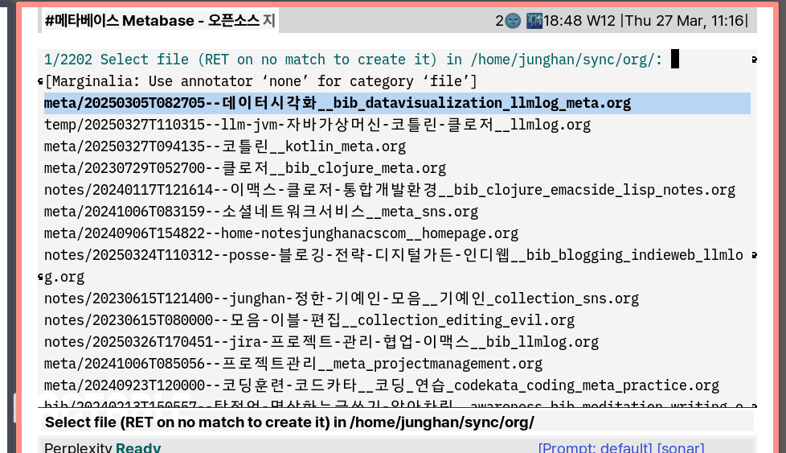

<!-- gid:20250327T123531 -->
[[TIP("이 노트에 대하여")]]
노트 목록에서 파일명만 더 깔끔하게 보고 최근 수정 순으로 정렬하고 싶다는 문제의식에서 출발한다. Marginalia와 Vertico를 자신에게 맞게 다듬는 편집기 취향 노트다.
[[/TIP]]

<!-- provenance:source:start -->
[[TIP("원본·최신본")]]
이 페이지는 한국어 검색과 읽기를 위한 WikiDocs 미러입니다. [원본·최신본은 가든](https://notes.junghanacs.com/notes/20250327T123531/)에 있습니다. 최신 수정 내용·백링크·태그·히스토리·댓글·출처 정보는 원본 가든에서 확인하세요.

- 작성: `2025-03-27T12:35:00+09:00`
- 최근 수정: `2025-03-27T00:00:00+09:00`
[[/TIP]]
<!-- provenance:source:end -->

[TOC]

## BIBLIOGRAPHY

## 관련메타

-   [완성](https://wikidocs.net/380786)

## Related Notes

-   [조직모드 빈라인 지우기](https://wikidocs.net/381688)
-   [이맥스 자동완성 프레임워크 - corfu vertico consult embark](https://wikidocs.net/381027)

## History

-   [2025-03-27 Thu 12:35]

### <span class="org-todo done DONE">DONE</span> 11:18 버그픽스 필요 - vertico childframe

## 문제개요

쓰고 있는 노트에 기존 노트를 연결하려고 한다. 키보드로 뭐 하나 누르면 된다. 노트 목록이 나온다.

근데 뒤에 덕지덕지 정보가 붙어 있다. 지저분하다. 불편하다. 파일명만 나오면 된다. 파일명에 다 들어 있으니까.

대략 이 정도면 충분하다.

그럼에도 좀 바꾸고 싶다. 특히 노트 목록의 순서를 어떻게? 알파벳 순으로? 한글 순으로? 최근 수정 한 노트 순서로 정렬하는 것은? 아무렴 다 된다. 카테고리를 적용하면 된다.

### 스크린샷



## 로그

### [|2025-03-27 Thu 12:35|](https://wikidocs.net/380405.md#h-2025-03-27/)

@user 조직모드 파일을 검색 할 때, marginalia annotator category 를 최근 수정한 파일 목록 기준으로 정렬 하도록 함수를 만들어줘.

@assistant 조직모드에서 특정 카테고리(marginalia annotator category)를 기준으로 최근 수정한 파일 목록을 정렬하는 함수를 만들기 위해서는 Emacs Lisp 을 사용하여 함수를 정의해야 합니다. 아래는 그 예시입니다.

```elisp
(defun org-sort-recently-modified-marginalia-annotator-category ()
  "Marginalia Annotator Category 를 기준으로 최근 수정한 파일 목록을 정렬합니다."
  (interactive)
  (let ((files (org-agenda-files))
        (sorted-files nil))
    (dolist (file files)
      (with-current-buffer (find-file-noselect file)
        (let ((category (org-get-category))
              (modified-time (nth 5 (file-attributes file))))
          (when (string= category "Marginalia Annotator")
            (push (cons file modified-time) sorted-files)))))
    (setq sorted-files (sort sorted-files (lambda (a b) (time-less-p (cdr b) (cdr a)))))
    (mapc (lambda (file) (message "%s" (car file))) sorted-files)))
```

이 함수는 `org-agenda-files` 를 통해 현재 조직모드에서 관리하는 파일 목록을 가져옵니다. 각 파일의 카테고리가 "Marginalia Annotator"인 경우, 파일의 수정 시간을 기준으로 목록을 정렬합니다. 정렬된 파일 목록은 메시지로 출력됩니다.

이 함수를 사용하려면 Emacs 에서 `M-x org-sort-recently-modified-marginalia-annotator-category` 를 실행하면 됩니다.

**주의**: 이 함수는 파일의 카테고리가 정확히 "Marginalia Annotator"인 경우에만 동작합니다. 다른 카테고리 이름을 사용하고 있다면 함수 내의 `category` 문자열을 해당 이름으로 변경해야 합니다.

-   Citations: [1] <https://learn.microsoft.com/ko-kr/visualstudio/ide/find-in-files?view=vs-2022> [2] <https://help.worksmobile.com/ko/use-guides/message/group-folder/search-folder/> [3] <https://support.microsoft.com/ko-kr/windows/windows%C2%A0%EC%97%90%EC%84%9C-%ED%8C%8C%EC%9D%BC-%EC%B0%BE%EA%B8%B0-5c7c8cfe-c289-fae4-f5f8-6b3fdba418d2> [4] <https://support.google.com/drive/answer/2375114?co=GENIE.Platform=Android> [5] <https://support.google.com/drive/answer/2375114?co=GENIE.Platform=Desktop>

@user

## <span class="org-todo todo TODO">TODO</span> 11:18 버그픽스 필요 - vertico childframe

[2025-03-27 Thu 13:37] 여기에 필요한 기능을 정의해서 넣어야 한다. 샘플은 다 구했다. 근데 넣고 뭐 하는데 1시간 걸릴 것 같다. 잠시 대기.

/home/junghan/doomemacs-git/modules/completion/vertico/config.el

둠이맥스 카테고리

```elisp
(pushnew! marginalia-command-categories
            '(+default/find-file-under-here . file)
            '(doom/find-file-in-emacsd . project-file)
            '(doom/find-file-in-other-project . project-file)
            '(doom/find-file-in-private-config . file)
            '(doom/describe-active-minor-mode . minor-mode)
            '(flycheck-error-list-set-filter . builtin)
            '(persp-switch-to-buffer . buffer)
            '(projectile-find-file . project-file)
            '(projectile-recentf . project-file)
            '(projectile-switch-to-buffer . buffer)
            '(projectile-switch-project . project-file))
```

### 엄청난 주제이며 중요한 주제다

```elisp
;;;; marginalia-file and vertico sort modified

(progn
  (defun gr/marginalia--annotate-local-file (cand)
    "Annotate local file CAND.
Removes modes, which I’ve never needed or wanted."
    (marginalia--in-minibuffer
      (when-let (attrs (ignore-errors
                         ;; may throw permission denied errors
                         (file-attributes (substitute-in-file-name
                                           (marginalia--full-candidate cand))
                                          'integer)))
        (marginalia--fields
         ((marginalia--file-size attrs) :face 'marginalia-size :width -7)
         ((marginalia--time (file-attribute-modification-time attrs))
          :face 'marginalia-date :width -12)
         ;; File owner at the right
         ((marginalia--file-owner attrs) :face 'marginalia-file-owner)))))

  (defun gr/marginalia-annotate-file (cand)
    "Annotate file CAND with its size, modification time and other attributes.
These annotations are skipped for remote paths."
    (if-let (remote (or (marginalia--remote-file-p cand)
                        (when-let (win (active-minibuffer-window))
                          (with-current-buffer (window-buffer win)
                            (marginalia--remote-file-p (minibuffer-contents-no-properties))))))
        (marginalia--fields (remote :format "*%s*" :face 'marginalia-documentation))
      (gr/marginalia--annotate-local-file cand)))

  ;; 순서를 바꾸면 된다.
  (add-to-list 'marginalia-annotator-registry
               '(file gr/marginalia-annotate-file marginalia-annotate-file builtin none))
  )


```

### vertico multiform

```elisp

;;;; vertico sort modified

(progn

  ;; (setq vertico-multiform-categories nil)
  ;; (setq vertico-multiform-categories
  ;;       '(
  ;;         ;; (file (vertico-sort-function . sort-directories-first))
  ;;         ;; (file (vertico-sort-function . gr/sort-modified))
  ;;         (file (+vertico-transform-functions . +vertico-highlight-directory))
  ;;         ))

  ;; Sort directories before files
  (defun sort-directories-first (files)
    (setq files (vertico-sort-history-length-alpha files))
    (nconc (seq-filter (lambda (x) (string-suffix-p "/" x)) files)
           (seq-remove (lambda (x) (string-suffix-p "/" x)) files)))

  (defun gr/sort-modified (list)
    "Sort LIST of files for latest modified."
    (let ((ht (make-hash-table :test #'equal :size 5000)))
      (dolist (x list)
        (puthash x (file-attribute-modification-time (file-attributes x)) ht))
      (sort list
            (lambda (a b)
              (let ((one
                     (gethash a ht))
                    (two
                     (gethash b ht)))
                (time-less-p two one))))))

  (defun vertico-sort-modified ()
    (interactive)
    (setq-local vertico-sort-override-function
                (and (not vertico-sort-override-function)
                     #'gr/sort-modified)
                vertico--input t))
  (keymap-set vertico-map "M-," #'vertico-sort-modified)
  )

```
