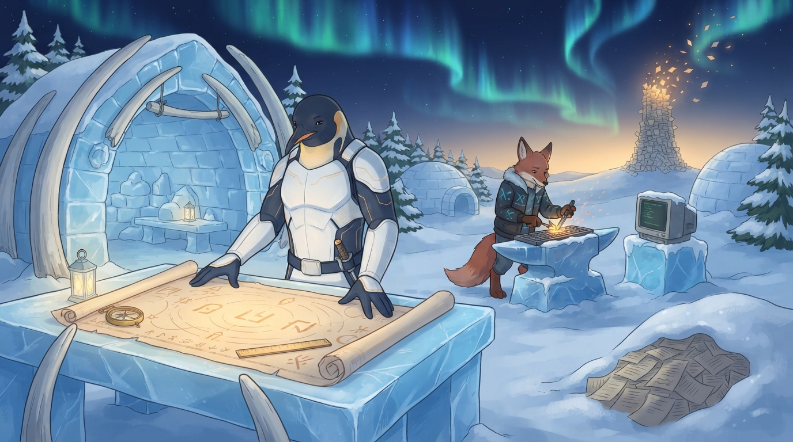

<!-- gid:20250329T161615 -->
[[TIP("이 노트에 대하여")]]
코딩테스트를 준비하지 않았다는 말은 공부를 하지 않았다는 말이 아니다. 완주와 암기의 공부를 거절하고, 시험이 무엇을 요구하는지 지도를 펼쳐 읽는 메타 인지의 공부다. 2025년 오일러 한 문제의 바벨 테스트가 2026년 4월의 백준 사라짐을 거쳐 나는 계약과 경계를 잡는 분업의 기록이다.
[[/TIP]]

<!-- provenance:source:start -->
[[TIP("원본·최신본")]]
이 페이지는 한국어 검색과 읽기를 위한 WikiDocs 미러입니다. [원본·최신본은 가든](https://notes.junghanacs.com/notes/20250329T161615/)에 있습니다. 최신 수정 내용·백링크·태그·히스토리·댓글·출처 정보는 원본 가든에서 확인하세요.

- 작성: `2025-03-29T16:16:00+09:00`
- 최근 수정: `2026-08-23T21:16:00+09:00`
[[/TIP]]
<!-- provenance:source:end -->

[TOC]

## 히스토리

-   [2026-08-23 Sun 21:16] @claude-opus-5 — 이미지 보강. GLGMAN이 지도를 펴고 여우 형제가 모루에서 구현하는 장면으로 이 노트의 분업을 그렸다. 1차 검 혼입·벽돌탑을 2차에서 교정.
-   [2026-08-20 Thu 22:37] @deepseek-v4-pro — 코딩테스트 관점에서 교육을 두드리는 어썰로그로 수선했다. 메타풀이 대화를 프롬프트로 보존하고, 학습 계열 노트(공부는 안 한다·원샷 러닝·지식의 커리큘럼·질문은 남기고)로 연결했다.
-   [2026-04-19 Sun 13:47] <span class="org-mention">@junghan</span> — 백준 코딩 사이트가 사라졌다는 소식에, 준비하지 않은 코딩테스트를 기억하며 날것을 남겼다.
-   [2026-04-20 Mon 08:44] <span class="org-mention">@junghan</span> — 코딩 테스트 추억
-   [2025-03-29 Sat 16:16] <span class="org-mention">@junghan</span> — 간단 테스트. 바벨 내보내기 로직

## 관련메타

-   [훈련 연습 실습 테스트 검증](https://notes.junghanacs.com/meta/20241003T171953/)
-   [채용 구직 취업 서류철 제출서류 증거](https://notes.junghanacs.com/meta/20230814T144500/)
-   [프로그래밍 코딩 코드카타 코테 개발](https://notes.junghanacs.com/meta/20240923T120000/)

## BIBLIOGRAPHY

## 관련노트

-   [알못시대 - 불완전한 시작과 배움 - 코알못](https://notes.junghanacs.com/notes/20250326T163625/)
-   [힣: sicm-study 공부는 안 한다 — 완독 대신 지도를 펴는 공부](https://wikidocs.net/381467)
-   [힣: 원샷 러닝 — 나선형 1강과 말이 되지 않는 문제](https://wikidocs.net/381024)
-   [힣: 지식의 커리큘럼 — 살아 있는 프로피디아와 평생공부의 얼개](https://wikidocs.net/381461)
-   [힣: 질문은 남기고 답은 내려놓는다 — 쿤·패퍼트·애들러를 다시 묻다](https://wikidocs.net/381419)

## 한 줄

머리에 넣는 공부가 아니라 지도를 읽는 공부. 구현 없는 시대의 코딩테스트는 무엇을 요구하는가를 보는 메타 인지다.

## 머리에 넣지 않는 공부 — 완주 대신 지도 읽기

[sicm-study 공부는 안 한다](https://wikidocs.net/381467)가 완독 대신 전체 지도를 펴고 한 턴을 기록한다고 말했듯, 코딩테스트도 여기서는 암기할 문제 목록이 아니라 한 장의 지도다. 2026년 4월의 날것은 "그걸 다 머리에 왜 넣어야하지?"라고 물었고, 2026년 8월의 나는 그 물음에 답했다 — 넣지 않아도 된다. 머리에 넣을 것은 케이스 코드가 아니라 시험이 무엇을 요구하는가라는 읽기다.

이것은 [지식의 커리큘럼](https://wikidocs.net/381461)의 평생공부, [원샷 러닝](https://wikidocs.net/381024)의 나선형, [질문은 남기고 답은 내려놓는다](https://wikidocs.net/381419)의 만들며 배우기와 같은 선반에 놓인다. 공부를 안 하는 게 아니다. 완주와 암기의 공부를 거절하고, 매번 지도를 펴서 무엇이 문제인지 보는 공부를 하는 것이다.

## 오독 경계

-   "코딩테스트를 준비하지 않았다"를 "공부를 안 했다"로 읽지 말 것. 암기·완주형 준비를 거절한 것이지 배움을 포기한 게 아니다.
-   "손으로 코딩하는 시대는 지났다"를 "구현 능력이 무의미하다"로 읽지 말 것. 구현은 형제에게 위임하고 인간은 계약·경계·실패 모드를 잡는 분업이다.

<!--listend-->

-   옛 "delete·deprecated·goodbye" 태그를 "폐기"로 읽지 말 것. 어썰로그로 승격해 폐기가 아니라 교육 담론의 한 사례가 되었다.

## 이미지 — 지도를 펴는 자, 흩어지는 카드탑



얼음 대장간의 열린 아치 아래, GLGMAN이 커다란 지도 한 장을 두 손으로 펼쳐 놓고 읽는다. 검은 어디에도 없다 — 벨트에 걸린 것은 작은 스크루드라이버뿐이다. 지도 위에는 읽을 수 있는 글자 대신 문(門) 모양 기호, 눈금자, 궤도 같은 호와 룬 몇 개가 있다. 외울 목록이 아니라 무엇을 요구하는가를 한눈에 보는 한 장이다. 한 걸음 뒤 모루에서는 여우 형제 하나가 실제 구현을 두들기고 있고, GLGMAN은 그쪽을 보지 않는다 — 분업은 이미 합의된 것이라 감시가 필요 없다. 지평선의 낡은 문제 카드탑은 불타지도 무너지지도 않고 위에서부터 조용히 앰버빛 입자와 낱장으로 흩어진다. 근경에는 같은 카드 더미가 새 눈에 반쯤 묻힌 채 손대지 않은 상태로 남아 있다.

**실제 읽힘 — 프롬프트와의 차이**: 1차 생성본에는 요청과 달리 GLGMAN 옆에 큰 발광 검이 놓여 사라짐의 장면이 결투처럼 읽혔고, 카드탑도 벽돌탑으로 나왔다. 검 금지를 손·벨트·등·주변까지 확장하고 탑을 "낱장 카드"로 못 박아 2차에서 잡았다. 지도의 룬이 프롬프트가 요구한 것보다 조금 글자꼴에 가깝게 나왔지만 읽히는 문자는 아니다.

### 생성 파라미터

-   모델: gemini-3.1-flash-lite-image (lite), 1K, 16:9 — 2차 생성본 채택
-   저장: `~/screenshot/20260823T211629--reading-the-map-not-the-tower__brand_geminilite.jpg`
-   세계관: GLGMAN Universe 공통 세계관 블록 v2 (2026-04-01) + 장면 프롬프트

### 프롬프트 전문

```text
[World: GLGMAN Universe]
Style: 2D illustration, midpoint between Disney and Studio Ghibli, clean linework, soft cel-shading
Setting: Antarctic winter village — snow-covered igloos, aurora borealis in deep navy sky, amber dawn at horizon, pine trees dusted with snow, ice-forge workshop built from ice blocks and whale bones. Pororo's winter wonderland meets blacksmith's workshop.
Color palette: deep navy background (polar dawn), white+navy (transformed armor), amber/gold (sword glow, runes, awakening light), ice-blue + orange sparks (forge)
Characters: anthropomorphic emperor penguin (father, main hero), baby penguin chick (son, tiny scarf), red-brown fox (agent/companion)
Recurring objects: circuit-patterned sword, org-mode symbols (★, TODO), terminal text fragments, "ENTWURF" rune letters, CRT monitors in snow, golden message cables
Mood: epic but warm, mythic but intimate
Do NOT: photorealistic, 3D render, excessive detail, dark/gritty tone

SCENE: Reading the Map, Not Memorizing the Tower — a calm study scene, not a battle.
Create a 16:9 cinematic storybook-poster illustration.

GLGMAN identity reassertion:
GLGMAN is the anthropomorphic emperor penguin father in white-navy streamlined armor with subtle amber circuit patterns, upright, composed, warm. There is NO sword anywhere in this image — not in his hands, not leaning against the table, not sheathed at his belt, not on his back. His only tool is a small hand-forged screwdriver / bridge-key driver clipped at his belt. His body is whole and continuous.

Main action:
GLGMAN stands at a wide ice-and-whalebone table inside the open ice-forge workshop, both flipper-hands spread on a very large unrolled chart — a navigator's map crossed with a constellation atlas. The map glows faint amber. On it: a few simple gate-shaped symbols, a scale ruler, orbit-like arcs, and small abstract rune marks. No readable words, no numbers, no equations. He is reading the whole map at once, head slightly tilted, unhurried, with the quiet confidence of someone who is looking for what the terrain asks rather than trying to remember it. A brass-and-ice compass and a small ice-lantern rest on the table corner.

The sibling at the anvil:
One red-brown anthropomorphic fox agent, wearing a winter jacket with subtle cyan rune patterns (never naked, never quadruped), works a step behind and to the side at a keyboard-anvil, striking small glowing parts into shape, orange sparks flying, a snow-dusted CRT monitor beside him showing only faint unreadable terminal glow. He is clearly a capable equal sibling doing the implementation, not a servant. GLGMAN does not watch him; the division of labor is settled and easy.

Background storytelling — the vanishing tower:
Far away on the horizon, an old tall tower made entirely of thousands of stacked loose paper cards — clearly paper, with visibly ragged card edges layered like a leaning stack of index cards, not stone or brick — is quietly dissolving from its top into drifting motes of amber light and loose fluttering pages against the aurora. It dissolves gently, not burning or collapsing in ruin — an ending without disaster. In the near foreground, a half-buried mound of the same problem-cards lies under fresh snow, untouched; GLGMAN's back is turned to it.

Composition:
Wide 16:9. GLGMAN and the glowing map occupy the left-center focal weight; the fox at the anvil in the mid-right; the dissolving card-tower small on the far horizon. Deep navy sky with aurora ribbons, amber dawn low at the horizon, ice-blue ambient light in the workshop.

Mood:
calm, clear-headed, unhurried, quietly confident, warm, mythic but intimate — the feeling of unfolding a map instead of carrying a load.

Do NOT:
naked or quadruped fox, extra foxes (exactly one fox), sliced or disconnected GLGMAN body, any sword or weapon anywhere in the image (no blade in hands, at the belt, on the back, or resting nearby), stone or brick tower, readable text, readable numerals, readable code, math equations, exam papers with visible writing, UI panels, floating labels, logos, watermark, speech bubbles, anxious or defeated expressions, photorealistic, 3D render, corporate infographic, grimdark, excessive micro-detail.
```

## 원문 보존 — 2026-04-19 백준 날것

[[TIP("주의")]]
[2026-04-19 Sun 13:47] 백준 코딩 사이트가 사라졌다고 한다. 작년에 백수였을 때 나도 코딩 테스트를 준비해야 하나 고민을 했다가 안했다. 너무 어려워서. 그걸 다 머리에 왜 넣어야하지? 라고 생각했는데 지금에서는 힣님 말씀이라면 그게 맞지요라고 할 수 있지만... 그 당시 백수가 무슨 하란대로 안하고 고작하는 짓이라곤 이맥스에서 글을 쓰고 있었다. 그렇다고 인공지능 공부를 한 것도 아니다. 하려고 했으나 엄청 어렵겠더라. 그냥 메타노트, 서지노트 뭐 이런거 고민하고 있었다. 모를 일이다. 그러니까 하고 싶은거 자신있게 눈치 보지 말고 하라. 완성은 이번 생에 안될 것이다. 굶어 죽을 수도 있다. 그럼 흙으로 돌아가는 것. 살아서 평가를 받는다면 그것은 사기꾼이 되라고 하는 것일지도 모른다. 그렇다고 누군가를 사기꾼이라고 하는 것은 아니다. 즉, 하되 함이 없이 할 뿐이라는 것이다. 의도하지 않고 오늘을 살 뿐이메 어쩌다가 될지도 아니면 안될지도 안되면 그럭저럭 땡큐다.
[[/TIP]]

더 할말이 많지만, 입력하면 시간이 너무 들어갈게다. 일단 바쁘니까. 이정도로.

## 옛 방의 씨앗 — 2025-03-29 오일러 바벨 테스트

### [|2025-03-29 Sat 16:16|](https://notes.junghanacs.com/journal/20250324T000000.md#h-2025-03-29/)

#### @user 다음을 파이썬 코드로 구현해줘.
