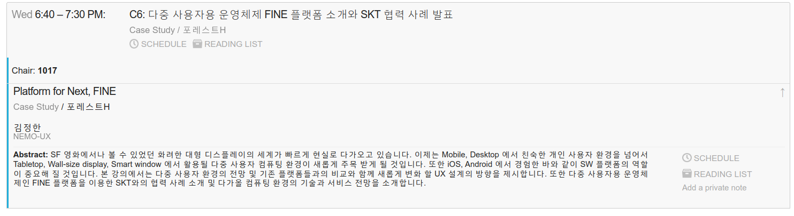
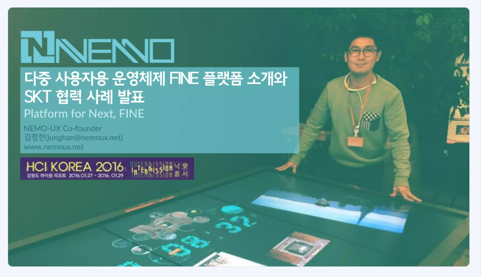

<!-- gid:20250403T082120 -->
[TOC]

[[TIP("이 노트에 대하여")]]
HCIK 발표를 중심으로 다중 사용자용 운영체제와 인터랙티브 서페이스의 전망을 설명한다. 플랫폼과 UX 설계가 어떻게 새롭게 바뀌는지 보여 주는 발표 기록 노트다.
[[/TIP]]

## 관련메타

-   ...

## BIBLIOGRAPHY

  “Hci Korea 2016 C6: 다중 사용자용 운영체제 Fine 플랫폼 소개와 Skt 협력 사례 발표 - 네모유엑스 Nemoux.” n.d. Accessed April 2, 2025. [https://conference.hcikorea.org/hcik2016/guide/](https://conference.hcikorea.org/hcik2016/guide/).
  “[NEMO-UX] HCIK 2016 다중 사용자용 운영체제 FINE 플랫폼 소개와 SKT 협력 사례 발표.” 2016. January 28, 2016. [https://www.slideshare.net/slideshow/nemoux-hcik-2016-fine-skt/57601591](https://www.slideshare.net/slideshow/nemoux-hcik-2016-fine-skt/57601591).

## 히스토리

-   [2026-03-16 Mon 08:21] 절대 `레트로` 가 아닐세! [존재-데이터-뷰어: 시간과정신의방 홈페이지 - WebTUI SF 터미널 어젠다](https://notes.junghanacs.com/botlog/20260310T140114/)를 고민하다가 헉쓰 했네
-   [2025-04-03 Thu 08:21] 생성 관련노트 - [인터렉티브 서페이스 스페이스 컴퓨팅::2014 NEMOSHELL Demo: Windowing System for Concurrent Applications on Multi-user Interactive Surfaces](https://notes.junghanacs.com/notes/20250403T082332.md#h-6f069ea0-f48a-4b15-8773-5bd43987cffd/)

## HCI Korea 2016 C6: 다중 사용자용 운영체제 FINE 플랫폼 소개와 SKT 협력 사례 발표 - 네모유엑스 nemoux

(“Hci Korea 2016 C6: 다중 사용자용 운영체제 Fine 플랫폼 소개와 Skt 협력 사례 발표 - 네모유엑스 Nemoux” n.d.)

-   Platform for Next, FINE↑
-   Case Study / 포레스트H
-   김정한

[[TIP("인용")]]
Abstract: SF 영화에서나 볼 수 있었던 화려한 대형 디스플레이의 세계가 빠르게 현실로 다가오고 있습니다. 이제는 Mobile, Desktop 에서 친숙한 개인 사용자 환경을 넘어서 Tabletop, Wall-size display, Smart window 에서 활용될 다중 사용자 컴퓨팅 환경이 새롭게 주목 받게 될 것입니다. 또한 iOS, Android 에서 경험한 바와 같이 SW 플랫폼의 역할이 중요해 질 것입니다. 본 강의에서는 다중 사용자 환경의 전망 및 기존 플랫폼들과의 비교와 함께 새롭게 변화 할 UX 설계의 방향을 제시합니다. 또한 다중 사용자용 운영체제인 FINE 플랫폼을 이용한 SKT와의 협력 사례 소개 및 다가올 컴퓨팅 환경의 기술과 서비스 전망을 소개합니다.
[[/TIP]]

## 슬라이드 [NEMO-UX] HCIK 2016 다중 사용자용 운영체제 FINE 플랫폼 소개와 SKT 협력 사례 발표

(“[NEMO-UX] HCIK 2016 다중 사용자용 운영체제 FINE 플랫폼 소개와 SKT 협력 사례 발표” 2016)

-   [NEMO-UX] HCIK 2016 다중 사용자용 운영체제 FINE 플랫폼 소개와 SKT 협력 사례 발표, 2016

