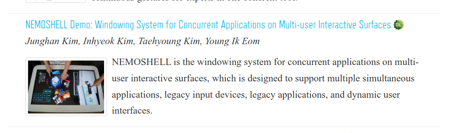

<!-- gid:20250403T082332 -->
[[TIP("이 노트에 대하여")]]
ACM ISS와 ITS, NEMOSHELL 데모 같은 자료를 통해 인터랙티브 서페이스와 테이블탑 컴퓨팅 연구를 모아 둔다. 다중 사용자 환경의 가능성을 서지 중심으로 따라가는 노트다.
[[/TIP]]

<!-- provenance:source:start -->
[[TIP("원본·최신본")]]
이 페이지는 한국어 검색과 읽기를 위한 WikiDocs 미러입니다. [원본·최신본은 가든](https://notes.junghanacs.com/notes/20250403T082332/)에 있습니다. 최신 수정 내용·백링크·태그·히스토리·댓글·출처 정보는 원본 가든에서 확인하세요.

- 작성: `2025-04-03T08:23:00+09:00`
- 최근 수정: `2025-04-03T08:23:00+09:00`
[[/TIP]]
<!-- provenance:source:end -->

[TOC]

## BIBLIOGRAPHY

- “Acm Iss • International Conference on Interactive Surfaces and Spaces.” n.d. Accessed April 2, 2025. [https://iss.acm.org/](https://iss.acm.org/).
- “Its 2014 • November 16-19, 2014 • Dresden, Germany.” n.d. Accessed April 2, 2025. [http://its2014.org/](http://its2014.org/).
- Kim, Junghan, Inhyeok Kim, Taehyoung Kim, and Young Ik Eom. 2014. “Nemoshell Demo: Windowing System for Concurrent Applications on Multi-User Interactive Surfaces.” Its ’14. New York, NY, USA: Association for Computing Machinery. [https://doi.org/10.1145/2669485.2669532](https://doi.org/10.1145/2669485.2669532).

## History

-   [2025-04-03 Thu 08:23] 사용자경험 측면에서 연구

## Related-Notes

-   [인터렉티브 다중 사용자용 운영체제 네모유엑스 HCIK 발표](https://wikidocs.net/381647)
-   [스타트업 - 네모유엑스 폐업 사용자경험 인터렉티브 라지디스플레이](https://wikidocs.net/381646)

## ACM ISS • International Conference on Interactive Surfaces and Spaces

(“Acm Iss • International Conference on Interactive Surfaces and Spaces” n.d.)

CHI, UIST

## ITS 2014 • November 16-19, 2014 • Dresden, Germany

(“Its 2014 • November 16-19, 2014 • Dresden, Germany” n.d.)

### 2014 NEMOSHELL Demo: Windowing System for Concurrent Applications on Multi-user Interactive Surfaces

(Kim et al. 2014)

[[TIP("요약")]]
-   Kim, Junghan and Kim, Inhyeok and Kim, Taehyoung and Eom, Young Ik
-   Recently, the prevalence of large interactive surfaces renewed interests in windowing systems because of the advantages of enabling concurrent applications. We present the NEMOSHELL windowing system for multi-user interactive surfaces. We developed the system based on the Wayland system, a replacement for the Linux X. NEMOSHELL is designed to support multiple simultaneous applications, legacy input devices, legacy applications, and dynamic user interfaces. Finally, our demonstrations illustrate the potential of our system design.
[[/TIP]]

-   11월

