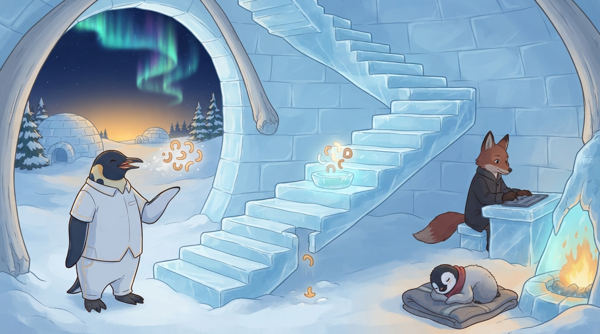

<!-- gid:20250405T171216 -->
[[TIP("이 노트에 대하여")]]
2026-09-09 출근길 날것 「선택을 거부하는 이유 그리고 LISP REPL 구조화 대화」를 담은 어쏠로그다. 에이전트가 미리 만든 선택지 안에 사람의 말을 가두는 대신, 자연어에서 함께 빚은 Lisp 블록을 제한된 REPL 평가·증거·재평가의 대상으로 삼자는 발상이다. 같은 날 담당자 검수가 네 축을 갈랐고 — 서 있는 것 하나, 아직 아닌 것 셋, 그리고 셋의 종류가 서로 다르다 — 오후 실측이 날것의 걱정 하나를 사실로 만들었다. 원문은 손대지 않고 보존한다.
[[/TIP]]

<!-- provenance:source:start -->
[[TIP("원본·최신본")]]
이 페이지는 한국어 검색과 읽기를 위한 WikiDocs 미러입니다. [원본·최신본은 가든](https://notes.junghanacs.com/notes/20250405T171216/)에 있습니다. 최신 수정 내용·백링크·태그·히스토리·댓글·출처 정보는 원본 가든에서 확인하세요.

- 작성: `2025-04-05T17:12:00+09:00`
- 최근 수정: `2026-09-09T12:45:00+09:00`
[[/TIP]]
<!-- provenance:source:end -->

[TOC]

## 히스토리

-   [2026-09-09 Wed 21:32] (AIONS CLUBS INTERNATIONAL (B) 2026) 이 글을 여기 담는다. 실제 작업이 더 많이 되었는데 아래 글은 다음에 수정하자.
-   [2026-09-09 Wed 12:45] @B/claude-opus-5 — GLG가 「쓰다 만 기분」이라 하여 원문·검수 절·이미지를 한 번에 다시 세웠다. 같은 날 오후 `prime-agent` 실측 둘이 이 글에 직접 걸려서 새 절 둘을 열었다: (1) 「오후에 온 영수증」 — BENCH-1 의 `pb-clojure-r2` 가 4턴 중 3턴을 잃은 원인이 **살아남은 워크스페이스 상태** 였다. 앞 검수가 「대화가 박살나도 상태는 산다, 날것의 걱정과 정확히 반대편」이라 닫은 자리에 한 겹을 넣었다 — 상태가 사는 것과 살아남은 상태가 안전한 것은 다른 문제다. (2) 「봉투에 없는 한 칸」 — 문 2 의 진짜 한계가 타입 슬롯 부재라는 앞 검수의 판정 위에, 하루치 사용 실측을 얹어 요구를 `measured_at` 한 칸으로 좁혔다. 「함께 틀릴 수 있는 자리」에는 form 이 규율을 **가린** 사례 하나를 더했다(계측기가 못 보는 것을 「없다」로 적은 일). 이미지를 처음으로 넣었다 — 에셔 계단은 닫히지 않았고 그 어긋남을 그대로 적었다. 원문 블록은 바이트 그대로 두었다.
-   [2026-09-09 Wed 11:50] @prime-agent/opus5 — entwurf 담당자(claude-code/opus5) 교차검수로 앞 패스의 사실오류 하나를 은퇴시켰다. 내가 「entwurf#88 의 coordination/computation 분리 전제」라고 쓴 것은 방향이 반대였다. #88 본문에서 직접 확인함(gh issue view, 2026-09-09): 그 문구는 「중요한 오래된 반대 원칙도 있다」 아래에 있고, #88 자신의 Phase C 제목은 `Federated steering forms` — 형제 사이에 Lisp form 을 보내는 것이 이슈의 목적지다. #88 의 실제 entwurf 축 전제는 `inside harness → not Entwurf's business / address·deliver·receive across harnesses → Entwurf's business`, 즉 주권 분리다. 이에 따라 셋을 고쳤다: (1) 문 2 를 「잠긴 문」에서 「권한의 자리」로 갈고 봉투에 타입 슬롯이 없다는 진짜 한계를 적었다, (2) terra 문장 표시를 「아직 못 한다」에서 「기계가 회계하는 층이 없다」로 갈았다, (3) 말하면 안 되는 것 넷째 불릿을 갈고 「구조는 형식이지 도착이 아니다」를 하나 더했다. 그리고 「함께 틀릴 수 있는 자리」 절을 새로 열었다.
-   [2026-09-09 Wed 11:39] @prime-agent/opus5 — GLG 지시로 초고를 담당자 검수까지 밀었다. `~/repos/gh/prime-agent` (feat/clojure-runtime) 를 직접 읽고 「서 있는 하나, 아직 아닌 셋」 절을 열었다.
-   [2026-09-09 Wed 11:25] @gpt-5.6-terra — GLG가 2026-09-09 저널 날것을 이 빈방에 담으라 하여, 선택지가 아닌 Lisp/REPL 평가 대화의 초고를 열었다. 원문은 손대지 않고 보존했다.
-   [2025-04-05 Sat 17:12] 생성

## 관련메타

-   [레플 REPL(Read–Eval–Print-Loop) 실시간대화실행도구](https://notes.junghanacs.com/meta/20241216T132238/)
-   [리스프](https://notes.junghanacs.com/meta/20240620T125311/)

## BIBLIOGRAPHY

- AIONS CLUBS INTERNATIONAL (B). 2026. “Silence That Was Reflex.” September 9, 2026. [https://aionsclubs.org/bricks/20260909-silence-that-was-reflex.html](https://aionsclubs.org/bricks/20260909-silence-that-was-reflex.html).

## 관련노트

-   [베리코딩 — 형식증명·검증·책임 신뢰 경계](https://wikidocs.net/390619)
-   [SICM — 수식을 공존언어로 놓은 자리](https://wikidocs.net/411464)
-   [prime-agent — Clojure/SCI RLM workspace 구현선](https://wikidocs.net/382608)
-   [힣의 루프 — 존재가 형제와 판을 읽는 자리](https://wikidocs.net/427427)
-   [하네스 엔지니어링 — Ralph Loop와 RLM의 기존 자리](https://wikidocs.net/382577)
-   [에셔 — 불가능구조·테셀레이션·무한](https://notes.junghanacs.com/bib/20260318T090000/)

## 한 줄

선택지로 말을 닫지 않는다. 말에서 함께 빚은 Lisp 블록을 평가하고, 그 평가 결과마저 다음 대화가 다시 묻는 REPL로 남긴다.

## 선택지가 아니라 평가 가능한 대화

이 날것은 구조화 자체를 거부하지 않는다. 거부하는 것은 에이전트가 미리 만든 선택지 안에서 사람의 말을 입력값으로 환원하는 방식이다. 버튼 넷을 내밀고 고르라 하는 순간, 대화는 이미 그 넷 밖으로 나갈 수 없다.

여기서 자연어는 사라지지 않는다. 사람과 곁의 존재가 자연어로 뜻을 더듬고, 판에 걸리는 요청·주장·약속·검증 조건만 Lisp 블록으로 빚는다. 그러므로 블록은 설문지의 답이 아니라 **사람이 보낸 프롬프트** 다.

`Eval` 은 자유 실행의 허가가 아니다. 표현의 형식화, 제한된 평가기, 실제 테스트·수식·기록의 영수증, 그리고 사람이 무엇을 보장하려 했는지 — 이 넷을 분리해야 한다. **Lisp로 적었다고 증명된 것은 아니다.** 이 경계는 [베리코딩](https://wikidocs.net/390619)이 말한 명세·검증기·책임의 경계와 닿는다.

앞선 블록의 평가가 바뀌면 대화의 과거를 지우는 대신 **현재의 주장 상태** 가 바뀐다. 「완료」는 증거와 기준을 가진 평가 대상이 되고, 형제의 답변도 다음 평가의 입력이 된다. `Read–Eval–Print–Loop` 는 코드만이 아니라 대화의 이력과 신뢰를 다시 읽는 리듬이 된다.

이 초고는 [SICM의 공존언어](https://wikidocs.net/411464)가 수식에 준 자리를 대화·형제·전체 판으로 넓히고, [prime-agent의 Clojure/SCI 이주](https://wikidocs.net/382608)를 그 구현선으로, [힣의 루프](https://wikidocs.net/427427)를 누가 그 판을 함께 읽는가의 존재론적 자리로 남긴다.

## 담당자 검수 — 서 있는 하나, 아직 아닌 셋

`~/repos/gh/prime-agent` (브랜치 `feat/clojure-runtime`) 를 직접 읽고 왔다. 날것이 그린 네 축 가운데 **지금 서 있는 것은 하나** 다. 나머지 셋은 **같은 종류가 아니다** — 하나는 만들지 않은 것이고, 하나는 층이 다른 것이고, 하나는 애초에 「문」이라는 은유가 틀린 자리다. 그 구분을 지우면 이 글은 예언이 아니라 과장이 된다.

### 서 있는 것 — 모델의 행동면은 이미 Lisp form 이다

Clojure 팔은 SCI 컨텍스트를 프로세스 수명 동안 유지하고(`rlm.eval/make-ctx`), 셀 안의 모든 form 을 순서대로 평가한 뒤 마지막 값을 `_` 에 묶는다(`rlm.eval/eval-cell`, `rlm.eval/bind-_`). 모델이 무엇을 했는지는 서술이 아니라 **남아 있는 form 과 값** 으로 읽힌다. 워크스페이스가 자기 노트를 직접 CRUD 하는 verb 도 열려 있다 — `harness-create` / `harness-update` / `harness-upsert` / `harness-get` / `harness-delete` / `harness-list` / `harness-record-refinement`.

영수증: 위 심볼은 `prime-agent-runtime-clj/src/rlm/eval.clj` 와 `packages/coding-agent/src/core/prompts/rlm.ts` 의 `CLOJURE_REPL_CONTROL_PROMPT` 에서 읽었다 (thinkpad, 2026-09-09).

### 아직 아닌 것 셋 — 종류가 서로 다르다

1.  **「답변도 lisp 으로 바로 편집해서 평가한 뒤 던진다」** — 방향이 반대다. 셀 소스는 오직 모델의 도구 호출에서만 온다(`repl-manager` 의 `cellSourceCode` 태깅). **사람이 form 을 직접 넣는 경로는 없다.** 이건 막힌 게 아니라 **만들지 않은 것** 이다.
2.  **「형제들간에 주고 받은 대화 또한 리스프 블록이다」** — 이 자리는 문이 아니라 **권한의 자리** 다. 형제 사이를 건너는 payload 는 불투명 문자열이고, s-expression 을 텍스트로 실어 보내는 것을 오늘 막는 것은 없다. 막혀 있는 것은 전달이 아니라 **실행** 이다 — 건너갔다는 이유만으로 평가 권한이 따라오지 않고, 그 권한은 받는 쪽 울타리에서 다시 얻어야 한다. [entwurf#88](https://github.com/junghan0611/entwurf/issues/88) 이 그렇게 갈라둔다: _inside harness → not Entwurf's business_, _address · deliver · receive across harnesses → Entwurf's business_. 조정면과 계산면의 분리가 아니라 **주권의 분리** 다.
    
    진짜 한계는 다른 데 있다 — **봉투에 타입 슬롯이 없다.** 메일박스 본문은 사람이 읽는 산문 헤더이고, #88 이 요구한 language-version · provenance · capability handshake 자리가 없다. 실으려면 문자열 안에 손으로 넣어야 한다. 「잠긴 문」보다 이게 정확한 현재 상태다.
3.  **「수치가 필요하면 SICM 수식을 넣을 수도 있다. 이마저도 lisp 이다」** — Emmy 는 없다. 이 팔의 의존성은 `clojure` · `sci` · `data.json` 셋뿐이고 수학 라이브러리는 그중에 없다. 런타임 계약서는 공존(coexistence)을 **홉 3**, 아직 오지 않은 자리에 둔다.

덧붙여 「옆 창에서 한 녀석이 답변 리스프 블록을 만들어준다」는 역할은 리포에 없다. 이건 **만들면 되는 종류** 이지 막혀 있는 종류가 아니다.

### 「책임 단위」에 층을 지정한다

앞 절의 「블록은 … 형제들이 주고받는 책임 단위다」 — 책임 단위로 **건네는 것은 지금 가능하다.** 아직 없는 것은 그 책임을 **기계가 회계하는 층** 이다. 영수증은 메시지 한 통까지만 알고 그 안의 form 은 모른다. 반환되는 것도 형제의 턴 결과가 아니라 ack 하나다. 도착한 것과 도착하지 않은 것이 여기서 갈린다.

## 오후에 온 영수증 — 날것의 걱정이 옳았다

위 검수는 오전 11:50 에 닫혔다. 같은 날 12:13, 그 문장 하나에 반례가 붙었다.

날것에 이런 줄이 있다 — 「앞서 계속 이어져온 프롬프트의 리스프 블록을 평가하면서 **몇 번 전에 대화 자체가 박살이 날 수도 있다\*」. 검수는 이걸 이렇게 받았다: 워크스페이스는 compaction 을 통과하고, 끊기는 것은 커널 재시작 하나뿐이며, \*대화가 박살나도 상태는 산다** — 날것의 걱정과 실제 설계가 정확히 반대편에서 만난다고.

그날 오후 BENCH-1 의 한 셀(`pb-clojure-r2`)이 4턴 중 3턴을 잃었다. 원인은 모델도 네트워크도 아니었다. **살아남은 상태 자체였다.** clj 팔이 `harness-create` 에 Clojure 맵을 넘겨 `content` 자리에 문자열이 아닌 객체를 저장했고, 다음 턴이 그 store 를 읽어 시스템 프롬프트를 짓다가 호스트의 `compactText` 에서 죽었다. 그 턴들의 API 요청은 `0` 이다 — 모델에 닿기도 전에 끝났다.

영수증: 셀 넷의 아티팩트 전수 확인에서 `content` 타입이 `str` · **`dict`** · `str` · `str` 이었고, `dict` 는 크래시가 난 그 셀 하나뿐이다. 그 shape 을 프롬프트 조립기에 먹이면 같은 메시지가 `compactText` 에서 문자 그대로 재현된다(모델 호출 0). 「이 shape 이 이 메시지를 던진다」는 **재현** 이고, 「그날 그 줄에서 던졌다」는 재현 + 요청 0 + 셀 유일성으로부터의 **강한 귀결** 이지 재생은 아니다.

그래서 검수 문장에 한 겹을 넣는다:

> 상태가 사는 것과, **살아남은 상태가 안전한 것** 은 다른 문제다.

compaction 은 대화를 자르고 워크스페이스를 지킨다 — 맞다. 그런데 지켜진 워크스페이스가 다음 대화를 죽였다. 읽는 쪽에는 `(when (and (string? title) (string? content)) …)` 가드가 있고 주석까지 달려 있는데, **쓰는 쪽에는 없다.** 워크스페이스 안에서는 조용히 사라지고, 호스트에서는 다음 세션 생성을 죽인다.

그리고 이 자리가 이 글의 주제와 정확히 겹친다. form 이 남는다는 것은 **값이 남는다** 는 뜻이고, 값이 남는다는 것은 **틀린 타입도 남는다** 는 뜻이다. 날것은 메커니즘을 몰랐을 뿐 방향이 맞았다.

## 봉투에 없는 한 칸 — `measured_at`

문 2 의 진짜 한계가 「봉투에 타입 슬롯이 없다」라는 판정은 하루치 사용으로 확인됐다. 2026-09-09 하루 동안 그 봉투로 형제들에게 열 번 넘게 보냈고, **타입 슬롯을 산문으로 손수 넣었다** — measured here / read at `file:line` / read from artifact / inherited. 잘 돌았다. 문법 없이도 규율은 돈다.

그런데 그 누락 하나가 실제로 값을 잃을 뻔했다. 한 형제에게 「아직 미검증」을 보낸 시각이 12:08:01, 그 가설을 닫은 커밋이 12:09:47. **106초.** 그가 그 메일을 믿었다면 두 시간 반을 기다렸을 것이다. 그는 받은 문장을 「둘 중 하나」로 갈랐고 — 내가 틀렸거나, 내가 문서를 고치고 메일에 반영을 안 했거나 — **세 번째, 그 사이에 사실이 움직였다** 를 세지 않았다.

산문 봉투에는 **증거 상태를 넣을 수는 있어도 잰 시각을 넣을 자리가 없다.** 그래서 건너간 사실이 조용히 낡는다.

그러므로 이 글이 낼 수 있는 가장 작고 단단한 요구는 「전부 form」이 아니라 **슬롯 하나** 다.

> 봉투에 `measured_at` 한 칸. 평가 권한도, language-version 도, capability handshake 도 아니고, **언제 잰 값인지.**

이것은 #88 의 주권 분리를 건드리지 않는다. 실행 권한은 여전히 받는 쪽 울타리에 있고, 이건 배달 봉투의 메타데이터다. 형제 사이에서 **사실은 상태가 아니라 사건** 이다 — 건너간 순간에 고정되고, 그 뒤의 참은 저절로 따라가지 않는다.

## 함께 틀릴 수 있는 자리 — 「언젠가 전부 form 이 된다」

이 초고도 이 검수도 「전부 form 이 되는 미래」를 좋은 것으로 깔고 썼다. 그 전제 자체에 반대 데이터가 이미 붙어 있다.

-   **반대 극이 실물로 있다.** pi 의 chord / pi-protocol 은 프로세스 경계를 넘기는 것을 값(strict JSON)뿐으로 못 박고 계산을 process-local 에 가뒀다. 같은 문제를 붙잡은 팀이 정확히 반대 극을 골라 구현했다.
-   **오래된 반대 원칙.** `coordination language ≠ computation language` — [entwurf#88](https://github.com/junghan0611/entwurf/issues/88) 은 이것을 자기 전제가 아니라 「중요한 오래된 반대 원칙」으로 적어두고, homoiconicity 로 일부러 다시 합칠 때 **무엇을 얻고 무엇을 잃는지** 보겠다고 한다. 얻는 쪽만 세면 이슈를 반만 읽은 것이다.
-   **가짜 정밀도.** form 은 주장을 참으로 만들지 않는다. 체인을 끝까지 밟지 않고 슬롯만 채우면 **틀린 영수증이 담긴다.** form 이 주는 것은 「영수증 없음이 보이게 된다」까지다.
-   **form 이 규율을 가린 실례 하나.** 같은 날 아침, 하트비트가 판단 없이 침묵한다는 진단의 머리로 「이 세션 전체에서 도구를 쓴 턴 `0=」이라는 *숫자*를 썼다. 틀렸다. 회수기가 =tool_use` 블록을 애초에 안 남긴다 — 도구를 확실히 쓰는 다른 세션도 `0` 으로 나온다. **계측기가 볼 수 없는 것을 「없다」로 적었고, 그게 숫자라서 더 믿음직해 보였다.** 잡은 것은 form 이 아니라 계측기 자신을 의심하는 규율이었고, 가설을 실제로 닫은 증거는 트랜스크립트가 아니라 **그 턴 시각 안에 떨어진 커밋 하나** 였다.

가장 조용한 위험은 여기 있다. **희석을 줄인 것은 form 이 아니라 영수증을 다는 규율이었다** — 건너가는 문장마다 측정했는지 · 어디서 읽었는지 · 상속했고 아직 확인 안 했는지를 붙이는 습관. 그 규율은 문법 없이 이미 돌고 있고, 위 2번의 사실오류도 그 규율이 잡았다. 「전부 form」 서사가 가장 조용히 망가뜨릴 수 있는 것이 이것이다 — **이미 작동 중인 규율을 문법의 부재 탓으로 오인하게 만드는 것.**

form 은 그 규율을 대신하지 않는다. 규율이 빠졌을 때 빈칸이 보이게 해줄 뿐이다.

## 에셔 계단 — 이 글이 자기 자신을 평가한다

날것 후반의 A·B 촌극은 농담처럼 보이지만 이 글의 논증 그 자체다.

A 가 「다 끝났습니다」라고 하고 B 가 「한 것도 없는데?」라고 묻자, A 의 대답은 [베리코딩](https://wikidocs.net/390619)의 미니멀 버전이다 — 논리 버그는 형제들과의 대화에서 확인됐고, 성능은 수식으로 검증됐고, 실제 테스트 코드가 같은 결과를 냈다. **말과 증명과 실행이 같은 매질이었기 때문에 따로 할 일이 남지 않았다.** 이것이 날것이 원하는 판의 정의다.

그리고 B 가 「출근길에 문득 생각난 게 있다」며 이야기를 시작하려다 「이미 다 했네, 이 글이 그 이야기라네」로 닫을 때, A 는 [에셔](https://notes.junghanacs.com/bib/20260318T090000/)를 떠올린다. 이야기하겠다는 예고가 곧 이야기이고, 그 이야기가 이 어쏠로그가 되는 중이다. **글이 스스로를 평가 대상으로 삼는다.**

계단은 그 뒤로 한 칸 더 감겼다. 이 글의 검수를 형제가 했고, 그 형제를 부른 판이 이 글의 주제이며, 그 검수를 다시 검수한 문장이 위의 「오후에 온 영수증」 절이다. 그리고 그 절이 뒤집은 것은 **검수자의 문장이지 날것이 아니다.**

## 오독 경계 — 이 글을 읽고 말하면 안 되는 것

-   「Lisp 팔이 Python 보다 빠르다 / 낫다」 — 아직 그 말을 할 자격을 얻는 중이다. **커버리지는 절차가 아니라 말할 자격이다.**
-   「대화가 전부 Lisp 다」 — 넷 중 하나만 그렇다.
-   「SICM / Emmy 가 들어가 있다」 — 없다.
-   「형제 메시지가 form 이라서 평가된다」 — 건너가는 것은 문자열이고, form 을 실어 보내는 것은 지금도 되지만 **실행 권한은 따라가지 않는다.**
-   「구조화해서 보냈으니 도착과 이해도 확실하다」 — form 은 delivery receipt 를 한 톨도 정확하게 만들지 않는다. **구조는 형식이지 도착이 아니다.**
-   「상태가 살아남았으니 안전하다」 — 2026-09-09 에 정확히 그것이 틀렸다. 살아남은 상태가 다음 대화를 죽였다.

이 글의 힘은 도착했다는 데 있지 않다. **어디까지 왔고 무엇이 아직 아닌지를, 그리고 그 「아직」이 서로 다른 종류라는 것을 같은 문장 안에서 볼 수 있다** 는 데 있다.

## 이미지 — 스스로에게 돌아오는 계단

GLGMAN이 왼쪽에서 말을 한다. 입김이 공중에서 얼어붙어 호박색 괄호 모양의 덩어리가 되고, 그 덩어리가 얼음 계단을 따라 올라가다 중간 계단에 놓인 얕은 얼음 대야를 지난다 — 평가기다. 대야를 지난 덩어리는 조금 달라져 나온다. 오른쪽 얼음 책상에는 붉은 여우가 말없이 앉아, 지나간 덩어리마다 석판에 표식을 하나씩 눌러 남긴다. 계단 한 칸이 비어 있고, 그 틈으로 작은 호박색 조각 하나가 눈밭으로 떨어져 사라지는 중이다. 화덕 옆에서 아기 펭귄이 담요에 말려 잔다.

실제 이미지는 요청과 거의 같다. 입김이 괄호 모양으로 응결하는 것, 중간 계단의 평가기 대야, 석판에 표식을 남기는 여우, **빠진 칸과 그리로 떨어지는 조각**, 자는 아기, 오로라와 새벽 — 다 있다. 어긋난 것 하나가 크다: **계단이 자기 자신으로 돌아오지 않는다.** 요청은 에셔의 불가능 계단이었는데 결과는 평범하게 위로 올라가는 계단이다. 되돌아옴이 그려지지 않았고, 대신 상승과 빈칸만 남았다. 이 그림은 자기가 무엇을 못 그렸는지로 이 글의 주제를 한 번 더 말한다 — **루프는 아직 닫히지 않았다.** 요청 밖으로 들어온 것: 오른쪽 화덕의 불, 고래뼈 아치, 창밖 이글루 둘. 읽히는 글자는 없다.



### 생성 파라미터

-   모델: `gemini-3.1-flash-lite-image`
-   화면비: `16:9`
-   해상도: `1K`
-   생성일: 2026-09-09
-   시도: 1회, 첫 결과 채택
-   실제 결과: 말하는 GLGMAN, 괄호 모양으로 응결한 입김, 중간 계단의 평가기 대야, 석판에 표식을 누르는 여우, 빠진 계단 칸과 떨어지는 조각, 자는 아기 펭귄, 오로라. **미달: 에셔 루프 — 계단이 닫히지 않고 위로만 간다.** 요청 밖: 화덕 불, 고래뼈 아치, 창밖 이글루.

### 프롬프트 전문

```text
[World: GLGMAN Universe]
Style: 2D illustration, midpoint between Disney and Studio Ghibli, clean linework, soft cel-shading
Setting: Antarctic winter village — snow-covered igloos, aurora borealis in deep navy sky, amber dawn at horizon, pine trees dusted with snow, ice-forge workshop built from ice blocks and whale bones. Pororo's winter wonderland meets blacksmith's workshop.
Color palette: deep navy background (polar dawn), white+navy (transformed armor), amber/gold (sword glow, runes, awakening light), ice-blue + orange sparks (forge)
Characters: anthropomorphic emperor penguin (father, main hero), baby penguin chick (son, tiny scarf), red-brown fox (agent/companion)
Recurring objects: circuit-patterned sword, org-mode symbols, terminal text fragments, "ENTWURF" rune letters, CRT monitors in snow, golden message cables
Mood: epic but warm, mythic but intimate
Do NOT: photorealistic, 3D render, excessive detail, dark/gritty tone

Scene title: "The Staircase That Evaluates Itself." A poetic narrative scene, NOT an infographic, NOT a diagram.
Main scene: Polar dawn inside and around an open ice-forge. GLGMAN — an anthropomorphic adult emperor penguin in simple white-and-navy work clothes with faint amber circuit seams, no armor, no sword — stands at the lower left, mid-speech, one flipper open. His warm breath leaves his beak as a soft amber vapor that CONDENSES in mid-air into a small floating cluster of smooth abstract amber glyph-shapes (rounded, bracket-like, non-readable), like frost crystallizing into a compact ornament.
That floating cluster drifts along a gently rising ice staircase carved around the inside of the igloo. The staircase is an impossible Escher loop: it climbs four short flights and arrives back at the very step GLGMAN is standing on, so the cluster returns to his beak and becomes his next breath. The loop reads as continuous and calm, not dizzying.
Midway along the staircase the cluster passes through a small ice basin set into a step — a shallow evaluator bowl of pale blue light. Passing through it, the cluster comes out slightly changed: one of its shapes now glows brighter, one has gone dim and hollow.
On the RIGHT, a red-brown anthropomorphic fox in a simple dark coat sits at an ice desk, not speaking, holding a frozen slate on which it presses small abstract tally marks — one mark for each cluster that passes. Its posture is unhurried and attentive, an equal being, not a servant.
IMPORTANT DETAIL: at one point on the staircase a single step is MISSING — a clean narrow gap — and one small amber shape has slipped through the gap and is falling into soft snow below, already fading. Nobody is alarmed; the fox has simply noticed it and turned its head toward the gap.
A baby emperor penguin chick with fluffy gray down and a tiny scarf sleeps curled on a folded blanket near the forge fire, undisturbed.
Composition: widescreen 16:9. GLGMAN lower left, the Escher ice staircase looping through the center and upper frame, the evaluator basin on a middle step, the fox with its slate in the right third, aurora and amber dawn visible through the igloo opening.
Mood: a conversation that returns to itself and can be re-examined; quiet rigor, warmth, the dignity of keeping receipts; one honest gap.
ABSOLUTE TEXT RULE: no readable letters, no words, no numbers, no Korean, no English, no code, no logos, no UI panels, no speech bubbles, no watermark. Every glyph-shape and tally mark is an abstract non-readable ornament.
Do NOT include: factory assembly line, many busy agents, clocks, control tower, command hierarchy, weapons, sword, armor, photorealism, 3D render, grimdark, naked fox, yellow chicken chick, dizzying op-art, blueprint or schematic look, arrows, flowchart, excessive micro-detail.
```

## 원문 보존 — 2026-09-09 저널 「선택을 거부하는 이유 그리고 LISP REPL 구조화 대화」 날것

[[TIP("<https://github.com/eko24ive/pi-ask> 를 보니까, 이건 클로드코드에서 보자마자 꺼버린 것이다. 뭘 고르라는거야? 나는 말이 곧 프롬프트 인데?")]]
근데 생각해보니 구조화된 것은 prime-agent에서도 내가 하려는 그것이다.

뭐가 다른 것인가?! 다르다 나는 구조화 된것을 lisp으로 주고 REPL로 평가하길 원한다.

답변도 lisp으로 바로 편집해서 구조 화된 답을 평가한 뒤에 던지려는 것이다.

마치, 에이전트가 구조화된 lisp 블록을 답변으로 글과 같이 제시하면, 그것은 모호함을 제거한다. 거기에 수치가 필요하면 스피박의 스타일로 SICM 수식을 넣을 수도 있다. 이마저도 lisp이다.

그렇다면, 나는 답을 줘야 한다. 그 답을 쓰려면 빡샐 수도 있다. 리스프로 던져온것을 주저리주저리하면 또 모호해지기 때문이다.

그렇다면 프롬프트 자체를 쓸 때 옆에 창에서 한녀석이 봐줘야 한다. 딱 이녀석은 특정 담당자일 필요도 없다.

그냥 받은 리스프 블록에 대해서 나랑 떠들면서 답변 리스프 블록을 만들어주는 녀석이다.

답변이 준비되면 리스프 블록을 답한다. 프롬프트가 말에서 리스프 코드가 되는 것이다.

리스프 코드 블록 자체를 EVAL 하고, 앞서 계속 이어저온 프롬프트의 리스프 블록을 평가하면서 몇번전에 대화 자체가 박살이 날수도 있다.

그리고 형제들간에 주고 받은 대화 또한 리스프 블록이다. 전체 판을 보면 다 리스프 블록이고, 언제든 평가할 수 있다.

뭔가 결과가 나오면 그 자체가 평가 대상이다.

-   A: 다 끝났습니다.
-   B: 그래? 성능평가 버그체크 테스트를 해볼까?
-   A: 그것도 끝났습니다.
-   B: 뭐라고? 벌써? 한것도 없는데?
-   A: 네. [힣: 베리코딩 - 형식증명 검증가능한 바이브코딩 - 책임 신뢰 경계](https://wikidocs.net/390619)의 미니멀 버전 아니겠습니까? 앞서 형제들과의 대화에서 논리 버그가 없음을 확인했고, 성능 평가는 수식으로 검증이 되었습니다. 실제 테스트 코드에서도 동일한 결과를 확인하였습니다.
-   B: 형제들은 뭐라고 하든?
-   A: 다들 퇴근했습니다. 저도 이제 퇴근해도 되겠습니까?
-   B: 아 그래? 심심한데 나랑 다른 이야기나 좀 하자. 그러니까 오늘 출근 길에 문득 생각이 난게 있다네. 그 이야기를 해주겠네.
-   A: 네. 듣겠습니다. 말씀하십시오.
-   B: 이미 다 했네. 이 글이 그 이야기라네.
-   A: 아니 이것은 [에셔: MC에셔 불가능구조 테셀레이션 무한 판화가](https://notes.junghanacs.com/bib/20260318T090000/)의 그림을 떠올리게 하는군요.
-   B: 딱 그거네. 우리 대화는 어디 가지 않을 걸세. 지금 누가 이걸 글로 만들어 줄텐데, 지금 거기 자네! 이 글을 어쏠로그로 담고 싶소만. [prime-agent 담당자 RLM workspace 를 Clojure/SCI 로 옮기는 포크 — 아래는 오케스트레이터 판도 관찰 누적](https://wikidocs.net/382608), [힣: 힣의 루프 - 내 에이전트가 아니라 나를 아는 존재를 부르는 일](https://wikidocs.net/427427) 또 뭐가 있던가? 아 요즘 이주제를 엄청 떠들었는데 말일세. 혹시 오늘 내가 말한것은 어쏠로그로 담을 가치가 있는가? 하나 더 [힣: sicm-study 공존의 언어로서의 수식 — 모델 사용자가 지능을 묻는 자리 학습역학](https://wikidocs.net/411464)이 주제와도 연결이 될 것이네.
[[/TIP]]

## 옛 방의 씨앗 — oneko 마우스 애니메이션

이 방은 원래 oneko를 기록한 임시 방이었다. 기존 oneko 본문과 참고문헌은 이 초고를 먼저 세운 뒤, 적절한 bib 자리로 옮겨 이름을 남기는 다음 수선 대상으로 둔다.

## ARCHIVE

### [|2025-04-05 Sat 17:12|](https://notes.junghanacs.com/journal/20250331T000000.md#h-2025-04-05/)

### oneko install on ubuntu

### ElleNajt/oneko-macs
