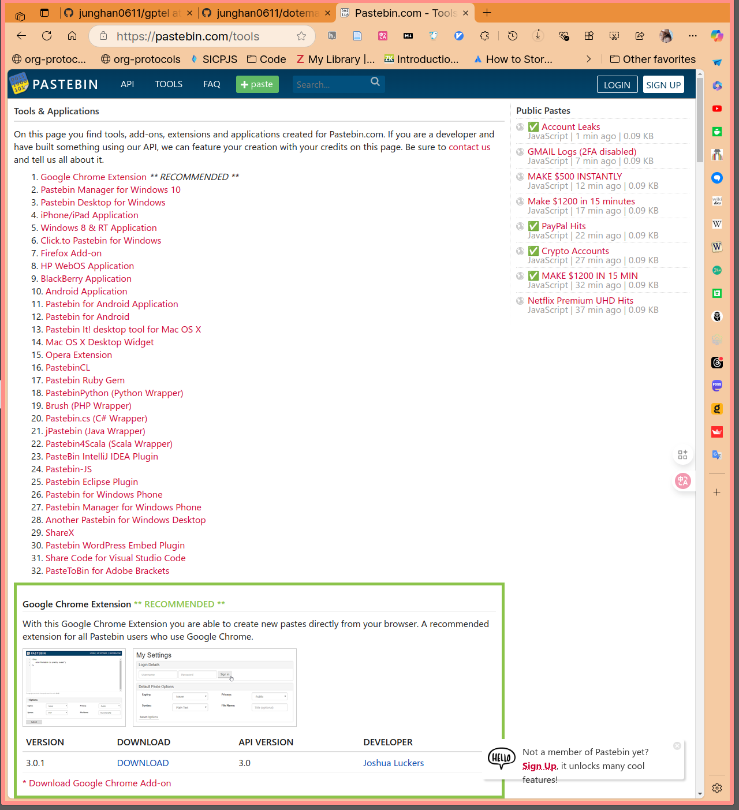

<!-- gid:20250407T224346 -->
[TOC]

[[TIP("이 노트에 대하여")]]
Pastebin이 코드 조각과 설정 파일, 긴 텍스트를 URL로 공유하는 서비스라는 점을 정리한다. 클립보드와 스니펫 공유 도구 지형을 이해하는 데 도움이 되는 노트다.
[[/TIP]]

## BIBLIOGRAPHY

  “Pastebin.Com - #1 Paste Tool since 2002!” n.d. Accessed September 11, 2024. [https://pastebin.com/](https://pastebin.com/).

## 히스토리

-   [2025-06-27 Fri 09:42] Created!
-   [조직모드: 클립보드 복사 붙여넣기 복붙 org-rich-yank ◊kill-ring ◊yank](https://wikidocs.net/381391)

## 관련메타

-   [무료 공짜 나눔 공유](https://wikidocs.net/380643)
-   [스니펫](https://wikidocs.net/380701)

## BIBLIOGRAPHY

  “Pastebin.Com - #1 Paste Tool since 2002!” n.d. Accessed September 11, 2024. [https://pastebin.com/](https://pastebin.com/).

## 로그

### [|2025-06-27 Fri 09:42|](https://wikidocs.net/380421.md#h-2025-06-27/)

#### @user pastebin이라는 서비스를 소개해줘. 목적 및 활용 방안에 대해서.

@assistant Pastebin은 텍스트, 특히 프로그래밍 코드나 설정 파일 등 원본 형식을 유지해야 하는 긴 텍스트를 웹상에 저장하고 공유할 수 있는 서비스입니다. 사용자는 텍스트를 입력한 후 저장하면 고유한 URL이 자동으로 생성되어 이를 통해 다른 사람과 쉽게 내용을 공유할 수 있습니다[3][4].

### 목적

-   주로 개발자들이 소스 코드 일부를 저장하고 리뷰하거나 공유하는 데 사용됩니다[1][4].
-   익명으로도 텍스트를 올릴 수 있어, 간단한 메모나 로그, 설정 파일 공유에도 적합합니다[3].
-   토렌트 정보나 해커가 공개한 정보 등 다양한 텍스트 데이터가 공유되는 공간으로도 알려져 있습니다[1].

### 주요 기능 및 특징

-   100개 이상의 프로그래밍 언어 문법을 인식해 문법 하이라이팅(색상 강조)을 지원, 코드 가독성을 높여줍니다[3][5].
-   공개/비공개 설정과 자동 만료 시간 설정 기능이 있어 공유 범위와 보존 기간을 조절할 수 있습니다[3].
-   회원가입 없이도 대부분 기능을 사용할 수 있으며, 페이스북이나 구글 계정으로도 로그인 가능합니다[1].
-   PRO 계정(유료)을 통해 추가 기능과 서비스를 이용할 수 있습니다[1].

### 활용 방안

-   개발자들이 코드 스니펫을 공유하거나 협업 시 코드 리뷰에 활용할 수 있습니다.
-   블로그나 커뮤니티에서 코드 예제나 설정 파일을 깔끔하게 보여줄 때 유용합니다[5].
-   긴 텍스트 데이터를 원본 형식 그대로 공유해야 하는 경우, URL 하나로 간편하게 전달할 수 있어 편리합니다.
-   보안상 민감한 정보는 주의가 필요하지만, 임시 저장이나 빠른 공유용으로 활용할 수 있습니다[1].

요약하면, Pastebin은 텍스트 기반 정보를 쉽고 빠르게 공유하기 위한 웹 서비스로, 특히 프로그래밍 코드 공유에 최적화되어 있으며, 다양한 편의 기능을 제공해 개발자 및 일반 사용자 모두에게 널리 활용되고 있습니다[1][3][4].

-   Citations: [1] <https://blog.naver.com/aepkoreanet/221403057071?recommendTrackingCode=2> [2] <https://ko.wikipedia.org/wiki/%ED%8E%98%EC%9D%B4%EC%8A%A4%ED%8A%B8%EB%B9%88> [3] <https://gone-db.com/entry/%EA%B0%9C%EB%B0%9C%EC%9E%90-%EB%A9%94%EB%AA%A8-%EA%B3%B5%EC%9C%A0-%EC%88%A8%EC%9D%80-%EC%82%AC%EC%9D%B4%ED%8A%B8-PasteBin> [4] <https://ko.wikipedia.org/wiki/Pastebin.com> [5] <https://alyong.tistory.com/entry/Pastebin-%EC%82%AC%EC%9A%A9%ED%95%B4%EB%B3%B4%EA%B8%B0>

#### @user 이 노트의 제목을 뭐라고 하면 좋을까? 핵심 키워드만 나타 내고 싶어

@assistant 이 노트의 제목으로는 핵심 키워드를 간결하게 담아 다음과 같이 제안할 수 있습니다.

**"Pastebin: 텍스트·코드 공유 플랫폼"**

또는

**"Pastebin 서비스 개요 및 활용"**

이 두 제목은 Pastebin의 본질인 텍스트와 코드 저장 및 공유 기능을 명확히 드러내며, 서비스의 목적과 활용 방안을 포괄적으로 나타냅니다[1][3][4].

-   Citations: [1] <https://suskind.tistory.com/139> [2] <https://asec.ahnlab.com/ko/1131/> [3] <https://blog.naver.com/aepkoreanet/221403057071> [4] <https://ko.wikipedia.org/wiki/%ED%8E%98%EC%9D%B4%EC%8A%A4%ED%8A%B8%EB%B9%88> [5] <https://rgo4.com/tip/95397>

#### @user

## 아카이브

### 20250623T072948-pastbin

(“Pastebin.Com - #1 Paste Tool since 2002!” n.d.)

