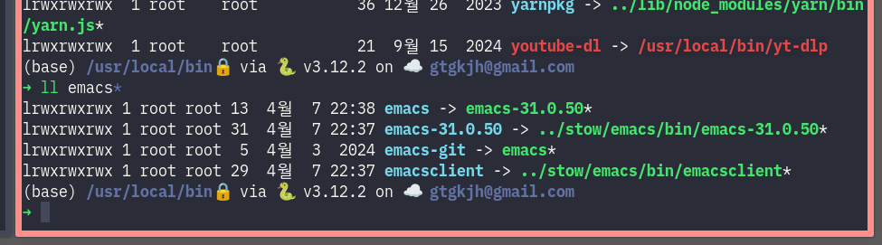

<!-- gid:20250408T150326 -->
[[TIP("이 노트에 대하여")]] Emacs 버전업과 재설치 이후 Stow 링크가 꼬이는 문제를 스크립트로 해결하려는 노트다. 빌드 설치를 반복하는 환경에서 꼭 필요한 재연결 절차를 담고 있다. [[/TIP]] BIBLIOGRAPHY History - [2025-04-08 Tue 15:03] 이 부분은 그냥 일단 스크립트 넣어 둔다 Related-Notes - [이맥스 설치 - PPA 및 빌드 리눅스](https://notes.junghanacs.com/notes/20241216T100853/)
-   [GNU stow 심볼릭 링크 닷파일 관리 도구](https://notes.junghanacs.com/notes/20250407T224601/)

## 스토우 활용 설치 관리 및 업데이트

[2025-04-08 Tue 15:03]

스크립트에서 아주 강력하게 사용하는 것이 스토우다. 스토우를 할 때 버전 업을 하면 꼬이게 되는 것이 바로 아래와 같다.

대략. 스토우를 하고 다시하는 것

```shell
#!/bin/bash

start_green="\033[92m"
end_green="\033[39m"

current=${PWD}
devname=${NAME}

echo -e "\n${start_green} Hi! ${devname} ${end_green}"

# 2022-10-13 : emacs-master-git da752c04664c0e22a2f6b4a41dfa1fed4d5276ff
# 2022-10-15 : emacs-master-git e185526d216e544a70b2be77b34b5cb5386762d1

# sudo mkdir /usr/local/include
# sudo mkdir /usr/local/libexec
# sudo mkdir /usr/local/man

# 1) 처음 설치 할 경우!
# git clone
# git clone -b master --depth 1 --single-branch git@github.com:emacs-mirror/emacs.git emacs-master-git
# cd emacs-master-git
# git clone -b emacs-29 --depth 1 --single-branch git@github.com:emacs-mirror/emacs.git emacs-29-git

# need GCC 12 +
# sudo apt update -y
# sudo apt install -y gcc-12 g++-12 libgccjit0 libgccjit-12-dev

# 2) 업데이트만
cd ~/nosync/emacs-pkgs/emacs-master-git
# cd ~/nosync/emacs-pkgs/emacs-29-git

git pull --depth=50

# git clean -fdx
# git reset --hard
# git clean -xfd

# emacs build (29+)
export CC=/usr/bin/gcc-13 CXX=/usr/bin/g++-13

make clean

# --without-sqlite3  ;; without builtin sqlite
# --without-tree-sitter
# --without-pop ;; pop3 mail

# export IMAGEMAGICK_LIBS=/usr/local/lib/

./autogen.sh

# use gtk3
# toolkit="--with-xwidgets --with-x-toolkit=gtk3"

read -p "Use gkt and xwidgets instead of pgtk on wayland (y/N) " ready_choice
if [ "$ready_choice" = "y" ]; then
  toolkit="--with-xwidgets --with-x-toolkit=gtk3"
else
  toolkit="--with-pgtk"
  # toolkit="--with-x-toolkit=lucid"
fi

./configure --without-pop \
  --with-gnutls \
  --without-mailutils \
  --with-sqlite3 \
	--with-rsvg \
	--with-png --with-jpeg --with-tiff --with-imagemagick \
  --with-tree-sitter \
  --without-xim \
  ${toolkit} \
  --with-cairo --with-lcms2 --with-modules \
  --program-transform-name='s/^ctags$/ctags.emacs/' \
  CFLAGS="-O2 -pipe -mtune=native -march=native -fomit-frame-pointer"

# --with-xwidgets --with-x-toolkit=gtk3
#   What window system should Emacs use?                    pgtk
#   What toolkit should Emacs use?                          GTK3

#read -p "Ready to install (y/N)?" ready_choice
#if [ "$ready_choice" = "y" ]; then
#    echo "Installing\n";
#else
#    echo "Exiting\n";
#    exit 0
#fi

make -j4;
# ./src/emacs -Q # for test

echo -e "\n Input Password for Installation"

# 1) Alternative installation methods
sudo make install prefix=/usr/local/stow/emacs

# 2) stow adopt and remove for overwriting
cd /usr/local/stow
sudo rm emacs/bin/emacs
sudo stow emacs --adopt
sudo stow -D emacs
sudo rm -Rf emacs

# 3) Alternative installation methods
cd -
sudo make install prefix=/usr/local/stow/emacs

# 4) stow new compiled emacs
cd /usr/local/stow
sudo stow emacs

cd /usr/local/bin
sudo ln -s emacs emacs-git

echo -e "\n Update Done"

cd ${current}

# OLD verion
# remove stowed old emacs
# cd /usr/local/stow
# sudo stow -D emacs
# sudo rm -Rf emacs
# cd -
```

### 문제 발생 시 링크 수동 해결


