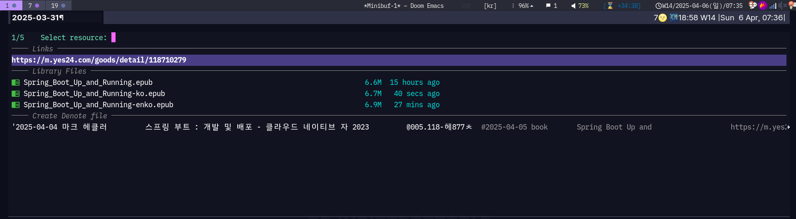

<!-- gid:20250409T142618 -->
[TOC]

[[TIP("이 노트에 대하여")]]
서지 관리의 중심을 Zotero 앱보다 bib 파일과 citar 쪽으로 옮기며 첨부 연결과 메타 확장을 설명한다. 조테로는 편하지만 없어도 된다는 관점을 실용적으로 제시하는 노트다.
[[/TIP]]

## BIBLIOGRAPHY

- “Import Bib by Zotero Translation Server · Issue #220 · Joostkremers/Ebib.” n.d. Accessed April 9, 2025. [https://github.com/joostkremers/ebib/issues/220](https://github.com/joostkremers/ebib/issues/220).
- “Translators [Zotero Documentation].” n.d. Accessed April 9, 2025. [https://www.zotero.org/support/translators](https://www.zotero.org/support/translators).

## 히스토리

-   [2026-02-16 Mon 23:06] 진짜 조테로 필요 없다.
-   [2026-01-04 Sun 18:43] 생성하긴했는데 유사 노트가 있다.
-   [2025-06-14 Sat 09:26] 잠시만, 무슨 노트야?
-   [2025-04-09 Wed 14:26] bib 파일 하나에 연결 링크를 남기면 그 안에서 정보 관리가 편해진다. 사실 조테로는 필요 없다. 그렇지만 있으니까 편하다.

### translators [Zotero Documentation]

(“Translators [Zotero Documentation]” n.d.)

### import bib by zotero translation server · Issue #220 · joostkremers/ebib

(“Import Bib by Zotero Translation Server · Issue #220 · Joostkremers/Ebib” n.d.)

Inspired by this pull request jkitchin/org-ref\\#901, we can import bib entries by Zotero Translation Server with Zotero Translators which support a large range of websites. We don't need to install ...

## Related-Notes

-   [조테로](https://wikidocs.net/380563)
-   [zotero-config AI-Queryable 서지정보 관리](https://wikidocs.net/381667) 여기서 완성함

## 2025 조테로 사이타 첨부파일 연결

[2025-04-06 Sun 07:36]

파일을 넣는 것을 보라. bib 파일에 넣어야돼. 그러면 간단해져.

```text

file = {/home/junghan/sync/logseq/Documents/book/Spring_Boot_Up_and_Running-enko.epub;/home/junghan/sync/logseq/Documents/book/Spring_Boot_Up_and_Running-ko.epub;/home/junghan/sync/logseq/Documents/book/Spring_Boot_Up_and_Running.epub},
```

### 스크린샷



## 로그

### [|2026-01-04 Sun 18:43|](https://wikidocs.net/380448.md#2026-01-04-sun/)

@user 브라우저 또는 조테로 gui 프로그램 없이도 조테로에 저장할 수 있는 방법이 있는가? 여기는 nixos 노트북인데 메인 노트북이 아니라 조테로 gtk가 설정이 제대로 안되어 있어. translation 서버를 띄워 놓고 어디서는 링크를 담으면 편할 것 같아. 알아봐줘. 방법이 있는 것으로 알고 있는데 적용할 때가 된 것 같아. 요즘 굉장히 많은 링크를 놓치고 있어.

@assistant

## Translation Server를 이용한 Zotero 저장 방법

**Question:** Is there a way to save to Zotero without a browser or Zotero GUI program? This is a NixOS laptop, not the main one, so Zotero GTK settings aren't configured properly. I think it would be convenient to run a translation server and save links from anywhere. Please look into this. I believe there's a method, and it seems like it's time to apply it. I'm missing a lot of links these days.

---

조테로(Zotero)에 브라우저나 GUI 없이 아이템을 저장하는 방법이 있습니다. **Zotero Translation Server** 를 활용하면 됩니다.

### 주요 방법들

#### 1. **Zotero Translation Server** (추천)

-   GitHub: <https://github.com/zotero/translation-server>
-   독립 실행형 HTTP 서버로, 조테로 트랜스레이터(translators)를 사용해 URL에서 메타데이터를 추출합니다
-   REST API를 통해 CLI나 스크립트에서 호출 가능

**작동 방식:**

```bash
# Docker로 실행
docker run -d -p 1969:1969 zotero/translation-server

# 또는 직접 실행 (Node.js 필요)
git clone https://github.com/zotero/translation-server.git
cd translation-server
npm install
npm start
```

**사용 예시:**

```bash
# URL에서 메타데이터 추출
curl -X POST -H "Content-Type: application/json" \
  -d '{"url":"https://www.nature.com/articles/s41586-021-03819-2"}' \
  http://localhost:1969/web
```

#### 2. **Zotero Web API와 연동**

Translation Server에서 얻은 메타데이터를 Zotero Web API로 전송:

```bash
# 1. Translation Server에서 메타데이터 추출
METADATA=$(curl -s -X POST -H "Content-Type: application/json" \
  -d '{"url":"YOUR_URL"}' http://localhost:1969/web)

# 2. Zotero API로 저장
curl -X POST \
  -H "Zotero-API-Key: YOUR_API_KEY" \
  -H "Content-Type: application/json" \
  -d "$METADATA" \
  https://api.zotero.org/users/YOUR_USER_ID/items
```

#### 3. **NixOS 통합 방안**

\## 실행 단계

#### 1️⃣ **Translation Server 설치 및 실행**

```bash
# Docker 사용 (가장 간단)
docker run -d -p 1969:1969 --name zotero-translation zotero/translation-server

# 또는 systemd 서비스로 (위 .nix 파일 참고)
```

#### 2️⃣ **Zotero API 키 발급**

1.  <https://www.zotero.org/settings/keys> 접속
2.  "Create new private key" 클릭
3.  권한: "Allow library access" - "Read/Write"
4.  User ID는 <https://www.zotero.org/settings/keys> 페이지 상단에 표시

#### 3️⃣ **환경 변수 설정**

```bash
# ~/.bashrc 또는 ~/.zshrc
export ZOTERO_API_KEY="your_api_key_here"
export ZOTERO_USER_ID="your_user_id_here"
export ZOTERO_TRANSLATION_SERVER="http://localhost:1969"
```

#### 4️⃣ **사용**

```bash
# 스크립트 실행 권한 부여
chmod +x zotero-save-url.sh

# URL 저장
./zotero-save-url.sh "https://www.nature.com/articles/s41586-021-03819-2"

# 특정 컬렉션에 저장
./zotero-save-url.sh "https://arxiv.org/abs/2103.00020" "COLLECTION_KEY"
```

#### 5️⃣ **Emacs 통합** (선택사항)

Doom Emacs `config.el` 에 추가:

```elisp
(load-file "~/path/to/zotero-emacs-integration.el")

(setq zotero-api-key (getenv "ZOTERO_API_KEY")
      zotero-user-id (getenv "ZOTERO_USER_ID"))

(map! :leader
      :desc "Save URL to Zotero" "n z u" #'zotero-save-url-at-point
      :desc "Save Org link to Zotero" "n z l" #'zotero-save-org-link)
```

### 추가 팁

-   **i3wm 키바인딩**: `bindsym $mod+z exec ~/zotero-save-url.sh "$(xclip -o)"` 로 클립보드 URL 즉시 저장
-   **북마클릿**: Translation Server API를 호출하는 북마클릿 생성 가능
-   **CLI 도구**: `pyzotero` (Python), `zotero-cli` (Node.js) 등도 있음

이제 GUI 없이 어디서든 조테로에 링크를 저장할 수 있습니다! 🎯

---

📊 Tokens: 1,111 in, 3,217 out

@user
