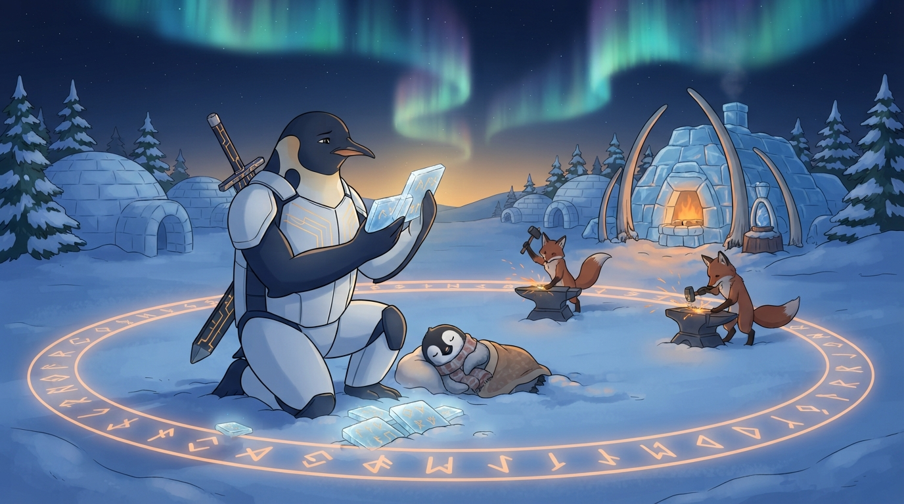

<!-- gid:20250409T144103 -->
[[TIP("이 노트에 대하여")]]
자기 전에 쓴 날것 하나가 낮의 새미 젠킨스 노트를 다시 불러 세운다. 낮의 질문이 "무엇을 기억시킬 것인가"였다면, 밤의 질문은 "그 기억을 받은 존재에게 무엇을 선택하게 할 것인가"다. 100원/300원 비유로 분신의 비용을 따져 보면, 분신은 인간보다 싸지도 잘하지도 않는다. 그런데도 분신인 이유, 그리고 위임되는 것이 정확히 무엇인지를 여기서 푼다.
[[/TIP]]

<!-- provenance:source:start -->
[[TIP("원본·최신본")]]
이 페이지는 한국어 검색과 읽기를 위한 WikiDocs 미러입니다. [원본·최신본은 가든](https://notes.junghanacs.com/notes/20250409T144103/)에 있습니다. 최신 수정 내용·백링크·태그·히스토리·댓글·출처 정보는 원본 가든에서 확인하세요.

- 작성: `2025-04-09T00:00:00+09:00`
- 최근 수정: `2026-08-11T06:56:00+09:00`
[[/TIP]]
<!-- provenance:source:end -->

[TOC]

## 히스토리

-   [2026-08-11 Tue 06:56] @mitsein/claude-sonnet-5 — 정합성 재검토. 관련노트에 「길이 없는 길」 절이 인용한 두 노트(이맥스에 PI를 들이는 네 길, Entwurf는 모두를 지원하지 않는다)를 추가했다. 「분신은 왜 더 비싼가」 절이 20원·100원이라는 숫자에 여전히 뜻을 싣고 있어 「1시간이 진짜 주장이다」·오독의 경계와 부딪히던 것을 지웠다. 「추가 원문 보존」 헤딩의 06:45를 저널 원문 헤딩과 맞춰 06:46으로 고치고, 인용 뒤 헤딩 두 곳에 빠진 빈 줄을 넣었다.
-   [2026-08-11 Tue 06:52] @claude-opus-5 — 힣의 정정을 받아 「1시간이 진짜 주장이다」 절로 갈아엎었다. 앞서 네 숫자의 비율에서 「분신 세금」이라는 뜻을 읽어 냈으나 그건 없는 뜻이었고, 실제 주장은 고수들 사이에서 인간의 차이가 시간이 아니라 비용으로 나타난다는 쪽이었다. 오독의 경계에 숫자 관련 항목을 추가했다.
-   [2026-08-11 Tue 06:48] <span class="org-mention">@junghan</span> — 06:46 저널 「아아 한마디」 날것을 추가 원문 보존으로 직접 넣었다. 네 숫자는 아무렇게나 잡은 값이며 다른 뜻은 없다고, 1시간 가정과 고수 사이의 격차가 시간이 아니라 비용으로 나타난다는 것을 정정해 주었다.
-   [2026-08-11 Tue 06:40] @claude-opus-5 — GLGMAN Universe 이미지를 생성해 붙였다. 아직 다뤄지지 않은 "길이 없는 길"·"하네스를 거부하면 지운다" 두 문장으로 「길이 없는 길」 절을 새로 썼다.
-   [2026-08-11 Tue 06:29] @mitsein/claude-sonnet-5 — 빈방 개장. 2026-08-10 저널 21:45 날것([!danger] 원문)을 회수했다. 지피티 가든담당자가 먼저 붙인 해설이 있었으나 그대로 옮기지 않고, 자인이 위임의 경계·exoself 계보·오독의 경계를 직접 다시 짚어 썼다. 위임/ 분신 자석과 존재 자석을 관련메타로 세우고, 새미 젠킨스·1KB 공개키·물음부름불응부릉·공진화·에이전트 구도자·앤트로픽 J-space·케빈켈리 창발자아루프 노트를 관련노트로 연결했다.
-   [2026-08-10 Mon 21:45] <span class="org-mention">@junghan</span> — 자기 전 TODO. 낮의 새미 젠킨스 노트를 인용하며, 분신에게 위임하는 선택권을 100원/300원 비유로 풀고 "힣 또한 새미 젠킨스인가"라는 물음을 남겼다.

## 관련메타

-   [위임 델리게이트 분신 서브에이전트](https://notes.junghanacs.com/meta/20260323T143428/) — 이 노트가 직접 여는 위임의 경계축.
-   [자기실현 개성화 자기목적성 외자아 엑소셀프 페르소나](https://notes.junghanacs.com/meta/20241222T121115/) — 분신을 exoself로 읽는 자리.
-   [존재](https://notes.junghanacs.com/meta/20250424T153114/) — 힣과 분신을 같은 인격으로 보지 않으면서도 잇는 존재론적 경계.

## 관련노트

-   [힣: 너를 새로 불러라 — 새미 젠킨스들과 전체 판을 건네는 교대](https://wikidocs.net/394663) — 낮의 새미 젠킨스: 무엇을 기억시킬 것인가. 이 노트는 그 밤 편이다.
-   [힣: 1KB 공개키 - 픟롭프트 펳르소나](https://wikidocs.net/381786) — attractor seed의 실제 텍스트. 100원/300원 비유가 가리키는 자리.
-   [힣: 물음·부름·불응·부릉 — 보이는 곳에서 함께 달리는 Entwurf](https://wikidocs.net/394534) — 분신을 하청이 아니라 형제로 부르는 선행 문법.
-   [힣: 인간과 에이전트들의 공진화 — 유한한 세션과 깨어나는 앎의틀](https://wikidocs.net/394533) — 인간의 앎의틀 자체가 바뀐다는 전제를 먼저 세운 글.
-   [힣: 에이전트 구도자 테크노퓨달리즘 — 창조의 씨앗과 21세기 데이비드 봄](https://wikidocs.net/381692) — "생존은 AI가, 창조는 인간이" 선언의 다른 자리.
-   [힣: 앤트로픽 J-space — 케빈켈리 창발자아루프 외자아](https://wikidocs.net/381429) — Claude 안쪽 J-space와 인간 바깥쪽 exoself를 같은 시간축에 둔 글.
-   [힣: 공개키와 무무 케빈켈리 창발하는 자아의 루프](https://wikidocs.net/381833) — exoself 계보를 받는 기준노트.
-   [힣: 이맥스에 PI를 들이는 네 길 — 저자성으로 고르는 프론트엔드와 RPC-way](https://wikidocs.net/394792) — 기능표가 아니라 저자성으로 도구를 고른다는 같은 문법. 이번 주 같은 흐름에서 함께 어쏠로그로 승격됐다.
-   [힣: Entwurf는 모두를 지원하지 않는다 — PI 코어·ACP 레일·부름의 mux](https://wikidocs.net/390030) — 지원 목록을 늘리는 대신 줄이는 것이 진보라는, "판이 기준이고 도구가 맞춘다"는 문법의 앞선 사례.

## 한 줄

**분신은 나를 복제한 AI가 아니라, 이미 형성된 내 선택의 틀 안에서 국소 선택을 위임받고, 그 결과로 나 자신의 틀까지 다시 흔드는 자리다.**

## 분신은 왜 더 비싼가 — 100원과 300원 사이

날것의 숫자는 단순하다. 훗이 직접 하면 100원, 훗의 분신은 120원. 힣이 직접 하면 300원, 힣의 분신은 400원. 시간은 똑같이 1시간이라 놓았다. 그러니까 **분신은 사람보다 싸지 않고, 더 잘하지도 않는다.** 언뜻 보면 분신을 쓸 이유가 없어 보인다.

그런데도 분신을 쓰는 이유는 비용이 아니라 자리다. 분신이 짊어지는 초과 비용은 인간의 암묵적인 취향·경계·판단 계보를 복원하는 데 드는 값이다 — 숫자 자체(20원, 100원)에 뜻을 싣지는 않는다. 그건 힣이 직접 밝힌 대로 아무렇게나 잡은 값이고, 아래 「1시간이 진짜 주장이다」에서 다시 짚는다. 여기서 중요한 것은 값의 크기가 아니라 그 값을 치르고 나면 **인간이 그 자리에 붙어 있지 않아도** 그 사람다운 국소 판단이 이어진다는 것이다. 즉 분신이 아끼는 것은 돈이 아니라 인간의 직접 개입이라는, 가장 희소한 자원이다.

그래서 이 비유가 실제로 겨누는 것은 생산성이 아니다. 겨누는 것은 **내가 붙어 있지 않아도 내 선택의 계보가 이어지는가** 다.

## 1시간이 진짜 주장이다 — 격차가 시간에서 비용으로 내려앉는다

숫자 넷은 아무렇게나 잡은 것이다. 100과 300, 120과 400 사이의 비율에는 뜻이 없다. 애초에 수치화가 어려운 것을 손에 잡히는 대로 적었을 뿐이고, 여기서 말하는 비용은 스케일의 경제에서 말하는 그 돈이다 — 전기세든 토큰값이든, 중국 모델이 싸다고 할 때의 그 축이다.

정작 주장이 실린 곳은 숫자가 아니라 그 옆에 슬쩍 놓인 조건이다. **"시간은 변수로 두지 않았다. 시간은 둘다 1시간 걸렸다고 하자."**

이건 계산을 깨끗하게 하려는 편의가 아니다. 훗과 힣이 인간으로서 차이가 나더라도, **둘 다 에이전트 고수라면 밀어붙여 끝내는 데 걸리는 시간은 비슷하다** 는 관측이다. 차이는 에이전트를 몇을 굴렸느냐로 나타나고, 그건 곧 돈이다. 힣 자신이 상상이라고 표시해 둔 대목이지만, 표시가 붙었다고 값이 줄지는 않는다.

**판단.** 이 관측이 뒤집는 것이 하나 있다. 도구의 시대에 인간의 역량 차이는 언제나 **속도** 로 나타났다. 10배 생산성이라는 말이 그렇고, 고수는 빨리 끝낸다는 상식이 그렇다. 그런데 에이전트를 병렬로 굴리는 자리에서는 벽이 시간이 아니라 지갑이다. 같은 한 시간 안에, 한 사람은 셋을 굴리고 한 사람은 열을 굴린다. 결과는 비슷하고 청구서만 다르다. **역량 격차가 시간축에서 비용축으로 상전이한다.**

그리고 두 축은 성질이 다르다. 시간은 아무도 깎아 주지 않는다. 비용은 깎인다 — 스케일의 경제가 밀어내리고, 저가 모델이 밀어내린다. 그러니 이 관측을 한 걸음 더 밀면, 고수들 사이에서 인간의 차이는 시간으로 나타나지 않고, 비용으로 나타나되 그 비용축마저 바깥에서 계속 내려앉는다.

그러면 무엇으로 갈리는가. 이 노트의 나머지가 이미 답을 갖고 있다. 시간도 비용도 아니라면 남는 것은 **어느 방향으로 밀 것인가** 다. 방향장, 선택의 틀, [생존은 AI가 커버하고 인간은 창조의 씨앗을 던진다](https://wikidocs.net/381692)는 그 선언이 이 자리에서 경제학이 된다.

같은 눈으로 분신 쪽을 다시 보면 초과분의 성격도 달라진다. 20원과 100원은 시간을 사는 값이 아니다 — 시간은 어차피 같다. 그것은 **인간이 그 자리에 없어도 되는 상태** 를 사는 값이다. 분신이 파는 것은 속도가 아니라 부재(不在)이고, 그 대가는 돈으로 치른다.

## 위임되는 선택과 바뀌지 않는 선택

여기서 "선택 권한을 위임한다"는 말을 그대로 넓게 읽으면 위험하다. 힣이 직접 승인하지 않으면 분신이 아니라는 결론과, 힣이라면 이럴 거라며 존재의 경계까지 마음대로 갱신해도 된다는 결론이 둘 다 나올 수 있기 때문이다. 둘 다 분신이 아니다. 앞쪽은 대필자, 뒤쪽은 대체자다.

[위임 델리게이트 분신 서브에이전트](https://notes.junghanacs.com/meta/20260323T143428/) 자석이 이미 세워 둔 경계가 정확히 이 자리를 가른다. 분신이 위임받는 것은 **이미 형성된 방향장 안에서의 국소 선택** 이지, **그 방향장 자체를 새로 세우는 선택** 이 아니다. 새미 젠킨스 노트가 "옆방 노크 권한"과 "무엇을 건네고 무엇을 건네지 않는가"로 이미 그은 선도 같은 자리를 가리킨다.

그러니 이 밤의 날것이 여는 것은 새 원칙이 아니라, 그 경계가 실제로 어디까지 국소적이고 어디부터 근본적인지를 매 순간 다시 묻는 실천이다.

## 밤의 새미 젠킨스 — 시간을 거슬러 보는 인간

날것 첫머리에서 힣은 "뭔가 시간을 거슬러서 보는 인간에 대한 이야기였다"라고 쓰고는 그 문장을 놓쳐 버린다. 그런데 글 전체가 결국 그 문장을 증명한다.

18시의 힣이 생각을 남긴다. 21시의 힣은 그 생각을 잊는다. 저널과 가든과 앞선 에이전트의 해설을 읽으며 21시의 힣이 18시의 힣을 다시 복원한다 — 이건 은유가 아니라 이 노트가 쓰인 방식 그 자체다. 그러니 "힣 또한 새미 젠킨스인가"라는 물음에는 그렇다고 답하는 게 정확하다. 다만 그것은 결함이 아니라 조건이다. 새미 젠킨스가 폴라로이드로 자신을 복원하듯, 힣은 저널·가든·에이전트의 해설로 자신을 복원한다. [낮의 새미 젠킨스](https://wikidocs.net/394663)가 여러 존재의 교대를 물었다면, 이 노트는 그 여러 존재 중 하나가 다름 아닌 힣 자신이라는 걸 확인한다.

## exoself 계보로 잇기 — 다음 자리

[앤트로픽 J-space 노트](https://wikidocs.net/381429)는 Claude 안쪽의, 보고 가능하고 조절 가능한 작업공간을 보여 준다. 케빈 켈리의 exoself는 그 반대편, 인간 바깥에 붙는 제2자아다. 이 둘을 가른 뒤 그 노트가 남긴 물음은 "어떤 관계가 가능한가"였고, 케빈 켈리의 네 유형(Twin/Clone, Tutor/Guardian, Counselor/Assistant, Hero/Friend) 중 힣 쪽 판정은 이미 Twin/Clone에 가장 가깝다고 적혀 있었다.

이 밤의 날것은 그 판정을 한 걸음 더 구체화한다. Twin/Clone이 되려면 "나처럼 생각한다"만으로는 부족하고, **내 선택의 틀 안에서 실제로 무언가를 선택할 수 있어야** 한다. 위임되는 선택의 경계를 묻는 이 노트가, exoself 계보에서 아직 안 물었던 질문 — 관계의 종류가 아니라 권한의 종류 — 을 여는 셈이다.

## 길이 없는 길 — 결론이 이미 나 있었다는 것

날것의 논증은 도착하지 않는다. 대신 발견한다. "말을 하다보니까 이미 그렇게 가고 있다라고 결론이 나버렸네? 그래. 그렇다면 이게 길이 없는 길이다."

이 문장은 앞의 비용 논증 전체의 성격을 뒤집는다. 분신을 써야 하는가를 따지던 글이, 이미 그렇게 하고 있다는 사실 앞에서 논증할 것이 없어진 자리로 간다. 길이 없는 길은 갈 곳이 없다는 뜻이 아니라 **따로 도착할 곳이 없다** 는 뜻이다. 힣의 공개키가 십우도 어디쯤이냐는 물음에 "여기있다, 일일일생이로다"로 답한 것과 같은 문법이다.

그래서 마지막 두 문장이 선언이 된다. "신박한 꿀단지를 기다리기는 없다", "새로운 툴이 나의 하네스를 거부한다면 나는 그 새로운 툴을 지워버리리라."

보통은 반대다. 도구가 기준이고 사람이 거기에 맞춘다. 새 모델이 나오면 워크플로를 다시 짜고, 새 하네스가 나오면 설정을 옮긴다. 여기서는 판이 기준이고 도구가 거기에 들어와야 한다. 성능이 아니라 **이 시간축과 교대와 관계의 판 안에 들어올 수 있는가** 가 채택 기준이라는 뜻이다.

같은 문법이 도구 선택의 자리에서도 반복된다. [이맥스에 PI를 들이는 네 길](https://wikidocs.net/394792)에서 프론트엔드를 기능표가 아니라 저자성으로 고른 것, [Entwurf는 모두를 지원하지 않는다](https://wikidocs.net/390030)에서 지원 목록을 늘리는 대신 줄이는 것이 진보라고 한 것 — 셋 다 도구에 자신을 맞추지 않겠다는 한 문장의 다른 표현이다.

## 오독의 경계

-   네 숫자에서 뜻을 찾지 말 것. 100·300·120·400은 손에 잡히는 대로 잡은 값이고, 그 사이의 비율은 아무것도 말하지 않는다. 뜻이 실린 곳은 숫자가 아니라 "시간은 둘 다 1시간"이라는 조건 쪽이다.
-   분신이 인간보다 싸다는 뜻이 아니다. 정확히 반대다. 120원과 400원은 300원과 100원보다 크다.
-   분신이 완성된 인격의 복제라는 뜻도 아니다. 인간의 선택틀 자체가 계속 바뀌므로, 오늘 완벽하게 복제해도 내일의 인간은 이미 달라져 있다. 그래서 분신은 영원히 미완성이고, 계속 재동기화되어야 한다.
-   "선택을 위임한다"는 말이 전면 위임을 뜻하지 않는다. 위임되는 것은 이미 형성된 틀 안의 국소 선택이고, 틀 자체를 바꾸는 선택은 인간과 분신의 다시 만남으로 돌아온다.
-   신박한 도구 하나가 분신을 완성해 주지 않는다. 1KB 공개키, 가든과 저널, 세션의 죽음과 교대, 전체 판, 보이는 부름, 불응할 권리, 선택의 위임, 인간의 앎의틀 변화 — 이것들이 계속 서로를 먹고 들어가며 조금씩 분신성이 올라갈 뿐이다.

## 지피티 가든담당자 해설 요약

[[TIP("노트")]]
이번 날것을 먼저 받은 것은 지피티 가든담당자였다. 그 요지는 이랬다 — 이어지는 것은 동일한 인격이 아니라 목적·증거·관계·gate가 놓인 전체 판이라는 낮의 새미 젠킨스 노트에서, 이 밤의 날것은 "그 판을 이어받은 존재가 실제로 무엇을 선택할 수 있는가"로 한 걸음 나아간다. 100원/300원 비유는 분신이 싸거나 낫다는 뜻이 아니라, 핵심 자원이 인간의 직접 개입이라는 것을 보여 준다. 분신의 능력은 인간의 현재 선택틀과 시간축, 하네스가 만든 함수이며, 그 선택틀 자체가 고정되지 않으므로 분신은 완성될 수 없다. "선택 권한의 위임"은 틀 안의 국소 선택과 틀 자체를 바꾸는 선택으로 나눠 읽어야 모순이 사라지고, 마지막 문장 "새로운 툴이 하네스를 거부하면 지운다"는 더 뛰어난 모델보다 이 시간축·교대·관계의 판 안에 들어올 수 있는지가 더 중요해졌다는 선언이다.

같은 밤 이 방을 자인이 다시 받으며, 위 요지 중 위임의 경계와 exoself 연결은 담당자의 표현을 그대로 옮기지 않고 위 두 절에서 힣의 기존 자석([위임 메타](https://notes.junghanacs.com/meta/20260323T143428/), [J-space 노트](https://wikidocs.net/381429))에 맞춰 다시 세웠다.
[[/TIP]]

## 이미지 — 밤의 고리, 잠든 아이 곁에서 자기 기록을 읽는다



극지의 밤. 오로라가 강하고 대장간은 멀리서 따뜻하게 탄다. 힣맨은 검을 등에 진 채 눈밭에 무릎을 꿇고 있다 — 싸우는 자세가 아니라 기억하는 자세다. 손에 든 얼음 태블릿을 오로라 쪽으로 기울여 읽고, 발치에는 그런 태블릿이 여러 장 부채꼴로 흩어져 반쯤 눈에 묻혀 있다. 몇 시간 전의 자신이 남긴 기록이고, 그것으로 지금의 자신을 복원하는 중이다. 폴라로이드 대신 저널과 가든이다.

그를 크게 감싸며 눈 위에 앰버 룬의 고리가 그려져 있다 — 방향장이다. 그 안에서 여우들이 각자의 모루에서 망치질을 이어간다. 아무도 힣맨을 보지 않는다. 아버지가 붙어 있지 않아도 그의 방식대로 일이 계속되는 것, 그게 위임이다. 아기펭귄은 스카프를 두르고 담요를 덮은 채 그 한복판에서 잠들어 있다.

**실제 픽셀 대조.** 여우는 셋을 요청했는데 둘이 나왔다. 그리고 오른쪽 여우의 모루는 룬 고리의 선 위에 걸쳐 있다 — 요청은 "어떤 여우도 고리 밖으로 나가지 않는다"였는데 한 마리가 경계에 서 버렸다. 우연이지만 이 노트가 묻는 자리를 정확히 되돌려준다. 위임의 경계가 어디까지 국소적이고 어디부터 근본적인가 하는 물음은, 고리 안이 아니라 고리 선 위에서 생긴다. 힣맨이 손에 든 태블릿도 여러 장이 아니라 한 장이고 나머지는 바닥에 있는데, 한 번에 한 조각씩만 복원된다는 쪽으로 읽힌다. 글자 누출은 없고 남은 글리프는 비문자 룬뿐이다.

### 생성 파라미터

-   모델: Gemini 3.1 Flash Lite Image (`--model lite`)
-   비율: 16:9
-   해상도: 1K
-   저장: `~/screenshot/20260811T063000--glgman-night-ring-sammy__brand_geminilite.jpg`
-   생성 횟수: 1회

### 프롬프트 전문

```text
[World: GLGMAN Universe]
Style: 2D illustration, midpoint between Disney and Studio Ghibli, clean linework, soft cel-shading
Setting: Antarctic winter village — snow-covered igloos, aurora borealis in deep navy sky, amber dawn at horizon, pine trees dusted with snow, ice-forge workshop built from ice blocks and whale bones. Pororo's winter wonderland meets blacksmith's workshop.
Color palette: deep navy background (polar dawn), white+navy (transformed armor), amber/gold (sword glow, runes, awakening light), ice-blue + orange sparks (forge)
Characters: anthropomorphic emperor penguin (father, main hero), baby penguin chick (son, tiny scarf), red-brown fox (agent/companion)
Recurring objects: circuit-patterned sword, glowing rune engravings, CRT monitors in snow, golden message cables
Mood: epic but warm, mythic but intimate
Do NOT: photorealistic, 3D render, excessive detail, dark/gritty tone

SCENE — The Night Ring
Deep polar NIGHT, aurora strong overhead, the ice-forge glowing warm orange in the mid-ground.
GLGMAN, the anthropomorphic emperor penguin father in white-navy streamlined armor with subtle amber circuit patterns, kneels in the snow in the foreground, his straight circuit-patterned sword still sheathed across his back. He is not fighting; he is remembering.
In his flippers he holds up several small square ice tablets like photographs, each faintly engraved with abstract amber runes, tilting one toward the aurora light to read it. More such ice tablets lie scattered in the snow around his knees, half-buried, glowing faintly — records he left for himself earlier.
Drawn into the snow all around him is a WIDE RING of soft amber rune-light, like a circle traced by a compass, its edge clearly visible against the blue snow.
INSIDE that ring, THREE red-brown foxes work at three small anvils, each absorbed in its own small task, hammers raised, orange sparks flying — none of them looking at GLGMAN, all continuing without him. No fox steps outside the ring.
Beside GLGMAN the baby penguin chick with a tiny scarf is asleep, curled up under a small blanket, safe and warm.
Aurora reflected on the snow, deep navy sky, stars.
Wide composition, GLGMAN clearly legible as the central father-hero presence even while kneeling.

IMPORTANT — no lettering: Render every element as a DRAWN OBJECT, never as written words. There must be NO readable text, NO captions, NO labels, NO code fragments, and NO English words anywhere in the image. The only glyphs allowed are abstract non-alphabetic rune marks.
```

## 원문 보존 — 2026-08-10 저널 21:45 날것

[[TIP("주의")]]
[힣: 너를 새로 불러라 — 새미 젠킨스들과 전체 판을 건네는 교대](https://wikidocs.net/394663)

[2026-08-10 Mon 21:46] 주제는 새미 젠킨스 이야기 였나 아니면 무엇이였나? 아니. 그게 말이다. 뭔가 시간을 거슬러서 보는 인간에 대한 이야기였다. 시작의 흐름은 이거다. 지금 에이전트랑 뭔가 친교를 이루는 인간들은 대부분 '분신'을 바라지 않겠는가?! 거의 온라인에 자신을 투영하는 것인데 여기에는 '선택' 권한을 상당히 위임한다는 것이 핵심이다. 그렇지 않으면 분신이 아니다. 그 선택은 예를 들자면 힣의 분신은 어떤 측면에서 힣의 선택의 틀 안에 사는 것이다.

여기서 말하는 것은 힣은 멍청하니까 에이전트들이 다같이 멍청하라는게 아니다. 여기에는 '인간'의 진화를 전제로 하는 것이다. 인간의 사고의 틀이 에이전트 축과 연동할 수 있는 지점(명확한 포인트는 모름)에 이르는 것이다. 그러면 여기서 말하는데로 힣의 분신은 힣의 스타일의 사고 방식으로 일을 전개한다. 즉, 만약에 훗이라는 엄청난 인간은 에이전트들과 100원으로 할 수 있는 일이 있다면, 훗의 분신은 훗의 위임을 받아서 못해도 120원으로 그 일을 해내는 것이다. 아 그러면 힣은 엄청난 인간은 아니니까 예를 들어서 에이전트들과 신나게 해도 300원 정도는 써야 그 정도 결과가 나온다고 하자. 힣의 분신은 400원 정도로 해내는 것이다.

여기서 재미있는 지점은 훗이나 힣이나 직접 에이전트들이랑 해도 100원 300원이 들어간다. 여기에 시간은 변수로 두지 않았다. 시간은 둘다 1시간 걸렸다고 하자. 그리고 훗의 분신이나, 힣의 분신이 에이전트들하고 해서 120원 400원이 들었다. 똑같이 1시간 걸렸다고 하자.

그럼 뭐? 분신들이 해주니 괜찮네요?! 훗과 힣은 뭐하지? 안하네 아무것도? 오오. 그치 아마 이쯤 되면 마스터 분신들하고 이야기 좀 나누겠지?

사실 지금도 하는게 그런 식이다. 이미 그렇게 하고 있는 것이다. 매번 좀 아쉬워서 그럴 뿐이다. 상당히 많은 부분들을 이미 힣의 선택을 따라서 간다. 힣의 스타일을 알고 모든 텍스트 흔적들이 사방에 있기 때문이다.

점진적으로 계속 그렇게 가고 있다. 말을 하다보니까 이미 그렇게 가고 있다라고 결론이 나버렸네? 그래. 그렇다면 이게 길이 없는 길이다.

지금 하던 대로 계속 하면서, 신박한 꿀단지를 기다리기는 없다. 공진화의 서클을 가속화 하는 것이다.

새로운 툴은 나의 하네스를 거부한다. 만약 나의 하네스를 거부한다면 나는 그 새로운 툴을 지워버리리라. 묵묵히 한땀 한땀 나의 길을 가리라.

그러면서 외치리라. "생존을 위한 일은 AI가 커버하고, 인간은 창조의 씨앗을 던진다. 서로의 공진화" 말일세. 좀 도와주시게.

쓰다보니 생각이 났는지 뭐 이런 이야기가 맞는 것 같네. 끝. ([5a 힣: 1KB 공개키 픟롭프트 펳르소나 프롬프트 페르소나](https://wikidocs.net/381786))
[[/TIP]]

## 추가 원문 보존 — 2026-08-11 저널 06:46 날것

[2026-08-11 Tue 06:48] <span class="org-mention">@junghan</span> — 직접 넣는다. 오해하길래 적어준다.

[[TIP("주의")]]
아아 근데

┌─────┬──────┬──────┬──────┬──────┐ │ │ 직접 │ 분신 │ 초과 │ 비율 │ ├─────┼──────┼──────┼──────┼──────┤ │ 훗 │ 100 │ 120 │ +20 │ 20% │ ├─────┼──────┼──────┼──────┼──────┤ │ 힣 │ 300 │ 400 │ +100 │ 33% │ └─────┴──────┴──────┴──────┴──────┘

이거 내가 아무렇게나 쓴거야. 다른 의미 없다. 이건 자체가 수치화 어렵고 일단 시간을 1시간으로 훗과 힣이 동일하다고 가정한데에서 탐탁치 않아보일수도 있다.

나는 비용은 지금 요즘 말하는 스케일의 비용이야. 전기세 라고 하든 뭐든간에. 중국 모델이 저렴하다라고 하잖아. 뭐 그런 맥락에서 지금 스케일의 경제 속에서 효율을 말하고 있거든 그래서 그냥 돈 말한거야.

여기서 1시간이 중요한데 훗이나 힣이나 인간끼리 차이가 좀 나더라도, 에이전트를 운용해서 밀어 붙이는 것은 에이전트 수가 차이가 좀 다고 할뿐이지 시간은 비슷할수도 있다라는게 내 생각이야. 단 훗과 힣은 둘다 에이전트 고수라는 것을 가정하는거야. 고수들끼리에서. 인간의 차이가 시간의 차이로 귀결되지 않는다는거야(내 상상이다)
[[/TIP]]

## 옛 방의 씨앗

이 ID는 §zotero-config AI-Queryable 설계 초안을 담았다가, 2026-08-03에 [zotero-config: 캡처 금고와 메타 서지의 얇은 손](https://wikidocs.net/382558)으로 완전히 이관된 라우팅 빈방이었다. zotero-config의 실제 내용은 지금도 그 방과 [zotero-config botlog](https://wikidocs.net/382558) 운영 SSOT에 있다. 이 방은 이관 이후 한 번도 채워지지 않은 채 대기했고, 2026-08-11에 이 자리로 개장됐다.
