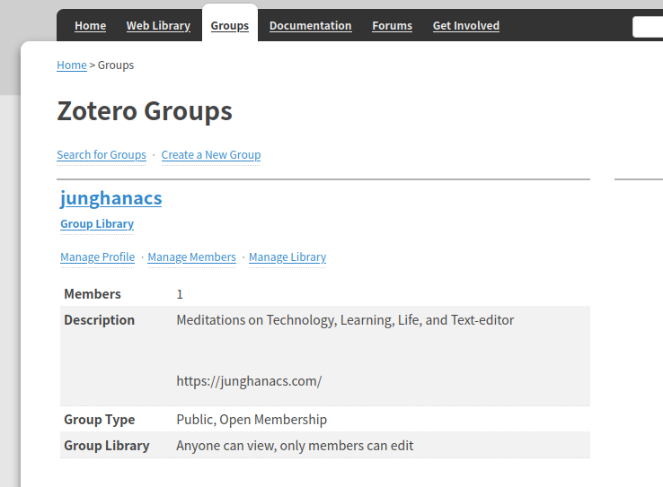

<!-- gid:20250409T144319 -->
[TOC]

[[TIP("이 노트에 대하여")]]
Zotero의 온라인 그룹과 공유 라이브러리를 이용해 서지 파일을 공개하고 함께 활용하는 방식을 설명한다. 개인 서지관리와 공동체적 공유가 만나는 실용 노트다.
[[/TIP]]

## 관련메타

## BIBLIOGRAPHY

  “Zotero.” n.d. Accessed April 4, 2025. [https://www.zotero.org/groups/5570207/junghanacs](https://www.zotero.org/groups/5570207/junghanacs).
  “Zotero Groups 조테로 그룹.” n.d. Accessed April 4, 2025. [https://www.zotero.org/groups](https://www.zotero.org/groups).

## History

-   [2025-06-22 Sun 09:39] 업데이트 - [2025-04-04 Fri 15:03] 조테로 공유클럽은 무료인데 여러모로 훌륭하다. 왜 안쓰겠는가? - [어쏠로지: 모두가저자다 인생은한권의책 조테로공유그룹](https://wikidocs.net/381331)

<https://www.zotero.org/groups>

## 그룹 가입 및 서지 추가 코멘트 작성

## 내보내기 하여 본인의 에디터에 추가하는 방법

## Book.bib 파일

-   [2025-06-22 Sun 09:41] 서지 파일 업데이트
-   [2025-04-17 Thu 17:56] 내보내기

[junghanacs/notes.junghanacs.com/blob/v4/Book.bib - github.com](https://github.com/junghanacs/notes.junghanacs.com/blob/v4/Book.bib)

다음과 같은 형식의 파일

```bib
@book{001-김65ㅅ,
  title = {생각의 시대 - 인류 문명을 만든 5가지 생각의 도구},
  author = {{김용규}},
  date = {2015},
  publisher = {김영사},
  url = {https://www.yes24.com/Product/Goods/90893281},
  urldate = {2024-05-29},
  abstract = {}
  langid = {korean},
  keywords = {/unread},
  datemodified = {2024-12-20T07:11:36Z},
  dateadded = {2024-11-05T21:52:21Z}
}
```

## Zotero Groups 조테로 그룹

(“Zotero Groups 조테로 그룹” n.d.)

아무도 없는 사랑스러운 곳



### Zotero | Groups junghanacs

(“Zotero” n.d.)
