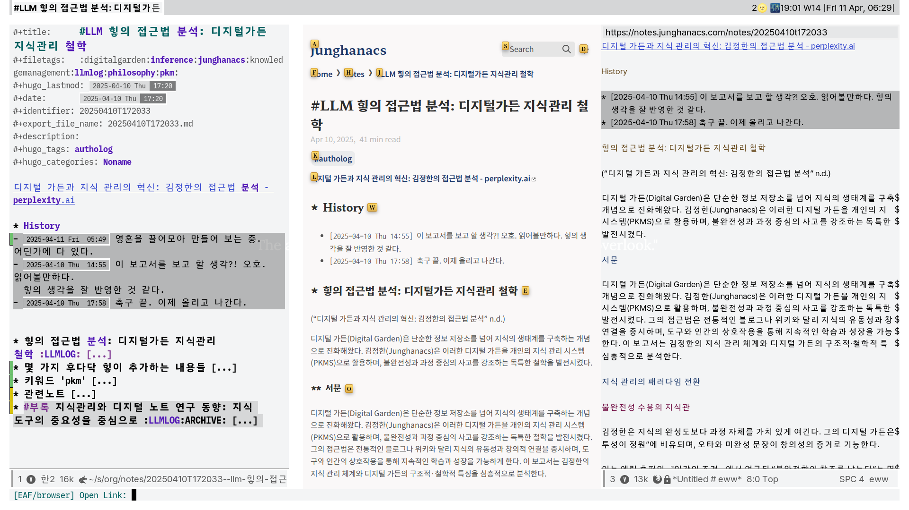
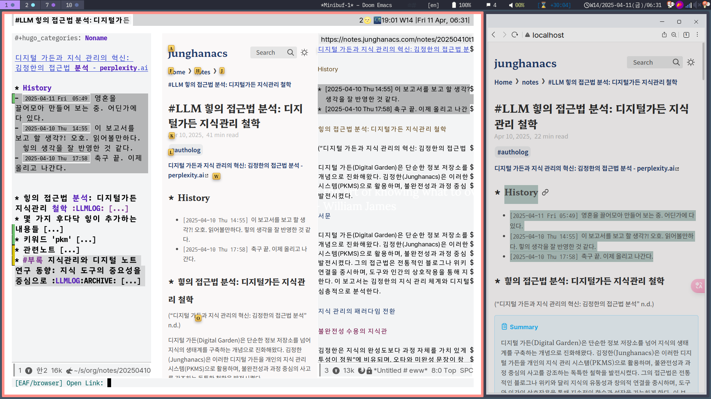

<!-- gid:20250411T064714 -->
[TOC]

[[TIP("이 노트에 대하여")]]
EAF와 EWW, w3m, Xwidgets를 비교하며 Emacs에서 웹을 다루는 여러 방식을 정리한다. 완벽한 브라우저는 아니어도 텍스트 중심 워크플로우와 어떻게 이어지는지 보여 준다.
[[/TIP]]

## 관련메타

-   [브라우저](https://wikidocs.net/380713)

## 히스토리

-   [2025-06-02 Mon 10:23] 웹 브라우저 이맥스를 다루는 문서가 아닐까

-   [emacs-eaf 이맥스 애플리케이션 프레임워크 설치 및 활용법](https://wikidocs.net/381656)
-   [옴니 브라우저 워크플로우 - 브라우저리스](https://wikidocs.net/381360)

## 2025 모든 것: 웹 브라우저 이맥스

[2025-06-02 Mon 10:22]

<https://irreal.org/blog/?p=13028>

Emacs에서 웹 브라우징 기능을 완벽히 구현하는 방법은 아직 없지만, 여러 대안들이 존재하고 점점 개선되고 있다는 기사입니다.

핵심 내용은 다음과 같습니다.

1 조아르 본 아른트(Joar Von Arndt)는 Emacs에서 웹 브라우징을 위한 몇 가지 방법 (eww, w3m, Xwidgets, EAF) 을 비교 분석했습니다. eww를 가장 나은 방법으로 제시했습니다.

2 작성자는 이메일(mu4e)과 RSS 피드(elfeed-webkit)를 보기 위해 Xwidgets와 elfeed-webkit을 사용하며, 필요에 따라 텍스트와 HTML 렌더링을 전환하는 방식으로 사용한다고 밝혔습니다. 텍스트 기반과 브라우저와 같은 렌더링 간 균형을 추구합니다

3 아직 완벽한 해결책은 없지만, 기존 솔루션들은 지속적으로 개선 중이어서 Emacs 내에서 웹 브라우징이 가능해지는 미래를 전망하고 있습니다.

## 2025 조직모드, EAF 그래픽브라우저, EWW 텍스트브라우저

-   [2025-04-11 Fri 06:47] 쓰는 것과 보이는 것에 일관성. 그리고 텍스트 도구가 품어내는 것. 밖을 벗어날 필요가 없다는 것. 그 것은 자유.

### 이맥스: 조직모드, EAF 그래픽브라우저, EWW 텍스트브라우저

20250411T063005-orgmode-eaf-eww.png

### 실제 웹브라우저 추가 (네이버 웨일 - 크롬엔진)

