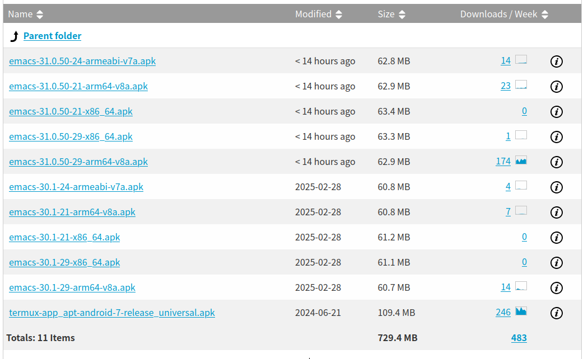

<!-- gid:20250413T183642 -->
[TOC]

[[TIP("인용")]]
As part of Emacs 30 Emacs will run natively on Android. I had already used Emacs in terminal on Termux but a native graphical app seemed better and I decided to try it. It took me a bit of time to understand the explanations and get it to work. The following are my notes on how I did it. Maybe it's useful for someone else as well.

Emacs 30의 일부로 Emacs는 Android에서 기본적으로 실행됩니다. 저는 이미 Termux의 터미널에서 Emacs를 사용했지만 기본 그래픽 앱이 더 나은 것 같아서 사용해 보기로 했습니다. 설명을 이해하고 작동하는 데 약간의 시간이 걸렸습니다. 다음은 제가 어떻게 했는지에 대한 제 메모입니다. 다른 분들에게도 유용할지도 모르겠네요.
[[/TIP]]

<!--quoteend-->

[[TIP("이 노트에 대하여")]]
Emacs 30의 안드로이드 네이티브 앱과 Termux 환경을 오가며 설치 과정을 정리한다. 실제로 해 보니 번거롭지만 모바일 Emacs 가능성을 확인하는 기록이다.
[[/TIP]]

## History

-   [2026-03-01 Sun 12:28] 잠시만, 이거 안해. 너무 번거로워서. 이렇게 안드로이드에 하면 안할거야!
-   [2025-06-27 Fri 15:05] 동작된다
-   [2025-04-13 Sun 18:36] 이제 때가 되었다.

### Native graphical Emacs on Android

(Martin Stemplinger 2025) Martin Stemplinger 2025

As part of Emacs 30 Emacs will run natively on Android. I had already used Emacs in terminal on Termux but a native graphical app seemed better and I decided to try it. It took me a bit of time to understand the explanations and get it to work. The following are my notes on how I did it. Maybe it's useful for someone else as well.

## 이맥스 버전

[2025-04-28 Mon 11:20]

### 30.0 버전

[2025-04-28 Mon 11:20]

```shell
pkg install libxml2

```

### Emacs 29.1 지원

[2023-09-18 Mon 12:57] 드디어 공식 버전이 termux 에 들어왔다.

```text
pkg install libsqlite
pkg install libtreesitter
```

## 관련메타

-   [안드로이드 이맥스](https://wikidocs.net/380513)
-   [피터프리보스 prevos EWS 이맥스 글쓰기 도구](https://wikidocs.net/381861)
-   [MS윈도우즈 이맥스 설치 및 활용](https://wikidocs.net/381130)
-   [MartinStemplinger 이맥스 네이티브 안드로이드](https://wikidocs.net/382389)

## BIBLIOGRAPHY

- emacswiki. 2025. “Emacswiki: Doom Emacs on Android - 둠이맥스 안드로이드 설치.” 2025. [https://www.emacswiki.org/emacs/DoomEmacsOnAndroid](https://www.emacswiki.org/emacs/DoomEmacsOnAndroid).
- Martin Stemplinger. 2025. “Native Graphical Emacs on Android.” January 5, 2025. [https://mstempl.netlify.app/post/emacs-on-android/](https://mstempl.netlify.app/post/emacs-on-android/).

## 2025 폴드4 안드로이드 이맥스 설치

```text
 ~/sync/family/toattach
➜ adb devices
List of devices attached
R3CT804NQEW	device

~/sync/family/toattach
➜ adb install emacs-31.0.50-29-arm64-v8a.apk
Performing Streamed Install
Success
```

## 2025 안드로이드 이맥스 설치 - 네이티브 그래픽 지원

## <span class="org-todo done DONT">DONT</span> adb install emacs

-   안드로이드 버전 14인 폰에서는 보안 문제로 설치가 안된다. 아무렴.
-   [안드로이드 리눅스 미러링 scrcpy](https://wikidocs.net/381168) ADB 설치

<!--listend-->

```shell
➜ adb install emacs-30.1-21-arm64-v8a.apk
Performing Streamed Install
adb: failed to install emacs-30.1-21-arm64-v8a.apk: Failure [INSTALL_FAILED_SHARED_USER_OMPATIBLE: Reconciliation failed...: Reconcile failed: Package org.gnu.emacs has no signres that match those in shared user com.termux; ignoring!]
(base) ~/sync/family/toattach on ☁️  gtgkjh@gmail.com
```

## EmacsWiki: Doom Emacs On Android - 둠이맥스 안드로이드 설치

(emacswiki 2025) emacswiki 2025

<https://sourceforge.net/projects/android-ports-for-gnu-emacs/files/termux/termux-app_apt-android-7-release_universal.apk/download>

-   emacs-30.05.50-29-arm64-v8a.apk
-   termux-app android-7-release universal.apk



## 2023 TERMUX 안드로이드 이맥스 설치 방법

[2023-08-29 Tue 11:09]

### F-Droid 에서 termux, termux-style Install

스타일이 들어가야 폰트 잡을 수 있다. 스타일은 꾹 누르면, 컨텍스트 메뉴에 있다.

### Termux Setup

[2023-04-13 Thu 05:38]

```text

pkg upgrade -y
# termux-change-repo

pkg install curl wget git openssh
pkg install neovim

pkg install byobu
pkg install git gh

```

```text
Volume Up + q toggles the extended keyboard, so more screen is available when using a hardware keyboard.

Connect a hardware keyboard for the best experience, e.g the Keyboard.io atreus is an excellent and highly portable mechanical keyboard. The software keyboard is automatically switched off when a hardware keyboard is connected, although the extended keyboard is still displayed by default.
```

### zsh

하는 김에 내 시스템도 oh my zsh 로 돌아간다. 간단해서 좋다. [Zsh - Practicalli Spacemacs](https://practical.li/spacemacs/termux/custom-shell/)

[2023-04-16 Sun 06:14]

```text
pkg install zsh
zsh
chsh -s zsh
sh -c "(curl -fsSL https://raw.github.com/ohmyzsh/ohmyzsh/master/tools/install.sh)"
git clone --depth=1 https://github.com/romkatv/powerlevel10k.git ZSH_CUSTOM:-HOME/.oh-my-zsh/custom/themes/powerlevel10k
# p10k configure
```

### Clojure

[Clojure - Practicalli Spacemacs](https://practical.li/spacemacs/termux/clojure-development/#java-host-platform) It's works well!

```text
wget https://github.com/clojure-lsp/clojure-lsp/releases/download/2023.02.27-13.12.12/clojure-lsp

clojure-lsp  linux-install-1.11.1.1149.sh  myhome  org  spacemacs  spacemacs.d.john  sync
~ chmod 755 clojure-lsp
~ ./clojure-lsp --version
clojure-lsp 2023.02.27-13.12.12
clj-kondo 2023.02.17

## PATH=/data/data/com.termux/files/usr/bin
~ mv clojure-lsp PATH

```

#### lsp

git clone git@github.com:junghan0611/clojure-lsp-config.git ~/.config/clojure-lsp [2023-04-16 Sun 06:56]

### sshd

ssh ip -p 8022 [2023-04-16 Sun 06:11]

### bt keyboard

[2023-08-29 Tue 11:06] 접이식 블루투스 키보드로 커버 아주 훌륭

### <span class="org-todo done DONT">DONT</span> symlink

[2023-09-16 Sat 12:57]

-   [2025-04-28 Mon 11:25] 안드로이드14 폰에서 안되네?!

<!--listend-->

```text
cd ~
ln -s /storage/emulated0/Documents/sync sync
```

## 2023 안드로이드 Emacs 듀얼 설치 기록

-   [2023-11-26 Sun 18:33] 작성 버전. 네이티브와 털묵스 연동관련 테스트 목적

termux 와 네이티브 듀얼 설치 방법

<https://sourceforge.net/projects/android-ports-for-gnu-emacs/files/termux/>

왜 몰랐을까?! 이렇게 하면 termux 에서 설치한 모든 것들을 기반으로 안드로이드 네이티브 이맥스를 구동 시킬 수 있다. 네이티브 앱 이기 때문에 완벽한 사용자 경험이 가능하다.

### 일단 termux 와 Emacs 관련 된 것들을 다 지운다. 안드로이드 폰에서.

### termux, emacs-arm64-v8a 버전을 다운 받는다.

위의 링크에서 받아야 공유 된다.

-   pkg update &amp;&amp; pkg upgrade &amp;&amp; pkg install git openssh -y
-   다운 받은 Emacs apk 를 설치한다.
-   early-init 을 넣은다. 아래 참고.
-   안드로이드 애플리케이션 설정 : termux 에 파일 및 미디어 권한 넣기 :

### termux 들어가서 심볼링 링크 생성

```shell
ln -s /data/data/com.termux/files/ root
ln -s /storage/emulated/0/Documents/sync sync
cd sync/markdown/android/
cp -av crafted-* termux-dotfiles ~
cd crated-dotfiles/emacs
ln -s ~/crafted-emacs/
cd termux-dotfiles
cp -av termux/font.ttf ~/.termux
# + termux style 설치 안됨. 그러나 폰트는 반영 된다 (종료 후 진입하면)
cp -av ssh ~/.ssh
chmod 0644 ~/.ssh/*
chmod 0400 ~/.ssh/id_rsa
cd ~/termux-dotfiles/ && git pull
cp authinfo.gpg ~/.authinfo.gpg
bash setup.ssh
# - pkg install ...
# - npm install ...
# - pip install ...
```

### emacs termux 실행

-   [ ] emacs --init-directory=~/crafted-dotfiles/emacs
-   [ ] ln -s ~/sync/org ~/org
-   [ ] ln -s ~/crafted-dotfiles/emacs ~/.emacs.d
-   [ ] cp ~/.termux/font.ttf ~/root/usr/share/fonts/TTF
-   cp -av ~/sync/markdown/android/MonoplexKRNerd3/ ~/root/usr/share/fonts/TTF
-   fc-cache -f -v

### emacs gui 실행

spacemacs 로 가야 한다. 그래야 동작한다.

-   termux 환경을 인식하니까 완벽해진 것이다.
-   애플리케이션 설정 가서 권한 왕창 줘라! 설치중이다.
-   M-x shell
-   git clone git@github.com:junghan0611/spacemacs.git .emacs.d -b main
-   git clone git@github.com:junghan0611/my-spacemacs-dotfiles.git .spacemacs.d

### scrcpy 로 연동해서 데스크탑에서 조작하면 쉽다.

## 2023 메뉴얼 번역

[2023-11-26 Sun 18:36]

This directory holds several different installation packages, each intended for a different kind of Android machine.

이 디렉토리에는 각각 다른 종류의 Android 기기를 위한 여러 가지 설치 패키지가 있습니다.

emacs-30.0.50-16-armeabi-v7a.apk - armv7 devices running Android 4.1 or later. emacs-30.0.50-21-arm64-v8a.apk - aarch64 devices running Android 5.1 or later. emacs-30.0.50-29-arm64-v8a.apk - aarch64 devices running Android 10.0 or later. emacs-30.0.50-21-mips64.apk - mips64 devices running Android 5.1 or later. emacs-30.0.50-21-x86_64.apk - x86_64 devices running Android 5.1 or later. emacs-30.0.50-29-x86_64.apk - x86_64 devices running Android 10.0 or later. emacs-30.0.50-9-armeabi.apk - armeabi devices running Android 2.3 or later. emacs-30.0.50-9-mips.apk - mips devices running Android 2.3 or later. emacs-30.0.50-9-x86.apk - x86 devices running Android 2.3 or later. emacs-30.0.50-8-armeabi.apk - armeabi devices running Android 2.2.

Always install the package for the CPU architecture used by your Android system; if you install any other compatible package (such as the x86 package on an x86_64 system), it will not be capable of executing subprocesses such as the shell.

항상 Android 시스템에서 사용하는 CPU 아키텍처에 맞는 패키지를 설치하세요. 다른 호환 패키지(예: x86_64 시스템의 x86 패키지)를 설치하면 셸과 같은 하위 프로세스를 실행할 수 없게 됩니다.

Additionally, the directory \`termux' contains copies of these installation packages built with their \`\`shared user ID'' set to \`com.termux' and a version of the Termux terminal emulator signed with Emacs's signing keys.

또한 'termux' 디렉토리에는 '공유 사용자 ID'가 'com.termux'로 설정된 이러한 설치 패키지의 복사본과 Emacs 의 서명 키로 서명된 Termux 터미널 에뮬레이터 버전이 포함되어 있습니다. Together, those packages enable Emacs to make use of the Termux package repositories. 이러한 패키지를 함께 사용하면 Emac 에서 Termux 패키지 리포지토리를 사용할 수 있습니다.

To install Emacs with Termux support, first remove any existing copy of Emacs (this will remove all data within Emacs's home directory, so make a backup beforehand!) and Termux, to avoid signature or user ID conflicts. Next, install Termux <span class="underline">first</span>, then install Emacs.

Termux 를 지원하는 Emacs 를 설치하려면 먼저 서명 또는 사용자 ID 충돌을 피하기 위해 기존 Emacs 복사본(이렇게 하면 Emacs 홈 디렉터리 내의 모든 데이터가 제거되므로 미리 백업을 해두세요!)과 Termux 를 모두 제거하세요. 그런 다음 Termux 를 <span class="underline">먼저</span> 설치한 다음 Emacs 를 설치하세요.

Once both packages are installed, open Termux, and at the shell prompt displayed therein, type: 두 패키지가 모두 설치되면 Termux 를 열고 셸 프롬프트가 표시되면 입력합니다:

pkg update &amp;&amp; pkg upgrade 패키지 업데이트 &amp;&amp; 패키지 업그레이드

confirming each of the inquiries made by the dpkg package manager. Once all applications have been installed and updated, open Emacs, and introduce the following code to \`early-init.el':

dpkg 패키지 관리자의 각 문의를 확인합니다. 모든 애플리케이션의 설치 및 업데이트가 완료되면 Emac 을 열고 \`early-init.el\`에 다음 코드를 추가합니다:

```text
(setenv "PATH" (format "%s:%s" "/data/data/com.termux/files/usr/bin" (getenv "PATH"))) (setenv "LD_LIBRARY_PATH" (format "%s:%s" "/data/data/com.termux/files/usr/lib" (getenv "LD_LIBRARY_PATH"))) (push "/data/data/com.termux/files/usr/bin" exec-path)
```

after which programs installed through Termux will be made accessible to Emacs. 그 이후에는 Termux 를 통해 설치된 프로그램이 Emac 에서 액세스할 수 있게 됩니다.

Please bear in mind that Termux (and the copies of Emacs built to use it) can only be installed on Android 7.0 and later. Termux(및 이를 사용하도록 제작된 Emacs 사본)는 Android 7.0 이상에서만 설치할 수 있다는 점에 유의하세요.

FREQUENTLY ANSWERED QUESTIONS 자주 묻는 질문

The answers to most questions fre 이 Emacs 포트 사용자가 자주 묻는 대부분의 질문에 대한 답변은 함께 배포되는 Emacs 및/또는 Lisp 참조 매뉴얼에서 찾을 수 있습니다. Nevertheless, a list of very frequently answered questions has been compiled, for the benefit of individuals who are unaware of the previously mentioned documentation. 그럼에도 불구하고 앞서 언급한 문서를 잘 모르는 분들을 위해 자주 묻는 질문 목록을 정리해 두었습니다.

1.  Which package do I download?
2.  어떤 패키지를 다운로드하나요?

Probably \`emacs-30.0.50-29-arm64-v8a.apk' or its counterpart in the \`termux' directory. If your phone or tablet runs a 32-bit OS, then most likely \`emacs-30.0.50-16-armeabi-v7a.apk'. 아마도 \`emacs-30.0.50-29-arm64-v8a.apk'또는 \`termux'디렉토리에있는 해당 파일 일 것입니다. 휴대 전화 또는 태블릿에서 32 비트 OS 를 실행하는 경우 \`emacs-30.0.50-16-armeabi-v7a.apk'일 가능성이 높습니다.

1.  Where do I get help?
2.  어디서 도움을 받을 수 있나요?

help-gnu-emacs@gnu.org.

1.  Where do I report bugs/submit patches?
2.  버그 신고/패치 제출은 어디에서 하나요?

bug-gnu-emacs@gnu.org.

1.  How do I access my documents/source code/etc?
2.  문서/소스코드 등에 액세스하려면 어떻게 하나요?

Android apps can be granted access to three different kinds of storage. Android 앱에는 세 가지 종류의 저장소에 대한 액세스 권한을 부여할 수 있습니다.

The first is the app data directory, which also serves as the app's Unix home directory, and is only accessible to Emacs itself. 첫 번째는 앱의 유닉스 홈 디렉터리 역할을 하는 앱 데이터 디렉토리로, Emac 자체에서만 액세스할 수 있습니다.

The second is the external storage directory (located at /sdcard), which Emacs must explicitly request permission to access. This directory is what shows up as the \`\`internal storage'' in your file manager app. 두 번째는 외부 저장소 디렉토리(/sdcard 에 위치)로, 이 디렉토리에 대한 접근 권한을 Emac 에서 명시적으로 요청해야 합니다. 이 디렉토리는 파일 관리자 앱에서 '내부 저장소'로 표시됩니다.

Prior to Android 11, granting Emacs rights to access this directory can be performed from the Permissions menu in the App Info settings panel, by enabling the option labeled Storage; after Android 11, the path to the setting has changed, and must instead be granted from the Special App Access menu in Settings. Android 11 이전에는 앱 정보 설정 패널의 권한 메뉴에서 저장소라고 표시된 옵션을 활성화하여 이 디렉터리에 액세스할 수 있는 Emacs 권한을 부여할 수 있었지만, Android 11 이후에는 설정 경로가 변경되어 설정의 특수 앱 액세스 메뉴에서 권한을 부여해야 합니다.

Contrary to several descriptions circulating online, it is not incumbent upon you to install the Termux variant for access to external storage. 온라인에 떠도는 여러 설명과 달리, 외부 저장소에 액세스하기 위해 Termux 변형을 설치해야 하는 것은 아닙니다. That being said, either application will gain any permissions granted to the other (which encompasses the rights to access external storage) as a consequence of their shared user ID. 즉, 두 애플리케이션 모두 공유 사용자 ID 의 결과로 다른 애플리케이션에 부여된 모든 권한(외부 저장소에 액세스할 수 있는 권한 포함)을 얻게 됩니다.

The third is storage provided by other applications (Nextcloud, for example) through the Storage Access Framework -- this storage is extremely slow (thanks in part to Google's botched implementation of document provider IPC), and is located within subdirectories of /content/storage. 세 번째는 스토리지 액세스 프레임워크를 통해 다른 애플리케이션(예: Nextcloud)에서 제공하는 스토리지로, 이 스토리지는 매우 느리며(부분적으로는 Google 의 문서 공급자 IPC 구현이 잘못되었기 때문) /content/storage 의 하위 디렉터리 내에 위치합니다. Before any of these directories become available, you must run \`M-x android-request-directory-access', and select the directory you want from the file selection panel displayed. 이러한 디렉토리를 사용할 수 있게 되려면 \`M-x android-request-directory-access\`를 실행하고 표시되는 파일 선택 패널에서 원하는 디렉토리를 선택해야 합니다.

Because the /content directory is implemented entirely within Emacs's own file input/output primitives, subprocess cannot access any files it contains. content 디렉터리는 전적으로 Emacs 의 자체 파일 입출력 프리미티브 내에서 구현되므로 하위 프로세스는 여기에 포함된 모든 파일에 액세스할 수 없습니다. If you attempt to create a subprocess inside that directory, its working directory will actually be set to Emacs's home directory. This additionally applies to the /assets directory holding Lisp and ancillary files distributed with Emacs. 해당 디렉터리 내에서 하위 프로세스를 만들려고 하면 실제로 작업 디렉터리가 Emacs 의 홈 디렉터리로 설정됩니다. 이는 또한 이맥스와 함께 배포된 Lisp 및 보조 파일을 보관하는 /assets 디렉터리에도 적용됩니다.

Refer to (emacs)Android Filesystem and (emacs)Android Document Providers within the Emacs manual for more details. 자세한 내용은 Emacs 매뉴얼의 (emacs)Android 파일 시스템 및 (emacs)Android 문서 제공업체를 참조하세요.

1.  Where is my .emacs/.emacs.d/init.el?

~/.emacs, of course. 물론 ~/.emacs 입니다.

You cannot copy an Emacs configuration to the so-called internal storage on your phone and make it immediately available to Emacs. This is because, being subject to Android's security model, Emacs is the only app with permission to access its home directory. Emacs 구성을 휴대폰의 내부 저장소에 복사하여 Emacs 에서 즉시 사용할 수 있도록 할 수는 없습니다. 이는 Android 의 보안 모델의 적용을 받기 때문에 홈 디렉터리에 액세스할 수 있는 권한이 있는 유일한 앱은 Emacs 이기 때문입니다.

Instead, follow the procedures outlined in the previous answer to grant Emacs access to that internal storage, and copy your configuration files from there to your home directory. 대신 이전 답변에 설명된 절차에 따라 Emac 에 해당 내부 저장소에 대한 액세스 권한을 부여하고 구성 파일을 홈 디렉터리로 복사하세요.

Android doesn't guarantee that Emacs's home directory will be located at any predetermined location, but it is normally placed at _data/data/org.gnu.emacs/files. Android 는 Emacs 의 홈 디렉터리가 미리 정해진 위치에 있다고 보장하지 않지만, 일반적으로 /data/data/org.gnu.emacs/files 에 배치됩니다. On systems with multiple users (Android users, not Unix users), it may instead be located somewhere within /data/user_ if Emacs is installed for a user other than the device owner. 여러 사용자(유닉스 사용자가 아닌 안드로이드 사용자)가 있는 시스템에서 장치 소유자가 아닌 다른 사용자를 위해 Emacs 를 설치한 경우 _데이터_ 사용자/ 내의 어딘가에 위치할 수 있습니다.

1.  Where are binaries like emacs, emacsclient, and movemail?

Short answer: ~/../lib. 짧은 대답: ~/../lib.

Long answer: because Android restricts both the locations from where executable files can be loaded and the names of the executables that it will extract from installation packages, Emacs files all of its ancillary executables under names resembling shared libraries. 긴 답변: Android 는 실행 파일을 로드할 수 있는 위치와 설치 패키지에서 추출할 실행 파일의 이름을 모두 제한하기 때문에 Emacs 는 모든 보조 실행 파일을 공유 라이브러리와 유사한 이름으로 파일화합니다. When Emacs is installed, Android extracts these executables to a private directory that Emacs symlinks at startup to \`lib' within the parent directory of its home directory. Refer to (elisp)Subprocess Creation and (emacs)Android Environment for more details. Emacs 가 설치되면 Android 는 이러한 실행 파일을 홈 디렉터리의 상위 디렉터리 내에 있는 \`lib\`에 심볼릭 링크하는 개인 디렉터리로 추출합니다. 자세한 내용은 (elisp)서브프로세스 생성 및 (emacs)안드로이드 환경을 참조하십시오.

While the names of these executables are stable (and will be so for the forseeable future), it is better to use the variables that are specifically defined to provide their names: \`emacsclient-program-name', \`movemail-program-name' and so on, in place of hard-coded names such as \`libemacsclient.so' and \`libmovemail.so'. 이러한 실행 파일의 이름은 안정적이지만(당분간은 안정적일 것입니다), 하드 코딩된 이름(예: \`libemacsclient.so\`, \`libmovemail.so\` 등) 대신 이름을 제공하도록 특별히 정의된 변수(예: \`emacsclient-program-name\`, \`movemail-program-name\` 등)를 사용하는 것이 좋습니다. Following this advice will guarantee that your code continues to run faithfully in the future and on non-Android systems. 이 조언을 따르면 향후에도 안드로이드가 아닌 시스템에서 코드가 계속 충실하게 실행될 수 있습니다.

The location of \`emacs' is more involved: the \`libemacs.so' is actually a real shared library containing all of the Emacs C code. This code is not functional until it is linked to a bundle of Java code implementing the Android filesystem and GUI interfaces, which is automatically performed by the Android JVM at run-time when you open Emacs from the app icon. 'emacs'의 위치는 좀 더 관련이 있습니다. 'libemacs.so'는 실제로 모든 Emacs C 코드가 포함된 실제 공유 라이브러리입니다. 이 코드는 안드로이드 파일 시스템과 GUI 인터페이스를 구현하는 자바 코드 번들에 연결되기 전까지는 작동하지 않으며, 앱 아이콘에서 Emac 을 열면 런타임에 안드로이드 JVM 이 자동으로 수행합니다.

\`libandroid-emacs.so' is a binary that tries to invoke the JVM with the right arguments for starting Emacs on the command line. 'libandroid-emacs.so'는 명령줄에서 Emac 을 시작하기 위한 올바른 인수를 사용하여 JVM 을 호출하려고 시도하는 바이너리입니다. While it is true that Emacs cannot create a display connection when started in this manner, the greatest difficulty posed by this approach is rather its reliance on Android internals that are subject to change without notice. 이러한 방식으로 시작할 때 Emac 이 디스플레이 연결을 만들 수 없는 것은 사실이지만, 이 접근 방식의 가장 큰 어려움은 예고 없이 변경될 수 있는 Android 내부에 의존한다는 점입니다. Because of this unfortunate dependency, it does not work reliably on all versions of Android, and must be revised after each major change to the OS. 이러한 안타까운 종속성 때문에 모든 버전의 Android 에서 안정적으로 작동하는 것은 아니며, OS 가 주요하게 변경될 때마다 수정해야 합니다.

The true solution to this conundrum is to avoid running Emacs inside itself, obviating the need for that binary in the first place. 이 수수께끼에 대한 진정한 해결책은 자체적으로 Emac 을 실행하지 않는 것이며, 애초에 바이너리가 필요하지 않습니다.

1.  Where do I get more software? (clang, git, python, etc.)

See (emacs)Android Software. The \`termux' directory holds versions of both Termux and Emacs that share the same user ID and signing key. (이맥스)안드로이드 소프트웨어를 참조하세요. 'termux' 디렉토리에는 동일한 사용자 ID 와 서명 키를 공유하는 Termux 와 Emacs 의 버전이 모두 저장됩니다.

1.  The on-screen keyboard isn't displayed! You must only use Emacs with a physical keyboard!

화면 키보드가 표시되지 않습니다! 물리적 키보드가 있는 Emac 만 사용해야 합니다!

The author of this port does not use a physical keyboard under Android. He uses AnySoftKeyboard for English input, and Fcitx 이 포트의 작성자는 Android 에서 물리적 키보드를 사용하지 않습니다. 그는 영어 입력에 AnySoftKeyboard 를 사용하고, Fcitx

<https://github.com/fcitx5-android/fcitx5-android/>

for CJK input. With that misconception out of the way, there are at least two reasons for asking this question. 를 사용할 수 있습니다. 이러한 오해를 없애고 이 질문을 하는 데에는 적어도 두 가지 이유가 있습니다.

The first is that you may have unthinkingly disabled the menu bar or tool bar in keeping with an online Emacs introductory text, and now want to perform operations which are then impossible without a keyboard. 첫 번째는 온라인 Emacs 소개 텍스트에 따라 무심코 메뉴 모음이나 도구 모음을 비활성화했다가 이제 키보드 없이는 불가능한 작업을 수행하려고 할 수 있습니다. This is a very unwise decision on Android: any operation performed from a keyboard can also be performed from the menu bar or tool bar (including M-x, which is Edit -&gt; Execute Command), making the use of a keyboard unnecessary. Android 에서는 키보드로 수행하는 모든 작업을 메뉴 표시줄이나 도구 모음(편집 -&gt; 명령 실행의 M-x 포함)에서도 수행할 수 있으므로 키보드를 사용할 필요가 없습니다.

With that in mind, and to save screen space, the keyboard is normally hidden when the current window has selected a read-only buffer. 이를 염두에 두고 화면 공간을 절약하기 위해 현재 창이 읽기 전용 버퍼를 선택하면 일반적으로 키보드가 숨겨집니다. The second reason for asking this question is wanting to always display the on-screen keyboard; to do so, simply customize the option \`touch-screen-display-keyboard' to a non-nil value. (Options -&gt; Customize Emacs, hint, hint.) 이 질문을 하는 두 번째 이유는 항상 화면 키보드를 표시하고 싶기 때문입니다. 이렇게 하려면 '터치 스크린 디스플레이 키보드' 옵션을 nil 이 아닌 값으로 사용자 지정하기만 하면 됩니다. (옵션-&gt; 이맥 사용자 지정, 힌트, 힌트.)

For more details and an in depth explanation of how Emacs treats touch screen and on-screen-keyboard input, refer to (emacs)Touchscreens, (emacs)On-Screen Keyboards, (elisp)Misc Events, and (elisp)Touchscreen Events. Emacs 에서 터치 스크린 및 온스크린 키보드 입력을 처리하는 방법에 대한 자세한 내용과 심층적인 설명은 (emacs)터치 스크린, (emacs)온스크린 키보드, (elisp)기타 이벤트 및 (elisp)터치 스크린 이벤트를 참조하세요.

1.  My package X that relies on reading raw key events / binding keys globally doesn't work with an on screen keyboard!

원시 키 이벤트/바인딩 키를 전역적으로 읽는 데 의존하는 내 패키지 X 가 온스크린 키보드에서 작동하지 않습니다!

This is because Android input methods rely on directly invoking Emacs's buffer editing primitives, which is dubbed text conversion. Emacs tries to implement features such as electric-indent, electric-pair and Auto-Fill through analyzing the course of their edits after they take place. 이는 Android 입력 메서드가 텍스트 변환이라고 불리는 Emacs 의 버퍼 편집 프리미티브를 직접 호출하는 데 의존하기 때문입니다. Emacs 는 편집이 수행된 후 편집 과정을 분석하여 전기 들여쓰기, 전기 쌍 및 자동 채우기와 같은 기능을 구현하려고 시도합니다.

Consequentially, Emacs doesn't receive raw key press events as you type into the input method, your package doesn't work, and the text you type is inserted directly into the current buffer in lieu of the events you meant to send. 결과적으로, 입력 메서드에 입력할 때 원시 키 누르기 이벤트가 Emac 에 수신되지 않고 패키지가 작동하지 않으며, 입력한 텍스트가 전송하려는 이벤트 대신 현재 버퍼에 직접 삽입됩니다.

You can either fix these packages to disable text conversion through the variable \`overriding-text-conversion-style' or the buffer-local variable \`text-conversion-style', or disable text conversion globally by setting the first variable. 이러한 패키지를 수정하여 \`overriding-text-conversion-style\` 변수 또는 버퍼 로컬 변수 \`text-conversion-style\`을 통해 텍스트 변환을 비활성화하거나 첫 번째 변수를 설정하여 전역적으로 텍스트 변환을 비활성화할 수 있습니다.

See (elisp)Misc Events for further elucidations on the subject of text conversion. 텍스트 변환에 대한 자세한 설명은 (elisp)기타 이벤트를 참조하세요.

1.  Point jumps to the start of the text after I type an opening paren! (And other problems with IMEs in Text or Prog Mode derivatives.)

오프닝 파렌을 입력한 후 포인트가 텍스트의 시작 부분으로 이동합니다! (그리고 텍스트 또는 프로그 모드 파생물의 IME 에 대한 다른 문제).

This is probably a bug in your IME. Emacs implements the Android input method interfaces to the letter, but Android's own implementation leaves much to be desired. 이것은 아마도 IME 의 버그일 것입니다. Emacs 는 Android 입력 메서드 인터페이스를 문자 그대로 구현하지만 Android 의 자체 구현은 많은 부분을 보완해야 합니다.

One extremely common transgression committed by input methods is to assume that the \`getExtractedText' IME request will always reply with the entire contents of the buffer regardless of the number of characters the IME requests, which is indeed the case when the editor is the Android TextView widget. 입력 메서드가 저지르는 매우 일반적인 범법 중 하나는 \`getExtractedText' IME 요청이 IME 가 요청하는 문자 수에 관계없이 항상 버퍼의 전체 내용으로 응답할 것이라고 가정하는 것인데, 실제로 에디터가 안드로이드 TextView 위젯인 경우에 해당합니다. In contrast, Emacs respects the size specified in the request, in adherence with the documented behavior for that request. 이와는 대조적으로 Emac 은 해당 요청에 대한 문서화된 동작을 준수하여 요청에 지정된 크기를 존중합니다.

An additional transgression is assuming that, since the result of that request is always the entirety of the text buffer's contents, the caret offset returned by the input method is the position of the insertion point. 추가 위반은 해당 요청의 결과가 항상 텍스트 버퍼의 내용 전체이므로 입력 메서드가 반환하는 캐럿 오프셋이 삽입 지점의 위치라고 가정하는 것입니다. In reality, the base of this offset is the start of the text returned. 실제로 이 오프셋의 기준은 반환되는 텍스트의 시작 부분입니다.

Together, these two implementation mistakes result in many problematic input methods misleading themselves into thinking that point is at the start of the buffer. 이 두 가지 구현 실수로 인해 많은 문제가 있는 입력 메서드에서 해당 지점이 버퍼의 시작점이라고 착각하게 됩니다. After inserting a closing paren as part of their own electric-pair features, such input methods often try to obtain the location of the point and move to the last character prior to the closing paren. 자체 전기 쌍 기능의 일부로 닫는 파렌을 삽입한 후 이러한 입력 방법은 종종 점의 위치를 가져와 닫는 파렌 이전의 마지막 문자로 이동하려고 시도합니다. But what they think is the position of that character is actually the very beginning of the buffer. 하지만 그 캐릭터의 위치라고 생각하는 것은 실제로는 버퍼의 맨 처음입니다.

If the situation illustrated above does not appear consistent with the behavior you witness from your IME, however, please send a bug report (with M-x report-emacs-bug.) In that report, mention the name and version number of the IME you are using. 그러나 위에 설명한 상황이 IME 에서 목격한 동작과 일치하지 않는 경우 버그 보고서를 보내 주세요(M-x report-emacs-bug 사용). 해당 보고서에는 사용 중인 IME 의 이름과 버전 번호를 기재하세요.

1.  When I type in fundamental mode / a Custom buffer, the input method goes haywire!

기본 모드 / 사용자 지정 버퍼를 입력하면 입력 방법이 엉망이됩니다!

This is a bug in the IME. Input methods don't just settle for implementing text conversion incorrectly, they also sometimes forget to implement the \`TYPE_NULL' input mode that tells them to behave like plain keyboard devices. 이것은 IME 의 버그입니다. 입력 메서드는 텍스트 변환을 잘못 구현하는 것에 만족하지 않고 일반 키보드 장치처럼 작동하도록 지시하는 \`TYPE_NULL\` 입력 모드를 구현하는 것을 잊어버리는 경우도 있습니다.

These bugs typically manifest as no text being inserted (since Emacs doesn't provide an input connection when text conversion is disabled), as the Delete key not working, or in any number of other ways. Get a better input method, and exhort your friends to do the same. 이러한 버그는 일반적으로 텍스트가 삽입되지 않거나(텍스트 변환이 비활성화되어 있을 때 Emacs 가 입력 연결을 제공하지 않기 때문에), 삭제 키가 작동하지 않거나, 기타 여러 가지 방식으로 나타납니다. 더 나은 입력 방법을 찾아보고 친구들에게도 그렇게 하도록 권유하세요.

1.  How do I display modifier keys in the tool bar?

도구 모음에 수정자 키를 표시하려면 어떻게 하나요?

Enable \`modifier-bar-mode' and \`tool-bar-mode'. A small secondary tool bar will be displayed together with the tool bar containing buttons that read and modify subsequent events with each of the modifier keys understood by Emacs. 수정 도구 모음 모드\` 및 \`도구 모음 모드\`를 활성화합니다. 작은 보조 도구 모음이 도구 모음과 함께 표시되며, 이 도구 모음에는 Emac 이 인식하는 각 수정자 키로 후속 이벤트를 읽고 수정하는 버튼이 포함되어 있습니다.

When you tap one of these buttons, Emacs also displays the on-screen keyboard and momentarily disables text conversion. This enables you to type key sequences containing modifier keys even in a Text or Prog Mode buffer where text conversion is enabled. 이러한 버튼 중 하나를 누르면 Emacs 는 화면 키보드를 표시하고 텍스트 변환을 일시적으로 비활성화합니다. 이렇게 하면 텍스트 변환이 활성화된 텍스트 또는 프로그 모드 버퍼에서도 수정자 키가 포함된 키 시퀀스를 입력할 수 있습니다.

1.  How do I display the tool bar on the bottom of its frame? I want the buttons and modifier bar to be near my fingers as I type.

프레임 하단에 도구 모음을 표시하려면 어떻게 해야 하나요? 입력할 때 버튼과 수정 도구 모음이 손가락 가까이에 있도록 하고 싶습니다.

Although not specific to the Android port, the implementation of this feature on non-GTK systems was motivated by one such request from an Android port user. Android 포트에만 국한된 것은 아니지만, 비 GTK 시스템에서 이 기능을 구현하게 된 동기는 Android 포트 사용자의 요청에 따른 것입니다.

Customize \`tool-bar-position' to \`bottom'. '도구 모음 위치'를 '아래쪽'으로 사용자 지정합니다.

1.  How do I quit? I can't type C-g.

어떻게 종료하나요? C-g 를 입력할 수 없습니다.

Quickly click the button at the bottom of the volume rocker twice, which acts as a regular C-g. 볼륨 로커 하단에 있는 버튼을 빠르게 두 번 클릭하면 일반 C-g 처럼 작동합니다.

1.  How do I open other files in Emacs?

Emacs 에서 다른 파일을 열려면 어떻게 합니까?

Run \`M-x server-start' (or better yet, place it in your initialization files.) 'M-x server-start'를 실행합니다(또는 초기화 파일에 넣는 것이 좋습니다.).

When you try to open a text file, the system will display a dialog asking for a program to run. Select Emacs: emacsclient will be called to open the file in question, or Emacs will be started with that file as an argument if it's not already running. 텍스트 파일을 열려고 하면 시스템에서 프로그램을 실행할지 묻는 대화 상자를 표시합니다. Emacs 를 선택하면 해당 파일을 열기 위해 emacsclient 가 호출되거나, 아직 실행 중이 아닌 경우 해당 파일을 인수로 사용하여 Emacs 가 시작됩니다.

1.  What is the difference between this app and Emacs from Termux?

이 앱과 Termux 의 Emacs 의 차이점은 무엇인가요?

This app runs as a native Android GUI program, enabling it to take advantage of input methods, document provider programs and suchlike, and its support for touch screen input is superior, with most common gestures recognized and/or transparently translated into mouse events. 이 앱은 기본 Android GUI 프로그램으로 실행되므로 입력 방법, 문서 공급자 프로그램 등을 활용할 수 있으며 터치 스크린 입력에 대한 지원이 뛰어나 대부분의 일반적인 제스처를 인식하거나 마우스 이벤트로 투명하게 변환할 수 있습니다.

Distributed Lisp and auxiliary files are stored entirely within the application package itself, avoiding the need to use a separate package manager to install Emacs updates. 분산 Lisp 및 보조 파일은 애플리케이션 패키지 자체에 완전히 저장되므로 별도의 패키지 관리자를 사용하여 Emacs 업데이트를 설치할 필요가 없습니다. These files are also loaded directly from the app package, and so do not require a time-consuming extraction procedure every time Emacs is updated before they can be used. 이러한 파일은 앱 패키지에서 직접 로드되므로 Emacs 를 업데이트할 때마다 시간이 많이 걸리는 추출 절차를 거치지 않아도 사용할 수 있습니다.

This app is also capable of employing ported Unix software from Termux as well; see the top of this file, and moreover supports old Android releases before 7.0, which Termux does not. 이 앱은 또한 Termux 에서 포팅된 유닉스 소프트웨어도 사용할 수 있습니다(이 파일 상단을 참조하세요). 또한 Termux 에서는 지원하지 않는 7.0 이전의 이전 Android 릴리스도 지원합니다.

1.  What's the difference between the builds provided here and those offered by F-Droid?

여기에서 제공하는 빌드와 F-Droid 에서 제공하는 빌드의 차이점은 무엇인가요?

F-Droid's version is an old snapshot of the Android port from October 2023; although it has witnessed substantial improvement by comparison with the version from February they previously distributed, it remains incomplete and will always be absent bug fixes and new features present in the packages housed here. F-Droid 버전은 2023 년 10 월에 배포된 안드로이드 포트의 오래된 스냅샷으로, 이전에 배포한 2 월 버전에 비해 상당한 개선이 이루어졌지만 여전히 불완전하며 여기에 포함된 패키지에 버그 수정 및 새로운 기능이 포함되어 있지 않습니다.

Their versions are also missing many of the dependencies packaged within the builds provided here: GnuTLS, image libraries, tree-sitter, and so on. 또한 해당 버전에는 여기에 제공된 빌드에 포함된 많은 종속성이 누락되어 있습니다: GnuTLS, 이미지 라이브러리, 트리 시터 등입니다.

1.  Why don't these builds bundle Librsvg?

왜 이 빌드에는 Librsvg 가 번들로 제공되지 않나요?

Ask their developers to rewrite it in C, so it can easily be built with the Android.mk build system. 개발자에게 안드로이드.mk 빌드 시스템으로 쉽게 빌드할 수 있도록 C 로 다시 작성해 달라고 요청하세요.

1.  Why can't I update from the F-Droid build to this one?

F-Droid 빌드에서 이 빌드로 업데이트할 수 없는 이유는 무엇인가요?

Because Android requires package updates to be signed with the same key used to sign the existing installation, and F-Droid uses a signing key distinct from the one included in the Emacs repository. Android 는 기존 설치에 서명할 때 사용한 것과 동일한 키로 패키지 업데이트에 서명해야 하며, F-Droid 는 Emacs 저장소에 포함된 것과는 다른 서명 키를 사용하기 때문입니다.

Back up your configuration and uninstall the F-Droid build prior to installing any of the packages in this directory. 이 디렉토리에 있는 패키지를 설치하기 전에 구성을 백업하고 F-Droid 빌드를 제거하세요.

1.  \`\`Set Default Font'' in the Options menu does not list the fonts I have installed.

옵션 메뉴의 '기본 글꼴 설정'에 내가 설치한 글꼴이 나열되지 않습니다.

That menu is in truth a vestige from the early days of Emacs's graphics support, when the only font \`\`backend'' was X, and programs could get away with listing merely the fonts common to most X servers. 사실 이 메뉴는 Emacs 의 그래픽 지원 초창기, 유일한 글꼴 '백엔드'가 X 였고 프로그램에서 대부분의 X 서버에 공통된 글꼴만 나열하는 것으로도 충분했던 시절의 흔적입니다.

When invoked under Android, it produces a litany of fonts that are seldom really present on Android. Fonts should be configured through Customize or the \`set-frame-font' command instead. 안드로이드에서 호출하면 안드로이드에 거의 존재하지 않는 글꼴이 많이 생성됩니다. 대신 사용자 지정 또는 'set-frame-font' 명령을 통해 글꼴을 구성해야 합니다.

1.  Glyphs within fonts such as \`\`Anonymous Pro'' and \`\`IBM Plex Mono'' are deformed.

'익명 프로' 및 'IBM 플렉스 모노'와 같은 글꼴 내의 글리프가 변형됩니다.

These fonts exploit extensions and implementation-specific behavior unique to the Microsoft Windows font scaler that Emacs does not supply, as a result of which various glyph programs they define go awry as they are executed to fit glyphs to the pixel grid. 이러한 글꼴은 Emacs 에서 제공하지 않는 Microsoft Windows 글꼴 스케일러 고유의 확장 및 구현별 동작을 악용하므로, 글꼴을 픽셀 그리드에 맞추기 위해 실행될 때 정의한 다양한 글리프 프로그램이 잘못 작동합니다.

The file \`etc/PROBLEMS' distributed with Emacs (select Help -&gt; Emacs Known Problems from the menu bar or type \`C-h C-p' within Emacs to visit this file) outlines various remedies for these issues, many of which entail modifications to the font files that bring them back in conformance with the TrueType specification. Emacs 와 함께 배포된 'etc/PROBLEMS' 파일(메뉴 표시줄에서 도움말 -&gt; Emacs 알려진 문제를 선택하거나 Emacs 내에서 'C-h C-p'를 입력하여 이 파일을 방문)에는 이러한 문제에 대한 다양한 해결 방법이 설명되어 있으며, 이 중 상당수는 글꼴 파일을 수정하여 트루타입 사양에 맞게 다시 만드는 작업을 수반합니다.

1.  Tool bar buttons are undersized.

도구 모음 버튼의 크기가 작습니다.

Tool bar button margins are not commensurate with the display density, which produces buttons that appear smaller than expected on high-density output devices, a category that encompasses most Android phones in existence today. 도구 모음 버튼 여백이 디스플레이 밀도에 비례하지 않아 고밀도 출력 장치에서 버튼이 예상보다 작게 표시되며, 이는 현재 대부분의 Android 휴대폰을 포괄하는 범주입니다. Adjust the variable \`tool-bar-button-margin' to compensate. 'tool-bar-button-margin' 변수를 조정하여 보정합니다.

1.  How/where do I obtain the corresponding source code to which I am entitled under the terms of the GNU GPL?

GNU GPL 약관에 따라 권한을 부여받은 해당 소스 코드는 어떻게/어디서 구할 수 있나요?

Type: 유형.

M-x describe-variable RET emacs-repository-version RET M-x 설명-변수 RET emacs-저장소-버전 RET

within Emacs. Next, download that revision from the Emacs Git repository at: 을 클릭합니다. 그런 다음 다음 Emacs Git 리포지토리에서 해당 리비전을 다운로드합니다:

<https://git.savannah.gnu.org/git/emacs.git>

I also retain source code tarballs produced from the repository for the binaries that are currently present on SourceForge. Please contact me if you require those. 또한 현재 SourceForge 에 있는 바이너리의 저장소에서 생성된 소스 코드 타볼도 보유하고 있습니다. 필요한 경우 저에게 연락주세요.

1.  Something's missing from this FAQ!

이 FAQ 에 빠진 내용이 있습니다!

If it's a subject not covered by the Android or Input nodes in the Emacs manual, or the relevant portions of the Lisp reference manual, please report a bug. I will then update the manual and this FAQ as I see fit. Emacs 매뉴얼의 Android 또는 입력 노드 또는 Lisp 참조 매뉴얼의 관련 부분에서 다루지 않는 주제인 경우 버그를 신고해 주세요. 그러면 적절하다고 판단되는 대로 매뉴얼과 이 FAQ 를 업데이트하겠습니다.

## 로그

### [2025-04-07](https://wikidocs.net/380408)

### [|2025-07-17 Thu 08:48|](https://wikidocs.net/380424.md#2025-07-17-thu/)

#### @user 우분투 리눅스에 adb 설치하고 adb로 emacs apk 설치하는 방법 과정 정리

@assistant 알겠습니다. 우분투 리눅스에 ADB를 설치하고 ADB를 사용하여 Emacs APK를 설치하는 과정을 정리해 드리겠습니다.

1.  _ADB 설치:_
    -   터미널을 열고 다음 명령어를 입력하여 ADB를 설치합니다.

<!--listend-->

```shell

sudo apt update
sudo apt install android-tools-adb android-tools-fastboot
```

-   ADB가 제대로 설치되었는지 확인하려면 `adb version` 명령어를 입력합니다.

<!--listend-->

1.  _Android 기기 설정:_
    -   Android 기기에서 "설정" 앱을 엽니다.
    
    -   "개발자 옵션"을 활성화합니다. (숨겨져 있는 경우 "휴대폰 정보" 또는 "태블릿 정보"에서 "빌드 번호"를 7번 탭합니다.)
    
    -   개발자 옵션에서 "USB 디버깅"을 활성화합니다.

2.  _ADB 연결:_
    -   USB 케이블을 사용하여 Android 기기를 컴퓨터에 연결합니다.
    
    -   터미널에서 `adb devices` 명령어를 입력합니다.
    
    -   Android 기기에 USB 디버깅을 허용할지 묻는 팝업이 나타나면 "허용"을 선택합니다.
    
    -   `adb devices` 명령어의 결과에 기기가 표시되는지 확인합니다.

3.  _Emacs APK 설치:_
    -   Emacs APK 파일을 컴퓨터에 다운로드합니다.
    
    -   터미널에서 APK 파일이 있는 디렉토리로 이동합니다.
    
    -   `adb install emacs.apk` 명령어를 입력하여 Emacs APK를 설치합니다. (`emacs.apk` 는 실제 파일 이름으로 대체합니다.)
    
    -   설치가 완료되면 "Success" 메시지가 표시됩니다.

4.  _문제 해결:_
    -   "device not found" 오류가 발생하면 USB 케이블 연결을 확인하고 ADB 서버를 다시 시작해 보세요. (`adb kill-server` 후 `adb start-server` 명령어를 사용)
    
    -   "INSTALL\\_FAILED\\_" 오류가 발생하면 다른 APK 파일을 시도하거나 기기에 이미 설치된 Emacs가 있는지 확인합니다.
    
    -   Android 14 이상에서 설치가 실패하면 ADB 명령에 `--bypass-low-target-sdk-block` 옵션을 추가해 보세요. (`adb install --bypass-low-target-sdk-block emacs.apk`)

#### @user 안드로이드폰에서 termux ssh server 띄워서 접속하는 방법

@assistant 알겠습니다. 안드로이드폰에서 Termux SSH 서버를 띄워서 접속하는 방법을 설명해 드리겠습니다.

1.  **Termux 설치 및 기본 설정:**
    -   Google Play Store 또는 F-Droid에서 Termux를 설치합니다.
    -   Termux를 실행하고 필요한 저장소 접근 권한을 부여합니다. (`termux-setup-storage` 명령어 사용)
    -   패키지를 업데이트합니다. (`pkg update && pkg upgrade`)

2.  **OpenSSH 설치:**
    -   Termux에서 OpenSSH를 설치합니다. (`pkg install openssh`)

3.  **SSH 서버 설정:**
    -   `sshd` 를 시작하기 전에 비밀번호를 설정합니다. (`passwd`)
    -   SSH 서버를 시작합니다. (`sshd`)

4.  **접속 정보 확인:**
    -   IP 주소를 확인합니다. (`ifconfig` 또는 `ip addr show wlan0`) (Wi-Fi를 사용하는 경우 wlan0, 모바일 데이터를 사용하는 경우 rmnet_data0)
    -   기본 SSH 포트인 8022를 사용합니다.

5.  **SSH 클라이언트로 접속:**
    -   다른 기기 (PC, 다른 스마트폰)에서 SSH 클라이언트를 사용하여 접속합니다.
    -   `ssh -p 8022 사용자이름@IP주소` (예: `ssh -p 8022 u0_a123@192.168.1.100`)
    -   접속할 때 비밀번호를 입력합니다.

6.  **(선택 사항) 키 기반 인증 설정:**
    -   SSH 키를 생성합니다 (`ssh-keygen`).
    -   공개 키를 Termux에 복사합니다 (`cat ~/.ssh/id_rsa.pub >> ~/.ssh/authorized_keys`).
    -   권한을 설정합니다 (`chmod 600 ~/.ssh/authorized_keys`).
    -   SSH 설정 파일에서 비밀번호 인증을 비활성화합니다 (`/data/data/com.termux/files/usr/etc/ssh/sshd_config` 에서 `PasswordAuthentication no` 로 변경). (루팅 필요)

7.  **(선택 사항) 자동 시작 설정:**
    -   Termux:Boot 앱을 설치하여 Termux를 부팅 시 자동으로 시작할 수 있습니다.
    -   `~/.termux/boot/` 디렉토리에 실행 스크립트를 만들고 `sshd` 를 시작하는 명령어를 추가합니다.

**주의사항:**

-   Termux는 백그라운드에서 실행될 때 Doze 모드나 배터리 최적화로 인해 중단될 수 있습니다. 배터리 최적화에서 Termux를 제외하세요.
-   보안을 위해 강력한 비밀번호를 사용하거나 SSH 키 기반 인증을 설정하는 것이 좋습니다.
-   방화벽 설정에 따라 SSH 포트 (8022)를 열어야 할 수도 있습니다.

이 방법으로 안드로이드폰에 SSH 서버를 구축하고 다른 기기에서 안전하게 접속할 수 있습니다.

#### @user
