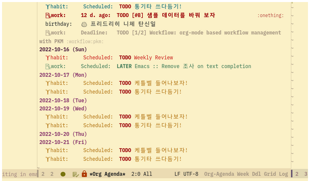

<!-- gid:20250423T122956 -->
[TOC]

[[TIP("이 노트에 대하여")]] 무기력과 우울, 답답함을 몸의 상태로 바라보며 스스로 만든 도파민 MAX 루틴을 설명한다. ADHD 약물 경험과 자기 돌봄이 생활 철학으로 이어지는 노트다. [[/TIP]] 히스토리 - [2026-07-07 Tue 09:59] 이거 수선해서 올리자. 근데 이렇게 안 산다. 이거 원문은 2022년에 작성한거다. - [2026-07-07 Tue] bib 표준 포맷(관련메타/관련노트) 정비, 티스토리 이관 과정에서 깨진 이스케이프(\`1\\.\`, \`\\\*\\\*...\\\*\\\*\`) 정리, 영어 태그 보완. - [2026-03-26 Thu 15:03] 2022년 작성한 글을 여기에 옮긴다. 티스토리에 예전에 쓴 글. 여러 블로그에 있는 글을 다 합치면 갯수가 엄청 날텐데 다 담을 필요는 없다. 히맨을 찾다가 여기 있었구나! [힣맨: 이맥스를 넘어 - 앎의 틀과 힣봇 생태계 정리 시작](https://wikidocs.net/382580) 여기에 이 세계관의 일부를 옮긴다.
-   [2022-10-15 Sat 15:02] 티스토리에 작성 [도파민 MAX 하루 루틴 (ADHD)](https://living-with-adhd.tistory.com/234)

## 관련메타

-   [ADHD 선택적집중](https://wikidocs.net/380489)
-   [루틴 패턴](https://wikidocs.net/380505)
-   [건강 운동 다이어트 호흡 숨 해독 식습관 음식](https://wikidocs.net/380600)
-   [명상 마음챙김 알아차림 자각 사색](https://wikidocs.net/380510)
-   [회복탄력성](https://wikidocs.net/380509)
-   [집중 몰입](https://wikidocs.net/380590)
-   [의지 권력의지 생존의지 자유의지](https://wikidocs.net/380951) — '힘의 의지'로 극복한다는 니체 인용의 자리.

## 관련노트

-   [힣맨: 이맥스를 넘어 - 앎의 틀과 힣봇 생태계 정리 시작](https://wikidocs.net/382580) — 히맨 세계관의 원출전.
-   [토머스암스트롱 증상이 아니라 독특함입니다 — 신경다양성 안내서](https://wikidocs.net/382464) — 본문에서 직접 인용한 책.

## [2022-10-15 Sat] 도파민 MAX 하루 루틴 (ADHD)

[2022-10-15 Sat 22:12]

by T힙스터 2022. 10. 15.

방금 도파민 맥스를 하고 자리에 앉았다. (도파민 맥스는 지금 내가 만든 말이다)

나는 이제 알고 있다. 무기력할 때 우울할 때 괴로울 때 화가 날 때 답답할 때 등내가 기분이라고 말하는 모든 것들은 '몸'의 상태다. (feat. 뇌)

언제 방송에서 아이유가 우울할 때 어떻게 극복하냐고 묻는 말에무조건 몸을 움직인다고 했다. 설거지를 한다던가 어떻게든 몸을 움직인다는 말이다. (정신과 의사 유튜브에서 들었다. 정말 모범 답안이라고 했던 기억이 난다)

심호흡을 한다던가 눈을 감고 명상을 하는 것도 약간 다르지만 비슷한 맥락이다.몸의 상태를 바꿔주는 것이다. 그게 뇌에 도파민 메커니즘에 영향을 준다.(관련 책으로 도파미네이션, 하버드 회복탄력성의 비밀 등 참고)

여기서 나는 일반인 대상의 이야기를 하려는 것이 아니다. 참고로 아침에는 콘서타 72mg, 스트라테라? mg (까먹음)를 먹고 저녁에는 우울증 약을 먹는다. (약을 먹는 상황에 대해서 이야기할 필요는 없을 것 같다. 오늘을 잘 사는 것뿐이다.)

ADHD는 간단하게 뇌에 도파민이 부족한 상태다. 안타깝게도 먹는 국내의 약들은 도파민을 만들어 주지 않는다.

재흡수를 방지시켜줄 뿐이다. 약을 먹으면 놀라게 된다. 도파민이 뭐 길래..이런 '파워'가 생긴다는 말인가!!

측정할 수는 없지만 나의 도파민 기본 레벨이 높을 리가 없다. 지난 삶.. 고된 시간들이었다. 일찍 알았더라면 :(

그렇다면 내가 할 수 있는 것은 도파민 레벨을 높이고, 천천히 소진되게 하는 것이다. 여기에 대해서 내가 하는 루틴은 다음과 같다.

참고로 아침에 뭐 대단한 기력이 있어서 하는 것은 아니다. 나는 잘 알고 있다. 약 먹고 도파민 게이지를 높이면 없던 정신력이

분출한다는 것을... 그러기에 약간은 로봇처럼 생각과 판단 없이 그냥 한다. (생각하면 행동을 못하기 마련이다)

1.  적정 수면을 한다.

2.  아침을 먹는다.

3.  약을 먹는다.

4.  짧은 고강도 운동을 한다.

5.  찬물 사워를 한다.

6.  아이스 헤어 드라이를 한다.

7.  아이스커피를 마시며 도파민 맥스로 하루를 시작한다.

**중간중간 눈을 감고 10분이라도 멍 때린다. (명상이라고 말하고 싶지 않다. 눈은 꼭 감는다)**

물론 매일 이렇게 할 수는 없다. 운동은 상황에 따라서 안 하거나 다른 시간에 가볍게 할 때도 있다.

기분이 안 좋으면 운동을 더 챙긴다. 잘못하다간 하루를 통째로 날릴 수가 있기 때문이다.

위에 대해서 조금 더 말을 하자면

### 1. 적정 수면을 한다.

수면 이야기는 앞서도 많이 이야기를 했다. 나는 기계적으로 밤 10시에는 자야지 생각을 한다. 휴대폰은취침모드로 변경된다. 앞서 글에는 이 시간에 자야 멜라토닌 호르몬이 나온다 뭐 그런 이야기 했었는데 그건 중요치 않다 나오면 땡큐고... 단지 일찍 일어나려고 일찍 잔다. 참고로 나는 새벽 4시 30분에 기계적으로 일어난다. 아침 먹기 전까지 2시간 정도 나의 일을 한다 (효율이 좋다). 새벽 루틴은 개취의 영역이다. 여하튼 중요한 것은 적정 수면 시간과 규칙적인 수면 루틴인 것 같다. 예를 들어, 날 새고 나서 콘서타를 먹었다고 제정신이기를 기대하면 안 된다. 우리는 다들 알고 있다. 에너지 드링크가 주는 그 에너지는 다음 날 쓸 귀한 에너지였다는 것을...

### 2. 아침을 먹는다.

아침을 간단히 먹는다. 약을 먹으면 일단 입이 써서 뭘 먹기가 싫다. 빈속에 커피를 마시면 속이 쓰리다 (커피는 개취다).

미연에 방지하고자 아침에 약 먹기 전에 뭐라도 먹는다. (물론 마지막 몰입이라는 책에서 '브레인 푸드' 이야기를 한다. 뇌에 좋은 음식을 먹으면 좋다. 나는 그냥 있는 대로 좋게 여기고 먹는다. 이것 저것 따지면 정작 중요한 것을 놓치게 되더라.)

### 3. 약을 먹는다.

콘서타는 12시간 지속된다고 한다. 컨디션에 따라서 다 다르다. 그냥 저녁때 까지라고 생각하고 산다. 일하는 시간에는 정신을 산만하게 하는 것들을 사전에 차단한다. 평정심이 무너지고 나면 콘서타도 소용없더라.

참고로... 나는 카톡, 인스타도, 페이스북, 다음, 네이버 ... 안 한다. 물론 원래 안했던 것은 아니다. 오지도 않는 카톡을 계속 열게 되는게 나이기에 선택한 것일 뿐이다. 습관적으로 보게 되는 포털 기사도 뇌에 좋지 않더라. ADHD로 살기 위해서는 조금 더 선택해야 할 부분일 뿐이다. 똑같이 살 수는 없겠더라. 살다보니 그렇게 됬다.

**멍 때린다고 하면 뭔가 부정적인 것으로 보이는데 나는 '브레인 워시'라고 정의한다.**

### 4. 짧은 고강도 운동을 한다.

기분이 별로 라면 더 해야 한다. 뭘 어떻게 해야지 이런 생각 안 한다. 나는 하나만 한다. 케틀벨 스윙 300개다. 15초 동안 10개 하고, 15초 쉬고 이걸 30번 하면 300개. 15분 걸린다. 물론 시계 보고 안 한다. 타바타 앱으로 설정해 놨다. 하면서는 유튜브를 틀어 놓는데 요즘에는 랄프 왈도 에머슨의 자기 신뢰의 힘 ([https://youtu.be/TAl6zpquYp0](https://youtu.be/TAl6zpquYp0))을 듣는다. 15분 정도 되니까 딱 맞다. 할 때는 눈을 감고 한다. 요게 나한테는 핵심이다. 눈을 감고 진자 운동을 하는 게 운동 명상 중에 하나라고 한다. 눈 뜨고 시계 보고하면 못한다. 왜냐? 이 운동은 엄청 빡샌 운동이다. 몇 세트했는지도 세지도 않는다. 그냥 딩동댕~ 끝났다고 할 때까지 한다. 할 때마다 지겹게 15분이 안가더라...

똑같이 할 필요는 없다. 눈도 감지 않아도 된다. 단! 심박수는 끌어올려야 한다! 천천히 동네 한 바퀴도 좋지만 도파민이 필요하다면 심장이 뜨거워져야 한다. 그냥 제자리 뛰기를 10분 타이머 맞춰 놓고 하면 심박수 잘 나올 것이다. 하다가 억 소리 나오면 잠깐 쉬고 계속하면 된다. 적당히 30분 1시간 운동할 생각 말고 그냥 짧게 힘들게 해야 한다. 늘어지면 하루 전체가 그렇게 된다. ADHD로 살면서 실패를 많이 경험한 뒤라면... 낙타로 그 만큼 살아왔으면 충분하다. 이제 사자로 다시 아이로 거듭 날때까지 자신의 인생을 개척해야 한다. (낙타, 사자, 아이는 니체 초인 사상에서 인용)

### 5. 찬물 샤워를 한다.

찬물 샤워는 좋다는 이야기 듣고 한 번 하고 이건 미친 짓이다 하고 안 했었다. 근데 이게 도파민을 순간 끌어 올다는 것을 알고 나니 안 하기가 참... 그랬다. (앞선 스탠퍼드 교수님 관련 글에서 이야기함) 일단 머리부터 찬물로 감았다. 이제는 찬물 샤워를 한다. 나름 방법은 있다. 면도하고 이를 닦는다. 그리고 따듯한 물로 몸을 적시며 룰루랄라를 조금 한다. 그러다가 물을 끈다. 온몸에 거품질을 한다. (샴푸, 바디워시도 좋지만 그냥 나는 비누로 한다. 씻고 나서의 뻑뻑함이 좋아서.. 개취다) 이제 몸을 닦아 내야 한다. 된장! 보일러가 고장이 났다! 찬물밖에 안 나온다. 어떻게 하겠는가? 찬물로 해야지 뭐!라고 생각을 하고 찬물을 가열차게 튼다. 찬물로 머리를 감으며 후우후우... 한다 (해보면 안다). 그리고 샤워 타월을 열심히 빨래하고 화장실에 묻은 거품도 닦아내며 찬물이 주변에 튀는 것을 느낀다. 그리고 과감하게 몸에 찬물을 뿌린다. 처음에는 물론 고통스럽다. 그때는 '우가차카 우가우가'를 되뇌며 원시인이 된 듯이 양발을 번갈아 가며 흔든다 (실제로 나는 우가차카 우가우가를 소리친다. 샤워기는 일종의 나무 방망이랄까?).

사실 2-3초면 적응이 된다. 아 차갑구나! 근데 좋네!라고 하며 샤워를 한다. 시간을 잴 것도 없다. 거품질을 많이 했기에 열심히 닦아내야 한다. 사실 뭐 이건 찬물도 아니다. (책 도파미네이션 '3장 뇌는 쾌락과 고통을 어떻게 이해하는가'를 보면 얼음을 넣어가며 온도 맞춰서 하는 이야기를 보라!) 몸과 정신에 쌓인 온갖 부정적인 것들이 사라지는 기분이 든다. 샤워가 끝나고 수건으로 물기를 닦아 내며 '슈퍼 파워'라고 진지하게 말한다. 거울은 잘 안본다. 아이언맨, 슈퍼맨이 아니라 우뢰매의 심형래 선생님 같아서인가? 어징간하면 이미지 찾아가면서 글을 쓰지 않는데 이건 안 넣을수가 없다. 사실 거울 속의 나는 우주의 왕자 히맨이다! (검색해보니 우주게이 히맨 이런게 많이 나온다. 슬픈 일이다.)

우주의 왕자 히맨 (He-Man and the Masters of the Universe)

더하여, 나는 ADHD 뇌는 브레이크가 고장 난 페라리 엔진이라는 말을 믿는다. (관련 내용은 책 ADHD 2.0을 보라!) 그래서 머리가 과열됐다고 싶을 때는 세수를 하거나 찬 물로 머리를 감는다. 신기하게도 기분이 좋아진다. 도파민 탓이리라...

**일부로 웃기려고 뭔가를 만들거나 짤을 찾거나 하지 않는다. 귀찮다. 단지 이런 것은 ADHD의 특징 중에 하나인 '유태 보존'이라고 생각한다.** 관련 내용은 책 '증상이 아니라 독특함입니다'의 ADHD 편을 보면 나와 있다. 알고 나니 더 유쾌하고 힘이 나더라!

### 6. 아이스 헤어 드라이를 한다.

요건 얼마 전부터 하게 되었다. 나는 사실 드라이기를 안써왔다. 남자이고 머리가 길지 않아서가 아니다. 남자들도 다들 머리 드라이기를 하더이다. 나는 귀찮아서 안 한다. 우리 어머니도 드라이기 잘 안 쓰시는 것을 봐서 뭐... 여하튼 아이스 헤어 드라이라고 별게 아니다. 그냥 찬 바람을 트는 것 뿐이다. 물론! 머리를 말릴 생각으로 하는 것은 아니다. 그냥 머리를 식히는 것이다. 눈을 감고 한다. 그냥 바람을 느낀다. 귀에 들어오는 바람과 소리는 외부와 내 안의 소음에서 자유를 준다. 특히 이마에 집중한다. 물론 이마에 머리털은 없다. 전두엽님이 거기 있기 때문이다. 전전두엽의 역할이 얼마나 중요한지는 더 말할 필요가 없다. 도파민도 결국 편도체를 안정화하고 전전두엽을 활성화하기 위해서 필요한 것뿐이니까. 전전두엽에게 힘내 달라고 부탁을 한다. 제발 오늘 힘 좀 내자! 경마장의 기수가 말에게 오늘 힘내자라는 말 하듯이.

### 7. 아이스커피를 마시며 도파민 맥스로 하루를 시작한다.

아침을 먹으면서 꼭 드립 커피를 내려놓는다. 나를 격려하기 위한 일련의 과정 중에 하나라고 생각한다. 냉장고에 얼려 놓은 얼음을 넣으면 아이스 드립 아메리카노가 아닌가? 바로 마시려고 만든 것은 아니다. 운동하고 씻고 나와서 마시려고 만든 거다.

이제 하루를 시작한다. 이 과정을 통해서 나의 빈곤한 도파민 시스템을 순간 폭발시켰다고 믿는다. (위 그림의 히맨이 검을 들고 있는 모습을 보라) 주먹으로 시멘트 벽도 아작을 낼 수 있는 슈퍼 파워다! 실제로 벽을 부수지는 않는다. 힘은 그런데 쓰는게 아니다. 이제 하루를 살아내야 한다. 특히, 감정을 조심해야 한다. 슈퍼 파워는 유지를 하기가 어렵다. 슈퍼 파워를 지닌 이들을 생각해보라. 정신 에너지는 무한하지만 시간은 유한하다. 에너지를 한 곳으로 모아야 한다. 분산하다보면 어느새 잘 시간이 된다.

그리고 부록으로 더 하자면...

1.  과열된 뇌를 식히는 멍 때리기

슈퍼 파워를 유지하는 방법은 하루의 중간 중간에 안해도 될 법한 웹서핑, SNS를 하는 대신 눈을 감고 멍 때리는 것이다. 눈을 감으면 엄청나게 몰아치는 시각 정보 피할 수 있기에 과열된 뇌가 식는다. 여기에 명상이라고 말을 할 필요는 없다. 나는 눈을 감는 것뿐이다. 15분짜리 루틴처럼 듣는 게 있긴 하다 ([BODY SCAN v2] Exam Anxiety? Lower your Stress, Increase your Focus [https://youtu.be/V2nnGKlNEd4](https://youtu.be/V2nnGKlNEd4)). 영어 리스닝한다고 듣는 거 아니다. 그냥 눈감고 틀어 놓았다고 생각하고 그냥 듣는다. 모든 것에 진지할 필요는 없다.

1.  '소뇌'를 위한 나의 취미 밸런스 보드

밸런스 보드라고 검색해보면 많이 나온다. 인터넷으로 저렴한 거 샀다. ADHD 2.0 책에서 소뇌가 중요하다는 말과 함께 밸런스 보드를 추천하더이다. 그래서 잠깐 쉴 때 밸런스 보드에 올라가서 먼산 보듯 멍 때린다. 책상 앞에서 일을 하기 전에는 바디스캔을 하면서 마음을 다 잡고, 중간중간마다 밸런스 보드에 올라간다고 보면 된다. 신기하게도 하다 보니 한 발로 서 있는 것도 별 일이 아니다. 아직 눈 감고 할 경지에는 이르지 못했다. 눈 감고 지구의 '자전과 공전'을 느끼면서 밸런스 보드를 하는 게 소박한 목표다. 해보면 알겠지만 마음이 번잡하면 밸런스 보드에 양발로 서 있기도 어렵다. 그만큼 수월한, 온유한, 평온한, 안정된 상태를 상태를 유지해야 한다. 행복한 상태라는 말이 아니다. 행복한 게 무엇인가? 불행하지 않으면 행복한 것이라는 말도 있듯이 감정은 객관적이지 않다. 내가 말하는 상태는 호흡이 안정적이고 눈을 감고 귀를 쫑긋하면 바람의 소리, 새들이 지저귐을 인지할 수 있는 정도를 말한다. 그것도 참으로 어려울 때가 많다.

맺으며...

1.  2. 3. 4. 뭘 이렇게 쓰긴 했지만, 하루에 지켜야 한 열 가지 수칙 뭐 이런 게 아니다. 그런 건 없다. 그냥 별 생각 안 하고 하는 루틴이다. 나도 글을 써놨지만 남들의 말에 휘둘리지 말아야 한다. 뭐가 좋다. 그런 것들. 물론 판단을 하고 내 것으로 만드는 것일 뿐이다. 휘둘리는 게 아니라 내것으로 수용이다. 나는 ADHD의 삶에 정말 감사한다. 나의 운명이라고 생각하고 받아들이며 '힘의 의지'로 극복해 나가는게 앞으로의 삶이다. '고통의 가장 좋은 처방은 고통이다.' '나를 죽이지 못한 것이 나를 성장하게 한다.' 이런 니체의 말을 항상 되새겨 본다.

그나저나 오늘 프리드리히 니체 선생님의 탄신일이다. 생신 축하드립니다. 감사합니다.

### 나의 이맥스 org-agenda 텍스트 기반 인생 관리 워크플로우의 일부

나의 이맥스 org-agenda 텍스트 기반 인생 관리 워크플로우의 일부
