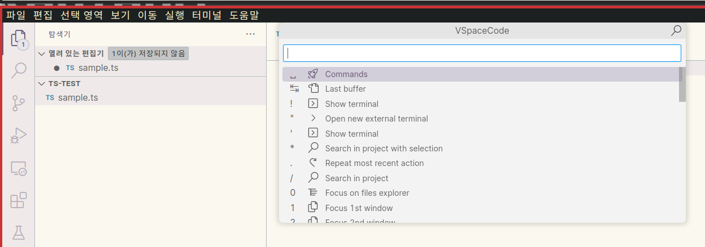
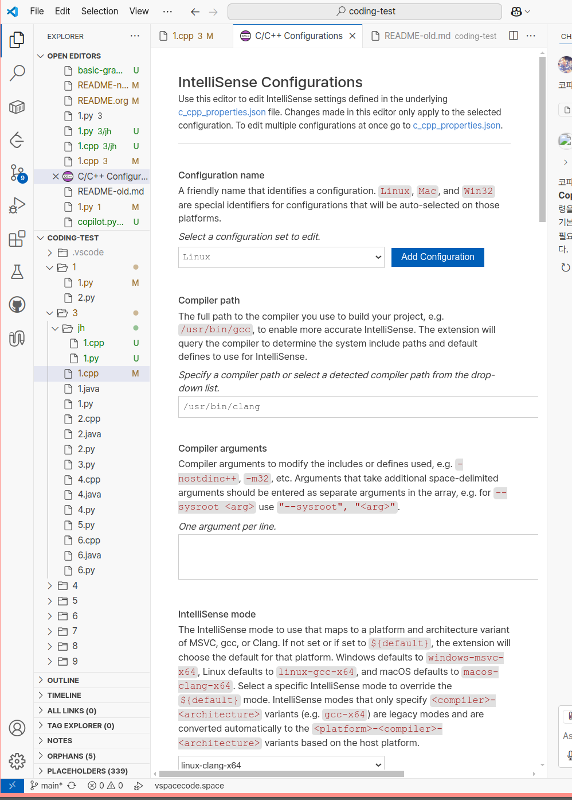
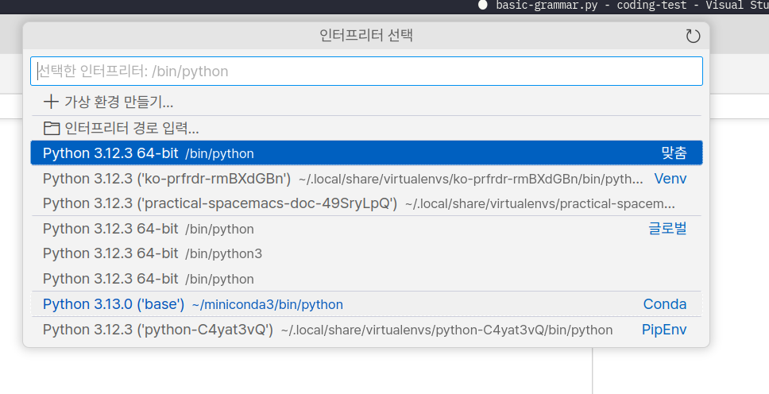

<!-- gid:20250601T145754 -->
[TOC]

[[TIP("이 노트에 대하여")]]
VSpaceCode를 통해 VSCode에 스페이스맥스식 키바인딩을 입히는 설정 흐름을 정리한다. Emacs 밖에서도 몸의 리듬을 이어 가려는 크로스플랫폼 노트다.
[[/TIP]]

## History

-   [2025-06-08 Sun 17:48] evil-escape 기능 추가함
-   [2025-06-01 Sun 14:57] 스페이스코드로 이맥스 개발 환경을 그대로 옮길 수 있다.
-   [힣: 키바인팅 통합 - 이맥스 VSCODE VIM (2025-03-21)](https://wikidocs.net/381606)

## VSpaceCode/VSpaceCode: Spacemacs like keybindings for Visual Studio Code

-   (“VSpaceCode” n.d.)
-   (“Vspacecode/Vspacecode: Spacemacs like Keybindings for Visual Studio Code” n.d.)
-   Spacemacs like keybindings for Visual Studio Code

### 힣의 VSpaceCode 입니다.

[2023-07-26 Wed 15:58]



## 2025 핵심 설정 기록

### 설치 후 커스텀 사용자 설정 방법

[2025-06-06 Fri 18:40]

_home/junghan_.config/Code/User/ 폴더에 아래 파일이 있다. 따로 닷파일을 관리해주고 있다.

```text
keybindings.json -> ../../../mydotfiles/config-common/.config/Code/User/keybindings.json
settings.json -> ../../../mydotfiles/config-common/.config/Code/User/settings.json
custom-style.css -> ../../mydotfiles/config-common/.config/Code/User/custom-style.css
```

### §evil-escape 와 같은 기능 Insert-&gt;Normal 변경

[2025-06-08 Sun 17:44] 너무 중요하다.

VS Code에는 이맥스의 evil-escape(예: ,. 빠르게 입력 시 ESC 동작)와 비슷한 기능을 제공하는 확장 프로그램이 있습니다.

config-common/.config/Code/User/settings.json

```nil
"editor.fontSize": 15,
"vim.insertModeKeyBindings": [
  {
    "before": [",", "."],
    "after": ["<Esc>"]
  }
]
```

### VSCODE 확장에 있는 `Emacs` 패키지 설치 금지

[2025-06-08 Sun 19:08]

VSpaceCode로 충분하니까 Emacs 이름 들어가는 패키지 설치하면 안된다. 충돌나서 고생함. 단순한 것이 최고다!

### C언어 CPP언어 설정

VSCode에서 C++17 설정

[이맥스 통합개발환경: C언어 CPP언어 임베디드 clangd](https://wikidocs.net/381229)

VSCode에서 C++ 프로젝트를 C++17 표준으로 설정하는 방법은 다음과 같습니다.

1.  **`c_cpp_properties.json` 파일 열기:** VSCode에서 C++ 프로젝트 폴더를 열고, `.vscode` 폴더 내의 `c_cpp_properties.json` 파일을 엽니다. 해당 파일이 없는 경우, `Ctrl+Shift+P` 를 눌러 명령 팔레트를 열고 `C/C++: Edit Configurations (UI)` 를 검색하여 실행합니다.
2.  **C++ 표준 설정:** `c_cpp_properties.json` 파일에서 `C_Cpp.default.cppStandard` 속성을 찾아 `"c++17"` 로 설정합니다. 예를 들어, `"cppStandard": "c++17"` 과 같이 설정합니다.
3.  **파일 저장:** 변경 사항을 적용하려면 파일을 저장합니다.

#### 스크린샷

[2025-06-12 Thu 15:05]

`C/C++: Edit Configurations (UI)` 설정 가보면 된다.

-   compiler path - /usr/bin/gcc
-   intellisense mode - linux-gcc-x64



## 파이썬 개발 환경

### <span class="org-hashtag">#파이썬</span> - 콘다 인터프리터 선택

[2025-06-03 Tue 13:56] 이걸로 해야 속도를 낸다.



## 관련 닷파일

-   [2025-06-06 Fri 15:44] vspacecode를 스페이스맥스, 둠이맥스 수준으로 설정해서 사용하는 고수들의 닷파일을 참고하자.

### The-Compiler/dotfiles <span class="org-hashtag">#vspacecode</span> <span class="org-hashtag">#qutebrowser</span>

(“The-Compiler/Dotfiles #Vspacecode #Qutebrowser” 2024)

-   Bruhin, Florian 2024
-   vspacecode 를 메인으로 사용한다. 완벽하게 설정하여 사용한다.
-   [contacts::Florian - The-Compiler](https://wikidocs.net/380486.md#h-e823cdfc-0aa9-4b61-b803-9e3f8ced61c2/) [장인](https://wikidocs.net/380718)을 따라가라!

/home/junghan/sync/man/dotsamples/dotall/The-Compiler-dotfiles-vscode/vscode

> -   /home/junghan/sync/man/dotsamples/dotall/The-Compiler-dotfiles-vscode/vscode:
> -   합계 84K
> -   -rw-rw-r-- 1 2.5K 2024-10-18 05:52 custom-style.css
> -   -rw-rw-r-- 1 6.1K 2024-10-18 05:52 keybindings.jsonc
> -   -rw-rw-r-- 1 72K 2025-03-30 04:20 settings.jsonc

### VSpaceCode/community-configs: Configurations by the community that differ from default VSpaceCode

(“Vspacecode/Community-Configs: Configurations by the Community That Differ from Default Vspacecode” n.d.)

### <span class="org-todo done DONT">DONT</span> junghan0611/practicalli-vspacecode from practicalli

### <span class="org-todo done DONT">DONT</span> lucasnad27 - Overview <span class="org-hashtag">#vspacecode</span>

## 관련메타

-   [통합개발환경](https://wikidocs.net/380799)
-   [이맥스 통합개발환경](https://wikidocs.net/380542)
-   [마이크로소프트 vscode](https://wikidocs.net/380502)

## BIBLIOGRAPHY

  “The-Compiler/Dotfiles #Vspacecode #Qutebrowser.” 2024. [https://github.com/The-Compiler/dotfiles](https://github.com/The-Compiler/dotfiles).
  “VSpaceCode.” n.d. Accessed October 8, 2024. [https://vspacecode.github.io//](https://vspacecode.github.io//).
  “Vspacecode/Community-Configs: Configurations by the Community That Differ from Default Vspacecode.” n.d. Accessed October 17, 2024. [https://github.com/VSpaceCode/community-configs](https://github.com/VSpaceCode/community-configs).
  “Vspacecode/Vspacecode: Spacemacs like Keybindings for Visual Studio Code.” n.d. Accessed January 24, 2025. [https://github.com/VSpaceCode/VSpaceCode](https://github.com/VSpaceCode/VSpaceCode).
