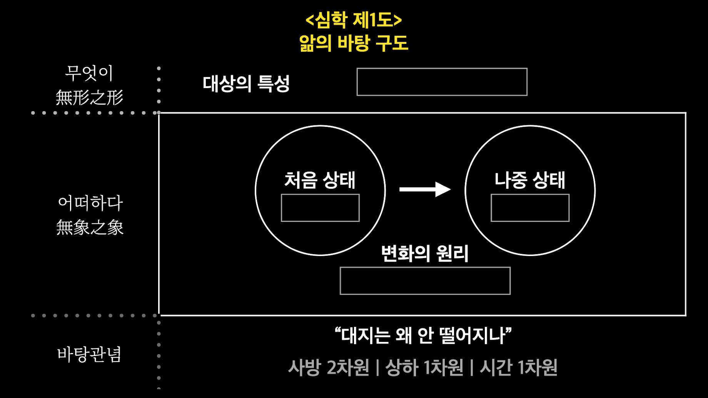
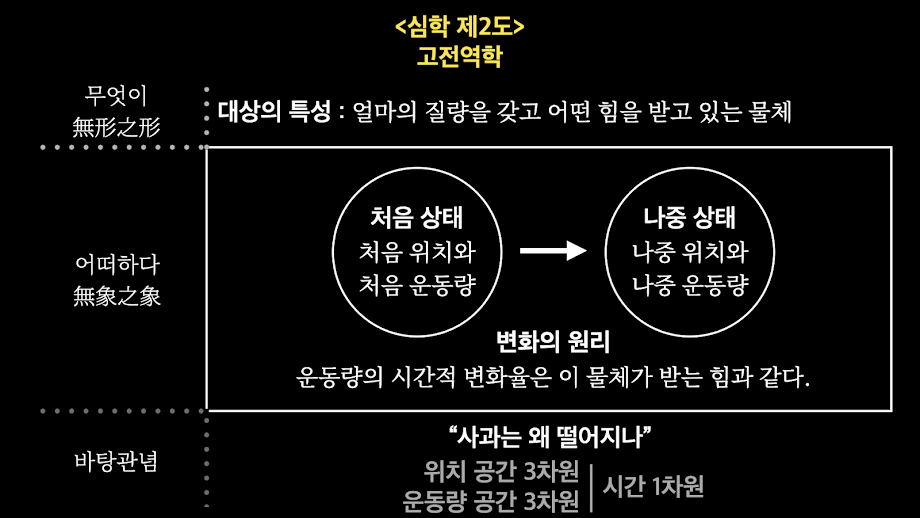
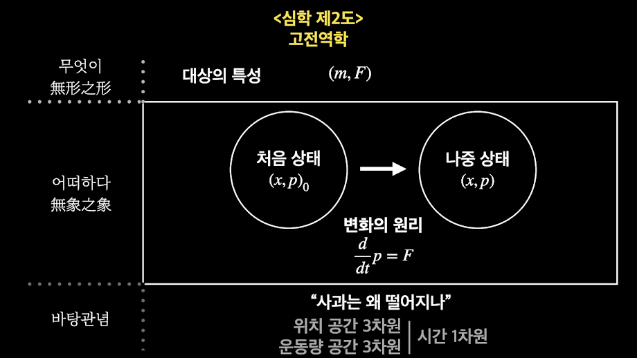
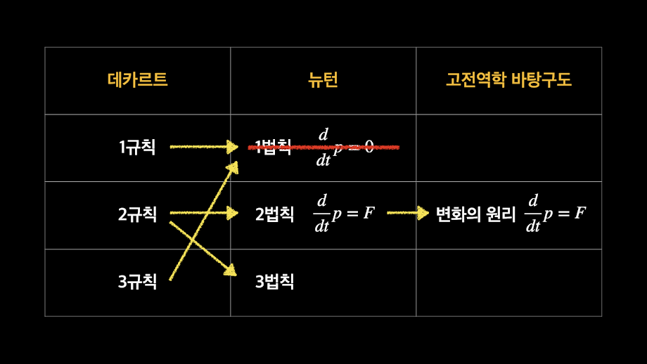
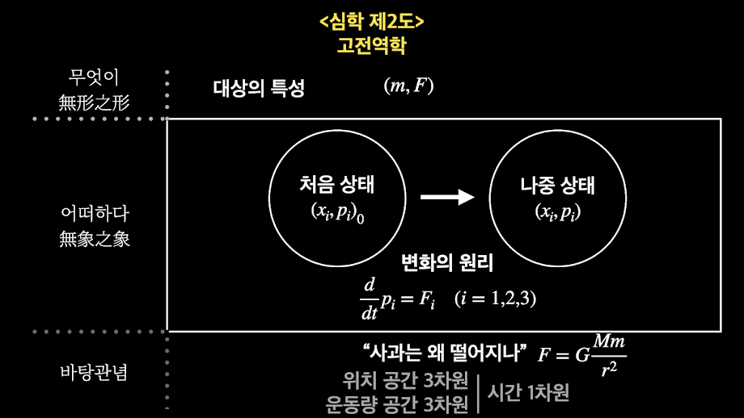

<!-- gid:20250601T161728 -->
[[TIP("이 노트에 대하여")]]
녹색아카데미 장회익의 자연철학 이야기를 녹취록 단위로 모아 두는 컬렉션 노트다. 철학과 과학을 잇는 긴 강연 흐름을 보존하는 자료 아카이브다.
[[/TIP]]

<!-- provenance:source:start -->
[[TIP("원본·최신본")]]
이 페이지는 한국어 검색과 읽기를 위한 WikiDocs 미러입니다. [원본·최신본은 가든](https://notes.junghanacs.com/notes/20250601T161728/)에 있습니다. 최신 수정 내용·백링크·태그·히스토리·댓글·출처 정보는 원본 가든에서 확인하세요.

- 작성: `2025-06-01T16:17:00+09:00`
- 최근 수정: `2025-06-01T16:17:00+09:00`
[[/TIP]]
<!-- provenance:source:end -->

[TOC]

## History

-   [2025-06-01 Sun 16:17] 양이 많으니까 따로 분리하자. 조직모드로 변환. 공백을 넣는 것. 이미지는 외부링크로 연결

-   [녹색아카데미: 공부모임 자연철학 앎의틀](https://wikidocs.net/381953)
-   [김재영 녹색아카데미 물리학자 물리철학 과학영재학교 과학사](https://wikidocs.net/382100)
-   [장회익 자연철학 온생명 스승](https://wikidocs.net/381920)

## 관련메타

-   [자연철학](https://wikidocs.net/380576)

## 관련링크

-   **[녹색아카데미 유튜브 채널](https://www.youtube.com/channel/UCl64B0fT030_LuTI9ZFLhgA/videos)**
-   **[유튜브 대담영상 녹취록 목록](https://greenacademy.re.kr/archives/tag/%EB%8C%80%EB%8B%B4-%EB%85%B9%EC%B7%A8)**
-   **[장회익의 자연철학이야기 목록 (유튜브 대담영상 녹취록 2차 편집본)](https://greenacademy.re.kr/archives/tag/%eb%8c%80%eb%8b%b4-%eb%85%b9%ec%b7%a8-2%ec%b0%a8)**
-   **[자연철학 세미나 녹취록 목록](https://greenacademy.re.kr/archives/tag/%EC%84%B8%EB%AF%B8%EB%82%98-%EB%85%B9%EC%B7%A8)**
-   **[녹취록 전체 목록 : 대담영상 &amp; 세미나](https://greenacademy.re.kr/archives/tag/%EB%85%B9%EC%B7%A8)**
-   **[자연철학이야기 카툰](https://greenacademy.re.kr/archives/tag/%ec%9e%90%ec%97%b0%ec%b2%a0%ed%95%99%ec%9d%b4%ec%95%bc%ea%b8%b0-%ec%b9%b4%ed%88%b0)**
-   **[자연철학 세미나 게시판](https://greenacademy.re.kr/%EC%9E%90%EC%97%B0%EC%B2%A0%ED%95%99-%EC%84%B8%EB%AF%B8%EB%82%98)**

## #목록: 장회익의 자연철학이야기

[2024-06-10 Mon 06:59]

-   [NP story series | 녹색아카데미 - greenacademy.re.kr](https://greenacademy.re.kr/archives/tag/np-story-series)

### 챕터별

-   [1-1. 왜 자연철학인가?\_](https://greenacademy.re.kr/archives/11829)
-   [1-2. 책의 주제와 형식에 대해서\_](https://greenacademy.re.kr/archives/11854)
-   [2-1. 앎의 바탕 구도\_](https://greenacademy.re.kr/archives/12031)
-   [2-2. 예측적 앎의 바탕 구도와 시공간에 대한 바탕 관념\_](https://greenacademy.re.kr/archives/12109)
-   [3-1. 고전역학의 역사지평 : 데카르트와 뉴턴\_](https://greenacademy.re.kr/archives/12155)
-   [3-2. 고전역학의 질문과 개념들\_](https://greenacademy.re.kr/archives/12246)
-   [3-3. 고전역학의 바탕 구도와 그 요소들\_](https://greenacademy.re.kr/archives/12301)
-   [4-1. 상대성이론의 역사지평 : 아인슈타인 이야기\_](https://greenacademy.re.kr/archives/12380)
-   [4-2. 상대성이론의 내용정리 1 : 좌표계와 차원\_](https://greenacademy.re.kr/archives/12506)
-   [4-3. 상대성이론의 내용정리 2 : 시간공간 2차원으로 줄여서 4차원 이해하기\_](https://greenacademy.re.kr/archives/12590)
-   [4-4. 상대성이론의 내용정리 3 : 4차원의 결과들\_](https://greenacademy.re.kr/archives/12625)
-   [4-5. 상대성이론의 내용정리 4 : 바탕 구도 요소의 재서술, 그리고 일반상대성이론\_](https://greenacademy.re.kr/archives/12782)
-   [5-1.양자역학의 역사지평\_](https://greenacademy.re.kr/archives/12834)
-   [5-2. 양자역학 : 겹실틈(이중슬릿)과 양자역학의 문제\_](https://greenacademy.re.kr/archives/12991)
-   [5-3. 양자역학의 '상태'와 '측정'에 대하여 : '성향'과 '변별체' 이해하기\_](https://greenacademy.re.kr/archives/13207)
-   [5-4. 공간 개념의 변화와 양자역학의 새 공리 체계\_](https://greenacademy.re.kr/archives/13263)
-   [5-5. 양자역학 변화의 원리\_](https://greenacademy.re.kr/archives/13338)
-   [6-1. 통계역학(1) : 엔트로피, 미시상태와 거시상태\_](https://greenacademy.re.kr/archives/13584)
-   [6-2. 통계역학(2) : 자유에너지와 거시상태 변화의 원리\_](https://greenacademy.re.kr/archives/13698)
-   [6-3. 통계역학 (3) : 통계역학의 활용\_](https://greenacademy.re.kr/archives/13803)
-   [7-1. 우주와 물질 : 역사지평\_](https://greenacademy.re.kr/archives/13933)
-   [7-2. 우주와 물질 : 내용정리, 해설 및 성찰\_](https://greenacademy.re.kr/archives/14037)
-   [8-1. 생명이란 무엇인가 : 자유에너지와 자체촉매적 국소질서\_](https://greenacademy.re.kr/archives/14134)
-   [8-2. 생명이란 무엇인가 : 이차질서와 생명의 이해\_](https://greenacademy.re.kr/archives/14364)
-   [9-1. 주체와 객체 (1)\_](https://greenacademy.re.kr/archives/14501)
-   [9-2. 주체와 객체 (2)\_](https://greenacademy.re.kr/archives/14562)
-   [10-1. 앎이란 무엇인가? (1)예측적 앎의 구도](https://greenacademy.re.kr/archives/14610)
-   [10-2. 앎이란 무엇인가 (2)이해와 앎 ](https://greenacademy.re.kr/archives/14805)
-   [11. 온전한 앎 (11-1, 11-2)](https://greenacademy.re.kr/archives/14926)

## 1-2. 책의 주제와 형식에 대해서

[2025-06-01 Sun 16:09]

[이 자료](https://greenacademy.re.kr/archives/tag/np-story-series)는 녹색아카데미 유튜브 '자연철학이야기'에서 나눈[대담 1-2](https://www.youtube.com/watch?v=lvHl5Zy-RZ8)을 정리한 것입니다. 자연철학세미나 2기 진도에 맞추어 진행할 예정입니다. 이전에 만들었던[대담 녹취록](https://greenacademy.re.kr/archives/tag/%EB%8C%80%EB%8B%B4-%EB%85%B9%EC%B7%A8)(링크 참조)은 내용 정리가 목적이기도 했고 급하게 작업하느라 읽기에 불편한 부분도 있었습니다. 이번에는 대담의 특성도 더 살리고 삽화도 적절히 넣어서 이해와 재미를 높이려고 합니다. 공부에 도움이 되었으면 합니다.

### 1. 책의 주제에 대한 이야기

#### 1.1. "철학을 잊은 과학에게, 과학을 잊은 철학에게"?

**최우석** 앞 시간에 꽤 많은 이야기를 들려주셨습니다. 이어서 이제 이 두툼한 책, 두께에 비하면 각 장에서 다루고 있는 내용은 너무 간단하게 다루신 것 같다는 생각도 드는 양면성을 가지고 있는 책이라고 저는 생각하는데요. 책에 대한 말씀을 두루 여쭤보도록 하겠습니다.

일단은 몇 가지 질문을 뽑아서, 가벼운 것에서부터 진지한 쪽으로 넘어가는 순서로 잡아봤습니다. 여쭤보다 보면 순서없이 얘기를 나누게 될 것 같습니다. 첫 번째로 운을 띄우는 의미에서, 책 제목은 너무 중요하니까 조금 뒤로 미루고, 부제에 대해서 질문을 먼저 드리겠습니다. 부제를 "철학을 잊은 과학에게, 과학을 잊은 철학에게"로 지으셨어요.

앞에서 해주신 말씀들을 요약해보면, 철학이라고 하는 큰 지혜에 대한 사랑으로부터 많은 탐구들이 나왔고, 그 중에 물리학이 굉장히 중요한 성공사례 혹은 가장 심오한 뭔가를 이뤄낸 기념비적인 분야가 되었는데, 그 분야가 나온 후에 또 새로운 새끼들을 치게 되고, 그러면서 그 안에 서로서로를 나누는 벽이 생기고, 원래부터 서로 관계가 없었다고 생각할만큼 거리가 멀어지는 여러가지 일들이 생겼다, 하지만 그것을 다른 의미와 다른 차원에서 다시 발전시키는 새로운 방향을 찾아야 된다, 이렇게 정리해 볼 수 있겠습니다.

특히나 여기서는 그런 것들이 모든 분야에서 일어났는데, 특별히 '철학을 잊은 과학에게, 과학을 잊은 철학에게', 이렇게 과학과 철학 둘 간의 관계 혹은 대비를 가장 크게 염두에 두신 것 같습니다. 여기에 대해서 왜 이러한 것이 문제인지, 문제의식을 가지게 되신 이유를 여쭤보고 싶습니다.

**장회익** 조금 전에 대충 얘기한 내용인데 다시 한번 정리를 하면, 철학자들이 물음을 묻죠. 그 물음에 대한 대답이 얻어지는데, 의미있는 대답을 못 얻을 수도 있고 얻을 수도 있어요. 의미있는 대답을 얻으면 그것은 말하자면 보존이 될 것이고 또 그 위에 더 쌓여나갈 거예요. 그런데 같은 질문을 계속 반복하는데도 아직 손에 잡히는 않는 그런 부분도 있을 수 있고. 같은 물음에 대해서 크게 그 두 가지, 철학과 과학으로 갈라졌다고 볼 수 있죠.

그 갈라진 것에서 성공 사례는 하루이틀만에 없어지는 게 아니야. 그 다음에 그 위에 또 더 쌓이고 쌓여서 더 올라가는 이런 구체적인 성과들이 있는데, 이것이 과학이라는 이름으로 지금 분가해 나온 거예요. 철학에서는 그 껍데기 물음만 가지고 항상 반복하면서 여러가지 답이 나오는데, 그 나온 답을 가지고 또 비슷한 걸 가지고 계속 씨름하고 있어요.

말하자면 알맹이는 빠져나가고 껍데기만 쥐고 있다고 표현하면 좀 지나치지만, 그것이 바로 \*'과학을 잊은 철학'

\*이죠. 진정한 자기 물음에 대한 답과 성과는 빠져나가고 물음만 계속 안고 있는, 그러니까 자기가 만들어낸 건데 알맹이는 잃어버린 상황이 현재 우리가 철학이라고 부르는 것의 상황과 가깝다. 그러니까 알맹이를 찾아라, 내가 만든, 철학 자신이 만든 알맹이를 찾아라, 그래서 정말 내가 만든 것 중에 중요한 내용이 뭔지를 다시 되살려서 내(철학)가 가지자. 이것이 '과학을 잊은 철학'의 현재 처지이고 해야할 일이에요.

반면 \*'철학을 잊은 과학'

\*은 알맹이만 달랑 나와서는 그게 전부인 줄 아는 거야. 처음에 어떤 물음에서부터 나왔고 그리고 왜 그걸 했는지는 잊어버리고 알맹이만 가지고 주무르고 있고, 심지어는 그 알맹이의 용도도 지금은 부분 부분 잘라서 쓰고 있는 것이 현재 과학의 모습이에요. 그런데, 너(과학)는 본래 그게 아니고 원래 여기(철학)에서부터 나온 것이다, 본래 집은 여기 철학이다, 그래서 철학에다가 다시 넣어서 그 본래 물음과 철학에서부터 얻게 되는 중요한 내용을 통합하자, 본래 철학은 분산하자는 것이 아니라 통합해서 연결하는 것이다, 다시 철학이라고 하는 바탕을 되찾자,하는 것이 '철학을 잊은 과학에게'의 의미에요.

그래서 철학과 과학 양쪽에 다 물음을 던지는 거죠. 그러니까 현재 철학하는 사람들에게는 과학이라고 하는 알맹이를 이 책을 통해서 다시 다시 잡아보게 하고, 과학하는 사람들은 정말 내가 어디서 왔는지 바탕이 뭔지를 연결해서 보는 게 좋겠다 해서, 이 책 이름을 '자연철학'으로 해서 연결을 해본 거다, 그런 의미로 보면 돼요.

**최우석** 그러면 과학과 철학, 양쪽에서 다 이 책을 보기를 희망하시는 건가요? (웃음)

**장회익** 희망은 하는데, 양쪽에서 다 안 볼 가능성이 있죠. (웃음)

#### 1.2. 학문이란 무엇인가? 학문의 본디 정신?

**최우석** 어떻게 보면 같은 질문의 반복일 수 있는데, 점층법이라고 생각해주시고 비슷한 질문에 대해서 더 멋진 답을 해주시면 좋겠습니다. 우선 책 안에 있는 구체적인 대목들을 들어가면서 여쭤보고 싶은데요. 책 머리에서 눈에 띄는 부분을 먼저 보겠습니다.

> "철학의 한 중요한 부분이 전문 학문 영역으로 분화되면서 본래 철학이 간직했던 학문 정신 또한 상당 부분 왜곡되고 있다. ... 그간 철학으로 대변 되던 진정한 '학문'이 사라지고 있음을 말하는 것이다."
> 
> -- 『장회익의 자연철학 강의』 P.5.

여기서 '진정한 학문'이 사라지고 있다, 내지는 본래 철학이 간직했던 학문 정신 또한 상당 부분 왜곡되고 있다고 말씀하셨어요. 본래 학문이 가지고 있던 정신, 이런 것에 대한 상이 분명히 있으실 것 같습니다. 사실 굉장히 어려운 질문인데, 어쩔 수 없이 여쭤보겠습니다. 학문이라는 것이 대체 무엇입니까? (웃음)

**장회익** 우리는 '알겠다', '이해하겠다'고 하는 원초적인 욕구를 가지고 있어요. 그렇게 해서 얻은 답을 체계적으로 정리한 것, 이게 학문이죠.

**최우석** 너무 소박하게 말씀하시는 것 아닌가요? (웃음)

**장회익** 뭐 어려울 게 없죠. 그렇게 해서 이뤄진 것이 있어요, 그 이루어진 것을 다듬은 것이 학문인데. 원초적인 본래 학문의 정신은 바로 그것을 '내가 이해하겠다'하는 거죠. 앞서 말했듯이 '심층적인 그리고 통합적인 이해를 하겠다',하는 것이 기본적인 철학의 정신이고 지금도 그 학문 정신을 가지고 와야 되는 거죠.

동양에서는 그냥 '학'이라고 했어, '학문'의 '문'도 나중에 붙였고, 그냥 '학'이다. 그러니까 한 마디야, 하나야. 그런데 지금은 100개의 갈래가 있고 100가지 학문이 있지만 본래 '학'이었어요. 한 덩어리로 본 거죠. 갈라지기 이전에 '전체'를 통합적으로 이해하는 그러한 추구, 그리고 추구한 이해에 굉장히 중요한 의미를 담아야하는데, 그 의미가 무엇이냐하는 것을 찾아가려고 하는 자세, 이것을 갖춘 것이 본래 학문의 정신이다.

그래서 구체적인 것이 얻어지고, 그리고 그것을 어떤 구체적인 목적에 활용하기 보다는 내 삶의 지침, 내가 어떻게 살아야되느냐 하는 삶의 방향을 내가 찾는 데에 본질적으로 도움이 되는 이런 내용이 학문이라고 보는 거죠. 그런데 현대 학문은 그 정신을 상당 부분 잃었다 이거지.

**최우석** 그게 연결이 안되는 분야가 대부분 아닌가요?

**장회익** 그렇죠. 그 중의 한 부분만 떼어 놓고 보면 서로 너무 멀어서 원래 거기서 왔는지 아닌지도 모를 정도가 돼있죠. 그러니까 말하자면 부분적인 전문가들이 되어 있고, 원래 학문이 가지고 있던 총체적인 것 그 정신부터 잊어버리고 있는데, 그것은 온당한 것이 아니다, 그래서 그것(학문의 본래 정신)을 되살릴 수 있어야겠다하는 생각이죠.

그런데 요즘 실용적인 걸 많이 따지죠. 학문을 실용적인 면에서 보더라도 앞으로 우리가 어떤 문명을 만들고 어떤 방향으로 문명을 끌어가야되느냐 하는 판단을 무엇을 가지고 하겠냐 이거야. 100명의 전문가들을 여기다 모아 놓으면 그 사람들 아마 100가지 얘기를 하고 있을 거예요. 아무도 그 전체의 모습은 못 보면서 얘기만 하는 거죠.

그걸 통합적으로 보는 사람이 있어야 돼요. 그러한 것(통합적으로 보는 눈)을 가지는 학문적 자질이 필요하고, 이상적으로는 적어도 대학 이상의 교육을 받은 사람들은 기본적으로 그러한 학문적 자질을 갖추어야 하는 거야. 그런데 지금은 별로 그렇게 되지 않죠. 결코 쉽다는 얘기는 아니에요. 어려울 수 밖에 없어요.

아까도 얘기했지만 그 많은 것을 통합하는 데 가장 중요한 줄거리를 연결하고 뿌리를 찾아야 돼. 그런데 이 학문이 몇 천 년, 짧게는 몇 백 년 동안 발달해오면서 엄청나게 심오해졌는데, 이것을 한 사람이 몇 개월 또는 몇 년 만에 파악할 수 있느냐. 어려움이 있죠. 그렇지만 그것을 못하면 항상 깨진 것(분리된 것) 밖에 가지지 못해요. 그래서 계속해서 (통합을) 추구하려는 노력이 있어야 된다.

아까도 얘기했지만, 불가능한 게 아니냐하는 생각을 먼저 하고 미리 포기를 해버린 것이 지금 현재의 상황이에요. 개인뿐만 아니라 사회가 그렇게 만들어. 너희는 통합하는 일은 못하니까 너는 이거 하고 너는 저거 해라. 물론 그걸 다 모으는 것을 또 하나의 전문 분야로 생각할 수도 있죠. 다 모으는 것을 기본으로 하는 그런 사람도 필요한데 그런 분야는 지금 없는 거야, 그게 필요하죠.

그래서 그걸 다 모으되 표피적이고 지엽적인 것을 쌓는 게 아니고 줄거리 전체를 연결해서 파악하는 것이 필요하다, 그것이 학문의 기본 정신이라고 보고 그리로 돌아가자. 옛날에 학문을 출발한 사람들은 다 그것(전체를 연결)을 생각하면서 했는데, 그 학문이 성과를 거두다보니까 학문 자체를 깨버리는 거야. 이게 참 비극이죠. 학문을 키워놨더니 아무도 못한다고 해서 (학문 자체를) 깨고 전부 한 조각씩만 가지고 있는 이런 상황인데, 이것은 바른 상황이 아니다. 적어도 일부 사람들이라도 기본 학문으로 돌아가려는 노력을 할 필요가 있다고 보는 거죠.

**최우석** 어려워서, 제 나름대로 다시 정리를 해보겠습니다:

소박하게 볼 때 학문, 학이라는 것은 알고자 하는 욕망에 따라서 알게 된 것을 잘 정리한 것이다. 그런데 우리가 여러 사람들의 노력을 통해서 알아낸 것들을 넓고 깊게 연구를 하다보니까 그런 것들을 종합적으로 이해하는 것 자체가 이제는 큰 일이 되어 있다. 현재로서는 워낙 많은 분야로 깊이 들어가있기 때문에 다 섭렵한다는 것 자체가 불가능하게 되었다.

과거 '학'의 전통은 우리 인류가 공통적으로 얻은 것들의 골간이 되는 혹은 중요한 것들을 내가 다 이해하고 말리라고 하는 야망 혹은 야심을 가지고 '학'을 했다면, 지금은 워낙 방대해져서 '그걸 누가해,' '아무도 할 수 없어'라고 하면서 그건 내 일이 아니다, 나는 이 부분을 할테니 너는 저 부분을 해라, 각기 자기 분야를 열심히 하다보면 뭔가 좋은 일이 있을 거야라고 하는 막연한 기대만 가지고 각자 자기 일들을 하고 있다.

그 와중에 아무도 우리 모두가 노력을 해서 얻어낸 전체의 모습, 코끼리의 모습 이런 것들은 아무도 접근하려고 하지도 않고 욕심도 안 내고 자기 일이라고 생각도 하지 않고, 그러면서 점점 무관심해지고 누구도 할 수 없는 일이 되어버린 상황이 된 것이 아닌가.

그렇다면 다시 여러 부분들을 종합해서 코끼리의 모습을 그려보려고 하는 그런 정신을 어느 분야, 어느 작은 부분을 하는 사람들이건 다 두루 가지고 있어야 하는데, 그것이 현실적으로 어려운 부분이 있다면 그 중의 일부라도 나서서, 개별 학자들이 하는 것들로부터 전체의 모습을 그려내는 그런 작업, 새로운 전문 분야라고 할 수 있을 만큼 다른 작업을 이제 해야 한다. 그럴 의향이 있는 사람들이 있어야 되고, 그것이 선생님께서 말씀하시는 학문의 본디 정신, 학문 그 자체다, 이렇게 정리를 해봐도 될까요?

**장회익** 아주 요약을 잘 했어요. 보면 이 사람이 아주 모범 학생이야, 정리를 아주 잘 했어요. (웃음) 잘 알아들었어. 바로 그것이 필요하다는 거지. 그래서 다른 모든 걸 떠나서, 이 과목 그리고 이 책을 쓸 때 내가 의도했던 것은 (학문을 다시 하는) 출발이라도 만들어보자하는 했던 거라고 보면 되겠죠.

**최우석** 같은 예는 아닌데, 저희가 요즘에 녹색아카데미 웹진을 하면서 세계의 기사들을 여러가지 찾아보고 그 중에서 의미 있는 것들을 소개하는 일을 하고 있는데요. 그러다보니 느끼는 것이 있습니다. 요즘 기후과학이라고 하는 것이 가장 중요한 부분이 되어 있지 않습니까. 한편으로 보면 기후과학이 통합적인 학문의 모습의 일면을 보여준다는 느낌도 듭니다.

어떤 사람은 하와이에서 이산화탄소 농도를 측정하고, 누구는 어디서 해수 온도를 측정하고, 온 사방에서 여러 사람들이 각자 자기 분야에서 일하고 있는데, 그런데 사실은 그 각각 만으로는 자신의 연구 결과가 무엇의 증거다라고 말할 수도 있고 아닐 수도 있는데, 그런 연구들을 다 한단 말입니다.

그런데 이런 노력을 하는 사람들이 세계적인 차원에서 각자의 연구들을 한 데 모으고, 태평양 바다의 해수의 상태가 의미하는 것과 이산화탄소의 농도가 의미하는 것, 한편에서는 어떤 생물종이 멸종하는 것 이런 것들이 어떤 공통된 원인이나 결과를 가리키고 있다는 식으로 종합을 해서 지구 전체의 상태를 드러내는 데 활용을 해서 뭔가 결론과 방향과 과제를 내고 있거든요.

그런 차원에서 이것은 협업을 하는 노력인 것도 같고, 또 한편으로는 여러 분야의 연관성을 찾지 않으면 이해가 안 되는 부분들을 다 모아서 종합해내는 그런 결과들을 보면, 요즘은 '집합 지성'이라는 말을 많이 하지만, 멋진 모자이크같다 라는 생각을 종종 하게 됩니다.

**황승미** 집합지성이라는 것도 결국은 한 사람이 하는 거잖아요. 여러 연구 논문들을 모아서 보니 이런 것들은 이런 패턴을 나타내더라는 연구도 결국은 한 사람 혹은 여러 명으로 구성된 한 팀이 하는 것이기 때문에, 선생님 말씀대로 또 하나의 새로운 전문가, 새로운 분야라고 할 수 있을 것 같아요. 저절로 만들어지는 것 같지는 않아요.

**장회익** 그렇죠. 연결해내는 지성이 없으면 갖다놔도 그것에서 어떤 통합적인 비전을 가질 수가 없어요. 연결해내는 지성이 필요한 거죠. 그러니까 물론 하나하나의 분리된 내용, 데이타들이 매우 중요하지만 연결돼야 의미를 찾을 수 있는 거에요. 아마 기후 정도에서는 연결하는 게 그렇게 어렵지 않을 수 있지만, (웃음) 그러나 우리 문명 전체를 생각해본다거나 할 때는 통합이 쉽지 않은 거죠.

조금 다른 예를 하나 들면, 군대나 전쟁 얘기가 좋은 예는 아니지만, 군대 조직에서 영어 계급 명칭에 재밌는 게 있어요. 사병 중에서 우리로 치면 상병 쯤 해당되는 계급이 스페셜리스트(specialist; 미 육군 상병에 해당하는 계급)에요. 우리도 군대에 가면 '특기'라는 걸 받는다 그러는데, 그 사람이 스페셜리스트, '특기'를 받은 사람, 전문가라는 얘기죠. 그런데 장군은 뭐라고 부르는지 알아요?

**황승미** 제너럴?! 오! 그렇구나! 와... (웃음)

**장회익** 그렇지, 제너럴이야. (웃음) (general; 미 육군의 장성 일반 명칭. 별 1~5개까지 모두 General Officer) 그러니까 전체를 보는 사람은 제너럴이고 전문가는 스페셜리스트야. 둘 다 필요하죠. 군대에서 스페셜리스트는 낮은 계급이고 제너럴은 전부 통괄하는 계급이란 말이에요. 그러니까 전쟁을 효과적으로 수행해서 이기려면 제너럴리스트가 위에 서야 제대로 할 수 있다,하는 거지.

전쟁에 참여하는 사람들은 목숨을 걸고 하는 것이기 때문에 거기에 제일 맞는 조직을 짜다보니까, 제너럴을 제일 꼭대기에 놓고 스페셜리스트는 밑에서 작업을 하는 거예요. 그러니까 스페셜리스트 100명 갖다 놓고 거기서 니가 작전해라, 그러면 결과가 제대로 나오지를 않아, 제너럴이 있어야 돼요. 그러니까 전쟁은 정말 생사를 걸고 하는 거니까 그런 조직이 필요한데.

우리 문명도 마찬가지에요. 우리 문명을 제대로 이끌어나가려면 제너럴에 해당하는 학문, 제너럴에 해당하는 시야가 있어야 하고, 많은 스페셜리스트들이 있어야 되죠. 숫자는 스페셜리스트가 더 많아야지, 그래야 많은 일을 할 수가 있죠. 그렇지만 소수의 사람이라도, 이런 다양한 분야의 일을 모아서 전체를 이끌어가는 그런 모습으로 비유를 해볼 수 있겠죠.

**최우석** 감동 깊게 와 닿았습니다, 선생님. (웃음)

#### 1.3. 자연철학이란 무엇인가?

**최우석** 이제 책 제목으로 들어가보겠습니다. 아까 '자연철학'에 대해서 설명을 해주셨는데요. 철학을 하는 사람 내지는 '학'을 하는 사람이 물리학을 공부한다 혹은 과학을 공부한다고 했을 때 그것에 또 다른 분과 학문의 이름을 붙이기 보다는 '자연철학'이라는 이름으로 부를 수 있겠다,라고 비교적 소박하게 말씀해주셨습니다. 책 머리에 이렇게도 써주셨어요.

> "자연철학은 한마디로 자연에 대한 합리적인 그리고 포괄적인 이해를 추구하는 학문이라 규정할 수 있다."
> 
> -- 『장회익의 자연철학 강의』 P.4.

일단 제가 개인적으로 궁금한 것은, 우리가 분과학문 체계를 논할 때는 상당히 대비적으로 이해하는 측면이 있습니다. 윤리학, 법학, 사회학... 이런 식으로 영역들을 나누어 공부하고 있는데요. 선생님께서는 어떤 나름대로의 종합적인 분야를 '자연철학'이라고 하셨습니다. 철학 그 자체라고 말씀하시지는 않았거든요. 만약에 지금의 스페셜리스트 학문들은 그대로 두고 이것들을 종합하는 제너럴리스트 학문들이 다시 또 다수로 포진할 수 있다고 한다면, 자연철학과 병립할 수 있는 다른 철학들을 또 상상하신 게 있을까요?

**장회익** 그렇죠. 내가 그냥 '철학'이라고 하지는 않고 굳이 '자연철학'이라고 했던 데에는, 일단 자연에 대한 통합적인 이해를 먼저 추구한다,하는 의미가 담겨 있어요. 사실은 역사적으로 가장 대표적인 자연철학자가 누구냐? 뉴턴이란 말이야. 우리는 뉴턴을 물리학자라고 부르지만, 뉴턴 자신은 스스로 물리학자라고 생각하지 않았고 철학자, 자연철학자라고 얘기했어요.

뉴턴의 대표적인 고전역학 주저가 『자연철학의 수학적 원리』에요. 자연철학이라고 했죠. 여기에는 철학이라고 하는 학문 정신을 살리되, 그 철학에서 자연에 대한 이해를 가장 중시하고 그것을 바탕으로 삼겠다, 이런 취지가 담겨있어요.

내가 여기서 '자연철학'이라고 하는 것도, 지금은 다들 그냥 자연과학이라고 부르면서 하고 있죠. 그러나 자연과학이라고 하는 의미의 학문 조각이 아니라, 철학이라고 하는 것으로 자연과학 전체를 연결한 그것을 무엇이라고 부를 거냐? 그걸 자연과학이라고 보통 요즘 얘기를 하지만, 그러나 아까 얘기했던 철학적인 정신과는 조금 다른 각도로 이해가 되는 면이 있어요. 철학이면서 자연 전체를 아우르는 그런 의미인 거죠.

그러면 나머지 다른 철학과는 어떻게 연결이 되느냐? 그 연결은 여기서 강조는 하지 않지만 철학인 이상 그건 연결 꼭지를 다 가지고 있다고 보는 거죠. 자연 만을 하자는 것이 아니라. 자연만 하는 것은 자연과학의 입장이지만, 자연철학이 되면 그걸 통해서 우리 삶과 어떻게 연결 되느냐, 내 삶과 어떻게 연결 되느냐 까지를 생각하는 그런 틀이다, 그렇게 보면 돼요.

내가 이 책에서도 중간 이후에는 생명, 인간, 의식 문제, 앎이란 게 뭐냐, 이런 것까지 통합을 시도했는데, 그런 내용들을 내가 '자연철학'이라는 말 속에 같이 묶었어요. 그러니까 그런 것들과 (자연철학이) 분리되는 게 아니다 이거죠. 자연철학을 바탕으로 우리가 생각하는 나머지 많은 것들과 연계를 짓지만, 거기서 바탕은 자연에 두고 이해를 해서 올라가는, 모든 걸 다 포괄한다는 의미는 아니고, 바탕에서 위로 연결할 수 있는 꼭지를 남기면서 나아가는 정도의 개념이라고 보면 되겠어요.

**최우석** 자연철학이 자연이라는 대상 혹은 탐구의 중핵을 자연에 두고 연결을 해나가는 것이라고 하면, 그와는 달리 인간, 사회, 법 이런 식으로 주된 초점 내지는 주된 발판이 자연이 아닌 다른 분야들로 연결망을 뻗쳐나가는 것도 될 수 있을까요?

**장회익** 있을 수 있죠. 아까 얘기한 것처럼 윤리 철학, 사회 철학 등 여러가지가 있을 수 있는데, 물론 그런 것을 또 철학적으로 연결하는 거지만. 그 중의 하나라고 볼 수는 있지만, 내가 강조하고 싶은 것은 자연이 중추적인 바탕을 이루어야 된다는 거예요. 자연이라는 바탕을 떠나서 존재하는 것은 아무것도 없다, 인간조차도.

그래서 거기서 바탕이 되는 부분을 제대로 받쳐줘야 연결이 제대로 돼요. 허공에 띄울 수는 없는 거니까. 그래서 다른 여러가지가 있지만 특히 자연철학은 원래 역사적인 출발도 그랬고, 지금도 각 학문의 바탕에서 자연과 연결을 해야 전체가 보이는 그런 구실을 한다, 이 정도로 차별을 둘 수 있겠죠.

#### 1-4. 자연철학과 메타과학?

**최우석** 뒤의 질문과 연결시켜서 다른 질문을 드려보겠습니다. 자연과학과 자연철학을 선생님께서는 구분하고 계시지 않습니까? 선생님의 앞서 나온 저서들을 안 읽은 사람들에게는 좀 섭섭한 질문이기는 한데, 제가 읽은 선생님 책 『과학과 메타과학』(현암사, 2012)에서는 '과학'과 '메타과학'을 구분하셨습니다.

메타과학은 문자 그대로 과학자체를 대상으로 한 과학, 과학을 과학적으로 탐구하는 학문으로 볼 수 있지만, 조금 더 넓게 보면 과학의 성과와 과학의 한계를 반성적으로 고찰하고, 과학 자체의 어떤 구조나 과학 자체의 내부 질서같은 것을 한 차원 위에서 조망한다는 의미도 있고 여러가지 의미가 있는 것 같은데요. 혹시 그 메타과학에 '자연철학'이라는 다른 이름을 지어주신 것은 아닌가요?

**장회익** 상당부분 중첩이 되죠. 상당히 겹치는 부분이 있는데, 그 정신에 조금 차이가 있어요. 자연철학을 하려면 메타과학적인 이해도 거기에 넣어야 된다는 의미도 되고, 자연철학은 조금 더 폭넓은 개념이에요. 반면에, 이미 과학이라는 것이 만들어졌는데 과학 자체는 어떤 구조와 성격을 가지고 있느냐 하는 부분을 중점적으로 조명하고, 그 구조와 성격이 가지고 있는 의미가 무엇이냐를 밝히는 것이 메타과학이에요.

그래서 메타과학과 자연철학이 겹치는 부분은 상당히 많다고는 봐요. 그런데 본래 성격 자체는 똑같은 것은 아니고. 굳이 얘기하자면 자연철학이 좀 더 폭 넓은 내용을 가지고 있고, 그 중에 메타과학은 자연철학의 중요한 구성요소로 작용한다, 그 정도로 이해하면 될 거예요.

#### 1-5. 자연철학과 과학철학?

**최우석** 또 과학철학, 물리철학은 말이 비슷해서 대비를 해볼 수 있을 것 같아서 여쭤보겠습니다. 꽤 많은 사람들한테 알려져있는 분야로서 '과학철학'이라고 하는 분야도 있고요. 잘 알려지지 않은 분야로는 '물리학의 철학' 혹은 '물리철학'이 있습니다. 이런 분야는 선생님께서 쓰시는 '철학'의 의미보다는 철학의 세부 분과, 철학의 새로운 분과같은 의미가 더 강한 것 같습니다. 그런 과학철학, 물리철학과는 자연철학이 완전히 궤를 달리 하는 분야인지 궁금합니다.

**장회익** 완전히 궤를 달리 한다고 보기보다는, 과학이 일단 성립하고 또 물리학이라는 것이 성립하고 그런 다음에 이것을 다시 철학적으로 보자, 그 바탕을 철학적으로 해보자 하는 것이 과학철학, 물리철학이에요. 자연철학의 입장에서는 철학이 먼저 있고 그것이 이루어낸 성과를 다 연결하려고 하는 것이라고 한다면, 과학철학과 물리철학은 이미 나온 성과 중의 일부를 중심으로 다시 그것을 철학적으로 검토하는 것, 이런 뉘앙스의 차이가 있겠죠.

그리고 내가 이 책에 담고 있는 자연철학과, 과학철학 또는 물리철학을 서로 비교를 해본다면, 과학철학과 물리철학은 그 나름대로 또 전문화가 되어 있어요. 그래서 과학철학이라고 한다면 현재 과학철학에서 다루는 분야가 뭐다 이렇게 있고, 물리철학에서는 이것이 물리철학의 분야라고 해서 꽤 특수화된 어떤 성격을 많이 담고 있어요.

나는 그런 것을 되도록이면 넘어서고 싶은 입장이고, 넘어선다는 의미에서 나는 '자연철학'을 했고. 또 한 가지는 자연철학 속에는 물리학의 내용 그 자체를 중점적으로 담고 있는데, 과학철학이나 물리철학에서는 또 물리학의 내용 중에서 일부는 빼버리고 그 분야의 특수한 성격만을 다뤄요.

내가 과학철학자냐 물리철학자냐 묻는다면, 아니라고 하기는 좀 그렇지만 나는 오히려 자연철학자다,라고 얘기하고 싶죠, 내 입장에서 볼 때는. 과학철학, 물리철학과 자연철학 사이에 역시 상당한 중첩은 있지만 기본적인 방향성에서는 좀 차이가 있다, 이렇게 보고 싶어요.

### 2. 책의 형식에 대한 이야기

#### 2-1. 수학적 이해는 자연철학의 본령?

**최우석** 이 책에 수학이 많이 나옵니다. 초급 수학이 아니라 고급 수학이 많이 나오는데, 수학을 넣으신 이유에서부터 우리가 어느 정도까지 소화를 해야하는지, 저를 비롯해서 많은 분들이 궁금해할 것 같습니다. 왜 굳이 수식을 빼지 않으셨는지, 책을 보다보면 굳이 뺄 필요가 있겠나하는 말씀도 하시는데, 그것만인지 아니면 수학이 빠지면 도저히 안되는 골간이 있기 때문인지 여쭤보고 싶고요. 저희들이 다 따라가기 쉽지 않을 것 같은데, 어느 정도까지 따라가면 그래도 해볼 만한 거라고 볼 수 있는지, 수학 얘기를 간단히 여쭤보고 싶습니다.

**장회익** 사실 우리가 수학을 모르는 게 아니야. 중고등학교에서 우리가 수학때문에 얼마나 고생을 했냐고. 그렇게 해 놓고 대학 들어가고 나서는 싹 잊어버리고 난 수학 모르는 사람, 이렇게 생각하는 사람들이 너무 많은데, 그건 참 낭비고 안타까운 일이거든.

그 수학을 살리자 하는 측면도 있어요. 이렇게 하면 수학이 이렇게 쓰이는구나, 수학을 썼더니 자연이 이렇게 보이는구나 하는 것을 봄으로써, 그동안 고생한 보답을 받는 거지. 그래서 우리가 가지고 있던 수학 지식이 다시 산 지식으로 가는, 그런 취지가 하나 있어요.

더 중요한 것은 역시 자연은 수학을 통하지 않고는 제대로 이해가 안 돼. 그래서 갈릴레오의 말도 인용했지만 자연은 수학으로 써있다, 지금은 갈릴레오 당시의 수학보다 더 깊은 수학으로 자연이 쓰여있어요. 그리고 그 수학의 상당 부분, 거의 절반 이상은 자연을 이해하는 과정에서 그 수학이 만들어진 거예요. 분리할 수가 없어요. 미적분도 뉴턴이 고전역학을 만들면서 같이 만들었어. 고전역학을 이해하려면 미적분을 써야하는 거다,해서 그렇게 만든 거예요. 그래서 분리시킬 수가 없다.

그런데 독자들은 수학이 몸에 체질화가 안 돼있기 때문에 일종의 거부감을 느끼죠. 수학없이 했으면 좋겠다고 생각을 하고 거기에 영합한 책들이 많이 있기는 한데, 그렇게 하면 왜곡될 가능성이 상당히 많아요. 자연을 제대로 보려면 수학을 통해서 봐야 한다.

누가 수학을 안 쓰고 말로만 했다 그러면, 나는 이렇게 얘기해요. 수학을 써도 어려운데 그걸 어떻게 말로 하느냐. (웃음) 말로 하는 것은 수학을 쓰는 것보다 몇 배 더 어려운 거야, 제대로 하려면. 그러니까 자연철학을 이해하려면 수학을 쓰는 것이 제일 쉽게 접근하는 길이다.

**최우석** 이 책이 제일 쉽게 쓰신 건가요? (웃음)

**장회익** 어렵다는 것을 내가 부정하는 것은 아니에요. (웃음) 나한테도 어려운 내용도 많이 있었고. 내가 예전에 공부할 때는 특히 더 그랬고. 그래서 이런 수학을 어떻게 넘어갈 수 있느냐에 대한 일종의 지혜가 있어야 돼요. 피하면 안 돼, 일단 읽어. 도저히 기호를 모르겠다하는 사람들은 뒤에 부록에 설명해놨으니까 거기서 기호를 먼저 확인을 하고, 이 내용 자체만으로 무슨 뜻이다하는 것만이라도 판독을 하면서 읽어나가요.

물론 여기서 이게 나오고 저기서 저게 나오고 하는 과정을 일일이 자기가 다 메우려면 힘든 점이 있어요. 내가 자세히 메워주고 싶지만 그러면 너무 내용이 방대해지기 때문에 껑충껑충 뛰어넘은 게 있는데. 그렇기 때문에 왜 여기서 이게 나와하고 턱턱 막히는 경우가 있어요. 그럴 때는, 이 사람이 거짓말은 안 했겠지하고 믿고 넘어가도 돼요. (웃음) 그런데 이건 꼭 알아야겠다 하는 부분은, 자기가 고생해서 하면 할 수 있거든. 하려면 할 수 있지만 지금 바쁘니까 뒤로 미루겠다, 이 정도로 생각을 하는 게 좋아.

이거 내가 못 하는 거다, 해버리면 그 다음부터는 접근이 안 돼요. 이거 내가 할 수 있다, 그래서 할 수 있다는 것을 처음 한 2장, 3장 정도에서 기본적인 것 몇 가지 해봐요, 아! 수학을 썼더니 이게 이렇게 이해가 되는구나 하는 것 몇 가지만 제대로 이해하고 나면 그 다음에 수학이 나올 때는 아, 그렇지, 그런 식으로 어떻게 되겠지 하고 믿고 나가도 돼요.

그러나 뛰어넘지는 말고. 그렇게 하면 수학적으로 하면 이게 이렇게 된다는데, 이게 수학적으로 이런 의미가 담겨 있구나하고 넘어가도 돼요. 그러나 포기하지 말고, 언젠가는 내가 이걸 하겠다, 일단은 뒤에 부록을 보면서 찾아서 확인해보고. 그거 안 된다고 해서 『수학의 정석』 이만한 책 살 필요는 없어요. (웃음) 그건 전혀 권장하진 않아. 최대한 이 책에서 이해하는 데까지 해보고, 정 안되면 차라리 고등학교 다니는 동생한테 물어보든가. 이렇게 해서 알아도 돼요.

그러니 겁먹지 말고. 여기서 제일 중요한 것은 내가 할 수 있다는 것. 수학도 지금 당장은 어렵다는 것은 인정해요. 당장 수학까지 다 연결해서 이걸 이해하려면 몇 년 정도 걸려요. 그러니까 내가 그걸 부정하는 게 아니고, 희망하는 것도 아니에요. 그렇지만 이건 수학적으로 이러이러하게 표시되고 이런 것이 이런 결과가 나온다 하는 것 까지만 연결해서 읽으면, 그것만으로도 아주 유익하다는 거죠. 수학을 빼고는 전혀 파악할 수 없는 내용이기 때문에, 그 정도의 지혜를 가지고 읽어달라, 그렇게 얘기하고 싶어요.

**최우석** 중요한 것은, 자연에 대해서 우리가 축적한 심오한 앎은 수학을 개발해가면서까지 만들어낸 앎이기 때문에 수학을 제외하고는 그 심오한 본체에 접근한다는 것은 기본적으로 불가능하다, 그러니 용기를 잃지 말고, 당장은 아니어도 할 수 있다는 자신감을 가지고 당분간은 할 수 있는 데까지만 해보자,는 말씀인 것 같습니다.

**장회익** 바로 그것이다. 그리고 더 중요한 것은, 이 책에 다 담겨 있다, 다른 거 볼 것 없이 이 책만 보면 다 된다, 그 책을 내가 가지고 있다, 그렇게 생각하면 자신이 생기죠.

#### 2-2. 동아시아 학문 전통과 장회익의 자연철학?

**최우석** 마지막으로 이 책에 대해서 한 가지만 더 여쭤보겠습니다. 우선 책의 구성이 상당히 흥미로운데요. 제1장에서 장현광선생을 소개하시면서 책이 시작됩니다. 장현광선생은 한국의 유학자 중의 한 사람이고, 선생님께서 평가하시기로는 우리 풍토에서 근대 학문의 시초가 될 만한 그런 분이라고 소개해주셨습니다.

그런데 시작은 우리 학문에서 했는데, 2장부터는 다시 서구로 넘어가서 서구에서 지금까지 해왔던 유구한 과학, 자연에 대한 앎이 축적된 역사를 쭉 훑고 그리고 거기로부터 많은 것들을 끌어낸 다음에, 맨 마지막에 온전한 앎을 찾는 과정에서 다시 또 동아시아 전통으로 돌아오는 구조를 택하셨습니다.

설득을 위한 책의 구조 말고, 왜 굳이 자연철학을 논하는데 동아시아적인 학문 전통이 거론되어야 하는지, 왜 그것이 출발이자 도착점이 되어야 하는지 궁금합니다. 우리가 흔히 과학을 얘기할 때는 좀 아쉽기는 하지만 다 서구의 성과였고 굳이 우리가 학문에 국경과 경계를 둘 필요가 있나, 앎이 중요한 것이지, 이러면서 받아들이고 있는데요. 선생님의 접근은 굉장히 독특한 것 같습니다. 그래야 될 만한 필연성이라든가 그런 얘기를 듣고 싶습니다.

**장회익** 우리가 학문을 하고 공부를 할 때 제일 중요한 것은, 물음을 내가 묻는 거예요. 내가 물음을 찾고 내가 뭘 알고 싶다, 거기서부터 출발하는 거예요. 내 물음이 아닌 남의 물음을 가지고 답을 찾아주는 게 아니야. 나한테서 물음이 나와야 돼요.

제일 가깝게는 지금 현재 내가 뭘 알고 싶으냐에서 출발하는 게 제일 좋죠. 그런데 각자 개인이 전부 다 물음을 가지기 어려우니까, 그러면 그 중에서 제일 가까운 것은 우리 풍토 안에서 발생한 물음이죠. 그리고 과거로 올라가면 우리 선조들이 물었던 물음에서 출발하는 것이 내 물음에 가장 가까운 출발점이에요.

그래서 '그 물음이 무엇인가'에서부터 출발을 해야 거기에 맞는 답을 얻어낼 수 있어요. 그런데 그 답은 지난 몇 백 년 역사 안에서 우리 풍토에서 우리가 다 찾아낸 게 아니고, 오히려 거의 대부분은 서구 쪽에서 답을 찾았죠. 하지만 서구의 물음이 아니라, 우리가 내 물음에 대한 답을 거기서(서구의 학문 성과에서) 가져와서 여기다가(내 물음에) 얹어야 되는 거예요. 이런 자세를 가져야 되겠다 이거죠. 개인으로 말하면, 내 물음을 가지고 내가 공부하는 것은 그 앎을 나한테 이해가 되도록, 나한테 납득이 되도록 만드는 것이 공부예요. 다른 데서 정리된 것을 외워서 그대로 내뱉는 게 공부가 아니고.

그래서 서구의 물음과 답을 참고로 해서, 우리의 물음을 가지고 우리의 답을 쌓아나가자는 거죠. 이 책은 서구의 것을 소재로 했지만, 책에 있는중요한 내용은 현재 내가, 개인적으로 말하면 나 자신의 물음에 대해 얻은 답을 이 책에 쓴 거예요. 나는 우리(의 문화, 학문)에 속하니까. 내가 얻은, 그러니까 이 책에 있는 내용은 서구 어느 문화에도 없는 것이 대부분이에요. 왜냐하면 내가 찾은 것이기 때문에. 우리 물음을 가지고 내가 찾고, 그리고 내가 원하던 결론을 찾은 거예요.

아까도 얘기했지만 우리 동아시아 전통 학문 중에서 가장 소중히 여겨야할 것은 통합적인 이해고, 동아시아에서는 그것을 끝까지 시도했어요. 그런데 그 통합적인 이해를 우리 식으로 마무리하고 싶다 이거지. 그래서 통합적인 이해의 대표적인 것이 마지막 10장에 들어가있는 '태극도설'이에요. '태극도설'에 나오는 내용을 다시 한번 요약을 하고, 그것에 해당하는 지금 현재의 우리의 답을 구성해보자. 이렇게 해서 내 물음에서 출발해서 내가 생각한 것을 나 식으로, 지금 나 개인을 얘기했지만, 우리, 가까이는 우리 한국의 학문 풍토에서 마무리 해야 진정한 우리 학문이 된다, 그런 정신을 반영해본 거예요.

**최우석** '질문'이라는 말씀을 하시니까 이런 생각도 드는데요. 종합적, 통합적인 앎에서는 중요한 것들을 골라내고 얽는 묘법이 필요할 것이라고 봤는데, 그렇다면 (나의) 질문이 어떤 기준이 될 수 있을 것 같습니다. 나의 질문에 비추어볼 때 이것은 중요하고, 이것은 내 질문에 대한 해답의 중요한 요소가 되고, 그렇지 않은 것은 배제하고, 그런 식으로 어떤 것을 쌓아간다고 한다면, 자연에 대한 이해와 과학적 성과들이 우리의 질문으로부터 출발해서 그 질문에 대한 답을 찾는 과정에서 함께 쭉 얽어서 우리의 답으로 가지고 오는 일이 새로운 어떤 전기가 될 수도 있을 것 같습니다.

**장회익** 그래서 내가 아까 잠깐 얘기했지만, 지금 우리 과목에서의 공부 방법도 마찬가지에요. 학생들마다 질문이 다 달라, 각자 자기 질문에서 출발해달라, 자기 질문을 이 과목에서 공부한 걸로 채워라, 그리고 자기 결론을 만들어라, 그걸 내가 권하는 거예요. 사람들마다 다 다를 거예요, 왜냐하면 자기 질문이니까. 그것이 제일 중요한 거예요.

조금 빗나가지만 재밌는 사례를 들면, 작년에 노벨화학상 탄 사람 이름이 [John B. Goodenough](https://www.nobelprize.org/prizes/chemistry/2019/press-release/)(1922-)에요. 존, 너는 B만 받아도 충분히 좋다는 뜻이지. (웃음) 이름이 John이고, 성이 Goodenough. 이름이 재밌어서 한번 들으면 잊어버리지를 않아요.

그 사람이 공부한 폭이 또 꽤 재밌어요. 이 사람은 예일대학에서 수학으로 공부를 시작했어. 수학과에서 최우등생으로 졸업을 했어요. 그 다음에는 시카고대학에서 물리학박사를 하고, 그 다음에는 노벨상은 노벨화학상을 받고, 그리고 현재는 텍사스대학 공과대학 교수로 있어. 나이 아흔 여덟에 지금도 공과대학 현직 교수로 있어요. 물론 석좌교수고. 수학에서 출발해서 물리학으로 다지고 그 다음에 화학으로 성과를 거둬서 노벨상을 받고 그리고 지금은 공과대학 교수를 하고 있어요.

그것도 재밌지만, 여기서 내가 얘기하고 싶은 것은 그 사람이 시카고대학에서 물리학 박사학위를 받을 때 지도교수([Clarence Zener](https://en.wikipedia.org/wiki/Clarence_Zener), 1905-1993)가 고체물리학을 한 사람이었어요. 그런데 그분한테 가서 지도를 받으러 왔습니다 하니까, 그분이 내가 너한테 두 가지 문제를 준다하면서, 첫째는 문제를 찾아라, 둘째는 그 문제를 풀어라, 그 다음 말은 이제 나가봐. (웃음) 거기서 중요한 것은 문제를 찾으라는 거예요. 박사학위를 받을 때, 보통 의례히 지도교수가 이런 문제를 풀어봐라하고 주는 것으로 대개 기대를 하는데, 문제를 니가 찾으라고 했고, 그래서 결국 노벨상까지 받은 거야, 자기가 문제를 찾았기 때문에.

그것이 중요해요. 문제를 내가 가졌다는 것, 그리고 그 문제를 내가 푼다는 것. 그러면 박사가 되는 거지. 그런 박사가 아니면 쓸모가 없는 박사가 되는 거예요. 그런 박사니까 이 사람이 노벨상까지 받게 됐죠. 뭐 약간 억지가 있기는 있는데, 여기서 우리가 배울 점이 있다는 거지. 내 문제! 그러니까 그 정신, 문제를 우리한테서 적어도 내가 찾자, 그리고 내 힘으로 풀자, 나머지는 참고로 하자. 책에 있는 그대로 배우는 게 아니라, 내가 푸는 과정에서 그걸 보고 내가 답을 찾는 자세로 내가 책을 썼고, 그 자세로 이번 학기에 공부를 하자. 그런 취지에요.

'장회익의 자연철학이야기 1-2' 끝.

녹취, 편집 : 황승미(녹색아카데미)

## 3-2. 고전역학의 질문과 개념들

[2025-06-02 Mon 22:33]

### **1\\. '역학'은**  **무엇이고, 그 중 '고전역학'은 무엇인가?**

**최우석** 본격적으로 고전역학에 대해서 말씀을 여쭤보겠습니다. 선생님께서 책 ⟪장회익의 자연철학 강의⟫의 1장 '내용정리'에서 정리하신 것을 다루기 전에 주변적인 것에서부터 안으로 모아 들어가듯이 여쭈어보고 싶습니다. 첫 번째는 아주 상식적인 것인데요. '역학'이라는 게 뭔지, 그 중에서 '고전역학'이 뭔지, 입에 올리기는 자주 올리는데 제가 역학이 뭔지 알고 얘기하는 것 같지는 않습니다.

**장회익** '역학'(mechanics)이라고도 하고 '동역학'(dynamics)라고도 해요.

**최우석** 동역학이 역학 아래에 들어가나요?

**장회익** 뭐, 꼭 그렇지도 않고 둘이 거의 동의어 가깝게 쓰이는데, 동역학에 대비되는 것으로 '통계역학'이 있어요. 통계역학과 동역학 모두, 현재 상태를 알 때 미래 상태를 어떻게 알아내느냐 하는, 앎의 기본 구도에 맞는 학문이라고 보면 되죠. 양자역학까지가 동역학이에요.

통계역학은 통계적인 방법 특히 엔트로피를 써서 미래의 변화를 보기 때문에 (동역학과) 성격이 조금 달라요. 통계역학과 동역학 그 둘 다를 역학이라고 해요. 역학은 현재 상태에서 미래 상태를 변화의 법칙을 통해서 알아내는 기본 구도예요. 우리가 첫 장에서 얘기한 여헌의 기본 구도를 가지는 것이 말하자면 크게 보면 역학이라고 근대 학문에서 얘기하는 거지.

고전역학은 양자역학 이전의 역학이에요. 양자역학과 뉴턴의 역학이 크게 달라져요. 양자역학 이전의 뉴턴의 역학을 고전역학이라고 하고, 양자역학은 새 역학이지만 그렇게 말하지는 않고 그냥 양자역학이라고 하죠. 고전역학은 양자역학에 대비되는 개념이에요.

그 중간에 상대성이론이 있는데 '상대론적 역학'이라는 말이 또 나와요. 상대성이론은 시간, 공간을 어떻게 취급하느냐, 4차원 시간˙공간을 취급해서 서술하면 상대론적 역학이라고 불러요. 그래서 고전역학과 양자역학이 (상대성이론에?) 다 관여가 되죠.

**최우석** 다이나믹스(동역학)라는 것은 운동을 다루는 학문, 이렇게 보면 되나요?

**장회익** 결국 그런 의미가 강하죠. 그런데 운동이라는 개념이 양자역학에 가면 뉘앙스가 조금 달라지기 때문에 꼭 그렇게 운동이라고 하는 걸로 얘기하기 어려운 면이 있어요.

**최우석** 그렇게 말씀하시는 것을 들어보면 동역학이 정역학에 대비되는 것 같지는 않은데요. 완전히 다른 거죠?

**장회익** 정역학이라고 하는 것은 힘 간의 관계, 힘의 균형 이것만 다루니까, 학문적으로 정역학이 독립적으로 있는 것은 아니에요. 움직임 없이 힘만 있는 단계에서 힘들 간에 어떻게 균형을 이루느냐 그런 거니까, 대단한 학문 카테고리에 들지는 않아요.

**최우석** 정역학도 물리학의 영역에 들어가기는 하나요?

**장회익** 요즘은 그런 말을 별로 안 쓰지.

**최우석** 구조공학이나 건축공학, 이런 쪽에서 쓰는 것 같은데요.

**장회익** 그렇죠. 그런 데서는 힘이 어떻게 서로 맞물려 있는가, 그런데 그것이 오래 맞물려 있으면 틀이 깨질 수 있으니까, 그런 건축 물리나 토목 쪽에서 쓰고 있죠.

**최우석** 그러면 역학(mechanics)은 자연 세계의 이치를 탐구하는 것이라고 얘기해도 될까요?

**장회익** 큰 카테고리가 그거지. 거기서 우리 식으로 얘기하면 여헌의 틀이 있잖아. 그 틀에 맞는, 그 틀에 담기는 내용이라고 보면 돼요. 그런데 처음부터 그런 틀을 가지고 사람들이 사용한 것은 아닌데, 지금 우리가 정리하자면 그렇다는 거죠.

### **2\\. 뉴턴, 또는 고전역학의 질문은 무엇인가?**

**최우석** 조금 더 가서, 뉴턴의 질문일 수도 있고 뉴턴 이후부터 양자역학 이전까지 그 분야를 했다는 여러 사람들의 질문일 수도 있을 것 같은데요. 고전역학을 대표 한다든가 관통하는 하나의 질문이라고 하면 무엇을 꼽을 수 있을까요? 사과는 왜 떨어지는가가 양자역학까지는 몰라도 고전역학 시대의 그 학문 분야의 발상과 태동과 의문, 이것을 다 대표하는 것이라고 할 수 있는지, 아니면 그것은 한 가지의 극단적인 사례이고 만물은 어떻게 움직이는가 이런 것이 하나의 질문이라면 질문일까요?

**장회익** 후자 쪽이 조금 더 가까울 거예요. 벌써 얘기를 했지만, 좀 구체화시키면 현재 상태를 우리가 알 수 있다, 확인할 수 있다고 한다면 이 상태가 미래에는 어떻게 가겠느냐에 대한 합당한 답을 주는 틀이(주요한 질문이)라고 보면 되지. 그런데 그것을 자꾸 간과해요. 사실 그런 표현을 잘 안쓰고 있거든. 그런데 나는 틀을 좀 강조하고 있지. 왜냐하면 모든 것이 그 틀에 담기는 것이기 때문에, 그래서 나는 그 틀에서 생각하자고 강조하고 있는 거예요.

**최우석** 자연세계의 미래는 어떻게 될 것인가, 이런 건가요?

**장회익** 그렇지. 현재를 내가 확인할 수 있고, 그렇다면 미래는 그것이 어떻게 가느냐, 거기에 대한 합리적인 관계를 찾자는 거지.

**최우석** 그러면, 지금 여러 분야에서 미래 예측을 하고 있지 않습니까? 대표적인 예가 기상학 쪽인데, 대기의 상태를 보면서 내일의 날씨, 모레의 날씨를 예측하는데, 기상학이 역학의 한 분야라고는 안 하잖아요?

**장회익** 왜, 기상 역학이라고도 하지.

**최우석** 그러면 적어도 인간의 운명, 사회의 무엇, 이런 데 국한하지 않고 자연 세계의 미래를 예측하고자 하는 전체적인 것을 고전역학 혹은 동역학의 큰 질문이라고 보아도 될까요?

**장회익** 그렇지. 고전역학은 그때의 뉴턴의 방식으로 해서 결과를 내는 것이 고전역학이고, 양자역학은 나중에 나온 새로운 방식으로 하는 것이라고 보면 되는 거죠.

### **3\\. 고전역학은 '자연의 변화'를 '운동'으로 이해하는가?**

**최우석** 고전역학 공부를 많이 하지는 못했지만 제가 가지고 있는 피상적인 인상은, 적어도 고전역학은 자연의 변화라고 하는 것을 여러가지로 볼 수 있지만 그것을 운동, 모션, 이런 것에 국한해서 혹은 그것을 출발점으로 삼아서 이해하려고 했다고 저는 생각을 하고 있는데요. 이게 맞나요?

**장회익** 그러니까 거기서 기본 개념이 '상태' 개념이에요. 어디에서 어떻게 움직이느냐가 '상태' 개념의 핵심이에요. 어떤 대상이 있을 때 어디에서 어떻게 움직이느냐, 그 운동의 양을 취급해요. 지금 운동 얘기를 했는데, 운동량이 그 핵심 개념이에요. 위치와 운동량이 현재 이러하면 미래에는 어떻게 되겠느냐 하는 것. 물론 (현재 상태에서 나중 상태까지) 중간 과정을 다 거치겠죠. 중간에 이 시간에는 어떤가, 그 다음 시간에는 어떤가. 그런 의미에서 맞는 거죠. 운동에 관한 거예요. 위치와 운동량이 기본 핵심 개념이고, 그것을 바탕으로 다른 것들을 다 설명하는 거예요.

**최우석** 만약에 별이나 행성을 본다, 혹은 포탄의 궤적을 추적한다, 아니면 무엇이 먼저 떨어지고 무엇이 나중에 떨어지느냐, 이런 문제들에서는 거기 운동 말고 다른 뭐가 있느냐, 없다는 게 분명해지는데요. 조금 더 넓혀서 자연의 만물들에는 색깔도 있고 질감도 있고 여러가지 속성들이 있습니다. 그 중에 운동을 주제로 삼았다고 하면 데카르트처럼 우리가 가장 이해하기 좋은 간단하고 확실히 알 수 있는 것을 그 출발점으로 삼았다고 볼 수 있을까요? 아니면 하다 하다 보니까 운동만 알면 나머지는 다 알아지더라하는 것인가요?

**장회익** 우선은 첫 번째죠. 역사적으로는 그 출발점이 그것이라도 알자 그렇게 갔겠지만, 그 감춰진 밑바탕에는 그것을 알면 다 안다는 생각이 또 깔려 있는 거예요. 거기에 겉으로 보기에는 색감으로 나타나고 질감으로 나타나지만, 그런 것들을 다 따지고 보면 대상을 구성하고 있는 것들의 운동, 상태를 알면 그것들의 결합에 의해서 다 설명이 되는 거다, 나머지는 2차적인 것이다, 가장 1차적인 것은 바로 운동이다, 이런 생각이 깔려 있었죠.

물론 지금도 예를 들어서 양자역학이라고 하면, 색깔이고 뭐고 모든 것들을 다 설명을 해내는데 양자역학이라는 틀 안에서 설명을 하고 있거든. 그러니까 기본적으로 그것만 알면 나머지는 거기서부터 유도되는 형식으로 설명 가능하다, 이런 생각이 많이 깔려있어요.

**최우석** 원자 혹은 작은 미세한 것들로 구성되어 있다고 하는 아이디어가 있고, 작은 원자와 같은 것들의 운동으로 큰 규모에서 나타나는 운동이 설명이 된다, 이렇게 생각해볼 수도 있겠다고 여길 수 있겠습니다. 그런데 주로 다루는 것이 포탄, 돌멩이, 행성 이런 수준이었을 때는 운동으로 다른 것들을 다 알 수 있다는 발상이…

**장회익** 거기까지 현재 우리가 알 수 있다는 것은 아니지만, 거기에 암묵적인 전제가 있어요. 예를 들어서 거기 뒤에 소개를 했는지 모르겠는데, 라플라스가 뉴턴의 이론을 가지고 현재 우주를 구성하고 있는 모든 것의 위치와 운동량을 알고 법칙을 써서 계산을 하면 모든 것을 다 알 수 있다고 했어요. 왜냐하면 모든 것을 구성하고 있는 것의 위치와 운동량의 결합으로 결국 모든 것의 성격이 설명이 될 수 있다고 하는 전제를 깔면 그걸로 되는 거예요.

그것이 우리가 알아야할 핵심인데, 하나의 대상에 대해서는 간단하지만 서로 상호작용하는 여러 개가 있으면 그만큼 복잡해지기는 하죠. 복잡해지지만 그것은 복잡한 것을 다룰 수 있는 계산 능력이 있으면 할 수 있는 테크니컬한 문제다 이거죠. 이런 전제를 명시적으로는 아니지만 암묵적으로 깔고 있는 거예요. 그래서 그것을 알면 다 안다, 해서 그것을 기본으로 삼는 거예요.

**최우석** 라플라스의 시대에는 원자론이 있었나요?

**장회익** 별로 있지는 않았고, 부분부분 그렇게 생각했죠.

**최우석** 그런데도 운동으로 다 이해할 수 있다는 생각을 한 건가요? 라플라스도 참 대단한 사람이네요.

**장회익** 그런데 그 얘기 나오기 150년 전에 벌써 여헌이 이미 라플라스와 비슷한 얘기를 했잖아. (웃음) 오히려라플라스는 뉴턴의 이론을 보고 그 얘기를 했죠.

### **4\\. 고전역학은 어떤 개념들을 가지고 자연을 이해하려 했나?**

**최우석** 그러면 이제 가장 확실하게 알 수 있고 가장 단순한 것부터 시작한다는 방법에 입각해서 학자들이 운동을 다루고자 했을 때, 그 전에 없던 새로운 개념들을 무기 삼아서 도전했을 것 같은데요. 그것을 위해서 새로 고안해냈거나 그 전에 정치하지 못했던 개념들을 정비해서 만들어내고자 했던 중요한 개념들에 대해서 조금 짚어봤으면 좋겠습니다.

#### **4.1. 고전역학의 개념들 1 – 질량**

**황승미** 저는 무게와 질량이 어떻게 다른지 잘 모르겠습니다.

**장회익** 아주 단순히 얘기하면 같은 것이라고 보면 돼요. 어떤 대상이 있다고 할 때, 그러니까 예를 들어 연필이 있을 때 색깔도 있고 크기도 있고, 연필에 대해서 여러가지 생각할 것들이 많단 말이에요. 그런데 여기서 가장 보편적이고 가장 기본적인 것 하나 추려내서 공통된 걸 따지면 질량이라고 하는 것 딱 하나를 뽑아낼 수 있어요.

질량은 어느 것이나 다 가지고 있는 거예요. 그런데 질량이라는 게 추상적이지 않냐? 그런데 무게는 우리가 다 알아요. 무게라고 하는 것 자체가 뭐냐 하면, 연필이 질량을 가지고 있어서 지구가 당기는 힘의 정도를 무게라고 부르는 거야. 무거운 것을 들려면 힘이 들죠.

**황승미** 그러면 질량은 무게를 통해서 아는 건가요?

**장회익** 실제로 우리는 무게를 재면 질량을 저절로 알게 되는 거죠.

**황승미** 저는 질량을 따로 잴 수 있는 방법이 있나 생각했거든요.

**장회익** 물론 다른 방법이 있기는 있지만, 그러나 제일 쉬운 것은 무게를 재는 거죠. 질량이 있다는 것을 전제로 하고, 질량이 있으면 무게가 나오게 돼. [g(중력가속도)라는 상수만 곱하면 그게 바로 무게](https://en.wikipedia.org/wiki/Gravity_of_Earth)거든. 질량과 무게가 지구상에서는 서로 비례해요.

무게라는 것은 지구 표면에서의 얘기에요. 달에 가면 똑같은 것을 가지고 가도 무게가 달라져. 연필이 무게를 가지고 있는 것이 아니라 질량을 가지고 있는 것이고, 연필의 무게는 연필이 지구상에 있기 때문에 나오는 거예요. 달에 가면 달이 당기는 힘이 약하기 때문에 무게는 가벼워져.

무게는 무엇이 당기느냐에 따라서 결정이 되는데, 지구상에서는 무게가 곧 질량이에요. 무엇이나 다 같은 가속도로 지구가 당기기 때문에, 지구에서는 무게와 질량은 같아요. 그러나 질량은 이 연필이 가지고 있는 것이고, 무게는 이것이 가지고 있는 질량 때문에 지구가 당기는 힘의 정도예요.

**황승미** 그러면 질량의 값을 몰랐던 거네요? 중력가속도를 찾아내서 그걸 이용 해서 질량을 찾아내는 것인가요?

**장회익** 질량은 우리 눈에 안 보이는 것이니까, 연필이 질량을 가지고 있다고 전제를 해요. 그런데 그 질량은 여기에 있으나 우주에 있으나 달에 가나 변하지 않아요. 그래야 연필이 가지고 있는 어떤 특성을 나타낼 수 있어요. 그런데 지구상에서는 그것이 무게로 나타나는 거지. 왜냐하면 지구가 당기는 힘은 우리가 느끼니까. 그 힘을 느끼는 것이 무게예요.

그런데 보통 우리는 무게를 연필 자체가 가지고 있는 것으로 생각하지. 나의 체중이라고 하면 지구가 나를 당기는 힘이라고 생각 안 하고, 내 몸이 가지고 있는 어떤 것이라고 생각해요. 그런데 사실 그 체중은 무게거든. 그 무게가 질량에 비례하기 때문에 중력가속도 g로만 나누면 내 질량이 나오는 거지.

**황승미** 그러면 중력가속도가 전혀 없으면 질량을 알 수가 없겠네요?

**장회익** 알기가 어렵죠. 어렵지만, 또 한 가지 알 수 있는 방법은 가속을 시켜보면 돼요. 같은 힘을 줬을 때 빨리 가속되면 질량이 작은 것이고, 무거우면 같은 힘을 줘도 속도가 많이 커지지 않지. 그러면 질량이 큰 거예요. 그렇게 해서도 알 수 있어요.

#### **4.2. 고전역학의 개념들 2 – 위치와 운동량**

**장회익** 그래서 제일 중요한 게 바로, **모든 것이 공통적으로 가지고 있는 기본적인 것을 어떻게 잡아내느냐** 하는 거예요. 또 한 가지는 위치가 있다 이거야. 물질세계에서는 모든 것에 위치가 있어요. 그리고 운동량이 있어요. 질량은 이미 가지고 있어요. 물질이 어디에 있든 질량은 가지고 있어요.

그런데 그 **물질의 '상태'라는 개념** 이 있어요. 연필이 같은 질량을 가지지만 여기에 있을 수도 있고 저기에 있을 수도 있고, 저기 가만히 있을 수도 있고 움직이고 있을 수도 있어요 . **이것을 다 구분해내는 상태가 위치와 운동량** 이지.

같은 질량을 가지고 있는 대상이라고 하더라도 위치와 운동량은 변할 수 있어요. 그리고 이 대상에 대해서 어느 시점에 어디에서 어떤 운동을 하고 있느냐를 직접 관측해서 알 수가 있으니까, 이 대상이 여기에 있다는 것은 분명한 거야, 그런데 한 시간 후에 이 대상이 어디에 가 있을 거냐, 그건 계산해봐야 아는 거지. 이런 식으로 하는 거예요.

그래서 중요한 것은 서로 다른 많은 것들, 노트도 있고 책도 있고 연필도 있단 말이야. 이 많은 것들에 대해서 하나하나 전부 다른 방식으로 처리하려 들면 한이 없으니까, 그것들이 다 가지고 있는 중요한 핵심적인 공통적인 것을 가지고 그것이 어떻게 되느냐를 알고, 그 나머지는 그것과 연결해서 또 새로운 것을 덧붙이는 작업을 해요. 아까 얘기했지만, 가장 간단하고 기본적이고 본질적인 것이 위치와 운동량이에요.

아까 색깔 얘기를 했는데, 지금 빨간색 공이 있고 파란색 공이 있다고 해봐요. 빨간 공과 파란 공의 색깔이, 내가 던질 때 아무런 차이를 안 주죠. 빨갛다, 파랗다 하는 것은 이 본질적인 것(운동)에 직접 관여는 안 해. 그것도 물론 물리적으로 의미가 있기 때문에 어떤 이유때문에 빨갛고 파랗다하는 것은 또 별도로 할 문제지만.

여기서 그러한 변두리의 것들을 다 제외하고 가장 핵심적인 것만 따지면, 기본적인 것은 모든 것이 가지고 있는 질량과 어떤 힘을 받느냐에요. 그 두 가지만 있으면 그 다음에는 그것의 위치와 운동량에 대해서, 현재 상태를 알면 과거와 미래도 알 수 있다 이것이 핵심이죠. 그것을 딱 잡아낸 것이 고전역학에서 굉장히 중요한 기본 아이디어라고 할까, 고전역학의 정수라고 할까. 그것을 딱 찾아서 할 수 있게 만든 거예요.

#### **4.3. 고전역학의 개념들 3 – 속도, 운동량, 가속도**

**최우석** 속도나 가속도 개념은 갈릴레오가 발명한 것이라고 할 수 있나요?

**장회익** 그거야 갈릴레오 이전에도 속도라는 것을 모르는 사람은 없지. 빠르다 느리다는 어린애도 다 아는 거니까.

**최우석** 수학적으로 정의를 갈릴레이가 했나요?

**장회익** 속도는 위치가 같은 시간 동안 얼마나 많이 변하느냐를 가지고, 거리와 시간의 함수로 속도를 연결 지을 수가 있죠. 그런데 그것을 수식적으로 나타낼 수 있다는 것은 누가 제일 처음으로 했는지는 모르겠지만, 분명히 갈릴레오 또는 그 이전에 있었던 거예요. 가속도는 속도 자체가 변하는 것을 나타내는 것이고.

그런데 사실은 **운동량 개념** 을 좀 확인할 필요가 있어요. 이미 데카르트, 뉴턴 이때 이미 운동량을 생각했죠. 운동의 크기가 무엇이냐? 운동을 우리가 논하는데, 운동을 크기로 나타내려면 어떻게 해야 하나? 한 가지 확실한 것은, 빨리 가는 것이 운동이 크다는 것은 분명해. 가만히 있으면 운동이 없는 것이고. 그러니까 운동량은 속도에 비례하는 거예요.

그런데 연필이 빨리 가는 것과 책이 빨리 가는 것 중에서 어느 쪽의 운동이 더 크냐? 누가 생각해도 무거운 책의 운동이 더 크다 이거지. 무슨 차이가 있나? 책의 질량이 더 크다 이거야. 그래서 질량을 곱하는 거예요. 그래서 속도( _v_ )와 질량( _m_ )을 곱한 것을 운동량( _p_ )이라고 놓으면, 그러면 우리가 생각하는 운동의 크기를 제일 잘 나타내는 어떤 양이 돼요. 그래서 운동량이 기본이 되는 거예요.

그러면 가속도( _a_ )는 무엇이냐. 단위 시간 동안 속도가 얼마나 변하느냐예요. 운동량은 속도에 질량을 곱한 것이기 때문에, 운동량의 변화율( _dp/dt_ )은 가속도에 질량을 곱한 것이 돼요.

**최우석** 속도나 가속도나 운동량은 그 자체로 상당히 자명한 그런 상식적인 데에서 출발했는데…

**장회익** 정의라고 보면 되겠죠. 분명히 해야 되니까 대상이 가지고 있는 위치도 정의하는 거죠. 어디에 대상이 있다 하는 것은 거의 자명하기는 하지만 정의해요. 그리고 속도는, 우리가 시간을 안다고 치면 시간과의 관계를 통해서 속도를 나타낼 수 있어요.

또 질량은 대상 자체가 가지고 있는 것으로 봤기 때문에 질량을 속도에 곱해준 것을 운동량이라고 일단은 정의를 하는 거예요. 뒤에 가면 달리 정의할 수도 있어요. 우선 고전역학에서는 그냥 그렇게 정의한다고 생각하면 돼요. 그렇게 하면 우리가 생각하는 운동의 크기에 맞는 정의가 되는 거죠.

#### **4.4. 고전역학의 개념들 4 – 힘**

**최우석** 질량, 운동량, 속도, 가속도, 위치, 이런 것 말고 또 고전역학에서 아주 기본적이고 중요한 개념으로 다루는 것이 있을까요?

**장회익** 힘이라는 게 있는데, 사실은 데카르트는 힘이라는 개념은 구체화하지 않았어요. 운동량의 변화, 운동량은 서로 전해지는 것, 어떤 대상이 움직이려면 다른 대상의 운동량을 받아야 한다, 이런 식으로 힘과 직접적인 관련없이 생각을 했어요.

뉴턴은 중간에 힘이라는 매개를 하나 집어넣은 거지. 그래서 힘을 매개로 해요. 특히 지구 중력을 직접 운동량으로 나타내기는 어려워요. 그래서 떨어지는 것은 중력이라는 힘이 있어서 그렇다, 그래서 힘이라는 것이 존재하는 것으로 본 거죠.

**최우석** 힘 내지는 __F__ 를 처음 자연철학적인 설명으로 끌고 들어온 것은 뉴턴인가요?

**장회익** 그렇다고 봐야되겠지. 적어도 현대적인 의미의 힘은 그래요. 그런데 힘이라는 것을 몰랐던 게 아니야. 힘들다, 근육의 힘, 힘이 세다, 이런 게 다 힘이거든. 그 전부터 다 우리가 쓰던 거예요. 힘이 있어야 들어올린다, 이런 것도 다 맞기는 맞아요. 뉴턴적인 힘이 있어야 운동량에 변화를 주니까. 그런 것도 어렴풋이 있는 거예요. 그런데 힘이 개념적으로 구체화된 것은 뉴턴에 와서 힘이라는 것을 집어넣으면서죠.

데카르트까지는 힘이라는 것이 너무 막연해서, 학문적으로 다루는 것이 적합하지 않다고 생각을 해서 그것을 빼고 했는지는 모르겠어요. 특히 뉴턴은 지구의 중력을 힘의 수학적인 표현으로 정확하게 했기 때문에, 그래서 힘을 수학적으로 서술할 수 있어서 가능했죠.

그런데 꼭 그런 중력만 있는 것은 아니고, 용수철을 늘일 때 이것도 힘이에요. 용수철을 내가 한 쪽으로 당기면 당기는 쪽으로 힘이 미쳐요. 이것은 중력과는 다른 힘이지. 힘은 한 가지가 아니라 여러가지가 있어요. 그리고 조금 더 나가면 힘이라고 하는 것은 두 물체 사이에 주고 받는 거예요. 혼자서 가만히 있는데 힘을 받는다는 것은 없어요.

(어떤 물체가) 혼자 있는데, 내가 어디로 날아가고 싶다고 해서 내 힘으로 휙 간다, 그건 잘못된 힘의 개념이에요. 우리는 내 힘으로 걸어간다고 하지만, 뉴턴 역학에 따르면 내 힘으로 걸어갈 수가 없어. 나는 힘을 받아야 움직이니까. 그 힘이 거기서 크게 갈라져요.

**최우석** 힘을 낸다가 아니고요?

**장회익** 그렇지. 그렇게 우리는 상식적으로 내 속에 힘이 있는 것처럼 생각하지. 내가 내는 힘은 내 속에 있는 생체 에너지를 내가 쓰는 것이지, 힘이 아니에요. 힘이라고 헛갈리면 안 돼요. 에너지도 힘과 관련이 있지만.

뉴턴의 힘은 에너지와는 다른 거예요. 어떤 대상을 움직이게 해주는 것, 말하자면 운동량에 변화를 주는 역할을 하는 것이 있는데 그것을 힘이라고 한다, 이렇게 봐도 돼요. 그러니까 운동량의 변화율이 힘이다(책 p.113), 이것이 기본 원리야. 그게 힘의 정의라고도 볼 수 있고 법칙이라고도 볼 수 있는데, 힘이 객관적으로 있다고 하면 거기(식)에 넣어야 되니까 법칙이 돼요. 그런데 힘이라는 것을 우리가 모른다고 한다면, 바로 그렇게 할 수 있는(운동을 일으키는) 것이 힘인데 그렇다면 그런 힘들이 어떤 게 있느냐, 중력이 그렇다, 이런 식으로 거꾸로 갈 수도 있죠.

**최우석** 영어로 '힘을 받는다'라는 표현은 어떻게 할 수 있나요? 선생님께서 '힘을 받는다'라는 말씀을 많이 하시는데, 영어권 사람들은 어떻게 비슷하게 얘기를 할지 잘 모르겠습니다.

**장회익** 그러니까 힘은, 자기가 자기를 움직이는 능력은 없어요. 반드시 밖에서 오기 때문에 외력이라고 하지. 외력, external force를 받아야 한다고 말하죠.

**황승미** force를 수동태로 쓸 것 같은데요?

**장회익** 그렇지, 수동태로 써도 되지. External force가 있어야 돼요. 그런데 외력이 있으려면 무엇인가가 힘을 가해줘야 하는데, 힘을 주는 대상은 또 어떠냐? 힘을 주는 것은 그 힘을 받는 대상으로부터 또 반대로 동일한 힘을 받게 돼요. 이것을 뉴턴의 제3법칙이라고 해요. 힘 하나는 작용이라고 해서 작용을 하는 힘이 있으면, 반작용은 그 힘을 작용시켜주는 물체가 도로 받게 되는 힘을 말해요. 하나(A)가 다른 하나(B)를 당겨주면 A는 혼자 가만히 있으면서 B를 당겨가는 게 아니고, A도 또 힘을 받아서 B 쪽으로 당겨 온다 이거야.

그런데 지구같이 큰 것이 있고 상대(C)가 작으면 이번에는 지구가 당기는 힘에 의해서 C가 지구로 가고 지구는 가만히 있다고 볼 수 있죠. 하지만 그런 게 아니고 지구와 C가 똑같은 힘을 (서로) 받는 거야. C가 지구에 의해서 받는 힘만큼 지구도 C에 의해서 힘을 받는 거야. 그런데 왜 지구는 가만히 있냐? 질량이 워낙 크니까 같은 힘을 받아도 가속도는 아주 작아. 그래서 지구의 움직임이 감지가 안 되는 거야. 그래서 일차적인 근사는 그냥 지구는 가만히 있고 C만 힘을 받는 거예요.

이런 경우는 특별한 예이고, 사실은 같이 힘을 받죠. 예를 들어서 태양과 지구를 봐요. 태양이 더 크니까 지구 혼자만 태양의 힘을 받는 것처럼 보이지만 태양도 지구에 의해서 힘을 받아요.

**최우석** 벗어나는 질문이기는 한데, 만화같은 데서도 많이 나오는 얘기인데요. 흔히 상상하기를 사람들이 동시에 뛰어 올랐다가 꽝 내려오면 지구가 조금 충격을 받나, 이런 생각들을 종종 하잖아요? 그런 것이 계산이 됩니까?

**장회익** 그렇지, 그럼.

**최우석** 그러면 만약에 전세계 사람들이 퍼져 있지 않고 어느날 지구 어느 장소에 다 모여서 한꺼번에 쾅 땅을 울린다고 하면 지구의 궤도가 살짝 비껴 간다든가 그런 게 가능할까요?

**장회익** 그런데 사실 펄쩍 뛸 때 내려올 때 지구도 동일한 힘을 받아요. 지구에 있던 것이 아니라 전혀 다른 데서 오는 외력(거대한 운석이나 소행성같은)을 받는다면 영향을 받겠죠.

### **5\\. 데카르트의 세 규칙과 뉴턴의 운동 법칙, 고전역학의 바탕 구도 비교해 보기**

**최우석** 이 책은 지금 역사적으로 있었던 여러가지 주요한 혁명적인 과학 이론, 자연에 대한 이해들을 장현광으로부터 얻은 앎의 바탕 구도라는 것으로 잘 맞추어서 앎들을 재정리하고 가다듬어서 이해한다라고 저는 이해하고 있습니다. 우리가 흔히 물리학을 공부한다고 하면 뉴턴의 3법칙부터 시작을 하는데요. 선생님께서는 그런 게 있다라는 얘기는 간단히 하셨지만 아예 안 다루셨습니다.

그런데 안 다루어도 우리가 그 본질은 너무도 잘 알 수 있다라는 게 선생님의 입장인 것 같은데, 그래도 배우는 사람들은 조금 아쉬우니까 굳이 여기에 가져왔습니다. 데카르트가 세운 세 개의 규칙과 뉴턴의 세 가지 운동 법칙, 그리고 그것을 앎의 바탕 구도로 맞춘 것이 어떻게 정리한 것인지 한번 이해를 해봤으면 좋겠습니다.

[인용 1]은 데카르트의 자연의 세 규칙입니다.

> 
> 
> **데카르트의 자연의 세 규칙**
> 
> "첫째, 물질의 각 개별 부분들은 다른 것들과의 충돌이 이것의 상태를 강제하지 않는 한, 항상 동일한 상태를 유지한다.
> 
> 둘째, 한 물체가 다른 것을 밀 때, 이것이 같은 양의 자신의 운동을 동시에 잃지 않는 한, 다른 것에 운동을 전해줄 수 없다.
> 
> 셋째, 한 물체가 움직일 때, 이것의 각 부분은 개별적으로 항상 직선을 따라 움직인다."
> 
> – 인용 1. 『장회익의 자연철학 강의』 p.97.

<!--quoteend-->

> 
> 
> **뉴턴의 운동 법칙**
> 
> "운동 제1법칙 : 모든 물체는 바깥에서 힘이 작용하지 않는 한 정지해 있거나 또는 직선 상의 등속 운동을 유지한다.
> 
> 운동 제2법칙 : 물체의 운동 변화는 가해지는 힘(motive force)에 비례한다. 그리고 그 변화는 가해지는 힘의 방향으로 이루어진다.
> 
> 운동 제3법칙 : 모든 작용에는 항상 동일한 크기의 반작용이 있다. 즉 두 물체가 서로에게 가하는 작용은 그 크기가 같고 방향은 반대이다."
> 
> – 인용 2. 안상현, 『뉴턴의 프린키피아』동아시아, 2015, p.281.

인용 2는 뉴턴의 운동 법칙입니다. 선생님의 책에는 없어서 다른 데서 찾아왔습니다. 그 다음에 선생님께서는 그러한 뉴턴의 고전역학 내용을 앎의 바탕 구도(그림 1)에 맞추어서 정리를 하셨다고 볼 수 있겠습니다(그림 2).

[그림 1] 심학 1도. 앎의 바탕구도

**최우석** [그림 2]에서 '무엇이'를 특성으로, '어떠하다'를 상태로 나누어 볼 수 있겠습니다. 그러면 대상의 특성은 얼마만큼의 질량을 가지고 얼마만큼의 힘을 받고 있는가하는 것이, 지금 우리가 논하고 있는 주어(무엇이)에 해당하는 특성입니다.

[그림 2] 심학 제2도. 고전역학

**최우석** 상태로 보면 지금 우리가 알고 있는 게 처음의 위치와 처음의 운동량이라고 한다면, 변화의 원리라는 것이 적용 됐을 때 나중 위치와 나중 운동량을 알게 되는 틀에 맞게 짜인 구도를 가지고 있다는 것이 바탕 구도의 핵심입니다.

그렇다면 여기서 변화의 원리는 무엇이냐, 운동량의 시간적 변화율이 이 물체가 받는 힘과 같다,라고 하는 뉴턴의 제2법칙 그것이 변화의 원리이다, 이렇게 정리가 됩니다. 이 내용을 수식으로 쓰면 [그림 3]이 됩니다.

[그림 3] 심학 제2도. 고전역학의 변화의 원리

**최우석** 이들의 관계를 제가 만들어봤는데(그림 4) 이 그림을 검토해주시면 좋겠습니다. 선생님께서 책에 쓰신 내용에 따르면, 데카르트의 1규칙과 3규칙의 합성이 뉴턴의 1법칙에 해당하고, 데카르트의 2규칙에는 뉴턴의 2법칙과 3법칙에서 말하는 내용이 녹아 있다고 하셨습니다. 결국은 데카르트는 뉴턴이 말하고 있는 것을 다 말했다고도 할 수 있지만 2법칙에 대한 얘기는 조금 약하고, 1법칙과 3법칙으로 다 나뉠 수 있는 것 같습니다.

[그림 4] 데카르트-뉴턴-고전역학 바탕 구도 비교

**장회익** 데카르트도 뉴턴의 2법칙과 비슷한 얘기를 하기는 했는데, 단 힘 _F_ 를 안 썼죠. _F_ 대신에 어떤 것(A)이 주는 운동량을 다른 것(B)이 받을 수 있다, 즉 운동량은 서로 주고 받아야지 혼자서 새로 운동이 생길 수 없다는 거예요. 그런데 힘 __F__ 라는 것은 둘이 서로 작용하는 힘 때문에 일어나는 것이거든. 사실은 2법칙을 운동량보존 법칙이라고 해요.

그런데 3법칙은 힘이 작용과 반작용으로 서로 반대로 작용하기 때문에 운동량보존 법칙이 나오는 거예요. 뉴턴의 2법칙과 3법칙이 결합돼서 데카르트의 2규칙이 나오게 되어 있어. 왜냐하면 A가 받는 힘도 알아야하고 B가 받는 힘도 알아야 A가 B에 가할 때의 운동량이 같다는 것이 나와요. 그래서 2법칙과 3법칙을 합하면 데카르트의 2규칙이 나와요.

그런데 데카르트는 __F__ 를 명시적으로 안 썼어. 뉴턴의 2법칙과 3법칙은 모두 __F__ 에 관한 것인데, 그것을 생략하면 데카르트의 2규칙이 돼요. 결국은 힘만 빼면 데카르트의 규칙에 다 나와 있는 거지.

**최우석** 데카르트의 세 가지 규칙은 __F__ 를 다루지 않았다는 것만 빼면 내용상으로 뉴턴의 세 가지 운동 법칙과 완전히 대등하다라고 볼 수 있는 거네요.

**장회익** 그렇지. 그리고 뉴턴의 제1법칙에서는 '힘이 없으면'이라는 가정을 했는데, 데카르트는 '외부에서 충돌이 없으면'이라고 했어요. 데카르트는 힘을 충돌로 본 거예요. 충돌은 결국 A가 B에 가한 것이거든. 충돌이 없으면 안 변한다는 것이 데카르트의 1규칙이에요. 그러니까 힘 하나만 빼면 이미 데카르트가 해 놓은 거예요.

**최우석** 그러면 뉴턴이 싹 다 발명했다기 보다는, 그 앞의 혁신가들의 업적을 종합하고 정치하게 만들고, 거기에 힘이라고 하는 것을 넣고,

**장회익** 그리고 중력, 힘의 표현을 각 대상의 질량에 비례하고 서로 떨어진 거리의 제곱에 반비례한다, 그런 힘이다하고 구체적인 힘의 표현을 넣었다는 것, 그게 중요한 거죠.

**최우석** 제가 평소에 선생님께 말씀 듣기로, 뉴턴은 세 가지 법칙으로 얘기를 했지만 사실 제1법칙은 제2법칙의 특수한 한 형태이기 때문에 굳이 있을 필요가 없다, 사족에 불과하다고 하신 걸로 기억합니다.

**장회익** 그렇다고 볼 수 있죠.

**최우석** 그래서 뉴턴의 법칙 중에서는 2법칙이 제일 중요하고, 고전역학의 바탕 구도는 운동량의 변화율이 힘이라는 것을 변화의 원리로 두는 것으로 재정리를 하셨다고 보았습니다.

**장회익** 그리고 3법칙이라는 것은 그 힘이 가지고 있는 성질이에요. 어떤 대상이 받는 힘은 어차피 외부에서 작용하는 거니까 어떤 힘이라도 되는데, 그럴 때 힘을 가하는 대상은 어떻게 되느냐하는 것은 2법칙 안에 안 들어가있어요. 힘을 나한테 가했던 대상은 어떤 영향을 받느냐, 나 때문에 다시 또 힘을 받게 되는데 그 부분은 2법칙에는 표현이 안 돼 있지. 힘을 받는 것 하나만 대상으로 했기 때문이에요.

실제로 지구상에서 중력을 받거나 용수철에서 힘을 받는 것도 다 힘 하나로 표시가 돼요. 지구상에서는 지구와 중력을 받는 대상과의 관계인데, 지구는 워낙 크니까 고정되어 있다고 보면 지구상의 대상은 혼자 힘을 받는 것처럼 돼. 그래서 2법칙 하나면 돼요.

용수철의 경우에는 벽과 용수철에 달린 물체 사이의 관계예요. 용수철에 달려 있는 물체와 벽 사이의 상호작용인데, 벽도 지구에 붙어 있기 때문에 안 움직여요. 그래서 물체 혼자서 힘을 받는 것 처럼 보여요. 그런 종류의 힘들이 많아서 그냥 뉴턴의 2법칙으로 쓰는 거예요.

실제로 둘을 같이 생각하려면 반대쪽에서는 어떤 힘을 받는지 봐야하는데, 그것을 제3법칙이 암시하고 있는 거지. 3법칙의 내용까지 2법칙에 넣으면 식이 틀려져요. 작용과 반작용을 합치면 힘이 없어지는데 어떻게 움직이느냐? 그건 말이 안 되는 거니까.

**최우석** 그러면 구체적으로 계산을 할 때에는 둘 간의 상호작용을 계산할 때와 힘을 받는 한쪽에만 국한해서 계산할 때가 서로 세부적인 계산이 달라지나요?

**장회익** 지구처럼 커서 안 움직이는 것이 있을 때는 지구같은 것의 움직임은 생각할 필요가 없어요. 지구상의 작은 물체와 상호작용할 때 어차피 지구는 안 움직이니까. 그러니까 지구상의 물체의 움직임만 보면 돼요. 또 용수철에 달린 물체의 경우에도 벽의 움직임은 미약하게나마 있기는 하지만 우리가 거의 생각할 필요가 없으니까 그냥 없는 것으로 처리해요.

그런데 비슷한 것들이 둘이 있는 경우는 달라요. 예를 들어서 태양과 지구가 그래요. 그것도 사실은 태양이 워낙 커요. 그래서 태양은 그냥 거기 가만히 있고 지구는 태양이 주는 힘을 받아서 어떻게 움직이느냐, 이것이 1차적인 근사예요.

그런데 사실은 태양도 좀 움직여. '1:무한대'가 아니기 때문에. 그래서 실제로는 지구로부터 태양이 받는 힘도 같이 계산해야 하는데 그게 복잡해요. 이런 것을 '이체문제'라고 그래. '이체문제'를 다룰 때는 또 묘한 방법이 있어요. 변수를 새로 정의하기를, 상대적인 거리를 새로운 변수로 놓고 둘을 합친 질량 중심의 위치를 또 변수로 놔요. 그렇게 하면 질량 중심의 위치는 거의 안 변하고 상대적인 거리만 변하게 돼요.

이 상대적인 것만 가지고 보면, 이것은 또 상대적인 힘에 의해서 상대적인 거리가 변하는 것으로 수학적으로 약간의 트릭을 써서 살짝 바꿔 놓을 수 있어요. 그러면 하나를 계산하고 그런 다음에 실제 지구의 운동, 태양의 운동을 구하려면 다시 처음의 변수를 다시 바꾸어서 지구의 변수, 태양의 위치의 변수로 환산하면 각각이 어떻게 움직이는지 나와요. 그래서 상대적인 거리에 대해서만 풀면 다시 계산해서 각각의 운동을 알 수가 있어요.

그런데 지구, 태양의 경우에는 이렇게 계산을 해도 별 차이가 없어요. 태양이 워낙 크고 지구가 상대적으로 작아서 질량 중심이 태양의 중심이라고 봐도 크게 안 틀리기 때문에, 그렇게 하면 결과는 똑같애. 상대적인 거리가 태양과 지구의 거리와 거의 같으니까. 그래서 두 개 이상이 있을 때는 그런 식으로 해야돼요.

그리고 그 중에 대개의 경우에 하나가 월등히 크면 그것을 고정시켜 놓고 대개는 생각하죠. 그렇게 하면 뉴턴 2법칙의 식 하나만 가지고 되는 거에요. 그때는 3법칙이 필요가 없는 거지. 그런데 데카르트는 말한 '운동량을 주고 받는 것'은, 힘을 받는다는 것이 실제로 뭐가 와서 땅 때려서 받는 것으로 생각했어요. 그때는 충돌을 주고 받는 대상 둘의 힘이 비슷하거든. 그러니까 결국 암묵적으로 반대방향으로 힘을 받아서 뉴턴식으로 말하면 작용, 반작용이 되는 거예요.

그런데 뉴턴의 2법칙과 3법칙에서 힘을 소거해버리고 운동량의 관계만 만들면 데카르트의 2규칙이 맞는 거예요. 운동량 보존의 법칙이라고 하는데, 운동량은 변하지 않고, A가 잃는 만큼의 운동량을 B가 받았다고 하면 돼요. 데카르트가 이미 밝혔죠.

**최우석** 운동량보존 법칙은 지금도 활용이 되는 것인가요?

**장회익** 그럼, 물론이지. 그러니까 사실은 반 이상 데카르트가 해 놓은 거예요. 그런데 데카르트를 물리학자가 아니라고들 하는데 데카르트는 굉장한 물리학자예요.

**황승미** 고등학교 때 그렇게 배운 기억이 없어요. 철학자라고 배우고, 수학자나 물리학자로는 들어본 적이 전혀 없어요. 수학자인지 그때는 전혀 몰랐어요.

**장회익** 주로 철학자로만 배우지. 그런데 서양에서는 의례히 데카르트 좌표계([Cartesian coordinate system](https://en.wikipedia.org/wiki/Cartesian_coordinate_system))라고 하죠.

**황승미** 운동량보존의 법칙에 대한 질문인데요. 데카르트의 2규칙에서 '운동을 전해줄 수 없다'라는 것이 어떤 의미인지 잘 모르겠습니다.

**장회익** B가 운동이 없이 가만히 있어요. 지금은 운동량이 없어요. 그런데 B가 갑자기 움직이게 됐다고 해봐요. 뭔가(A)가 와서 B에 운동량을 준 거예요. 운동량을 줄 때 A는 자기가 가지고 있던 운동량을 잃은 만큼만 B에 주는 거예요.

**황승미** 운동을 전해준다는 것은 A가 가지고 있는 운동량이 B에 전해지면 B의 속도로 나타난다는 뜻인가요?

**장회익** A는 운동량을 잃는 거지. 속도가 아니라 운동량으로만 생각해도 돼요. 예를 들어서 동그란 당구공(B)이 하나 있다고 해봐요. 그리고 똑같은 당구공(A)이 하나 더 있어서 B로 굴러와서 딱 때리면 어떻게 되는지 알아요? A는 가만히 서 있고 B만 굴러가요. 즉 A의 운동을 B가 그대로 받아요. 완전 탄성체면 그렇게 돼요.

B는 운동을 안 하다가 A가 와서 때리면 그 운동을 받아서 A의 운동을 그대로 하게 되는 거예요. A는 운동을 준 것이고 B는 운동을 받은 거예요. A는 B에 준 만큼 잃어버린 거야. 데카르트의 2규칙에 써 있는 것처럼 잃지 않으면 줄 수 없어요. 데카르트의 규칙에서는 운동과 운동량을 같은 의미로 쓰고 있어요. 운동량이라고 해야 더 맞아요.

A가 운동량을 가지고 왔는데 B에 운동량을 100% 전해줬어. 완전 탄성체면 운동량을 100% 전해줘요. 그러면 B는 A가 하던 운동을 하고 A는 그 자리에 딱 서요. 이거 해보면 아주 재밌어.

**황승미** 그런 것을 운동을 주고 받는 것이라고 하는 거군요.

**최우석** 데카르트의 3규칙에서는 '직선으로' 움직인다는 얘기가 있고 뉴턴의 3법칙에도 '방향' 얘기가 나오는데, 선생님의 앎의 구도에서 방향 얘기를 굳이 안 하신 것은 위치와 운동량이 3차원 벡터라서인가요?

[그림 5] 고전역학의 변화의 원리 (3차원)

**장회익** [그림 5]를 보면 수식에 _i_ 가 있어요. _i_ 가 1~3까지 셋이에요. 이게 전부 각 차원마다 직선으로 가는 것을 의미해요. 그런데 방향이 바뀌는 것은 무엇을 의미하느냐? 2개의 차원이 있을 때 그 둘의 관계를 말해요.

뒤에 어디 예가 나오는데, 지금 지구상에 무거운 물체를 놓으면 직선으로 떨어지죠. 그런데 옆으로 작용하는 힘이 있으면 지구 중심으로 향하는 직선의 힘과 옆으로 작용하는 직선의 힘이 합쳐져서 힘의 작용하는 방향이 (사선으로) 바뀌어서 나타나요.

이렇게 방향이 바뀐다는 것은 2차원 이상의 현상이에요. 1차원으로 보면 전부 다 직선인데, (2차원 혹은 3차원 방향) 각각을 합쳐서 궤도를 보면 방향이 바뀌어서 나타나요. 방향이 바뀐다는 것은 이미 2차원 또는 그 이상을 말해요. 그래서 그런 이유로 벡터로 표시되는 거예요. 2개 이상의 성분을 가지면 방향 변화가 나오는 거예요.

'장회익의 자연철학이야기 3-2' 끝.

대담 : 장회익, 최우석, 황승미 영상 편집 : 최우석 녹취, 그림, 편집 : 황승미 전체 제작 : 녹색아카데미

## 심학십도 이미지 1-11

[2025-06-02 Mon 22:21]

[새 자연철학 세미나 | 녹색아카데미 - greenacademy.re.kr](https://greenacademy.re.kr/%ec%9e%90%ec%97%b0%ec%b2%a0%ed%95%99-%ec%84%b8%eb%af%b8%eb%82%98?mod=document&uid=1275)

## 자연철학이야기 카툰

(녹색아카데미 2021)
