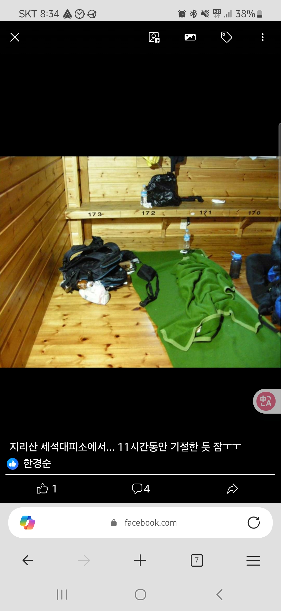

<!-- gid:20250605T221855 -->
[[TIP("이 노트에 대하여")]]
지리산 종주와 대피소 경험을 자연 치유와 인내, 극복의 언어로 엮어 보는 노트다. 산행이 몸과 마음의 회복 서사로 이어지는 감각이 담겨 있다.
[[/TIP]]

<!-- provenance:source:start -->
[[TIP("원본·최신본")]]
이 페이지는 한국어 검색과 읽기를 위한 WikiDocs 미러입니다. [원본·최신본은 가든](https://notes.junghanacs.com/notes/20250605T221855/)에 있습니다. 최신 수정 내용·백링크·태그·히스토리·댓글·출처 정보는 원본 가든에서 확인하세요.

- 작성: `2025-06-05T22:18:00+09:00`
- 최근 수정: `2025-06-05T00:00:00+09:00`
[[/TIP]]
<!-- provenance:source:end -->

[TOC]

## Related Notes

-   [0=60 자연](https://wikidocs.net/380911)
-   [산책](https://wikidocs.net/380617)

## History

-   [2025-06-05 Thu 22:18] 페이스북에서 지리산 종주 한 기억을 꺼내온다. 이런 싸이월드 같으니라구!

## DONE Screenshot_20250605_203415_Edge - 지리산 세석대피소

;# 

![[../images/Screenshot_20250605_203415_Edge.jpg|320]]

## 로그

### [|2025-06-05 Thu 22:18|](https://wikidocs.net/380418.md#h-2025-06-05/)

#### @user 지리산에 있는 대피소들을 정리해줘

@assistant 지리산에는 총 8개의 대피소가 있습니다. 이 중 경상남도에 속한 대피소는 **세석대피소**, **장터목대피소**, **로타리대피소**, **치밭목대피소** 이며, 전라남도에 속한 대피소는 **벽소령대피소**, **연하천대피소**, **피아골대피소**, **노고단대피소** 입니다[2][4].

-   **세석대피소**: 경상남도에 위치
-   **장터목대피소**: 경상남도에 위치
-   **로타리대피소**: 경상남도에 위치
-   **치밭목대피소**: 경상남도에 위치, 민간 운영
-   **벽소령대피소**: 전라남도에 위치
-   **연하천대피소**: 전라남도에 위치
-   **피아골대피소**: 전라남도에 위치, 민간 운영
-   **노고단대피소**: 전라남도에 위치

이 대피소들은 지리산 종주를 계획할 때 중요한 정보가 됩니다[4].

-   Citations: [1] <https://reservation.knps.or.kr/reservation/shelter/searchSimpleShelterReservation.do> [2] <https://blog.naver.com/sjyhere/220880622486> [3] <https://reservation.knps.or.kr/contents/S/serviceGuide.do?prdDvcd=S&parkId=B01&deptId=B011008> [4] <https://fmtview.com/47> [5] <http://www.ofof.net/doc/a14_02.htm>

#### @user 대한민국의 대표적인 산의 이름을 영어와 함께 정리해줘 10개만

@assistant 대한민국의 대표적인 산 10개를 영어와 함께 정리하면 다음과 같습니다:

1.  **지리산 (Jirisan)** - 제주도 외 가장 높은 산
2.  **한라산 (Hallasan)** - 제주도의 최고봉
3.  **설악산 (Seoraksan)** - 강원도에 위치한 명산
4.  **태백산 (Taebaeksan)** - 태백산맥의 주요 산
5.  **소백산 (Sobaeksan)** - 소백산맥의 주요 산
6.  **계룡산 (Gyeryongsan)** - 충청남도에 위치한 명산
7.  **오대산 (Odaesan)** - 강원도에 위치한 명산
8.  **팔공산 (Palgongsan)** - 대구 근처의 명산
9.  **북한산 (Bukhansan)** - 서울 근처의 명산
10. **금정산 (Geumjeongsan)** - 부산에 위치한 명산

이 산들은 한국의 자연과 문화적 중요성을 대표합니다.

-   Citations: [1] <https://en.wikipedia.org/wiki/List_of_mountains_in_Korea> [2] <https://www.korea.net/NewsFocus/HonoraryReporters/view?articleId=223572> [3] <https://plusplanner.kr/?q=YToxOntzOjEyOiJrZXl3b3JkX3R5cGUiO3M6MzoiYWxsIjt9&bmode=view&idx=14440021&t=board> [4] <https://peakvisor.com/adm/korea.html> [5] <http://koreaclimbs.blogspot.com/2007/09/highest-mountain-peaks-in-south-korea.html>

#### @user #지리산 #종주 #대피소 #자연 #치유 #인내 #극복 이에 대한 영어 태그를 정리해줘

@assistant 지리산 종주와 관련된 영어 태그를 정리하면 다음과 같습니다:

-   **#Jirisan**
-   **#JirisanRidgeHike**
-   **#Shelters**
-   **#Nature**
-   **#Healing**
-   **#Endurance**
-   **#Overcoming**

이 태그들은 지리산 종주와 관련된 자연, 치유, 인내, 극복의 주제를 잘 표현합니다.

-   Citations: [1] <https://runawayjuno.com/runaway-to/the-complete-guide-to-the-jirisan-ridge-hike-preparation-and-things-to-remember/> [2] <https://landcruisingadventure.com/hiking-in-jirisan-national-park/> [3] <https://english.visitkorea.or.kr/svc/whereToGo/locIntrdn/rgnContentsView.do?vcontsId=94282> [4] <https://www.hikegeoje.com/jirisan-national-park> [5] <https://www.1adventuretraveler.com/jirisan/>

#### @user
