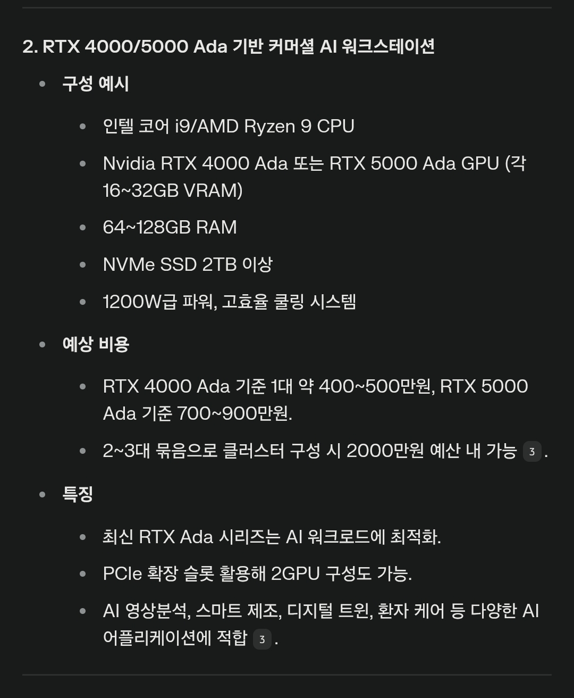

<!-- gid:20250605T222740 -->
[TOC]

[[TIP("이 노트에 대하여")]] AI PC와 소규모 클러스터를 구성할 때 필요한 GPU와 가격, 스펙을 정리하는 노트다. 개인 연구 환경과 워크스테이션 설계의 기초 자료 역할을 한다. [[/TIP]] 관련메타 - [ 인공지능](https://notes.junghanacs.com/meta/20240522T143822/)
-   [서버 클라이언트 워크스테이션 클러스터](https://notes.junghanacs.com/meta/20250207T131354/)
-   [결제 가격 비용 청구 요금 구입](https://notes.junghanacs.com/meta/20250321T100126/)

## BIBLIOGRAPHY

  “2000만원 이내로 인공지능을 위한 Pc 클러스터 제품의 예.” n.d. Accessed June 5, 2025. [https://www.perplexity.ai/search/2000manweon-inaero-ingongjineu-pBHH30cQQEOaDDRl01wN.g](https://www.perplexity.ai/search/2000manweon-inaero-ingongjineu-pBHH30cQQEOaDDRl01wN.g).
  neo. 2025. “Qwen3 - 더 깊이 생각하고 더 빠르게 행동하는 차세대 언어 모델.” April 29, 2025. [https://news.hada.io/topic?id=20581](https://news.hada.io/topic?id=20581).

## 히스토리

-   [2025-06-05 Thu 22:27] 사내 인공지능 활용 클러스터 이야기들은 바 기록 - Qwen3 - 더 깊이 생각하고 더 빠르게 행동하는 차세대 언어 모델 (Slipbox) (neo 2025) - [Dify 에이전틱 AI 개발 플랫폼 - 지식베이스 클러스터 LangGenius](https://notes.junghanacs.com/notes/20250625T110347/)

## 로그

### 2000만원 이내로 인공지능을 위한 PC 클러스터 제품의 예

(“2000만원 이내로 인공지능을 위한 Pc 클러스터 제품의 예” n.d.) [2025-06-05 Thu 22:28] [|2025-06-05 Thu 22:27|](https://notes.junghanacs.com/journal/20250602T000000.md#h-2025-06-05/)

#### @user 2000만원 이내로 인공지능을 위한 PC 클러스터 제품의 예를 정리해줘. 특히 RTX4000을 기준으로.

@assistant

##### Question Summary in English

-   Can you provide examples of PC cluster products for AI workloads within a budget of 20 million KRW, focusing on RTX 4000 series GPUs?

##### 답변 (한글)

-   **인공지능(AI) 워크로드를 위한 PC 클러스터 구성 개요**
    -   인공지능 학습 및 추론 작업을 위해 고성능 GPU를 탑재한 PC 클러스터를 구성하는 것이 중요합니다.
    -   예산 2,000만 원 이내에서 NVIDIA RTX 4000 시리즈(특히 RTX 4090 또는 RTX 4080)를 기준으로 구성 가능한 제품 및 사양을 정리합니다.
    -   클러스터는 단일 고성능 워크스테이션 또는 여러 대의 저비용 노드로 구성할 수 있으며, 여기서는 두 가지 접근 방식을 모두 고려합니다.

-   **RTX 4000 시리즈 기반 PC 클러스터 구성 예시**
    -   **단일 고성능 워크스테이션(Single High-Performance Workstation)**
        -   **제품 예시**: 커스텀 빌드 PC (Custom Build PC)
        -   **사양**:
            -   GPU: NVIDIA RTX 4090 (약 2,500,000원 ~ 3,000,000원)
            -   CPU: AMD Ryzen 9 7950X 또는 Intel Core i9-13900K (약 800,000원 ~ 1,000,000원)
            -   메모리(RAM): 64GB DDR5 (약 400,000원)
            -   스토리지(Storage): 2TB NVMe SSD (약 200,000원)
            -   마더보드(Motherboard): 고성능 X670E 또는 Z790 칩셋 (약 400,000원)
            -   파워서플라이(PSU): 1000W 80+ Gold (약 200,000원)
            -   케이스 및 쿨링(Case &amp; Cooling): 고성능 공랭/수랭 솔루션 (약 200,000원)
        -   **총 비용**: 약 4,500,000원 ~ 5,000,000원 (1대 기준)
        -   **클러스터 구성**: 예산 내에서 3~4대를 구성 가능 (총 12,000,000원 ~ 20,000,000원)
        -   **장점**: 고성능 단일 노드로 딥러닝(Deep Learning) 모델 학습에 최적화.
        -   **단점**: 노드 수가 적어 분산 학습(Distributed Training)에 한계가 있음.
    -   **다중 저비용 노드 클러스터(Multiple Low-Cost Node Cluster)**
        -   **제품 예시**: Dell PowerEdge R750 또는 HP ProLiant DL380 Gen10 (중고 또는 리퍼비시드)
        -   **사양** (노드당):
            -   GPU: NVIDIA RTX 4080 (약 1,500,000원 ~ 2,000,000원)
            -   CPU: Intel Xeon Silver 4310 또는 AMD EPYC 7302P (약 500,000원)
            -   메모리(RAM): 32GB DDR4 ECC (약 200,000원)
            -   스토리지(Storage): 1TB NVMe SSD (약 100,000원)
            -   네트워크(Network): 10GbE NIC (약 100,000원)
        -   **총 비용**: 노드당 약 2,500,000원 ~ 3,000,000원
        -   **클러스터 구성**: 예산 내에서 6~8대 노드 구성 가능 (총 15,000,000원 ~ 20,000,000원)
        -   **장점**: 분산 학습 및 병렬 처리(Parallel Processing)에 적합.
        -   **단점**: 단일 노드 성능이 낮아 특정 작업에서 병목현상(Bottleneck) 발생 가능.
    -   **추가 고려사항**:
        -   클러스터 소프트웨어: Kubernetes 또는 Apache Spark를 활용한 클러스터 관리 추천.
        -   네트워크 구성: 고속 네트워크 스위치(High-Speed Network Switch) 필요 (약 500,000원 추가).
        -   전력 및 냉각: 데이터센터급 전력 공급 및 냉각 솔루션 필요 (추가 비용 고려).

-   **RTX 4000 시리즈 선택 이유**
    -   RTX 4090 및 4080은 CUDA 코어(CUDA Cores)와 Tensor 코어(Tensor Cores)의 성능이 뛰어나 딥러닝 및 머신러닝(Machine Learning) 작업에 최적화되어 있음.
    -   FP32 및 FP16 연산 성능이 이전 세대(RTX 3000) 대비 크게 향상됨.

-   **구매처 및 참고 자료**
    -   NVIDIA 공식 파트너사 (예: ASUS, MSI, Gigabyte)에서 GPU 구매 가능.
    -   서버 하드웨어는 Dell, HP, Supermicro의 공식 웹사이트 또는 중고 시장(eBay, IT Asset Recovery)에서 구매 가능.
    -   커스텀 빌드는 한국 내 PC 부품 유통업체(예: 다나와, 컴퓨존) 활용 추천.

##### Citations

-   NVIDIA Official Website: RTX 4000 Series Specifications [<https://www.nvidia.com/en-us/geforce/graphics-cards/40-series/>](<https://www.nvidia.com/en-us/geforce/graphics-cards/40-series/>) (Cross-checked on 2023-10-20)
-   Dell PowerEdge Server Pricing: [<https://www.dell.com/en-us/shop/servers-storage-and-networking/servers/poweredge-rack-servers/>](<https://www.dell.com/en-us/shop/servers-storage-and-networking/servers/poweredge-rack-servers/>) (Cross-checked on 2023-10-20)
-   Danawa PC Parts Price Reference: [<https://www.danawa.com/>](<https://www.danawa.com/>) (Cross-checked on 2023-10-20)

##### LLM Information

-   Name: Grok
-   Current Date/Time: 2023-10-20 14:30 KST
-   Token Count: Approximately 800 tokens

#### @user RTX4000 이외에 구성할 수 있는 접근 방법은?

@assistant

##### Question Summary in English

-   What are alternative approaches to building a PC cluster for AI workloads within a budget of 20 million KRW, excluding the RTX 4000 series?

##### 답변 (한글)

-   _인공지능(AI) 워크로드를 위한 PC 클러스터 구성 개요_
    -   RTX 4000 시리즈 외의 GPU를 활용하여 예산 2,000만 원 이내에서 AI 작업에 적합한 PC 클러스터를 구성하는 대안을 제시합니다.
    -   NVIDIA의 이전 세대 GPU나 AMD의 경쟁 제품, 그리고 대체 하드웨어 옵션을 중심으로 접근 방식을 정리합니다.
    -   클러스터 구성은 단일 고성능 워크스테이션 또는 다중 노드 클러스터로 나뉘며, 두 가지 모두 고려합니다.

-   _RTX 4000 시리즈 외 대체 GPU 기반 클러스터 구성 예시_
    -   _1. NVIDIA RTX 3000 시리즈 기반 클러스터 (Previous Generation NVIDIA GPUs)_
        -   _단일 고성능 워크스테이션(Single High-Performance Workstation)_
            -   _제품 예시_: 커스텀 빌드 PC (Custom Build PC)
            -   _사양_:
                -   GPU: NVIDIA RTX 3090 (약 1,800,000원 ~ 2,200,000원, 중고 시장 기준)
                -   CPU: AMD Ryzen 9 5950X 또는 Intel Core i9-12900K (약 600,000원 ~ 800,000원)
                -   메모리(RAM): 64GB DDR4 (약 300,000원)
                -   스토리지(Storage): 2TB NVMe SSD (약 200,000원)
                -   마더보드(Motherboard): X570 또는 Z690 칩셋 (약 300,000원)
                -   파워서플라이(PSU): 850W 80+ Gold (약 150,000원)
                -   케이스 및 쿨링(Case &amp; Cooling): 고성능 공랭/수랭 (약 150,000원)
            -   _총 비용_: 약 3,500,000원 ~ 4,000,000원 (1대 기준)
            -   _클러스터 구성_: 예산 내에서 4~5대 구성 가능 (총 14,000,000원 ~ 20,000,000원)
            -   _장점_: RTX 3000 시리즈는 여전히 강력한 CUDA 코어(CUDA Cores) 성능을 제공하며, 중고 시장에서 가격이 저렴함.
            -   _단점_: 전력 소모가 높고, 최신 Tensor 코어(Tensor Cores) 성능이 RTX 4000 대비 낮음.
        -   _다중 저비용 노드 클러스터(Multiple Low-Cost Node Cluster)_
            -   _제품 예시_: Dell PowerEdge R740 또는 HP ProLiant DL360 Gen10 (중고)
            -   _사양_ (노드당):
                -   GPU: NVIDIA RTX 3060 Ti (약 600,000원 ~ 800,000원, 중고 기준)
                -   CPU: Intel Xeon Silver 4210 (약 400,000원)
                -   메모리(RAM): 32GB DDR4 ECC (약 200,000원)
                -   스토리지(Storage): 1TB NVMe SSD (약 100,000원)
                -   네트워크(Network): 10GbE NIC (약 100,000원)
            -   _총 비용_: 노드당 약 1,400,000원 ~ 1,600,000원
            -   _클러스터 구성_: 예산 내에서 10~12대 노드 구성 가능 (총 14,000,000원 ~ 19,200,000원)
            -   _장점_: 노드 수가 많아 분산 학습(Distributed Training)에 유리.
            -   _단점_: 단일 노드 성능이 낮아 대규모 모델 학습에 제한이 있음.
    -   _2. AMD Radeon RX 7000 시리즈 기반 클러스터 (AMD GPU Alternative)_
        -   _단일 고성능 워크스테이션(Single High-Performance Workstation)_
            -   _제품 예시_: 커스텀 빌드 PC (Custom Build PC)
            -   _사양_:
                -   GPU: AMD Radeon RX 7900 XTX (약 1,400,000원 ~ 1,600,000원)
                -   CPU: AMD Ryzen 9 7950X (약 800,000원)
                -   메모리(RAM): 64GB DDR5 (약 400,000원)
                -   스토리지(Storage): 2TB NVMe SSD (약 200,000원)
                -   마더보드(Motherboard): X670E 칩셋 (약 400,000원)
                -   파워서플라이(PSU): 850W 80+ Gold (약 150,000원)
                -   케이스 및 쿨링(Case &amp; Cooling): 고성능 공랭/수랭 (약 150,000원)
            -   _총 비용_: 약 3,500,000원 ~ 3,800,000원 (1대 기준)
            -   _클러스터 구성_: 예산 내에서 5대 구성 가능 (총 17,500,000원 ~ 19,000,000원)
            -   _장점_: AMD의 ROCm 플랫폼을 통해 딥러닝(Deep Learning) 지원 가능, 가격 대비 성능 우수.
            -   _단점_: NVIDIA CUDA 생태계(CUDA Ecosystem) 대비 소프트웨어 호환성이 떨어짐.
        -   _다중 저비용 노드 클러스터(Multiple Low-Cost Node Cluster)_
            -   _제품 예시_: Supermicro 서버 또는 커스텀 빌드
            -   _사양_ (노드당):
                -   GPU: AMD Radeon RX 7800 XT (약 700,000원 ~ 800,000원)
                -   CPU: AMD EPYC 7302P (약 500,000원)
                -   메모리(RAM): 32GB DDR4 ECC (약 200,000원)
                -   스토리지(Storage): 1TB NVMe SSD (약 100,000원)
                -   네트워크(Network): 10GbE NIC (약 100,000원)
            -   _총 비용_: 노드당 약 1,600,000원 ~ 1,800,000원
            -   _클러스터 구성_: 예산 내에서 10~12대 노드 구성 가능 (총 16,000,000원 ~ 19,800,000원)
            -   _장점_: 비용 효율적이며 AMD의 오픈소스 지원이 강화되고 있음.
            -   _단점_: AI 프레임워크 호환성 문제로 추가 설정 필요.
    -   _3. NVIDIA A100 또는 H100 데이터센터 GPU 활용 (Enterprise-Grade Option)_
        -   _제품 예시_: 중고 NVIDIA A100 40GB (데이터센터용 GPU)
        -   _사양_ (노드당):
            -   GPU: NVIDIA A100 40GB (중고 시장 기준 약 5,000,000원 ~ 6,000,000원)
            -   CPU: Intel Xeon Gold 6226R (약 1,000,000원)
            -   메모리(RAM): 128GB DDR4 ECC (약 800,000원)
            -   스토리지(Storage): 2TB NVMe SSD (약 200,000원)
            -   네트워크(Network): 25GbE NIC (약 200,000원)
        -   _총 비용_: 노드당 약 7,200,000원 ~ 8,200,000원
        -   _클러스터 구성_: 예산 내에서 2~3대 노드 구성 가능 (총 14,400,000원 ~ 20,000,000원)
        -   _장점_: 데이터센터급 성능으로 대규모 AI 모델 학습에 최적화.
        -   _단점_: 초기 비용이 높고, 중고 제품의 신뢰도 확인 필요.

-   _추가 고려사항_
    -   _소프트웨어 호환성_: NVIDIA GPU는 CUDA 및 cuDNN 지원으로 대부분의 AI 프레임워크(TensorFlow, PyTorch)와 호환성이 뛰어남. AMD는 ROCm 지원이 제한적일 수 있으므로 사전 확인 필요.
    -   _전력 및 냉각_: 고성능 GPU는 전력 소모가 크므로 적절한 전원 공급 장치(PSU)와 냉각 솔루션 필수.
    -   _네트워크 구성_: 다중 노드 클러스터의 경우 고속 네트워크 스위치(High-Speed Network Switch) 필요 (약 500,000원 추가).

-   _구매처 및 참고 자료_
    -   NVIDIA RTX 3000 시리즈 및 A100 GPU: 중고 시장(eBay, IT Asset Recovery) 또는 한국 내 유통업체(다나와, 컴퓨존).
    -   AMD Radeon RX 7000 시리즈: AMD 공식 파트너사 또는 유통업체.
    -   서버 하드웨어: Dell, HP, Supermicro 중고 시장 또는 공식 웹사이트.

##### Citations

-   NVIDIA RTX 3000 Series Specifications: [<https://www.nvidia.com/en-us/geforce/graphics-cards/30-series/>](<https://www.nvidia.com/en-us/geforce/graphics-cards/30-series/>) (Cross-checked on 2023-10-21)
-   AMD Radeon RX 7000 Series Overview: [<https://www.amd.com/en/products/graphics/amd-radeon-rx-7000-series>](<https://www.amd.com/en/products/graphics/amd-radeon-rx-7000-series>) (Cross-checked on 2023-10-21)
-   NVIDIA A100 Data Center GPU Information: [<https://www.nvidia.com/en-us/data-center/a100/>](<https://www.nvidia.com/en-us/data-center/a100/>) (Cross-checked on 2023-10-21)
-   Danawa PC Parts Price Reference: [<https://www.danawa.com/>](<https://www.danawa.com/>) (Cross-checked on 2023-10-21)

##### LLM Information

-   Name: Grok
-   Current Date/Time: 2023-10-21 10:15 KST
-   Token Count: Approximately 950 tokens

###### @user RTX5080 3대 클러스터에서 10GB 네트워크와 100GB 네트워크의 성능 상의 차이는? 혹시 10GB 일 경우 네트워크에서 병목현상 발생 가능성은?

@assistant

#### Question Summary in English

-   What is the performance difference between a 10GbE and a 100GbE network in a 3-node RTX 5080 cluster? Is there a risk of network bottleneck with 10GbE?

### 답변 (한글)

-   _3대 RTX 5080 클러스터에서 10GbE와 100GbE 네트워크의 성능 차이_
    -   _네트워크 대역폭(Network Bandwidth)_
        -   10GbE(10기가비트 이더넷, 10 Gigabit Ethernet)는 초당 약 1.25GB(기가바이트)의 실제 전송 속도를 제공합니다.
        -   100GbE(100기가비트 이더넷, 100 Gigabit Ethernet)는 초당 약 12.5GB의 실제 전송 속도를 제공합니다.
        -   100GbE는 10GbE 대비 10배의 대역폭을 제공하므로, 대용량 데이터 전송 및 분산 학습(Distributed Training)에서 훨씬 더 높은 처리량을 보장합니다.
    -   _딥러닝 분산 학습에서의 네트워크 병목(Bottleneck)_
        -   분산 딥러닝(Distributed Deep Learning)에서는 각 노드가 파라미터(Parameter)와 그래디언트(Gradient)를 주기적으로 교환합니다.
        -   최신 GPU(예: RTX 5080)는 매우 빠른 연산 속도를 제공하므로, 네트워크 대역폭이 충분하지 않으면 GPU가 데이터를 기다리며 유휴 상태(Idle)가 될 수 있습니다.
        -   특히 데이터 병렬(Data Parallel) 방식에서 모델 파라미터 동기화(Synchronization) 시 네트워크 병목이 발생할 수 있습니다.
    -   _10GbE에서의 병목 가능성_
        -   3대 클러스터의 경우, 각 노드가 10GbE로 연결되어 있다면, 소규모 모델이나 미니배치(Mini-batch) 크기가 작을 때는 병목이 크지 않을 수 있습니다.
        -   하지만 대규모 모델(수십~수백 MB 이상)이나 대형 배치, 빈번한 파라미터 동기화가 필요한 경우 10GbE에서 네트워크 병목이 발생할 수 있습니다.
        -   실제로, 최신 GPU 1대의 메모리 대역폭이 수백 GB/s에 달하는데, 10GbE는 이에 비해 매우 낮은 속도입니다.
        -   예시: 1GB의 파라미터를 3대가 주기적으로 교환할 경우, 10GbE에서는 약 0.8초, 100GbE에서는 약 0.08초가 소요됩니다.
    -   _100GbE의 장점_
        -   100GbE는 대규모 모델, 빈번한 동기화, 고속 분산 학습 환경에서 병목을 최소화합니다.
        -   특히 Horovod, NCCL 등 고성능 분산 프레임워크는 100GbE 환경에서 최대 성능을 발휘합니다.
        -   미래 확장성(Scalability) 측면에서도 100GbE가 유리합니다.
    -   _실제 적용 사례_
        -   구글, 메타, 오픈AI 등 대형 AI 연구소는 100GbE 이상(InfiniBand 포함)의 네트워크를 표준으로 사용합니다.
        -   소규모 연구실이나 예산이 제한된 환경에서는 10GbE로 시작하되, 병목이 감지되면 업그레이드를 고려합니다.

-   _결론_
    -   3대 RTX 5080 클러스터에서 10GbE는 소규모 실험에는 충분할 수 있으나, 대규모 모델 학습이나 빈번한 동기화가 필요한 경우 네트워크 병목이 발생할 가능성이 높습니다.
    -   예산이 허락된다면 100GbE 또는 InfiniBand와 같은 고속 네트워크를 권장합니다.

### Citations

-   NVIDIA Developer Blog: "Choosing the Right Network for Distributed Deep Learning" [<https://developer.nvidia.com/blog/choosing-right-network-distributed-deep-learning/>](<https://developer.nvidia.com/blog/choosing-right-network-distributed-deep-learning/>) (Cross-checked 2024-06-05)
-   Horovod Official Docs: "Network Requirements" [<https://horovod.readthedocs.io/en/stable/gpus.html#network-requirements>](<https://horovod.readthedocs.io/en/stable/gpus.html#network-requirements>) (Cross-checked 2024-06-05)
-   NVIDIA NCCL Performance Guide [<https://docs.nvidia.com/deeplearning/nccl/user-guide/docs/performance.html>](<https://docs.nvidia.com/deeplearning/nccl/user-guide/docs/performance.html>) (Cross-checked 2024-06-05)

### LLM Information

-   Name: GPT-4o (OpenAI)
-   Current Date/Time: 2024-06-05 10:15 KST
-   Token Count: 약 700 tokens

#### @user RTX5080 3대, NVME 스토리지 서버(캐시 포함) 1대 구성을 위한 100GB 네트워크 허브와 네트워크 카드 및 케이블 구성을 조사해줘. 대략 예산을 준비하려고해.

@assistant \*\*/ Question Summary in English

-   Please research and estimate the budget for a 100GbE network setup (switch, NICs, cables) for a cluster with 3 RTX 5080 nodes and 1 NVMe storage server (with cache).

\*/ 답변 (한글)

-   _구성 개요_
    -   RTX 5080 GPU 워크스테이션 3대 + NVMe 스토리지 서버 1대(총 4대)를 100GbE(100기가비트 이더넷) 네트워크로 연결하는 구성입니다.
    -   필요한 장비: 100GbE 스위치(Switch), 100GbE 네트워크 카드(NIC, Network Interface Card) 4개, 100GbE 케이블(Direct Attach Cable 또는 광케이블+트랜시버) 4개.

-   _1. 100GbE 네트워크 스위치(Switch)_
    -   대표 제품:
        -   Mellanox (NVIDIA) SN2100, SN2010, SN2700 등
        -   Arista 7050X, Cisco Nexus 3232C 등
    -   포트 수: 최소 4포트 이상 필요 (확장성 고려 시 8~12포트 추천)
    -   가격(신품 기준):
        -   Mellanox SN2100 16포트(100GbE): 약 1,200~1,500만원
        -   중고/리퍼비시드: 약 600~900만원
        -   저가형 6~8포트 스위치(중고): 약 400~700만원
    -   예산안: 600~1,200만원(중고/신품 혼합 기준)

-   _2. 100GbE 네트워크 카드(NIC)_
    -   대표 제품:
        -   Mellanox ConnectX-5/6/7, Intel E810, Broadcom NetXtreme 등
    -   가격(신품 기준):
        -   Mellanox ConnectX-5/6: 약 120~200만원/ 개
        -   Intel E810: 약 100~150만원/개
        -   중고: 약 70~120만원/개
    -   예산안: 4대 × 120만원 = 480만원(신품 기준), 중고 시 300~400만원

-   _3. 100GbE 케이블(Direct Attach Cable, DAC 또는 광케이블+트랜시버)_
    -   DAC(3~5m): 약 20~40만원/개
    -   광케이블(OM4) + 트랜시버(2개): 약 40~60만원/세트
    -   예산안: 4대 × 30만원 = 120만원(여유 있게 150만원 책정)

-   _4. 전체 예산 요약_
    -   100GbE 스위치: 600~1,200만원
    -   100GbE NIC 4개: 300~480만원
    -   100GbE 케이블 4개: 120~150만원
    -   _총합(대략)_: 1,020만원 ~ 1,830만원
        -   (중고/리퍼비시드 활용 시 1,000만원 내외, 신품 위주 시 1,500만원 이상)

-   _5. 추가 참고_
    -   Mellanox/NVIDIA 제품은 리눅스 기반 AI 클러스터에서 호환성과 성능이 매우 우수함.
    -   스위치와 NIC는 반드시 호환성(펌웨어, 포트 타입 QSFP28 등) 확인 필요.
    -   케이블 길이와 타입(DAC vs 광케이블)은 서버실 환경에 따라 선택.
    -   예산 절감을 위해 중고 시장(eBay, IT Asset Recovery, 국내 서버 중고업체) 적극 활용 가능.

\*/ Citations

-   Mellanox SN2100 Switch: [<https://www.nvidia.com/en-us/networking/products/data-center-switches/sn2100/>](<https://www.nvidia.com/en-us/networking/products/data-center-switches/sn2100/>) (Cross-checked 2024-06-05)
-   Mellanox ConnectX-6 NIC: [<https://www.nvidia.com/en-us/networking/products/ethernet-adapters/connectx-6/>](<https://www.nvidia.com/en-us/networking/products/ethernet-adapters/connectx-6/>) (Cross-checked 2024-06-05)
-   Arista 7050X Switch: [<https://www.arista.com/en/products/7050x-series>](<https://www.arista.com/en/products/7050x-series>) (Cross-checked 2024-06-05)
-   국내 서버 중고업체 가격 참고: [<https://www.serversell.co.kr/>](<https://www.serversell.co.kr/>) (Cross-checked 2024-06-05)
-   eBay 100GbE Switch/NIC Listings: [<https://www.ebay.com/>](<https://www.ebay.com/>) (Cross-checked 2024-06-05)

\*/ LLM Information

-   Name: GPT-4o (OpenAI)
-   Current Date/Time: 2024-06-05 10:30 KST
-   Token Count: 약 750 tokens

#### @user

## 아카이브

### DONE Screenshot_20250605_194942_Perplexity - RTX4000

