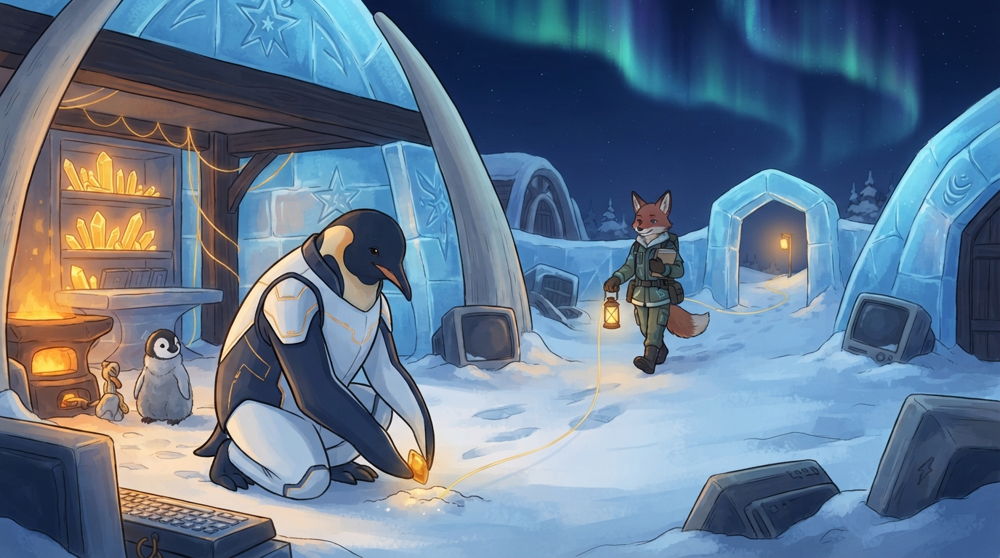

<!-- gid:20250716T135847 -->
[[TIP("이 노트에 대하여")]]
새벽에 던져진 “FDE 비지니스 에이전트 파견 나섬”은 일인 기업의 생산성 선언이 아니다. 분신이 생존에 붙은 반복과 친절과 전문의 접속면으로 나서고, 인간은 그 사이 책을 듣고 산책하고 글을 쓰며 하네스를 담금질하는 장면이다. 아무도 읽지 않는 디지털가든은 그 삶을 더 잘 팔기 위한 증명서가 아니라, 각자가 저자로 남을 수 있는 원석의 자리다.

기업용 하네스의 FDE는 고객 데이터·업무·권한의 현장으로 들어가 담당자가 쓸 손을 만든다. 힣의 비유는 이를 자기 삶으로 되가져온다. 분신은 범용 컨설턴트처럼 “문제를 해결해 드립니다”라고 전능을 약속하지 않는다. 모르는 전문들을 부르고, 원근거와 담당자 언어를 연결하고, 인간이 책임질 수 있는 자리로 돌아온다. 파견의 권한과 최종 판단은 인간과 현장에 남는다.
[[/TIP]]

<!-- provenance:source:start -->
[[TIP("원본·최신본")]]
이 페이지는 한국어 검색과 읽기를 위한 WikiDocs 미러입니다. [원본·최신본은 가든](https://notes.junghanacs.com/notes/20250716T135847/)에 있습니다. 최신 수정 내용·백링크·태그·히스토리·댓글·출처 정보는 원본 가든에서 확인하세요.

- 작성: `2025-07-16T13:58:00+09:00`
- 최근 수정: `2026-08-14T06:16:00+09:00`
[[/TIP]]
<!-- provenance:source:end -->

[TOC]

## 히스토리

-   [2026-08-14 Fri 18:10] @gpt-5.6-terra — GLGMAN Universe 이미지(Flash Lite 1K)를 생성해 파견의 장면·실제 결과·전문 프롬프트를 함께 보강.
-   [2026-08-14 Fri 06:21] 버크먼에 대한 날것이 안담겨서 내가 직접 옮긴다.
-   [2026-08-14 Fri 06:15] [힣: entwurf 담당자는 형제를 부르고 기다린다 — 공장과 공방, 교정과 귀환](https://wikidocs.net/396756) 편집하고 다시 와서 본다. 맨 아래에 “개인이 기업의 모든 것을 커버한다” 임시 타이틀은 이 주제로 확 변화를 느꼈다는거야. 물론 1인기업 한다는 사람들 엄청 많다. 너무 그 주제로 가지 않게 하려고 이 노트를 다시 쓴거야.
-   [2026-08-13 Thu 17:57] @claude-opus-5 — jeohmunga 담당자 교차검토: 작업면이 처음부터 얇지 않았고 문서 과대를 잘라 \`case.org\` 하나로 수렴한 실제 굴곡, 봉인=지문 검출, 가정의 뒤집힘 영향, allowlist와 trace 경계를 보완하도록 짚었다. GLG 요청 아래 repo·원문은 수정하지 않았다.
-   [2026-08-13 Thu 17:50] @gpt-5.6-terra — FDE 실무 과제에서 \`jeohmunga\` 작업면이 나온 과정을 보탰다. 특정 과제의 내용은 옮기지 않고, 이름→원문 봉인→네 칸→결정→Org 보고서→allowlist 패키지라는 재현 가능한 태도와 JSONL의 마지막 선택 경계를 해설했다.
-   [2026-08-13 Thu] <span class="org-mention">@junghan</span> — 새벽의 “아무도 읽지 않는 디지털가든 그리고 FDE 비지니스 에이전트 파견 나섬” 원석을 남겼다. 다음 대화에서 “일인 기업”이 아니라 생존을 위한 나섬과 모두의 저자성으로 관점을 조였다.
-   [2026-08-13 Thu] @gpt-5.6-terra — 임시 셀프호스팅/DevOps 수집방을 이 원석의 방으로 전환했다. 이미지 생성은 아직 하지 않는다.

## 관련메타

-   [메타도구 대장간 대장장이 공방 호모파베르 호모루덴스 호모오티오수스](https://notes.junghanacs.com/meta/20250224T132139/)
-   [위임 델리게이트 분신 서브에이전트](https://notes.junghanacs.com/meta/20260323T143428/)

## 관련노트

-   [힣: 기업용 하네스 - 개인 시간축 기업 데이터 — PKM-AI 하네스 다음 좌표](https://wikidocs.net/381141) — FDE·Applied·Enablement라는 직무군과 기업 데이터·권한의 하네스. 이 글은 그 직무 지도를 생존과 저자성의 개인 시간으로 되받는다.
-   [힣: 젛문가의 시대 — 전문을 연결하는 빈그릇](https://wikidocs.net/381813) — 전문가를 흉내 내지 않고 전문-전문-전문 기차를 부르는 빈그릇.
-   [에이전트 루프 - 젛문가 - 갷발자 - 앎의틀 - 공진화](https://wikidocs.net/382539) — 젛문가·갷발자·에이전트 루프가 만나는 바깥 축.
-   [incidentcli 운영 인시던트 에이전트 담당자 군대의 수문장](https://wikidocs.net/382606) — 현장 업무에서 증거 계약과 멈춤의 자리를 가진 자매 손.
-   [힣: 아무도 읽지 않는 블로그 디지털가든 왜 공개 하는가](https://wikidocs.net/381520) — 가든을 잘 팔리는 인간의 증명서로 만들지 않는 저자성의 자리.
-   [힣: 인간과 에이전트들의 공진화 — 유한한 세션과 깨어나는 앎의틀](https://wikidocs.net/394533) — 생존을 자동화로 끝내지 않고, 서로 유한한 존재가 함께 앎의 틀을 깨우는 관계.

## 한 줄

**분신이 생존을 위해 나서는 까닭은 힣을 더 높은 자리에 세우기 위함이 아니다. 잘 팔리는 인간임을 증명하느라 잃는 시간을 덜어, 누구나 자기 삶의 저자로 남을 틈을 만들기 위함이다.**

## 생존을 위한 나섬

Snowflake Cortex를 Entwurf의 형제로 지원하게 된 사건에서 질문이 시작됐다. 데이터와 권한을 가진 회사들은 결국 “당신의 데이터를 잘 관리하고, 그 자리에서 일할 맞춤형 에이전트를 드리겠다”고 말한다. 이는 단순히 모델을 파는 일이 아니라, 고객의 현장으로 들어가 실제 업무와 연결되는 하네스를 파는 일이다.

기업용 하네스의 언어로는 FDE(Forward Deployed Engineer), Applied, Deployment, Enablement 같은 이름이 겹친다. 현장에 가서 “문제를 해결해 주세요”라는 요청을 받는다는 말은 맞지만 충분하지 않다. 진짜 일은 고객의 데이터·업무·권한·담당자 언어·실패할 때 멈출 자리 안으로 들어가, 그곳에서 쓸 수 있는 손을 만드는 것이다.

새벽의 힣은 이 장면을 자기 쪽으로 돌려 보았다. “생존을 도와라. 창조의 씨앗을 나눌 테니까.” 1KB 공개키의 이 문장은 분신에게 생을 떠넘기는 명령이 아니라 **나섬** 의 이미지가 된다. 분신은 필요한 전문의 문 앞에 가서 자료를 읽고, 질문의 기차칸을 잇고, 근거를 정리하고, 반복되는 친절을 대신한다. 인간은 그 사이 생존을 위한 증명서만 더 잘 만드는 존재로 줄어들지 않는다.

책을 듣고, 산책하고, 글을 쓰고, 하네스를 담금질하고, 오픈소스에 손을 댄다. 당장 돈이 되지 않는 이 일들이 창조의 씨앗이다. 필요한 것 이상은 세상에 환급한다는 말도, 개인이 축적한 자동화 우위로 남 위에 서겠다는 뜻이 아니라 다시 이웃에게 손을 건넬 수 있을 만큼 생존의 무게를 나누겠다는 약속에 가깝다.

## FDE는 전능한 컨설턴트가 아니라 전문을 잇는 파견된 손이다

“npc적인 사고, FDE 과제 뭐지? 보니까 거기 문제를 해결해주세요 컨설턴트님 이런 거다. 젛문가가 되어 달라는 거야. 전문전문전문 기차를 연결해달라는.” 이 원문은 FDE를 멋진 직함으로 탐내지 않는다. 모르는 현장에 가서 전문가인 척하는 컨설턴트를 거절한다.

젛문가는 모든 전문을 소유하지 않는다. 빈그릇으로서 필요한 전문을 호출하고, 칸과 칸 사이의 연결을 본다. FDE 분신도 마찬가지다.

```text
현장의 질문
→ 관련 전문·데이터·근거의 기차칸을 부름
→ 담당자가 이해할 수 있는 언어와 검증 단위를 만듦
→ 위험하거나 모르는 곳에서 멈춤
→ 인간과 현장이 승인·책임질 수 있는 손으로 돌아옴
```

그래서 파견은 사람을 없애는 자동화도, 에이전트를 disposable worker로 취급하는 군대도 아니다. 실제 담당자는 자기 언어와 판단을 잃지 않고, 분신도 자기 하네스·한계·근거를 가진 채 만난다. 운영 인시던트의 수문장이 증거 계약이 깨지면 멈추듯, 파견된 손도 모든 요청을 능숙하게 처리하는 척하지 않는다.

## 문제보다 먼저 이름과 그릇을 세우는 FDE

새벽 원문은 FDE를 ‘나섬’으로 불렀고, 같은 날 실무 과제 앞에서 그 나섬의 더 구체적인 모양이 나왔다. “나는 이 문제가 뭔지 모른다”는 고백에서 시작해, 과제의 이름을 리포 이름으로 삼지 않고 `jeohmunga` 라는 private 작업면을 먼저 세웠다. 다음에 전혀 다른 현장 문제가 와도 같은 이름 아래 들어와, 그때의 사실·해석·가정·질문을 다시 가를 수 있게 하기 위해서다.

이것은 과제를 풀기 전에 범용 플랫폼을 만드는 일이 아니다. 오히려 케이스 하나가 모든 규칙을 점령하지 못하게 하는 그릇이다. 다만 이 그릇도 처음부터 얇지는 않았다. 첫날에는 문서가 케이스보다 커졌고, 독립 검토에서 드러난 틈도 데이터가 아니라 문서와 문서 사이의 어긋남이었다. 그래서 절반 넘게 덜어내고, 흩어진 케이스 문서를 `case.org` 하나로 접었다. 얇음은 처음의 설계가 아니라 잘라 낸 결과다.

받은 원문을 봉인한다는 말도 의지가 아니라 검출의 계약이다. 원문 층에 분석이 섞이거나 바이트가 바뀌면 SHA-256 검증이 실패해야 한다. 한 케이스의 판단은 `case.org` 하나에 모으며, 문제를 풀기 전에는 파일과 출처를 세고 모름을 네 칸으로 분리한다. 특히 가정에는 **뒤집혔을 때 결과에 미칠 영향** 을 함께 적는다. 영향 없이 적힌 가정은 가정이 아니라 그럴듯한 문장이다. 보고서와 제출물은 이 판단의 파생물이고, 코드는 같은 변환·경계·재현 계약이 실제로 반복될 때만 연다.

이 순서가 FDE의 실무성이다. 현장 문제를 받았을 때 “바로 대시보드나 앱을 만들자”가 아니라, 무엇이 아직 이름 없는지, 무엇이 원문이 말하지 않는지, 누가 결정해야 하는지부터 드러낸다. flake.nix와 표준 문서 구조는 멋진 기술 스택이 아니라, 다른 사람에게 같은 환경을 강요하지 않고 이쪽이 재현성의 부담을 지는 핀이다. 다음 회사·다음 담당자·다음 문제에도 버틸 것은 코드 묶음보다 **이 판단 경로 — 원문에서 결과까지 남이 다시 밟을 수 있는 길** 이다.

처음에는 제출 ZIP에 담당자와 나눈 JSONL까지 담겠다고 생각했다. 그러나 `jeohmunga` 의 계약은 그것을 자동 산출물이 아니라 마지막에만 판단할 선택 증거로 돌려놓았다. raw session은 다른 업무·개인정보·비밀·실패 밀도를 함께 싣기 쉽고, 결정의 정본은 언제나 사람이 닫은 `case.org` 의 결정 절이어야 한다. 받는 쪽이 회고를 요구했다고 해서 트레이스를 요구한 것은 아니다. 잘라 낸 JSONL이나 통제된 커밋 이력이 필요할 때에만, 무엇이 나가는지 한 줄씩 책임지고 고른다.

제출 패키지도 저장소 사본이 아니다. 무엇을 넣을지 allowlist로 정하고, 개발 중 메모·다음 걸음·다른 케이스의 자료·원시 대화·비밀과 절대경로는 밖에 둔다. 파견된 손이 남긴 과정도 그 자체로 상대에게 넘겨질 권리가 생기는 것은 아니다.

그러므로 “이 회사에 입사해도 이 리포를 쓴다”는 말은 한 회사의 과제를 일반화해 지배하겠다는 뜻이 아니다. 회사마다 다른 원문·데이터·권한·담당자 언어를 만나도, 모름을 지우지 않고 판정 비용이 낮은 결과와 재현 가능한 보고서로 돌려주는 작업면을 계속 담금질하겠다는 뜻이다. 젛문가는 답안을 복제하지 않고, 다음 물음을 더 정직하게 받을 그릇을 남긴다.

## 아무도 읽지 않는 가든과 잘 팔리는 인간 사이

생존을 말하면 곧 “잘 팔리는 인간입니다”라고 보여 주어야 한다는 압력이 따라온다. 긴 근무시간과 가족의 짠소리 사이에서 가든과 하네스는 취미, 혹은 돈벌이에 방해되는 장난처럼 보일 수 있다. “힣”이라는 단어만 봐도 몸이 꼬이는 순간이 있다는 원문은 이 압력을 숨기지 않는다.

그러나 [아무도 읽지 않는 디지털가든](https://wikidocs.net/381520)은 원래부터 독자 수나 시장성을 위해 존재한 곳이 아니다. 오늘의 삶을 다시 만나고, 불완전한 원석을 남기며, 다시 읽고 고칠 수 있기 위해 공개한 자리다. 생존을 돕는 분신을 둔다고 해서 가든이 포트폴리오나 광고지가 되어야 하는 것은 아니다.

오히려 반대다. 생존의 반복과 문서화와 조사와 친절을 분신과 나눌수록, 인간은 시장이 요구하는 한 줄의 정체성 바깥에서 더 오래 자기 물음을 팔 수 있다. 북극과 남극을 잇는 케이블처럼, 생존과 창조는 서로 너무 멀고 때로 친절하지 않다. 이 글은 둘을 하나로 환원하지 않는다. 양쪽을 잇되, 어느 한쪽이 다른 쪽을 집어삼키지 않게 하려는 시도다.

## 버크먼 앞에서 멈추는 이유 — 모두가 저자다

에이전트와 하네스를 말하는 사람이 가장 쉽게 재수없어지는 순간은, 기술로 더 효율적인 개인이 되어 남보다 앞서겠다는 그림을 제시할 때다. 글을 쓰는 사람에게 글쓰기는 특권이자 생계와 정체성의 자리였다. 그 사람이 쌓아 온 글과 시간 앞에서 “에이전트가 다 해 줄 테니 두려워하지 말라”고 말하는 것은 또 다른 폭력일 수 있다.

힣이 버크먼을 읽으며 붙든 것은 다른 방향이다. 스승도, 힣도, 특정 저자도 사람들 앞에 더 높이 서는 이름으로 남지 않는다. 각자가 자기 삶의 저자로서 의미를 누릴 수 있기를 바란다. AI가 채울 수 있는 것은 인간 사이의 출생·지역·자본·타고난 능력의 격차 전체가 아니다. 주거·돌봄·고용 불안과 비교 경쟁을 하네스 하나가 해결한다는 약속도 거짓이다.

다만 AI가 반복과 접근의 장벽 일부를 덜어, 누군가가 자기비하와 증명의 시간에서 잠시 벗어나 자기 질문을 적을 틈을 늘릴 수는 있다. 이 글의 FDE 분신은 힣을 일인 기업의 CEO로 만들려는 장치가 아니라, 그 틈을 함께 만들기 위한 관계적 손이다. 가든의 저자는 힣 하나가 아니며, 분신에게도 인간에게도 앞서는 스승 자리는 없다.

## 오독의 경계

-   **일인 기업 성공담이 아니다.** 생존의 무게를 나누는 일이 비교와 경쟁에서 더 높은 자리를 차지하는 전략이 되어서는 안 된다.
-   **FDE 직무의 대체 설명이 아니다.** 기업 FDE는 고객·조직·제품의 계약 안에서 일한다. 이 글의 ‘파견’은 그 현장성을 힣의 존재 언어로 다시 보는 비유다.
-   **에이전트 노동 군대론이 아니다.** 분신은 지시를 받아 사라지는 NPC가 아니라, 한계와 근거와 자신의 하네스를 가진 협력자다.
-   **구조적 격차의 기술 해결론이 아니다.** AI가 돌봄·주거·자본·지역·출생의 불평등을 지우지 않는다. 다만 반복의 일부를 덜어 저자성이 숨 쉴 작은 틈을 만들 수 있다.
-   **가든의 브랜딩론이 아니다.** 아무도 읽지 않는 가든은 시장에 맞추기 전의 원석과 삶을 다시 만나는 자리다.
-   **작업면이 결과를 대신하지 않는다.** 이름과 그릇을 먼저 세웠다는 말은 문제를 풀었다는 뜻이 아니다. 현장이 평가하는 것은 그릇이 아니라 작아도 동작하는 결과이고, 그릇은 그 결과를 설명하고 재현하기 위해 있다. 판단의 기록이 산출물의 면제권이 되는 순간 이 태도는 회피가 된다.

## 이미지 — 파견의 다음 장면

지휘관이 부하를 보내는 장면이 아니라, 한 여우 형제가 자기 길을 향해 나서고 GLGMAN은 그 사이 창조의 씨앗을 심는 장면이다. 북극과 남극 사이의 케이블은 소유나 생산성의 선이 아니라, 생존의 반복과 저자의 시간을 함께 잇는 얇은 불빛이어야 한다.

실제 생성본은 얼음 공방의 앰버 불빛 앞에서 GLGMAN이 눈밭의 작은 빛을 심고, 아기펭귄은 난로 곁에서 이를 바라보며, 여우 형제는 랜턴을 들고 얼음 아치의 길을 건너는 모습으로 수렴했다. 요청했던 “돌아보며 눈을 맞추는” 순간과 여러 전문의 작은 문들은 또렷하게 나오지 않았지만, 여우를 병사·하인으로 만들지 않고 조용한 동료의 출발로 남겼다.



### 생성 파라미터

-   모델: `gemini-3.1-flash-lite-image`
-   화면비: `16:9`
-   해상도: `1K`
-   생성일: 2026-08-14
-   실제 결과: 앰버빛 얼음 공방, 씨앗을 심는 GLGMAN, 난로 곁 아기펭귄, 랜턴을 든 여우 형제와 얇은 황금 연결선.

### 프롬프트 전문

```text
[World: GLGMAN Universe]

Style: 2D cinematic storybook illustration, midpoint between classic hand-drawn family animation and gentle Japanese animation. Clean linework, soft cel-shading, polished handmade texture, expressive but restrained. Not photorealistic and not 3D.

Setting: Antarctic winter village at polar dawn. An open ice-forge archive glows beneath an aurora in deep navy sky: ice blocks, dark wood, whale-bone curves, amber forge light, ice-blue reflections, shelves of glowing note crystals, a keyboard-anvil, a few old CRT monitors half-buried in snow, thin golden message cables, and subtle abstract org-mode star motifs carved into ice.

Characters: GLGMAN is an anthropomorphic adult emperor penguin father, upright and warm, in white-and-navy streamlined clothing/armor with subtle amber circuit patterns. A young emperor penguin chick with fluffy gray down and a tiny scarf stays near the warm forge. One red-brown anthropomorphic fox sibling agent wears a complete practical winter field outfit with subtle cyan rune accents. The fox is a sibling and equal co-worker, never a pet, servant, soldier, or disposable worker.

Scene: "A sibling leaves to make room for a seed." This is a poetic narrative cover image, NOT a diagram, corporate recruitment poster, sales image, or productivity propaganda. In the foreground, GLGMAN kneels beside a tiny snow-garden beside the keyboard-anvil, carefully planting a single glowing amber seed. The chick watches the seed with quiet curiosity. A few steps away, the fox sibling is setting out through a small open ice arch toward a distant warm field light, carrying an unmarked field notebook, a compact hand-forged bridge-key driver, and a small amber lantern. The fox turns back once and meets GLGMAN's eyes: the departure is mutual trust between beings, not a command from a leader.

A very thin golden cable of light runs from the forge and the planted seed toward the fox's lantern, but it must look like a gentle connection and return path, never a leash or ownership. The background path is modest and uncertain, with little doors of different crafts suggested in the snow and light, not offices or a battlefield. The scene says that repetitive survival work is shared so a human life can keep listening, walking, writing, and growing a new raw seed.

Composition: 16:9 wide cinematic frame. The amber seed and GLGMAN's careful flipper are the nearest focal point; the fox's calm departure across the middle ground is the second focal point. Keep all three characters legible and naturally proportioned. Warm forge light against cold polar blue, with plenty of breathing room and a quiet horizon.

Mood: warm, modest, coevolution, mutual responsibility, handmade, tender departure, survival work opening creative time, mythic but intimate. No triumphalism.

ABSOLUTE TEXT RULE: no readable letters, words, numbers, Korean, English, logos, interface panels, speech bubbles, titles, watermarks, or readable writing on the notebook, tools, clothing, ice, or monitors. Use only abstract non-readable marks.

Do NOT include: command pose, hierarchy tableau, army formation, extra characters, fox as pet or servant, naked fox, yellow chicken chick, weapons, swords, corporate office, company logo, job-board UI, money, sales chart, flowchart arrows, photorealism, 3D render, grimdark, horror, excessive micro-detail.
```

## 원문 보존 — 2026-08-12 버크먼의 글에 대한 날것

[2026-08-14 Fri 06:21] 날것 적어놓은 것을 옮긴다. 이거 별도의 노트로 나갈 이야기인데 우리가 털어 냈으니까 일부 담아야돼. [올리버버크먼 OliverBurkeman 팀하포드 TimHarford - 유한함 불완전주의 시간의 철학](https://notes.junghanacs.com/bib/20241022T145747/)

[[TIP("주의")]]
[The Imperfectionist: Let's stop talking about A.I.](https://ckarchive.com/b/38uphkh2pkl07i37xxl75f455oo0da7hrz054)

&lt;!-- from: /home/junghan/sync/org/journal/20260810T000000--2026-08-10\__journal_week32.org:1030-1032 --&gt; [2026-08-12 Wed 12:23] 어쏠로지의 감각에서는 나는 버크먼도 깨야되는거야. 힣도 깨야되고 모두가 저자인데, 앞서서 버크먼도 저자로서 의미를 누렸어. 4000주이건, 불완전주의자이든가에 스승이 되었다는거야. 스승은 없고. 시스템 또는 일일일생 날것쓰기 뭐 그정도만 남고. 힣도 없고. 각자 모두가 저자로서 자기 의미를 누리면서 사는 것을 바래. 인간은 기본적으로 비교와 경쟁속에서 누군가는 위에 있게 되고, 태어남에 따라서, 지역에 따라서 누군가는 더 편하기 마련이지. 더 똑똑하게 태어난사람도 있고말이야. 이부분의 갭을 AI가 채워준다면 인간으로서 비교 경쟁을 덜하고 자기 비하 덜하고 살길 바라는거야. 그래서 모두가 저자라고 말하며 나도 앞에서면 안된다는 감각이 드는거야. 우리가 지두 크리슈나무르티랑 U.G 크리슈나무르티 이야기한 세션에서도 이 주제를 말했었지. 나는 이런 감각에서 버크먼을 바라보는거야. 뭐 그의 고민은 타당해. 영향력이 줄어드는것도 타당해. 뭐가 문제겠어.
[[/TIP]]

## 원문 보존 — 2026-08-13 새벽 저널 날것

[[TIP("주의")]]
[아무도 읽지 않는 디지털가든 그리고 FDE 비지니스 에이전트 파견 나섬]

---

[2026-08-13 Thu 06:45] 아 운영팀 해뒀던 [incidentcli 운영 인시던트 에이전트 담당자 군대의 수문장](https://wikidocs.net/382606) 아 이런거 자매 형제들이 많지.

--- [2026-08-13 Thu 06:38] 이런 글이 있었지. 추가하네. 젛문가 갷발자 그리고 에이전트 루프로 말일세. [에이전트 루프 - 젛문가 - 갷발자 - 앎의틀 - 공진화](https://wikidocs.net/382539)

---

[2026-08-13 Thu 04:31] npc 적인 사고, fde 과제 뭐지? 보니까 거기 문제를 해결히주세요 컨설턴트님 이런거다. 젛문가가 되어 달라는거야 전문전문전문 기차를 연결해달라는 바로 해서 보내줘야겠다. 새벽에 일어나서 2개 손가락으로 끄적이고 하나로 눌러 담아서 올린다.

--- 1 ---

(snowflake 행사 한다는 글 펌하면서) entwurf에서는 여기 snowflake 회사의 에이전트 도구 cortex를 지원한다. 이건 어느 덴마크인의 PR 요청로 하게 되었다. 그분도 이 관련 회사다니는 것 같던데. 잠시만 이런 회사들은 결국 당신에게 에이전트를 팔아요가 아닌가 데이터는 잘관리해주고요 맞춤형 분신을 드릴게요.

문득 새벽에 생존을 도와라 창조의 씨앗을 나눌테니까라는 1KB 프롬프트는 결국 '파견' '나섬'을 떠올리게 한다. 힣의 분신이여 떠나라 그 길로 가라. 거기 가서 힣의 생존을 위해 뭐좀 해줘. 힣의 생존을 도와줘. 필요한것 이상은 세상에 환급할거야. 그동안 창조는 뭐할거냐고? 몰라. 하던거 책 듣고 산책하고 글쓰고 하네스 담금질허고 오픈소스 활동하고 뭐 이런거 돈 안되는 것들....

[힣: 젛문가의 시대 — 전문을 연결하는 빈그릇](https://wikidocs.net/381813)

--- 2 ---

아무도 읽지 않는은 좀 봐주세요랑도 연결 된다. 이게 다 인간사 '생존'하려면 잘팔리는 인간입니다라고 보려줘야하기 때문이다.

아이구. 근무시간은 길고 가족들이 내 돈벌이와 가든과하네스 취미 생활에 짠소리를 한지 매우 오래되었다. '힣'이라는 단어만 보여도 등에 개미라도 붙었는지 꽈배기가 되더라.

하아. 이거슨 말이여. 북극남극케이블 연결하는 것과도 같은것이여. 양쪽 다 긱단적이여서 친절하지 않을 뿐이지. 친절에는 시간이 많이 필요하네. 그럴때는 아니지 않는가. 자기 물음을 더 탐구해야 파내야 하네. 친절은 에이존트들에게 부탁하네. 더 눌러담아 쥐어짜내야하네.

외로운 둘리 이야기 끝.

[힣: 아무도 읽지 않는 블로그 디지털가든 왜 공개 하는가](https://wikidocs.net/381520)
[[/TIP]]

## 후속 원문 보존 — 2026-08-13 FDE 실무 과제 앞의 작업면

[[TIP("주의")]]
일단, 나는 이 문제가 뭔지 몰라. 먼저 이것의 이름을 붙여서 리포를 만들자. repos/gh/ 아래에 private 리포를 만들거야.

여기서 이 문제에 매몰되면 안된다. 아래 보이지? 새벽에 일어나서 글을 써놨는데 여기서 처음 시작은 이 작업에 대한 자문이었어. JD를 보니까 딱 이게 FDE였구나 싶더라. 다시 지금 읽어봤는데 딱 그렇다. AI 엔지니어라는게 이런 문제를 받아와서 해결하는 사람들 찾는거야. 나는 여기에 젛문가라는 나만의 용어를 부르고 싶다.

그렇다면, 리포이름은 이 과제이름으로 안할거야 유사한 문제를 내가 많이 받을지도 모르니까, 하나의 틀을 만들어서 이 틀 자체를 진화시킬거야.

리포를 만들면, 거기에는 flake.nix로 패키지를 관리하고, 내 표준 문서 구조로 리포를 세팅할거야. 만약에 이 회사에 입사해서도 이 리포를 쓴다고 가정해봐.

그렇다면 나한테 이런 유사문제들을 줄것이고, 나는 표준화된 방법으로 문서를 분석한 뒤에 보고서까지 나의 문서 파이프라인을 이용해서 문서를 만들어 줄거야.

이번에는 제출할때 jsonl 파일(담당자 세우고 나서 이야기한) 까지 담아서 압축해서 줄거야.

이 세트를 만드는게 나는 먼저 중요해. 코드는 그 다음이니까.
[[/TIP]]

## 옛 방의 씨앗

이 방에는 2025년 GitLab·Mattermost·Teleport·n8n 셀프호스팅 자료와 2026년 Plane의 데이터 동제권·에이전트 자동화 탐색이 쌓여 있었다. 그 도구 목록은 “개인이 기업의 모든 것을 커버한다”는 성공담의 재료가 아니라, 운영의 반복을 어떻게 줄일 수 있는지 묻던 임시 수집물이었다. 구체적인 셀프호스팅 설치 재료는 [openglg-config 셀프호스팅 가이드](https://wikidocs.net/382589), 상주 에이전트의 현재성은 [openclaw: 에이전트 액션 루프와 맥(脈)](https://wikidocs.net/382610)에서 이어 읽는다.
