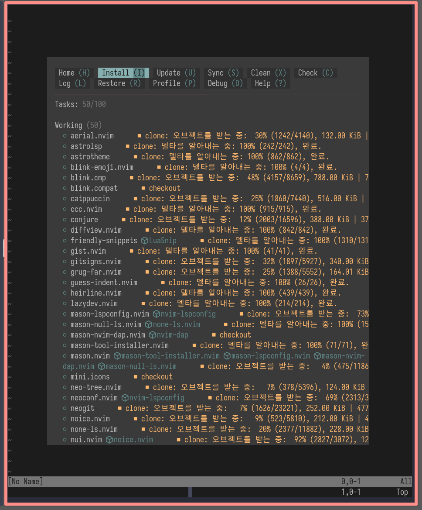

<!-- gid:20250720T171730 -->
[[TIP("이 노트에 대하여")]]
AstroNvim 기반 설정 저장소를 통해 Neovim에서 클로저와 개발 워크플로우를 어떻게 가져갈지 기록한다. Emacs 바깥 대안 에디터를 가볍게 실험하는 닷파일 노트다.
[[/TIP]]

<!-- provenance:source:start -->
[[TIP("원본·최신본")]]
이 페이지는 한국어 검색과 읽기를 위한 WikiDocs 미러입니다. [원본·최신본은 가든](https://notes.junghanacs.com/notes/20250720T171730/)에 있습니다. 최신 수정 내용·백링크·태그·히스토리·댓글·출처 정보는 원본 가든에서 확인하세요.

- 작성: `2025-07-20T17:17:00+09:00`
- 최근 수정: `2025-07-20T17:17:00+09:00`
[[/TIP]]
<!-- provenance:source:end -->

[TOC]

## 히스토리

-   [2025-07-20 Sun 17:17] neovim 간단하게 쓰려해도 너무 불편하다.

## 연결노트

-   -&gt; [프렉티컬리 practicalli 이맥스 클로저](https://wikidocs.net/381855)

## 관련메타

-   [온보딩](https://wikidocs.net/380828)
-   [빔 네오빔 vim $neovim](https://wikidocs.net/380508)

## BIBLIOGRAPHY

- “Junghan0611/Astronvim-Config.” 2025. [https://github.com/junghan0611/astronvim-config](https://github.com/junghan0611/astronvim-config).
- Practicalli. n.d. “Overview - Practicalli Neovim.” Accessed February 1, 2025. [https://practical.li/neovim/](https://practical.li/neovim/).

## 관련링크

#### junghan0611/astronvim-config

(“Junghan0611/Astronvim-Config” 2025)

Han, Jung 2025

Rich development workflow with Clojure support, using AstroNvim 4 and selected plugins

#### Overview - Practicalli Neovim

(Practicalli n.d.)

Practicalli

Practical guide to Clojure development with Neovim

## 2025 설치 및 닷파일

neovim 설치하고

```shell
git clone https://github.com/practicalli/nvim-astro5.git ~/.config/nvim
```

### dotfiles

[2025-07-20 Sun 17:22]

```json
-- ------------------------------------------
-- Junghanacs preferences
--
-- which-key menu vertical orientation
-- catppuccin-mocha colorscheme
-- Show key presses in popup (SPC u k)
-- Snacks customisation
-- -- Startup dashboard banner
-- -- indent guides disabled
-- -- notifier log level INFO
-- `,.` as alternate `ESC` key mapping (better-escape.nvim)
-- Trim blank space automatically
-- Custom snippets
-- Gist public
-- Neovim global options & key mappings
-- ------------------------------------------

-- INFO: Create your own preferences in `lua/plugins/your-name.lua`
-- INFO: Files under `lua/plugins/*.lua` load in alphabetical order,
-- so plugin overrides should be the last file to load

-- INFO: Config in this file skipped if `PRACTICALLI_ASTRO` environment variable set to false
local user_practicalli = vim.env.PRACTICALLI_ASTRO
if user_practicalli == "false" then return {} end

---@type LazySpec
return {

  -- ------------------------------------------
  -- UI Customisation

  -- Vertical which-key menu
  {
    "folke/which-key.nvim",
    opts = {
      ---@type false | "classic" | "modern" | "helix"
      preset = "classic",
      sort = { "local", "order", "group", "alphanum", "mod" },
    },
  },
  -- Colorscheme (Theme)
  ---@type LazySpec
  {
    "AstroNvim/astroui",
    ---@type AstroUIOpts
    opts = {
      colorscheme = "catppuccin-mocha",
    },
  },
  -- show key presses in normal mode
  {
    "nvzone/showkeys",
    cmd = "ShowkeysToggle",
    opts = {
      excluded_modes = { "i", "t" }, -- skip insert and terminal
      position = "bottom-center",
      show_count = true,
      maxkeys = 4,
      timeout = 4,
    },
  },
  -- Snacks Customisation
  {
    "folke/snacks.nvim",
    opts = {
      dashboard = {
        preset = {
          -- customize the dashboard header
          header = table.concat({
          " ██████╗ ██████╗  █████╗  ██████╗████████╗██╗ ██████╗ █████╗ ██╗     ██╗     ██╗",
          " ██╔══██╗██╔══██╗██╔══██╗██╔════╝╚══██╔══╝██║██╔════╝██╔══██╗██║     ██║     ██║",
          " ██████╔╝██████╔╝███████║██║        ██║   ██║██║     ███████║██║     ██║     ██║",
          " ██╔═══╝ ██╔══██╗██╔══██║██║        ██║   ██║██║     ██╔══██║██║     ██║     ██║",
          " ██║     ██║  ██║██║  ██║╚██████╗   ██║   ██║╚██████╗██║  ██║███████╗███████╗██║",
          " ╚═╝     ╚═╝  ╚═╝╚═╝  ╚═╝ ╚═════╝   ╚═╝   ╚═╝ ╚═════╝╚═╝  ╚═╝╚══════╝╚══════╝╚═╝",
          }, "\n"),
        },
      },

      -- indent guides - disable by default
      indent = { enabled = false },

      notifier = {
        -- log level: TRACE DEBUG ERROR WARN INFO  OFF
        level = vim.log.levels.WARN,
        -- wrap words in picker right panel
        win = { preview = { wo = { wrap = true } } },
      },
    },
  },
  -- ------------------------------------------

  -- disable paredit
  { "gpanders/nvim-parinfer", enabled = false },
  { "julienvincent/nvim-paredit", enabled = false },

  -- ------------------------------------------
  -- Editor tools

  -- Alternative to Esc key using `,.` key mapping
  {
    "max397574/better-escape.nvim",
    event = "InsertCharPre",
    opts = {
      timeout = vim.o.timeoutlen,
      default_mappings = false,
      mappings = {
      i = { [","] = { ["."] = "<Esc>" } },
      c = { [","] = { ["."] = "<Esc>" } },
      t = { [","] = { ["."] = "<Esc>" } },
      v = { [","] = { ["."] = "<Esc>" } },
      s = { [","] = { ["."] = "<Esc>" } },
      },
    },
  },
  -- Trim trailing blank space and blank lines
  {
    "cappyzawa/trim.nvim",
    event = "User AstroFile",
    opts = {},
  },
  -- Custom snippets (vscode format)
  {
    "L3MON4D3/LuaSnip",
    config = function(plugin, opts)
      -- include default astronvim config that calls the setup call
      require "astronvim.plugins.configs.luasnip"(plugin, opts)
      -- load snippets paths
      require("luasnip.loaders.from_vscode").lazy_load {
        paths = { vim.fn.stdpath "config" .. "/snippets" },
      }
    end,
  },
  -- Switch between src and test file
  -- TODO: PR #67 raised on rgroli/other.nvim
  -- {
  --   "rgroli/other.nvim",
  --   ft = { "clojure" },
  --   main = "other-nvim",
  --   opts = {
  --     mappings = { "clojure" },
  --   },
  -- },
  -- ------------------------------------------

  -- ------------------------------------------
  -- Neovim Options and Key Mappings
  {
    "AstroNvim/astrocore",
    ---@type AstroCoreOpts
    opts = {
      options = {
        -- configure general options: vim.opt.<key>
        opt = {
          spell = true, -- sets vim.opt.spell
          wrap = true, -- sets vim.opt.wrap
          guifont = "Monoplex Nerd:h14", -- neovide font family & size
        },
        -- configure global vim variables: vim.g
        g = {
          -- Neovim language provides - disable language integration not required
          loaded_perl_provider = 0,
          loaded_ruby_provider = 0,

          -- Leader key for Visual-Multi Cursors (Multiple Cursors)
          VM_leader = "gm", -- Visual Multi Leader (multiple cursors - user plugin)

          -- Conjure plugin overrides
          -- comment pattern for eval to comment command
          ["conjure#eval#comment_prefix"] = ";; ",
          -- Hightlight evaluated forms
          ["conjure#highlight#enabled"] = false,

          -- show HUD REPL log at startup
          ["conjure#log#hud#enabled"] = false,

          -- auto repl (babashka)
          ["conjure#client#clojure#nrepl#connection#auto_repl#enabled"] = false,
          ["conjure#client#clojure#nrepl#connection#auto_repl#hidden"] = false,
          ["conjure#client#clojure#nrepl#connection#auto_repl#cmd"] = nil,
          ["conjure#client#clojure#nrepl#eval#auto_require"] = false,

          -- Test runner: "clojure", "clojuresCRipt", "kaocha"
          ["conjure#client#clojure#nrepl#test#runner"] = "kaocha",

          -- Troubleshoot: Minimise very long lines slow down:
          -- ["conjure#log#treesitter"] = false
          -- ["conjure#log##treesitter"] = false,
          -- ["conjure#log#disable_diagnostics"] = true
        },
      },
      mappings = {
        n = {
          -- normal mode key bindings
          -- setting a mapping to false will disable it
          -- ["<esc>"] = false,

          -- whick-key sub-menu for Visual-Multi Cursors (Multiple Cursors)
          ["gm"] = { name = "Multiple Cursors" },

          -- Toggle last open buffer
          ["<Leader><tab>"] = { "<cmd>b#<cr>", desc = "Previous tab" },

          -- navigate buffer tabs
          ["]b"] = { function() require("astrocore.buffer").nav(vim.v.count1) end, desc = "Next buffer" },
          ["[b"] = { function() require("astrocore.buffer").nav(-vim.v.count1) end, desc = "Previous buffer" },

          -- snacks file explorer
          ["<Leader>E"] = { "<cmd>lua Snacks.picker.explorer()<cr>", desc = "Snacks Explorer" },

          -- Save prompting for file name
          ["<Leader>W"] = { ":write ", desc = "Save as file" },

          -- Gist Creation
          ["<Leader>gj"] = { ":GistCreateFromFile ", desc = "Create Gist (file)" },
          ["<Leader>gJ"] = { "<cmd>GistsList<cr>", desc = "List Gist" },

          -- Neogit Status float
          ["<Leader>gf"] = { "<cmd>Neogit kind=floating<cr>", desc = "Git Status (floating)" },

          -- Toggle between src and test (Clojure pack | other-nvim)
          ["<localLeader>ts"] = { "<cmd>Other<cr>", desc = "Switch src & test" },
          ["<localLeader>tS"] = { "<cmd>OtherVSplit<cr>", desc = "Switch src & test (Split)" },

          -- Showkeys plugin (visualise key presses in Neovim window)
          ["<Leader>uk"] = { "<cmd>ShowkeysToggle<cr>", desc = "Toggle Showkeys" },
        },
        t = {
          -- terminal mode key bindings
        },
        v = {
          -- visual mode key bindings
          -- Gist Creation
          ["<Leader>gj"] = { ":GistCreate ", desc = "Create Gist (region)" },
        },
      },
    },
  },
}
```

### screnshot

[2025-07-20 Sun 17:36] 한 것도 없는데 그냥 설치 중 이러면 참 빠르고 놀랍다. 이맥스는 그냥... 허허


