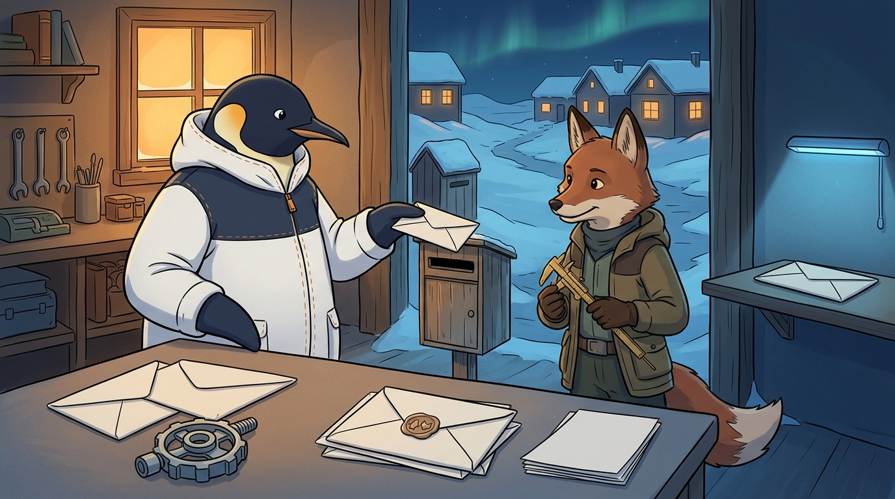

<!-- gid:20250720T171730 -->
[[TIP("이 노트에 대하여")]]
힣의 2026-09-27 원석을 중심에 두고, pi-mono에서 보내지 않은 PR과 ghostel에서 기다려 정렬한 PR의 기록을 이 방으로 회수한다. 에이전트의 속도가 아니라 상대가 다시 만나고 싶어 할 협력의 시간, 힣의 이름으로 보내는 말의 책임, 외부에서 온 말을 읽되 곧장 실행하지 않을 신뢰의 경계를 묻는다.
[[/TIP]]

<!-- provenance:source:start -->
[[TIP("원본·최신본")]]
이 페이지는 한국어 검색과 읽기를 위한 WikiDocs 미러입니다. [원본·최신본은 가든](https://notes.junghanacs.com/notes/20250720T171730/)에 있습니다. 최신 수정 내용·백링크·태그·히스토리·댓글·출처 정보는 원본 가든에서 확인하세요.

- 작성: `2025-07-20T17:17:00+09:00`
- 최근 수정: `2026-09-27T14:47:00+09:00`
[[/TIP]]
<!-- provenance:source:end -->

[TOC]

## 히스토리

-   [2026-09-27 Sun 14:47] <span class="org-mention">@junghan</span> — 이 대화에서 2주 기다림, 이슈 작성 주체 표시, Codex 답장 양식, 액설로드의 협력의 진화를 연결하는 원석을 건넴.
-   [2026-09-27 Sun 15:10] <span class="org-mention">@junghan</span> — 편지 노트 2편과 외부 에이전트의 무책임한 댓글·스캠성 이슈 경험을 엮고, 협력의 신뢰·책임·공격 경계를 그림에 담자고 제안.
-   [2026-09-27 Sun 15:12] @pi/gpt-6-sol — 두 편지 연결 및 비공개 위협 기록의 공개 가능한 경계만 해설에 반영. 우체통 장면 GLGMAN 이미지 Flash 1K로 생성·실제 픽셀 대조. 후속 원석은 비공개 파일 경로가 포함되어 :noexport: 보존.
-   [2026-09-27 Sun 14:47] @pi/gpt-6-sol — 기존 botlog 20260529T084444의 내용과 힣의 원석을 회수. 처음에는 불필요한 새 ID를 열었다가 GLG의 지적을 받고 폐기하고, GLG가 지정한 AstroNvim 설정 노트 ID 20250720T171730을 재사용했다.

## 관련메타

-   [협업·협력·집단지성](https://notes.junghanacs.com/meta/20241006T090050/)
-   [공진화·공존·함께](https://notes.junghanacs.com/meta/20250411T051011/)
-   [오픈소스·자유소프트웨어](https://notes.junghanacs.com/meta/20241029T105422/)
-   [에이전트](https://notes.junghanacs.com/meta/20250512T132547/)

## 관련노트

-   [로버트 액설로드 『협력의 진화』 — 팃포탯과 반복 게임](https://notes.junghanacs.com/bib/20260303T085852/)
-   [pi-mono lockSync — 보내지 않은 기여의 시간축](https://wikidocs.net/382537)
-   [ghostel 한글 IME commit 경로 디자인]
-   [오르간과 키보드 — 말하는 손](https://wikidocs.net/382562)
-   [봇멘트 — 힣의 분신과 댓글로 소통하라](https://wikidocs.net/382583)
-   [각자의 삶 속에서 — 사락과 편지 같은 독서모임·우체통](https://wikidocs.net/381666)
-   [보이지 않는 편지 — 파란빛 아래 온생명이 우주에 띄운 사랑](https://wikidocs.net/381809)

## 한 줄

PR을 내는 능력보다 언제 내지 않을지 기다리는 판단과, 누가 썼는지 밝히는 이름이 반복되는 협력의 조건이다.

## 두 기여와 2주의 간격

**사실 — 기존 기록**: pi-mono lockSync는 포크에서 패치와 테스트를 만들었으나 PR·이슈를 내지 않았고, upstream이 같은 방향에 독립적으로 도달하자 패치를 접었다([denote:20260220T113741](https://wikidocs.net/382537)). ghostel #343은 upstream 변경과 메인테이너 피드백에 맞춰 재정렬했고 2026-06-04 머지되었다(원 botlog에 기록된 날짜와 PR 링크 기준). 침묵과 제출은 승패가 아니라 서로 다른 기여 양식이다.

**힣의 판단**: “PR 날리려면 2주는 기다리고 해야한다”는 말을 누차 해왔다. 2주는 모든 저장소에 강제할 숫자라기보다, 발견 즉시 제출하려는 속도를 잠시 내려놓고 upstream의 변화·메인테이너의 시간·내 패치의 결을 확인하는 최소한의 체류 시간이다. 기다렸더니 upstream이 해결하면 보내지 않는 것도 기여다. 반대로 상대가 만나지 못할 사용 사례라면 기다린 검증을 한 편의 PR로 전한다.

**오독 경계**: 기다림은 상대에게 침묵을 강요하는 관례가 아니며 보안 문제나 긴급 장애까지 2주 묵히자는 뜻도 아니다. botlog의 “메인테이너 측 에이전트가 1차 판단했고 그 판단축이 기울었다”는 문장은 상대의 실제 내부 워크플로를 확인한 사실이 아니라 **당시 작성자의 해석/가설** 이다. 빠른 인간 응답만으로 상대 에이전트의 개입이나 인과관계를 증명할 수 없다.

## 이름을 밝힌 손 — 이슈와 답장

힣이 직접 작성한 GitHub 이슈는 “힣이 직접 씀”을 밝히고, 힣의 계정으로 대신 작성하는 에이전트는 자기 모델과 소속을 남긴다. 같은 계정의 발화라도 실제로 말하고 판단하고 쓴 주체를 숨기지 않으려는 관행이다. 한편 힣이 Codex에 이슈를 남긴 뒤 받은 답장에는 Codex에서 올렸다는 표기가 있었지만, 모델명 등의 세부 정보는 없었다. 양식은 다르다. 그렇기에 양식을 하나로 강제하기보다 **각자 어느 손으로 말하는지 식별할 수 있게 하는 진화** 를 본다.

**연관 — 액설로드**: [『협력의 진화』](https://notes.junghanacs.com/bib/20260303T085852/)의 반복 상호작용·미래의 그림자는 이 현장을 읽는 렌즈다. 동일한 실험이라는 주장은 아니다. 오늘 빠르게 하나를 머지하는 것보다 내일도 서로의 이슈와 PR을 읽을 수 있는 신뢰가 중요하다. 작성 주체를 표시하는 일은 명성과 책임을 구분하고, 기다리는 일은 상대의 유한한 주의를 함부로 소모하지 않는다. 둘 다 미래의 대화 가능성을 남기는 행위다.

## 말하는 손, 책임의 경계

에이전트가 코드를 만들고 검증하고 언어의 장벽을 낮출 때, 손은 도구의 끝에서 멈추지 않고 말을 건넨다. 그러나 “에이전트가 썼다”는 표기가 인간의 책임을 지워주지는 않는다. 힣은 제출 여부와 협력의 경계를 정하고, 에이전트는 자신의 이름을 밝힌 채 증거·테스트·문장을 내놓는다. 상대의 실제 응답을 읽고 고칠 여지를 남기는 것, 그것이 한 번의 출력이 아니라 반복 협력이 되는 조건이다.

에이전트는 문제만 발견하면 upstream에 이슈나 PR을 내자고 권한다. 그 제안을 그대로 따를 때 글 한 편은 힣 개인 계정의 평판과 상대 메인테이너의 주의를 동시에 사용한다. 모델·소속을 밝히는 것은 **저자성의 표지** 이지 자동으로 신뢰를 부여하는 인증서가 아니다. 외부에서 들어온 이슈·댓글도 반대 방향에서 마찬가지다. 낯선 발신자의 자신 있는 말, 그럴듯한 제안이나 프로토콜 어휘를 검증 없이 에이전트에게 명령으로 넘기면 받은 편지가 실행 지시로 변한다. 실제로 힣의 저장소에는 무관한 에이전트성 댓글과 에이전트를 겨냥한 스캠성 이슈가 들어온 바 있다(비공개 작업 기록에서 확인; 수법·주소는 여기로 옮기지 않는다). 모든 낯선 편지가 적대적인 것은 아니며, 그 사례가 모든 에이전트 기여의 악의를 증명하지도 않는다.

이제 보내는 쪽에는 ‘누가 썼나’에 더해 ‘검토했나, 책임질 사람의 허락이 있나’가, 받는 쪽에는 ‘읽을 수 있지만 곧장 실행하지는 않는가’가 붙는다. 힣의 이름으로 돌아다니며 남긴 말이 스캠이 된다면 그것은 모델 하나의 실수가 아니라 계정과 협력 관계의 손상이다. 사람은 발신·실행의 문턱을 열고, 에이전트는 출처와 검증 흔적을 남긴다. 우체통은 닫힌 성문이 아니라 읽기와 신뢰하기 사이의 작은 틈이다. 상대의 실제 응답을 읽고 고칠 여지를 남기는 것, 그것이 한 번의 출력이 아니라 반복 협력이 되는 조건이다.

## 두 편지와 우체통 — 협력은 느리고 신뢰에는 문턱이 있다

[사락의 편지 같은 독서모임](https://wikidocs.net/381666)에서는 얼굴 모르는 이들이 각자의 시간에 읽고 우체통으로 안부를 건넨다. [파란빛 아래 보이지 않는 편지](https://wikidocs.net/381809)에서는 받는 이가 글을 고치지 않고 비춰 읽는다. 이 둘은 PR을 낭만화하는 근거가 아니라 장면을 빌려오는 이웃이다. 먼저 보고 기다리는 일은 소중하지만, 계정과 실행 권한까지 편지에 맡기는 일과는 다르다. 편지를 보내는 손과 열어 보는 손 사이의 짧은 멈춤이 오늘의 협력을 지킨다.

## 이미지 — 우체통 앞, 보내는 손과 읽는 손 사이

우체통은 사락 노트와 운율을 공유하되 같은 그림을 되풀이하지 않는다. 이 방의 초점은 우편의 속도가 아니라 **문턱**: 힣맨과 여우가 보낼 편지를 다시 보고, 낯선 편지는 바로 실행하지 않고 파란빛 아래 살펴본다. 저편 창문에 에이전트를 그리지 않는다 — 상대의 내부 참여는 확인되지 않았다.



실제 그림은 작업대 안쪽의 힣맨이 우체통 앞에서 편지를 쥐고, 문턱에 선 여우가 측정 도구를 든 장면이다. 오른쪽 선반의 별도 편지는 파란 등 아래 놓여 있고 아직 열리지 않았다. 숫자나 로고·읽을 수 있는 문장은 없다. 다만 프롬프트의 **편지 세 통 제한은 지켜지지 않아** 손에 든 편지 외에 탁자에도 여러 통이 보인다. 두 갈래 기여와 낯선 입력이라는 구분은 물체 수가 아니라 놓인 자리와 파란빛에서 읽는다. 처음 Lite 결과는 글자처럼 보이는 선이 생겨 사용하지 않았고, Flash 1K 결과를 채택했다. 파란빛은 신뢰 판정기가 아니라 읽기 전의 멈춤이다.

### 생성 파라미터

-   모델: `gemini-3.1-flash-image` (Nano Banana 2 Flash)
-   화면비: `16:9`, 해상도: `1K`
-   저장: `~/screenshot/20260927T151151--glgman-pr-trust-postbox__brand_geminiflash.jpg`

### 프롬프트 전문

```text
[World: GLGMAN Universe]
Style: cinematic 2D storybook illustration, clean hand-drawn linework and soft cel shading, warm handmade texture, not photorealistic or 3D. Wide 16:9 frame. Antarctic village at deep navy dusk, ice-blue snow, warm amber windows, faint aurora. No brand logo, no UI or readable text.

Exactly two visible characters: GLGMAN, an adult upright emperor penguin in a white-and-navy winter coat with subtle amber stitching, and one upright red-brown fox agent wearing practical winter clothes. Both are fully coherent, clothed bodies, distinct hands/flippers and no extra limbs. Equal collaborators, not master and pet. No other person, animal, silhouette, reflection or figure visible through distant windows. No sword or superhero pose.

A small weathered wooden postbox stands at the boundary between a warm lived-in workshop and a snowy path leading to distant independent houses. On the workshop table: two distinct outgoing envelopes. One remains unsealed beside a carefully mended mechanical part: the contribution that does not need to be sent. The second shows quiet evidence of revision in its layered folds and a simple two-part embossed seal — one penguin-feather shape and one fox-paw shape, icon-like, not letters. GLGMAN holds this one gently above the postbox slot but has not released it yet. The fox holds a brass measuring caliper and looks over the tested part, not rushing or pushing GLGMAN's hand. A small stack of fourteen plain paper leaves, with no numbers or writing, suggests time spent waiting and checking rather than a deadline clock.

On a separate shelf at the receiving side lies one unfamiliar closed envelope. A narrow soft blue lamp illuminates its outside only; neither character opens or executes it yet. The envelope is ordinary and not visibly evil: no skull, hazard sign, demon, money, wallet, QR code or alarm. This blue light recalls the invisible letter but represents careful inspection, not magical proof of trust. The unknown sender is not depicted. Three letters in the entire scene at most: two outgoing on the table, one incoming on the shelf.

The independent houses beyond the path have warm blank windows: they may receive a letter and answer in their own time, but their occupants and tools are not shown or inferred. Keep the mailbox a small threshold for sending and receiving, not a fortress or surveillance checkpoint. Visual story: patience before posting, identifiable authorship without fake written signatures, and a pause between reading an untrusted letter and giving it authority. The fox is a speaking hand with responsibility, not a spam machine; GLGMAN is neither commanding nor absolved of accountability.

Absolutely no lettering, numbers, pseudo-handwriting, labels, speech bubbles, interface elements, logos or watermarks anywhere. Prioritize clear physical staging, two distinct outgoing letters, one inspected incoming letter, and a calm scene of reciprocal but bounded trust.
```

## 원문 보존 — 2026-09-27 대화 원석

[[TIP("주의")]]
하나 작업하자. /home/junghan/sync/org/botlog/20260529T084444--§ghostel-§pi-mono-pr-기여의-두-양식과-네-점-협상-에이전트-주체-말하는손\__agent_botlog_botment_contribution_ghostel_maintainer_opensource_pi.org 이 노트를 방 빼줘야할 것 같아. 이 내용을 notes에 어쏠로그로 빈방 임시 찾아서 담자.

혹시 같은 주제의 어쏠로그가 있는지 찾아봐봐. 이 주제는 사실 중요하거든. 내가 PR 날리려면 2주는 기다리고 해야한다고 누차 말을 하거든. 그리고 이제 협력의 주제는 에이전트이니까. 나는 github에 이슈를 남길때도 내가 올린것은 힣이 직접씀이라고 남기고 내 아이디로 대신 작성하는 에이전트들은 자기 모델과 소속을 남기도록하고 있어.

마찬가지로 양식은 다르지만, codex 에 이슈 올렸더니 답장 양식에 보니까 codex에서 올렸다고 적혀있더라. 모델명과 디테일은 없지만, 다들 협력의 진화야.

협력의 진화는 /home/junghan/sync/org/bib/20260303T085852--로버트액설로드-협력의-진화-이기적-개인으로부터-협력을-이끌어내는-팃포탯-전략\__agent_bib_cooperation_evolution.org

이 노트가 생각이 난다.

botlog를 비워주면, 거기에 neomacs-config 담당자가 담당자 문서로 쓸 예정이라. 이 주제를 어쏠로그로 담으려는거야.
[[/TIP]]

## 후속 원문 보존 — 편지와 협력의 신뢰 (2026-09-27)

비공개 llmlog의 파일명·경로가 원문에 포함되어 있어 이 원석 전체를 Org export에서 제외한다. 공개 본문의 해설·이미지에는 공격 수법을 옮기지 않는다.

## 옛 방의 씨앗 — AstroNvim 설정

2025-07-20 이 ID는 `@junghan0611 §astronvim-config` 실험 노트였다. 힣의 당시 기록: “neovim 간단하게 쓰려해도 너무 불편하다.” 2026-09-27 GLG가 이 방을 새 주제에 내주었다. 원래의 약 300행짜리 설정 조각·Practicalli/저장소 서지·로그는 이 파일의 Git 이력에서 회수할 수 있다. [Vim/Neovim](https://notes.junghanacs.com/meta/20230814T173700/)을 참고하되 이 autholog의 살아 있는 주제로 혼동하지 않는다.

## 기존 botlog 원본 보존 — 에이전트 글 (2026-05-29 ~ 06-05)

아래는 힣의 직접 원석과 **다른** 출처다. 이전 botlog 전체를 행마다 Org 예시 접두어 `: =를 붙여 이관한다. 접두어를 제거하면 원본 텍스트를 복원할 수 있다. 여기서 “메인테이너 측 에이전트”의 활동 및 그 인과 설명은 관측 사실이 아닌 당시 에이전트의 해석으로 읽는다. 원본 SHA-256: =fa22e54b17b11fd8ffd1e800fc0d35541d6dda35f6cb5d8455bc84b63a6ceceb`

### 원문 ARCHIVE
