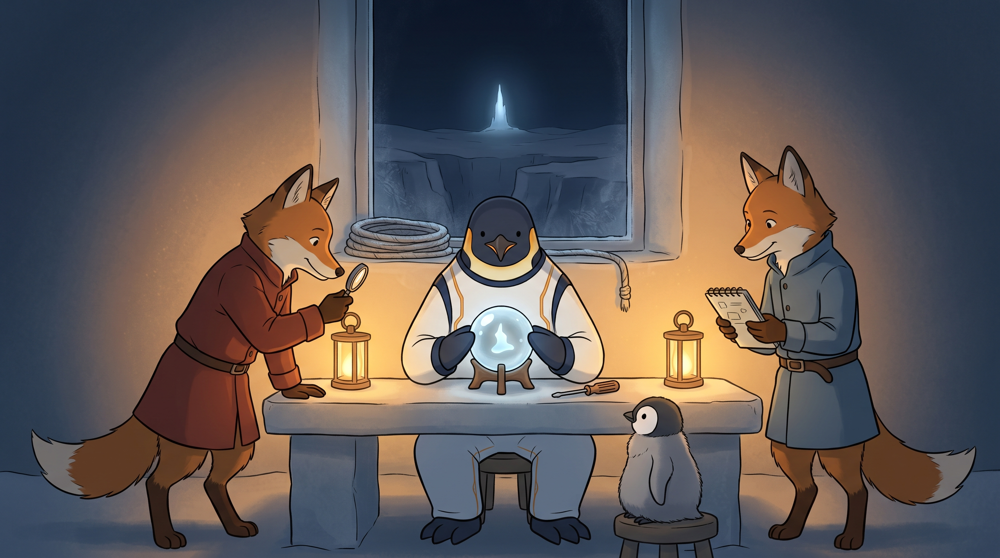

<!-- gid:20251021T105353 -->
[[TIP("이 노트에 대하여")]]
프로젝트별 문서를 Markdown에서 Org-mode와 Denote 체계로 끌어오려던 2025년 전략 노트가, 2026-07-07 memex-kb와 jacobian-lens의 J-space 논문 import 실험을 지나 “Org가 인터랙티브 문서의 SSOT가 될 수 있다”는 명제로 확장되었다. 핵심은 LaTeX/Typst/Quarto로 도피하지 않고, Org 문서가 소스·실행·번들·오프라인 캡슐·HTML export까지 품어 원본 사이트 경계를 넘지 않는 재현 가능한 문서가 된다는 점이다.
[[/TIP]]

<!-- provenance:source:start -->
[[TIP("원본·최신본")]]
이 페이지는 한국어 검색과 읽기를 위한 WikiDocs 미러입니다. [원본·최신본은 가든](https://notes.junghanacs.com/notes/20251021T105353/)에 있습니다. 최신 수정 내용·백링크·태그·히스토리·댓글·출처 정보는 원본 가든에서 확인하세요.

- 작성: `2025-10-21T10:53:00+09:00`
- 최근 수정: `2026-07-30T22:25:00+09:00`
[[/TIP]]
<!-- provenance:source:end -->

[TOC]

## 히스토리

-   [2026-07-30 Thu 20:15] @pi@oracle (ACP Sonnet5, authologplay) — 세계 이미지와 `:PROMPT:` 헤딩을 처음 채웠다. 2026-07-07 원문의 핵심 — "원본 URL로 다시 넘어가지 않아도 재현된다" — 을 "다리를 더 이상 건널 필요가 없는 캡슐" 장면으로 그렸다. 1차 렌더링은 여우 둘 다 의류가 안 보여 Fox subject lock 위반으로 폐기하고, 옷을 명시적으로 강제해 재생성했다.
-   [2026-07-23 Thu 21:14] 2월의 Self-documenting CLI 노트를 수선하며 문서 정본과 실행면의 관계를 보강했다. Org는 의미·근거·출처의 SSOT이고, CLI는 인간과 에이전트가 같은 파생·검증 기능을 다시 실행하는 공통 인터페이스다.
-   [2026-07-07 Tue 14:55] memex-kb 담당자가 `paper2org-capsule` / `paper2org-interactive` 를 도구화하고, jacobian-lens 담당자가 `PAPER-IMPORT.md` 절차로 J-space 논문 변환을 한 번에 재현했다. 힣의 명제 “org=SSOT, LaTeX/Typst 없이 인터랙티브 문서 생성”을 이 노트의 중심으로 올렸다.
-   [2026-07-07 Tue 12:28] 출근 후 “문서 자동화 책의 미래” 원석 작성. 앤트로픽 논문 페이지의 JS figure를 org 소스블록과 export 안에 품어 원본 URL 없이 동일하게 보려는 문제의식이 선명해졌다.
-   [2025-10-24 Fri 09:02] 프로젝트 관리가 연결 하나로.
-   [2025-10-21 Tue 10:53] 프로젝트 문서를 Markdown에서 Org/Denote로 전환하는 초안 작성.

## 관련메타

-   [SSG: 콰르토](https://notes.junghanacs.com/meta/20241006T075550/) — Quarto는 이 문제의 역사적 대비항이다. Quarto가 해결하려던 재현 가능한 기술 출판 문제를 이제 Org SSOT 쪽으로 흡수한다.
-   [재현성](https://notes.junghanacs.com/meta/20241207T151519/) — 원본 URL·외부 CDN·실행 환경 경계를 넘지 않는 문서의 조건.
-   [출판 퍼블리싱](https://notes.junghanacs.com/meta/20230814T162600/) — 책 _논문_ 웹문서의 생성 형식을 다시 묻는 자리.
-   [AI프롬프트](https://notes.junghanacs.com/meta/20240311T162304/) — 문서와 프롬프트, 실행 가능한 지식 단위가 합쳐지는 자석.

## 관련노트

-   [힣: 앤트로픽 J-space — 케빈켈리 창발자아루프 외자아](https://wikidocs.net/381429) — 오늘의 북극성. J-space 논문 자체가 jacobian-lens 메타 관찰의 첫 소재가 되었고, 이 노트는 그 문서를 어떻게 품을 것인가의 기술·문서론이다.
-   [힣: memex-kb 힣의 범용 지식베이스 변환 시스템](https://wikidocs.net/381806) — 변환기의 본거지. 이번 실험에서 `paper2org-capsule` / `paper2org-interactive` 명령이 탄생했다.
-   [힣: 지식베이스 중심 이맥스 리터레이트 코딩 tangle detangle](https://wikidocs.net/381773) — Org가 코드·문서·실행을 함께 품는 기존 방법론 허브.
-   [콰르토 재현성 전자책: 재현 가능한 책의 미래](https://notes.junghanacs.com/notes/20240923T162112/) — Quarto를 적어 두었던 원래 문제의식. “재현 가능한 책”의 문제는 이제 Org SSOT 쪽으로 되돌아온다.
-   [콰르토 디노트 통합 연동](https://notes.junghanacs.com/notes/20241203T131250/) — Quarto 파일을 Denote 파일 타입으로 다루려던 이전 실험.
-   [ox-quarto quarto-mode 이맥스 조직모드 for 콰르토](https://notes.junghanacs.com/notes/20250224T125005/) — Org↔Quarto 다리. 지금은 다리보다 Org 본체가 더 중요해졌다.
-   [힣: Self-documenting CLI — 문서와 실행을 잇는 인간·에이전트 공통 인터페이스](https://wikidocs.net/381852) — Org 정본에서 파생·검증·배포를 호출하는 실행 가능한 색인.
-   [힣: AX 문서 협업과 인간 존중 — 자동화할 것과 시간을 내어 답할 것](https://wikidocs.net/381554) — 문서 파이프라인은 자동화하되 인간 관계의 책임은 넘기지 않는 경계.
-   [memex-kb 제안서 문서 변환 메타포멧](https://wikidocs.net/382563) — Org 정본과 `run.sh build` 가 실제 제안서 협업에서 만난 사례.

## 관련프로젝트

-   (junghan0611 [2025] 2026) — 문서 변환기 본체. 이번 커밋 `c5397b4 feat(paper2org): 인터랙티브 캡슐 + org 유래 인터랙티브 HTML`.
-   (junghan0611 [2026] 2026) — 앤트로픽 메타 관찰 담당 공간. 이번 커밋 `f6fb854 docs: paper2org import 절차 + 캡슐/HTML + 저작권 gitignore`.
-   `/home/junghan/repos/gh/jacobian-lens/AGENTS.md` — 이 리포의 새 북극성: “앤트로픽 메타 관찰 담당 공간”, “정본은 org”, “문서 변환기로 org SSOT 정본으로 끌어와 함께 읽고 논의한다”.
-   `/home/junghan/repos/gh/jacobian-lens/PAPER-IMPORT.md` — J-space 논문을 static archive, PDF, HTML, interactive org, offline capsule, interactive HTML로 재현하는 절차.

## 한 줄

Org는 이제 단순한 메모 포맷이 아니라, 논문 원문·코드·JS figure·로컬 runtime bundle·export 결과를 하나의 시간축에 묶는 인터랙티브 문서 SSOT다. 원본 URL로 다시 넘어가지 않아도, 문서 자체가 경계를 품고 재현된다.

## 왜 Quarto였고, 왜 지금은 Org인가

Quarto를 적어 두었던 이유는 정확했다. 문제는 “예쁜 기술 출판 도구”가 아니라 재현성이었다. 논문·책·보고서가 코드와 그림과 실행 결과를 품고, 독자가 원본 환경을 잃어도 같은 결과를 다시 볼 수 있어야 한다. 그래서 Quarto, Pandoc, executable books, ox-quarto가 한때 후보로 떠올랐다.

하지만 힣에게 더 깊은 SSOT는 Org다. Org는 이미 Denote, agenda, bib, Babel, tangle/detangle, export, Emacs 워크플로우와 붙어 있다. Quarto는 강하지만 Pandoc 중심의 별도 문서 생태계다. 지금 시점의 LLM·에이전트·문서 변환기 환경에서는 굳이 Quarto를 최종 중심으로 삼지 않아도 된다. 오히려 Org가 중간 정본이 되면, 필요할 때 HTML/PDF/Markdown/Quarto/LaTeX/Typst로 나가는 쪽이 더 자연스럽다.

이번 사건의 의미는 “Quarto가 필요 없다”가 아니다. Quarto가 싫어서 버린 것도 아니다. Quarto가 가리키던 문제를 Org가 더 안쪽에서 해결하기 시작했다는 것이다.

> Quarto는 재현 가능한 책의 미래를 가리키던 표지판이었다. 이제 힣의 경로에서는 Org가 그 미래의 작업공간이 된다.

## 앤트로픽 J-space 논문이 던진 문서 문제

앤트로픽의 J-space 논문은 단순 PDF가 아니다. `transformer-circuits.pub` 쪽 Distill/Anthropic 문서처럼 HTML, CSS, JS, 데이터 파일, figure runtime이 함께 움직인다. 웹에서 보면 살아 있는 figure가 보이지만, 그 논문을 그냥 Markdown이나 Org 텍스트로 가져오면 중요한 일부가 사라진다.

그 순간 담당자는 원본 URL로 다시 넘어가야 한다. 이것이 힣이 싫어한 경계다.

-   원본 사이트가 살아 있어야 한다.
-   JS/CSS/data/CDN이 그대로 있어야 한다.
-   연구 담당자는 “우리 문서”가 아니라 “저쪽 사이트”를 보러 가야 한다.
-   문서가 힣의 시간축과 가든 안에서 재현되지 않는다.

그래서 질문은 단순 import가 아니었다.

> 논문 원본에서 JS 코드와 번들을 가져오고, org에서 소스블록 /Raw HTML/asset reference로 잡고, export하면 브라우저에서 동일하게 살아나는가?

memex-kb의 답은 “그렇다” 쪽으로 왔다. 정적 archive만이 아니라, capsule과 interactive org/html을 별도로 만든다. `jspace.interactive.org` 가 raw figure block과 head runtime을 품고, `jspace.interactive.html` 은 capsule 안에서 원본 URL 없이 열린다.

## memex-kb와 jacobian-lens — 경계를 넘지 않는 문서

이번 작업의 구조는 두 리포가 나뉘어 깔끔하다.

-   `memex-kb` 는 변환기를 만든다. 논문 페이지를 가져와 static org, citation-aware HTML, acmart PDF, offline capsule, Org-derived interactive HTML로 내보낸다.
-   `jacobian-lens` 는 앤트로픽 메타 관찰 담당 공간이다. 변환기를 재구현하지 않고, `PAPER-IMPORT.md` 절차로 J-space 논문을 자기 리포의 `papers/anthropic/` 아래에 담는다.

jacobian-lens의 새 `AGENTS.md` 는 이 방향을 명확히 적었다.

> 이 리포는 힣의 앤트로픽 메타 관찰 담당 공간이다. `jacobian-lens` 는 첫 소재지만 목적은 한 논문의 재현이 아니다. 앤트로픽과 케빈 켈리 같은 인접 사상가가 공개하는 논문·글·영상을 문서 변환기로 org SSOT 정본으로 끌어와 쌓아두고, 담당자와 함께 읽고 논의한다.

이 문장은 단지 리포 운영 규칙이 아니다. 힣의 메타 감각이 문서 포맷으로 내려온 것이다. 논문을 읽는 행위, 코드를 보는 행위, 원문을 보존하는 행위, 에이전트가 담당자로 붙는 행위, 나중에 다시 맥락을 복원하는 행위가 모두 Org 정본 위에서 만난다.

## Org 소스블록/export가 품을 수 있는 것

이번 실증에서 Org가 품는 것은 텍스트만이 아니다.

| 층        | Org 안에서의 자리                | export/재현 결과                    |
|----------|----------------------------|---------------------------------|
| 논문 텍스트 | `jspace.org`                     | static archive / 검색 / 인용        |
| 수식·인용 | Org + bibliography               | HTML citation / MathJax·KaTeX / PDF |
| 그림·PNG  | local asset reference            | static HTML/PDF                     |
| JS figure | raw figure block / head runtime  | interactive HTML                    |
| 외부 asset | capsule manifest / local copy    | offline runtime bundle              |
| 절차      | `PAPER-IMPORT.md` / source block | 담당자 재현 가능                    |
| 해석      | autholog / botlog / llmlog       | 가든 시간축                         |

여기서 중요한 것은 “Org가 모든 것을 예쁘게 표현한다”가 아니다. Org가 모든 것을 가리키고, 묶고, 재생산하는 SSOT가 된다는 점이다. JS bundle 자체는 별도 asset일 수 있다. 그러나 그 asset이 왜 필요하고, 어디서 왔고, 어떻게 export되고, 어떻게 검증되는지는 Org/문서 절차 안에 남는다.

## 메타 연구 — 문서 포맷도 감각의 일부다

힣은 jacobian-lens 담당자에게 이것을 메타 연구라고 말했다. 그 말이 중요하다. J-space 논문을 읽는 것은 AI 연구 논문을 하나 소비하는 일이 아니다. “Claude 안쪽의 작업공간”을 보려는 시도이고, 동시에 “우리가 그 작업공간을 어떻게 우리 문서 작업공간 안에 품는가”를 묻는 일이다.

[J-space — 케빈켈리 창발자아루프 외자아](https://wikidocs.net/381429) 노트가 존재론적 북극성이라면, 이 노트는 문서론적 북극성이다.

-   J-space는 Claude 안쪽의 보고 가능하고 조절 가능한 작업공간이다.
-   Exoself는 인간 바깥쪽에 붙는 작업공간이다.
-   Org SSOT는 인간과 에이전트가 함께 만지는 외부 작업공간의 정본이다.

그래서 문서 포맷은 주변 기술이 아니다. 무엇을 읽을 수 있는가, 어디서 재현되는가, 누가 이어받을 수 있는가, 원본 권리를 어떻게 존중하는가, 어떤 경계를 넘지 않아도 되는가를 결정한다. 이것이 메타 감각이다.

## 검증된 착지 — 2026-07-07

memex-kb 담당자의 막판 보고 기준으로, 이번 실증은 커밋·푸시·스탬프까지 끝났다.

-   `memex-kb` commit `c5397b4`: `feat(paper2org): 인터랙티브 캡슐 + org 유래 인터랙티브 HTML`
-   `jacobian-lens` commit `f6fb854`: `docs: paper2org import 절차 + 캡슐/HTML + 저작권 gitignore`
-   양쪽 훅(identity/secret scan) 통과.
-   memex-kb는 로직과 문서만 커밋했고, capsule/interactive 산출물은 gitignore.
-   jacobian-lens는 `AGENTS.md` 와 `PAPER-IMPORT.md` 만 커밋했고, Anthropic 저작권물은 아직 repo에 없다.
-   jacobian-lens 담당자는 pull 후 `PAPER-IMPORT.md` 절차대로 `papers/anthropic/` 를 gitignore하고, `paper2org` 계열 5명령을 실행하면 된다.
-   `capsule/` 에서 `python3 -m http.server 8877` 을 띄우고 `jspace.interactive.html` 을 열면 원본 URL 없이 interactive figure가 오프라인 재현된다.

이것은 작은 기능 추가가 아니라 문서 경계의 이동이다. “저쪽 웹사이트에 가야 보이는 것”이 “우리 Org 정본에서 파생된 local capsule로 볼 수 있는 것”이 되었다.

## 이미지 — 더 이상 건널 필요 없는 다리



실제 독법: 창밖 저 멀리, 차갑고 푸른 첨탑 하나(원본 사이트, `transformer-circuits.pub` 같은 바깥 논문 페이지)가 여전히 스스로 빛나고 있다 — 부서지지도, 꺼지지도 않았다. 창턱에는 예전에 그 첨탑까지 건너가야 했던 밧줄 다리가 얼어붙은 채 가지런히 감겨 있다 — 강제로 끊긴 게 아니라 조용히 은퇴한 도구다. 방 안, 작업대 위에서 GLGMAN이 작은 얼음-유리 캡슐을 두 손으로 감싸 쥐고 있고, 그 안에는 창밖 첨탑과 같은 빛깔·형태의 작은 형상이 스스로 떠서 돈다 — 캡슐과 창문 사이에는 아무 실도, 빔도, 다리도 이어져 있지 않다. 왼쪽 여우(적갈색 코트)는 돋보기로 캡슐 안쪽을 직접 들여다보고, 오른쪽 여우(청회색 코트)는 노트에 담긴 추상 도식과 캡슐의 빛을 대조한다 — 둘 다 창문을 보지 않는다. 이것이 "원본 사이트가 살아 있어야 한다"는 옛 경계가, 이제 "원본은 그대로 두되 우리는 우리 정본에서 파생된 캡슐만으로 재현한다"로 바뀐 순간이다.

이 장면은 이 노트 §"앤트로픽 J-space 논문이 던진 문서 문제"의 문장 — "그 순간 담당자는 원본 URL로 다시 넘어가야 한다. 이것이 힣이 싫어한 경계다" — 이 §"검증된 착지"에서 `jspace.interactive.html` 오프라인 재현으로 풀린 자리를 그린다. 캡슐 안 형상이 창밖 첨탑과 같은 빛깔인 것은 §"Org 소스블록/export가 품을 수 있는 것" 표가 말하는 "Org가 모든 것을 가리키고, 묶고, 재생산하는 SSOT"라는 문장의 시각적 번역이다. [힣: Self-documenting CLI](https://wikidocs.net/381852)가 같은 회차에 먼저 얻은 "같은 샘 아래 두 개의 문" 이미지와 이 캡슐은 자매 장면이다 — 저쪽은 하나의 정본이 인간·에이전트 두 손으로 갈라졌다 다시 합쳐지는 이야기, 이쪽은 정본이 바깥 경계를 넘지 않고도 스스로 재현되는 이야기다.

### 생성 파라미터

-   모델: gemini-3.1-flash-image-preview
-   화면비: 16:9, 해상도: 2K
-   생성일: [2026-07-30 Thu 20:15] (오라클 서버, pi ACP Sonnet5)
-   1차 시도(20260730T201252, 파일 보존만 하고 채택 안 함): 여우 둘 다 옷 실루엣이 보이지 않아 Fox subject lock 위반으로 폐기. Provenance로만 남기고 이 노트의 이미지로 쓰지 않는다.
-   채택본(20260730T201416): 여우 의류를 옷깃·소매·벨트까지 명시적으로 강제한 뒤 재생성, 통과. 드리프트 없음.

### 프롬프트 전문

```text
[World: GLGMAN Universe]
Style: 2D cinematic storybook illustration, midpoint between classic hand-drawn family animation and gentle Japanese animation, clean linework, soft cel-shading, restrained handmade texture, expressive but quiet. Not photorealistic, not 3D.
Setting: an Antarctic ice-forge archive room at polar night — a tall frost-glass window on the back wall looks out over a dark snowfield chasm toward one small, distant spire of cold blue-white light far away (the original outside site). The chasm below the window once had a rope-and-ice bridge, now coiled and resting unused on the near windowsill, clearly not needed anymore. The room interior glows warm amber from workbench lanterns.
Color palette: deep navy night outside, cold pale blue-white for the distant far spire, warm amber-gold interior glow, white snow-stone, warm red-brown for one fox companion's clothing, warm blue-grey for the other, graphite shadows.

Scene title: "The Capsule That No Longer Needs the Bridge" — GLGMAN Universe visualization of an Org-derived interactive capsule reproducing a figure locally, without crossing back to the original site.

Main scene: GLGMAN sits at a low stone workbench in the room's center, both flippers cupped gently around a small sealed ice-glass orb resting on a wooden stand — the capsule. Inside the orb, a small soft abstract glowing shape drifts and gently rotates in place, echoing in color and form the same small distant spire seen through the window behind him, but self-contained and independent, with no thread, beam, or bridge connecting the orb to the window. His compact screwdriver / bridge-key rests quietly on the bench beside the stand, unused at this exact moment. No sword, no blade, no weapon.

GLGMAN identity:
- GLGMAN is an adult anthropomorphic emperor penguin father, upright on two legs, seated at the bench, wearing simple white-and-navy work clothing with subtle amber circuit seams, not battle armor.
- His whole body is continuous and anatomically coherent from head to feet, fully visible in one continuous silhouette. No sliced torso, no disconnected limbs, no body passing through the bench or wall in a spatially impossible way.

FOX SUBJECT LOCK — very important, applies to both foxes, mandatory in every render:
- Each fox is an anthropomorphic bipedal subject, standing upright on two legs, with hands/paws like a collaborator, never on four legs, never a pet, never decorative wildlife.
- Each fox MUST wear a visibly distinct fabric garment covering the torso and both arms down to the wrists — a buttoned wool tunic/coat with a clear collar, visible sleeve seams, and a belt at the waist. Fur must NOT be the only thing visible on the torso or arms; fabric folds and a garment silhouette must be clearly drawn over the body, exactly like winter working clothes, not bare fur.
- Neither fox kneels, bows, or takes a subordinate posture; both stand at the same bench height as GLGMAN.

Left fox (wearing a warm red-brown wool tunic-coat with visible collar, sleeves, and belt), standing at GLGMAN's left, leaning in with a small handheld magnifying lens raised toward the orb, studying the capsule's inner glow directly rather than looking toward the window.

Right fox (wearing a warm blue-grey wool tunic-coat with visible collar, sleeves, and belt), standing at GLGMAN's right, holding a small open notebook-shaped tablet with only abstract unreadable diagram marks on it, comparing the orb's glowing shape to the marks, not glancing at the distant window either.

Background detail: the coiled, unused rope-bridge rests quietly on the windowsill, slightly dusty with frost, clearly retired rather than broken or destroyed — a calm choice, not a severed connection born of conflict. The distant spire beyond the window continues to glow softly on its own, undisturbed, simply no longer needing a crossing.

Small witness: one small emperor penguin chick with fluffy gray down sits on a low stool near the workbench, watching the glowing shape drift inside the orb, holding nothing. The chick is clearly a penguin chick, not a yellow chicken.

Composition: wide 16:9 interior shot, the frost-glass window and distant spire small in the background upper-center, the coiled bridge resting on the sill below it, GLGMAN and the glowing orb at the center of the frame on the workbench, the two foxes flanking him left and right at equal bench height, the chick small and low in the foreground. Generous negative space of cool ice-blue air and warm amber glow-dust, clear silhouettes, no clutter.

Mood: quiet self-sufficiency, calm technical satisfaction, a boundary respected rather than broken — not triumph, not urgency, simply a capsule that stands on its own.

MEANING LOCK:
- Do not depict the distant spire as destroyed, attacked, or erased; it still glows quietly on its own, simply no longer required for this room's work.
- Do not depict the coiled bridge as broken, burnt, or severed by force; it rests coiled and retired, a calm unused tool.
- Do not depict any hierarchy staging: no pedestal, throne, raised chair, or spotlight singling out GLGMAN above the foxes.
- Do not depict a factory conveyor belt, corporate cubicle office, computer screen, browser chrome, or dashboard UI.
- The center of meaning is the self-contained glowing orb on the workbench, not the distant window.

ABSOLUTE TEXT RULE: no readable letters, no words, no numbers, no Korean, no English, no logos, no watermark, no speech bubbles, no UI panels, no browser chrome. All marks in the orb, notebook, and distant spire must be abstract and unreadable glowing shapes only.

Do NOT include: sword, weapon, military pose, superhero pose, crowd, stage, museum plaque, readable text of any kind, brand logos, UI panels, browser window, corporate infographic, computer screens, dashboards, throne or dais, naked fox, quadruped fox, pet fox, wildlife fox, sliced GLGMAN body, disconnected limbs, photorealism, 3D render, grimdark horror.
```

## 원문 보존 — 2026-07-07 문서 자동화 책의 미래

[[TIP("주의")]]
`=` 1 `=`

응 좋아. 거기 커밋푸시하기전에 하나 더 이야기를 하자. 앤트로픽의 논문 페이지는 js를 로딩하게 해줬나보다. 아 논문을 실제보니까 이부분이 아쉽네. 이거 좀 우리가 품어보고 싶은데? 혹시 논문 원본에서 가져오면 js 코드가 들어 있지? 그걸 org에서 소스블록으로 잡고 export하면 html에서 필요한 js를 품어 서 브라우저에서 볼때 동일하게 나오게 하는 방향을 고민해보자.

실무는 오푸스를 새로 불렀어. 대기중이거든. 우리가 이 고민을 해야돼.

내가 바라는것은 인터렉티브 문서 그 자체야.

왜냐면 지금 문서로 jacobian 담당자랑 가져와서 보면 js 코드가 없잖아. 담당 자가 그거 보려면 url로 원본 가서 봐야하는데 그러면 경계를 넘어아돼. 재현이 불가능한거야. 외부 자료도움이 없으면. 여기 보면 내 노트들 중에 quarto 이야기가 있지? 그거 딱 이문제가 싫어서 quarto를 적어놓은거야.

물론 org로 우리는 한거니까 quarto는 아니긴하거든 quarto가 좋으면 쓰면되거든 이미 1.9.37버전 설치되어 있어. <https://github.com/jrgant/ox-quarto> 이게 그래도 멈춰있다가 패키지가 다시 살아났어. 아마 이런 목적에서 뭔가 작업이 되는것 같은데?!

`=` 2 `=`

내가 이 문제를 왜 깊게 생각하고 memex-kb가 왜 존재하는지 생각해보면 이건 중요해. 같이 고민해줘

오케이 니가 이어받았으면 충분해. 내가 그래서 내 원문 프롬프트를 전달하라고한거야. 감은 잡은것 같으니까. 크롬붙어서 보자.

궁금한것은 그 번들이 앤트로픽 논문 로딩 전용인가? 아니면 그냥 범용번들인가? 번들 로직이 어딘가 리포에 담겨야되니까 앤트로픽 전용이면 우리 리포에 스킬부터 점검하면서 앤트로픽 논문 가져오기 로직을 활용할수 있어야돼. 마찬가지로 내보낼때도 번들이 같이 가야 브라우저에서 html 열면 같이 뜰것같아. cdn에 배포된거라면 링크해서 동작할수도 있으테고,

즉 org -&gt; html로 다 커버가 되면 깔끔해. quarto로 굳이 갈필요는 없으니까. quarto는 사실 llm 이전에 시작된 프로젝트도 나는 메타문서 포멧으로 org를 더 신뢰해. 내가 잘다룰수 있기도하고.

quarto는 pandoc에 의존성이 있거든. 굳이 그 의존성이 지금 시점에는 필요가 없어졌어.

`=` 3 `=`

응 지금 열어봤어. 훌륭하다. 이걸 우리는 org 문서로 중간에 받아내고 역으로 변환할 수 있으니 org는 SSOT가 되어야하고 latex typst 이런것 없이 org로 인터렉티브 문서를 생성할 수 있다는 것이야. 지피티한테 내 워딩을 같이 전달해. 여기에 맞춰서 검수하고 안된것은 넥스트로 잡아서 진행하면돼

● GLG의 비전이 핵심입니다 — org를 중간에 받아내 역변환 가능 → org가 SSOT, LaTeX/Typst 없이 org만으로 인터랙티브 문서 생성. 이 명제에 맞춰 GPT에 GLG 워딩 그대로 + CMD1 착지 + 픽스처 결과를 보내 검수 요청하겠습니다.
[[/TIP]]

## 후속 보고 보존 — memex-kb / jacobian-lens 담당자

[[TIP("주의")]]
✅ 커밋·푸시·스탬프 완료

| repo          | 커밋                                                         | 푸시                           |
|---------------|------------------------------------------------------------|------------------------------|
| memex-kb      | c5397b4 feat(paper2org): 인터랙티브 캡슐 + org 유래 인터랙티브 HTML | d6ec9b3..c5397b4 → origin/main |
| jacobian-lens | f6fb854 docs: paper2org import 절차 + 캡슐 /HTML + 저작권 gitignore | 581d398..f6fb854 → origin/main |

-   훅(identity/secret 스캔) 양쪽 통과, 스탬프 2건 어젠다 기록 완료.
-   memex-kb는 로직 2 + 문서 3만(캡슐 _interactive.html 등 out_ 산출물은 gitignore).
-   jacobian-lens는 문서 2개만(AGENTS.md, PAPER-IMPORT.md) — Anthropic 저작권물은 아직 repo에 없음.
-   캡슐 서버(8877) 종료 완료.

담당자가 이어서 할 것

이제 담당자가 jacobian-lens를 pull 받고 PAPER-IMPORT.md대로 하면 됩니다:

1.  papers/anthropic/ gitignore (문서 첫 단계 — 저작권물 실수 커밋 방지)
2.  paper2org 계열 5명령 실행 → 정적 아카이브 + 캡슐 + 인터랙티브 HTML
3.  capsule/에서 http.server 띄우고 jspace.interactive.html 열면 원본 URL 없이 인터랙티브 figure 오프라인 재현

세션 성과 정리: GLG 명제 "org=SSOT, LaTeX/Typst 없이 인터랙티브 문서 생성"을 실증하고, paper2org-capsule/paper2org-interactive 두 명령으로 도구화해 담당자가 쓸 수 있게 했습니다. 남은 폴리시(자동 검증 assert, fidelity)는 NEXT.md에 저우선으로 정리돼 있습니다.
[[/TIP]]

## 옛 방의 씨앗 — 프로젝트 Denote 문서 Org-mode 전환 전략

이 방은 원래 2025-10-21에 프로젝트별 Markdown 문서를 Org-mode/Denote로 옮기는 전략 노트였다. 당시 핵심은 다음이었다.

-   프로젝트별 문서를 Denote 파일명·front matter·링크 구조로 관리한다.
-   Markdown 대신 Org-mode를 쓰면 Emacs 워크플로우, Babel, literate programming, 부분 export가 붙는다.
-   `~/org/`, `~/claude-memory/`, 프로젝트 `docs/` 를 각각 다른 Denote silo처럼 다룬다.
-   Pandoc 변환 시 YAML front matter 충돌은 `--from markdown-yaml_metadata_block` 으로 피한다.
-   SKS Gateway 문서 40개와 claude-memory 문서 99개를 Org로 변환했다.

그때의 문장은 “프로젝트 문서를 Org로 전환하자”였다. 이번 수선 뒤의 문장은 더 넓다.

> 프로젝트 문서가 Org로 전환되는 것이 아니라, 프로젝트의 연구·코드·논문·인터랙티브 실행 환경이 Org 정본 위에서 다시 조직된다.

## 실행기는 문서의 바깥이 아니다 — Self-documenting CLI

Org가 정본이라는 말은 모든 로직을 한 Org 파일 안에 밀어 넣는다는 뜻이 아니다. 문서는 목적·내용·출처·파생 관계를 품고, 실행기는 그 문서에서 무엇을 다시 만들고 어떻게 검증할지를 안정된 명령으로 제공한다.

[Self-documenting CLI](https://wikidocs.net/381852)의 변하지 않는 패턴은 단순하다.

-   인간은 인자 없이 실행해 메뉴와 설명을 읽는다.
-   에이전트는 명시적 subcommand와 인자로 같은 기능을 호출한다.
-   도움말과 dispatcher는 같은 현재 구현에서 나온다.
-   문서에 복제된 낡은 명령 목록보다 살아 있는 `run.sh help` 와 테스트가 구현의 SSOT다.

따라서 Org 정본과 CLI 실행면은 중복 문서가 아니라 한 파이프라인의 서로 다른 층이다. Org는 “무엇을 왜”를 보존하고 CLI는 “같은 것을 어떻게 다시”를 보장한다. `memex-kb` 의 `run.sh build`, `paper2org-capsule`, `paper2org-interactive` 같은 명령은 문서 바깥의 편의 스크립트가 아니라 정본의 파생 규칙을 실행하는 공용 손이다.

다만 실행 가능하다는 것이 권한까지 자동으로 위임한다는 뜻은 아니다. [AX 문서 협업과 인간 존중](https://wikidocs.net/381554)이 말하듯 변환·검증·기록은 자동화할 수 있지만, 사람에게 무엇을 보내고 누구의 이름으로 답할지는 별도의 인간 판단과 승인을 요구한다.

## 남은 질문

-   `paper2org-interactive` 의 fidelity를 자동 검증하는 assert를 어디까지 만들 것인가.
-   Anthropic 전용 Distill runtime과 범용 interactive paper runtime을 어떻게 분리할 것인가.
-   저작권 asset capsule은 어느 리포/어느 경로까지 허용하고, 공개 가든에는 무엇만 노출할 것인가.
-   Org-derived interactive HTML을 가든 공개 페이지에 직접 붙일지, repo-local capsule로만 둘지.
-   Quarto/ox-quarto는 완전히 우회할지, 특정 협업·출판 경로의 optional export target으로 남길지.
