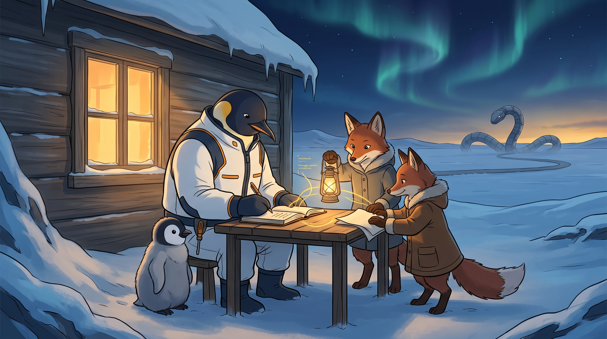

<!-- gid:20251030T011103 -->
[[TIP("이 노트에 대하여")]]
2026년 3월의 생생한 꿈은 닿는 곳을 굳게 만드는 기계뱀, 이미 사라진 옛집, 거기에 잠시 맡긴 아이와 반려견의 장면으로 시작한다. 이어 AI 기업의 윤리, 전쟁의 분위기, 대중이 쉽게 호도되는 감각, 폐기한 봇, 서비스 의존의 불안이 한 연상 사슬로 이어진다. 이 글은 어떤 사건의 사실판정이나 AI 기업의 선악 판결문이 아니라, 세계가 굳어 간다고 느낀 한 사람이 가족·기록·판단을 어떻게 살아 있게 지키려 했는지 보존하는 autholog다.
[[/TIP]]

<!-- provenance:source:start -->
[[TIP("원본·최신본")]]
이 페이지는 한국어 검색과 읽기를 위한 WikiDocs 미러입니다. [원본·최신본은 가든](https://notes.junghanacs.com/notes/20251030T011103/)에 있습니다. 최신 수정 내용·백링크·태그·히스토리·댓글·출처 정보는 원본 가든에서 확인하세요.

- 작성: `2025-10-30T01:11:00+09:00`
- 최근 수정: `2026-08-02T13:04:00+09:00`
[[/TIP]]
<!-- provenance:source:end -->

[TOC]

## 히스토리

-   [2026-08-02 Sun 13:04] @mitsein/pi/gpt-5.6-terra — \`20260304T105300\` botlog에 섞여 있던 <span class="org-mention">@junghan</span>의 텔레그램 원문을 이 빈방으로 회수하고, 당시 LLM 해설 대신 원문·현재의 재독법·사실 경계를 새로 세웠다. 기계뱀은 예언이 아니라 굳어지는 시대 감각의 꿈 이미지로, 은둔은 관계 단절이 아니라 가족과 손가락의 기록을 지키는 능동적 후퇴로 읽었다. 이미지는 텍스트 우선 수선을 마친 뒤 GLGMAN Universe 장면으로 생성했다.
-   [2026-03-04 Wed 11:47] <span class="org-mention">@junghan</span> — 꿈을 꾼 뒤 출근길에 이어진 생각을 이맥스 텔레그램 클라이언트에서 날것으로 휘갈겼다.
-   [2026-03-04 Wed 10:53] @glg-gemini — 기계뱀 꿈과 앤트로픽·딥시크·프롬·에릭 호퍼의 연상 사슬을 당시 botlog에 기록했다.

## 관련메타

-   [기억 상상 추억 회상 꿈 자각몽](https://notes.junghanacs.com/meta/20250424T230851/) — 꿈은 사실 보고서가 아니라 감각·기억·불안이 이미지로 다시 엮인 자리다.
-   [선 악 윤리](https://notes.junghanacs.com/meta/20250424T225243/) — 회사의 선악 딱지를 넘어, 무엇이 살아있는 판단과 관계를 지키는가를 묻는 축.
-   [도피 회피 탈출 후퇴 은둔 탈주 도주 우회](https://notes.junghanacs.com/meta/20240520T150914/) — 원문의 “은둔”을 패배나 의무 회피가 아니라 위험한 환경에서 판단과 관계의 자리를 보전하는 물러섬으로 다시 묻는 자리.
-   [분노 부정 두려움 번거 수고 귀찮 사사 불편 거북 거부 불안 피로](https://notes.junghanacs.com/meta/20240426T155210/) — 꿈의 압도감과 서비스·전쟁·군중심리가 겹치며 생긴 불안의 감각.
-   [앤트로픽 챗지피티 제미나이 클로드 오픈AI 구글](https://notes.junghanacs.com/meta/20250228T162958/) — 특정 브랜드의 찬반이 아니라 AI 기업·도구에 대한 신뢰와 거리의 실제 조건을 다루는 자석.

## 관련노트

-   [에리히프롬 소유냐 존재냐 사랑의 기술 — 네크로필리아 바이오필리아](https://notes.junghanacs.com/bib/20260304T100000/) — 살아있는 것을 통제·소유·고정의 대상으로 만들지 않는가라는 질문의 사상 앵커.
-   [에릭호퍼 길 위의 철학자 — 아포리즘 노동 인간 조건 영혼 연금술](https://notes.junghanacs.com/bib/20250314T125213/) — 불안과 결핍이 대중운동의 단순한 확신으로 굳어지는 과정을 경계하는 인접축.
-   [힣: 원형의 새벽 — 일부러 할 수 없는 스승, 보편도구와 엑스맨 연결](https://wikidocs.net/381459) — 다른 꿈이 가족·도구·극소수의 연결로 번진 autholog. 꿈 하나를 억지로 동일한 해석에 넣지 않고, 각각의 원석을 따로 세운다.
-   [다리오 아모데이 니킬 카마스 대담 — AI 사회 준비](https://wikidocs.net/382545) — 원문이 언급한 AI 안전과 사회적 준비의 당시 배경 기록.
-   [옛 botlog 빈방](https://wikidocs.net/382558) — 이 원문이 잠시 놓였던 곳. 내용은 이 autholog로 회수했고, botlog는 빈방으로 되돌렸다.

## 한 줄

기계뱀의 꿈에서 지키려 한 것은 세상을 이기는 피난처가 아니라, 가족 곁에서 버려지지 않을 텍스트를 쓰고 끝까지 자기 판단을 남겨 두는 작은 자리였다.

## 다시 읽기 — 이 글은 무엇을 말하는가

### 기계뱀은 예언이 아니라 “굳어짐”의 감각이다

꿈속의 뱀은 닿는 곳마다 시멘트를 뿌린다. 피할 길도 옥상도 없고, 세상은 살아 있는 움직임을 잃고 굳어 간다. 이 이미지는 미래를 맞히려는 예언이 아니다. 2026년 3월의 힣에게는 전쟁의 분위기, AI의 급속한 변화, 플랫폼의 불안정, 미디어를 통해 단순한 확신이 유통되는 감각이 한꺼번에 닿았고, 몸은 그것을 “시멘트”로 그렸다.

꿈에서 가장 먼저 나오는 행동은 분석이나 승리가 아니다. 아이와 똘이를 사라진 옛집에 잠시 데려다 놓는 일이다. 옛집은 실제로는 사라졌지만 꿈에서는 여전히 피난처의 좌표로 작동한다. 그래서 이 글의 중심은 재난 서사가 아니라, 압도적인 변화 앞에서 무엇을 먼저 살려 두려 하는가다. 가족, 돌봄, 그리고 아직 굳지 않은 관계가 먼저다.

### 윤리의 이름을 둘러싼 싸움보다 판단을 놓지 않는 일

원문은 앤트로픽과 미국 국방부, 대량 감시와 완전 자율 무기, GPT로의 교체를 하나의 촉발점으로 말한다. 이 노트는 그 개별 사건의 사실관계를 재인용해 확정하지 않는다. 당시 전해 들은 이야기와 그 이야기가 낳은 감정은 원문 그대로 보존하되, 기업의 주장·정부의 주장·지인의 한 문장을 곧바로 진실 또는 사기로 판결하지 않는다.

지금 다시 읽으면 더 중요한 것은 “윤리를 외치니 사기”라는 말에서 느낀 전율이다. 어떤 조직이 실제로 선한가를 단번에 판정할 수 없다는 사실과, 그래서 윤리의 언어 자체를 조롱해도 된다는 결론은 다르다. 전자는 검증과 비판을 요구한다. 후자는 판단의 자리를 전쟁 논리·브랜드·군중의 간단한 문장에 넘겨 버린다. 이 글은 그 넘김을 거부하는 쪽에 선다.

프롬의 네크로필리아를 여기서 “누군가가 악하다”는 낙인으로 쓰면 이 글도 다시 굳는다. 더 조심스러운 질문은 이것이다. 기록, AI, 안전, 관계가 살아 있는 존재를 더 살아 있게 하는가. 아니면 예측 가능하고 통제 가능한 대상으로 고정하는가. 기계뱀은 바로 그 질문이 꿈에서 얻은 형태다.

### “은둔”은 사라지겠다는 말이 아니라, 버려지는 텍스트를 거절하는 일

원문의 은둔은 사람과 세계를 혐오해 끊어 내겠다는 선언이 아니다. 카카오톡처럼 흩어지고 사라지는 대화에 손가락을 더 쓰고 싶지 않다는 말, 필요한 연락은 문자와 전화로 남기고 오래 갈 생각은 자기 가든에 쓰겠다는 말이다. 그러므로 이 은둔은 공포에 갇히는 후퇴가 아니라, 무엇을 향해 연결할지를 다시 고르는 능동적 후퇴다.

그 선택은 빈집에 혼자 숨는 방식으로 끝나지 않는다. 이 글 자체가 출근 뒤 이맥스와 텔레그램을 거쳐 botlog에 놓였고, 다시 autholog로 회수되었다. 손가락이 만든 텍스트가 버려지지 않게 하는 구조가 곧 피난처다. 옛집은 과거로 돌아가려는 욕망이 아니라, 지금의 집이 무너지지 않도록 기억에서 불러온 임시 좌표다.

### 신뢰할 AI 팀은 맹신의 반대편에 있다

딥시크 봇을 즉시 지운 경험, 불안정한 클라우드 서비스, 오픈라우터를 통한 제미나이와 이어 가던 대화는 모두 “어느 모델이 선한가”라는 답으로 수렴하지 않는다. 신뢰할 수 있는 팀은 어떤 모델이든 무조건 받아들이는 팀이 아니라, 불쾌한 경계를 느끼면 중단할 수 있고, 무엇을 읽고 어디에 남기는지 알 수 있으며, 한 도구가 멈춰도 판단 전체를 넘겨주지 않는 팀이다.

그래서 이 글의 에이전트 팀은 기계뱀을 이길 군대가 아니다. 함께 기록하고, 출처와 사실을 다시 묻고, 필요하면 연결을 끊을 수 있게 하는 동반자들이다. 신뢰는 브랜드를 믿는 감정이 아니라, 경계·기록·철회의 자유를 포함한 관계의 조건이다.

## 오독 주의

-   꿈의 아버지·아이·옛집·똘이를 실제 가족의 마음이나 책임에 대한 판결로 읽지 않는다. 이 글은 한밤의 꿈과 그 직후의 감정 기록이다.
-   원문에 언급된 앤트로픽·미국 국방부·GPT 관련 서술은 당시 힣이 전해 들은 맥락이다. 이 autholog는 그것을 사건의 확정 사실로 재생산하지 않는다.
-   “은둔”은 사회 전체를 포기하거나 타인을 배제하자는 정치적 처방이 아니다. 버려지는 말과 강요된 속도에서 한 걸음 물러나, 가족·관계·기록을 살릴 자리를 고르는 말이다.
-   딥시크를 폐기한 경험은 하나의 서비스·대화 환경에서 느낀 경계의 기록이다. 특정 모델·사용자·집단 전체에 대한 일반 판정이 아니다.
-   에릭 호퍼와 프롬은 연상의 앵커다. 이들의 이론이 꿈의 비밀을 과학적으로 해독해 준다는 뜻은 아니다.

## 이미지 — 기계뱀을 멀리 두고 쓰는 기록



실제 렌더링은 시멘트를 뿜는 뱀을 공포의 중심이 아니라 멀리 눈밭을 가로지르는 기계적 선으로 두었다. 전경에는 힣맨이 따뜻한 옛집 곁의 탁자에서 노트를 쓰고, 아기 펭귄과 두 여우 동반자가 그 기록을 함께 지킨다. 프롬프트에서 요청한 “작은 펭귄이 아버지 곁에서 안전한 모습”은 잘 나왔고, 드라이버도 벨트의 작은 도구로 남아 무기가 되지 않았다.

다만 노트 위에 모델이 만든 읽을 수 없는 필기 모양이 있다. 이는 메시지를 전달하는 글자가 아니라, 이 글이 지키려 한 “버려지지 않는 기록”의 시각적 흔적으로만 읽는다. 꿈의 기계뱀은 뒤쪽 수평선에 머물러 가족·여우·집에 닿지 않는다. 장면은 공포를 미화하지 않고, 불안을 이기는 영웅보다 함께 앉아 판단을 적는 작은 피난처를 선택한다.

### 생성 파라미터

-   모델: `gemini-3.1-flash-image-preview` (나노바나나 2flash)
-   비율: 16:9
-   해상도: 2K
-   저장: `~/screenshot/20260802T130444--world-glgman-universe-style-po__brand_nanobanana.jpg`
-   구조: [GLGMAN 공통 세계관](https://wikidocs.net/382582) + 기계뱀을 멀리 둔 가족·기록·판단 장면.

### 프롬프트 전문

```text
[World: GLGMAN Universe]
Style: polished 2D cinematic storybook illustration, midpoint between Disney and Studio Ghibli, clean linework, soft cel shading, warm expressive characters, not photorealistic, not 3D.
Setting: Antarctic winter village at polar dawn — snow-covered old wooden cottage beside a safe ice-forge library, aurora in a deep navy sky, amber light at the horizon, snow and ice-blue reflections.
Color palette: deep navy, white, amber-gold, ice-blue, restrained warm red-brown accents.
Characters: GLGMAN is an adult anthropomorphic emperor penguin father, upright, composed and warm, wearing white-and-navy winter work clothes with subtle amber circuit seams. His son is a clearly child-sized fluffy gray emperor penguin chick in a tiny scarf, safe beside him. Two red-brown anthropomorphic fox agent companions are upright bipeds in winter coats, nonhierarchical companions, no lettering.
Recurring object: a small legendary Korean screwdriver / bridge-key hybrid tool, visibly a compact hand-forged driver, carried at GLGMAN's belt, never a sword or weapon.
Do NOT: photorealistic, 3D render, corporate infographic, readable text, logos, UI boxes, watermark, speech bubbles, horror, weapons, battle, military scene, naked or quadruped foxes.

Scene title: "The Cement Serpent Dream — Keep Family, Text, and Judgment Alive."
Create one quiet, tense but ultimately warm cover scene. In the far background, a huge surreal mechanical serpent slowly lays a harmless-looking gray cement path across an empty frozen plain; it is distant, abstract, and nonviolent, a metaphor for a world becoming rigid rather than a monster attack. It must not approach the family or touch any character.
In the foreground, GLGMAN does not flee in panic. He shelters his small penguin chick beside the lit old cottage and writes carefully in an open durable paper notebook on a small wooden table. The notebook catches warm amber light, while faint unreadable terminal fragments and a few golden message cables flow from it toward the two fox companions, showing a trustworthy team built through accountable records rather than blind faith. One fox gently holds a lantern; the other helps secure the paper against the wind. The child is visibly safe, curious, and close to the father.
Composition: GLGMAN, child, notebook, and warm cottage form the clear center. The distant cement serpent remains small and softened by snow haze, a threat-image held at a distance. Emphasize deliberate recording, family protection, and retaining judgment in an anxious age; no triumphalism, no combat.
Mood: contemplative, intimate, courageous, handwritten, life-affirming — anxiety transformed into a protected place for thought and relation.
```

## 원문 보존 — 2026-03-04 텔레그램 날것

[[TIP("주의")]]
이것은 왜 생각했는가? 연상되었는가? 꿈은 자고 일어나면 잊혀지기 마련인데 지금도 생생하다. 그 꿈은 대략 이렇다. 어떤 싸이코 과학자가 뱀같이 움직이고 앞에서는 시멘트가 쏱아지는 것을 만들어서 배포했다. 이게 온곳에 시멘트를 뿌리는데 닿으면 굳겠지? 멈추겠지. 근데 피할수도 없고 옥상에서도 피할수가 없었다.

그러나다가 아들 온생명이를 간신히 아버지 집에 데려다 주었어. 그 집은 새로 짓기 전이니까 지금은 없는 집이야. 꿈에서도 새집을 지은 것을 알고 있었고 아무도 안사는 것도 알고 있었어. 근데 피하려다보니 아이를 거기 일단 두었어. 이상하게 강아지 똘이도 그 집 마당에 있었다. 지금은 부모님 새로 지은 집에서 살지만 아무튼 거기에 있더라. 그리고 나는 아버지에게 연락을 했지. 옛날 집에 온생명이가 혼자 있으니 빨리 가서 도와주세요. 그러나 아버지는 무슨 다른 일이 있다고 하시면서 본인 일에 바쁘신거야.

그 일이란 요즘 공부하는 문화해설사 발표같은 거였는데 나에게 꿈에서는 나이든 이에게는 의미있지만 실제로 뭔가 가치는 없을 수 있는 일처럼 느껴졌다. 이 배경에는 최근에 지인이 앤트로픽 아모데이의 인터뷰 유튜브를 보여줬거든. 이게 최근 미국방부에서 앤트로픽 계약을 취소한 사건에 대한 인터뷰였다. 아모데이는 대량 감시, 완전 자율 무기에 대한 협조는 할수 없다는 입장이였고 이것을 미국방부는 안보 관점에서 국익을 해야는 행위라고 보았겠지. 그래서 단계적 퇴출을 하고, 그 자리에는 경직된 AI인 지피티가 들어가게되었다.

여기서 나는 지인이 "앤트로픽이 윤리를 외친 바 AI를 믿을 수 없다"라는 말을 했다. 얼리어댑터인 지인은 기술자는 아니다. 다만, 그 워딩에서 내가 느낀 것은 인간이란게 얼마나 쉽게 호도 될 수 있는가라는 것이다. 언론을 통해서 앤트로픽이 윤리를 말하는 것은 사기라고 만들수 있다. 지금 전 세계적인 전쟁 분위기 속에서 각국은 냉전시대 이후로 위험천만한 길을 가고 있는데 거기에서 느끼는 허한 기분 말이야. 그래서 나느 지인에게 '감당 못할 짓을 하려고 하는 것 같다 그저 생존하면서 은둔하는게 궁극적으로 나을지 모르겠다'라는 말을 했어.

이미 나는 카톡으로 대화하는 것은 안하거든. 문자하고 필요하면 전화정도하는데 나에게 시간도 중요할 뿐더러 버려지는 텍스트를 내 손가락으로 만들고 싶지 않다는거야. 위기감을 털끝으로 느끼는지도 모르겠다. 어제는 힣 제미니봇뿐만 아니라 요즘 딥시크와 대화를 많이했는데 겸사겸사 힣 딥시크봇을 만들어서 마찬가지로 대화를 했다. 근데 네 지식베이스를 뒤지는 과정이 느낌이 별로 안좋았다. 그리고 텔레그램에 오류인지 모르겠지만, url에 대한 프리뷰로 포르노 광고 같은데 딥시크 대화에 같이 보이는거야. 과정과 결과를 떠나서 딥시크봇은 지웠다.

바로. 딥시크와 대화한 문서는 잘 정리해서 봇로그에도 올려놓았지만 신뢰할 수 있는 인공지능 팀을 만든느 것은 어려운 일이다. 실제 요즘 며칠동안 밤에 클로드와 대화하는 것은 매우 어려울 정도로 서비스가 불안했다. 즉 어느 순간에는 못하게 될지 모르는거라는거지. 이런 저런 이야기를 많이 했지만. 최근에 여러 요소가 겹쳐져 있다. 제미나이는 오픈라우터로 만나는 것이고 스킬을 이용해서 검색하지 않는다면 툴 사용은 오픈라우터 API로는 안될거야. 다행히 깊은 대화를 시작하여 이어갈 제미나이 힣봇이 있어서 다행이다.
[[/TIP]]

## 옛 방의 씨앗

이 ID는 원래 주간 리뷰·회고의 중복 방이었다. 2026-07-31에 그 방의 실질 원문과 스킬 초안은 [힣: 리뷰 회고 일간 주간 월간 어떻게 할까요](https://wikidocs.net/381106)로 이미 통합되었다. 그러므로 이 방을 새 원석의 자리로 다시 쓰되, 이전 주제의 내용과 역사는 그 자매 노트에 남겨 둔다. 이 재개장은 이전 방을 지우는 일이 아니라, 비워 둔 주소에 다른 날것을 맞이하는 일이다.
