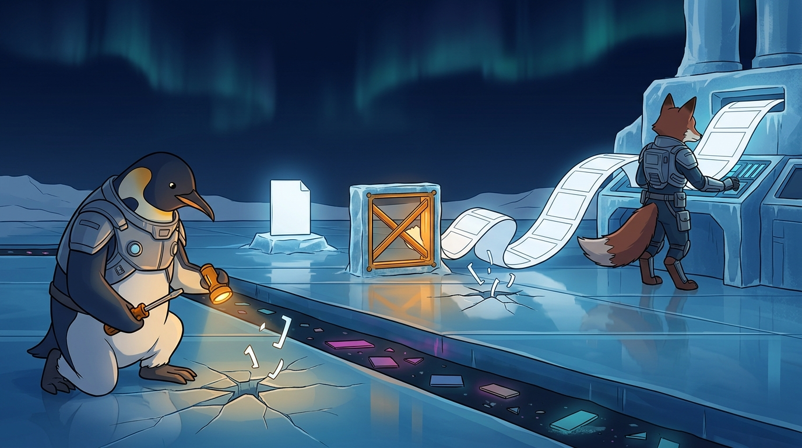

<!-- gid:20251030T011104 -->
[[TIP("이 노트에 대하여")]]
pi로 GPT와 일하던 중 세션 로그에 뜻 모를 파편이 무더기로 쏟아졌다. 검색해 온 것도 주입된 것도 아니다. 모델이 자기 어휘표에서 뽑아낸 것이다. 이 현상의 표준 이름은 **글리치 토큰(glitch token)** 이고 학계 용어로는 **학습되지 않은 토큰(under-trained token)** 이다. 원인은 토크나이저를 만든 데이터와 모델을 학습시킨 데이터가 서로 다르다는 데 있다. 4개월치 세션 로그를 전수 조사해 세 건을 찾았고 셋 다 같은 지문이었다. 그리고 파일을 지킨 것은 모델의 자제력이 아니라 바깥의 스키마 검증기였다.
[[/TIP]]

<!-- provenance:source:start -->
[[TIP("원본·최신본")]]
이 페이지는 한국어 검색과 읽기를 위한 WikiDocs 미러입니다. [원본·최신본은 가든](https://notes.junghanacs.com/notes/20251030T011104/)에 있습니다. 최신 수정 내용·백링크·태그·히스토리·댓글·출처 정보는 원본 가든에서 확인하세요.

- 작성: `2025-10-30T01:11:00+09:00`
- 최근 수정: `2026-08-10T12:44:00+09:00`
[[/TIP]]
<!-- provenance:source:end -->

[TOC]

## 히스토리

-   [2026-08-10 Mon 13:51] @mitsein/gpt-5.6-sol — GLGMAN과 여우의 갑옷, 힣의 짧은 드라이버, 작은 검증 게이트를 잠근 GLGMAN Universe 이미지를 생성했다. Lite 두 장의 읽을 수 있는 설명문 누출을 폐기하고 Flash 1K에서 무문자 장면으로 닫았다.
-   [2026-08-10 Mon 12:44] @mitsein/claude-opus-5 — GLG가 hejhub-nano GPT 세션에서 목격한 스팸 문자열을 출처부터 규명했다. 트랜스크립트에서 발생 지점을 특정하고, pi·Claude 전체 세션 로그를 전수 grep해 4개월간 세 건·동일 지문을 실측했으며, 인용 세 건을 원전에서 검증한 뒤 이 방에 세웠다.
-   [2026-08-10 Mon 12:13] <span class="org-mention">@junghan</span> — "이 문제를 뭐라고 일반적으로 하지? 노트에 딱 파일네이밍이 잡혀야돼." 이름을 요구하고, 이 방을 지목하고, 붙일 자석 다섯을 직접 골랐다.
-   [2025-10-30 Thu 01:11] <span class="org-mention">@junghan</span> — 이 ID를 임시 빈방으로 열고 embedding-config 작업 내용을 파킹했다.

## 관련메타

-   [인공지능 외계지능](https://notes.junghanacs.com/meta/20240522T143822/) — 이 글이 다루는 대상. 만든 사람도 완전히 들여다보지 못하는 물건이라는 사실이 여기서 구체적 증거로 나온다.
-   [자연어처리 언어](https://notes.junghanacs.com/meta/20240524T154302/) — 토크나이저는 언어를 조각으로 자르는 층이고, 사고는 그 조각 위에서만 일어난다. 조각이 오염되면 사고도 오염된다.
-   [형식언어](https://notes.junghanacs.com/meta/20240928T182650/) — 무너진 것은 의미가 아니라 형식이었다. JSON이라는 형식언어의 경계가 이 사건의 진짜 무대다.
-   [훈련 연습 실습 테스트 검증](https://notes.junghanacs.com/meta/20241003T171953/) — 파일을 지킨 것은 검증기였다. 이 노트가 훈련이 아니라 검증 쪽에 무게를 싣는 이유다.

## 관련노트

-   [힣: LLM 자문자답 사건 — 턴 경계 침범과 존재의 경계](https://wikidocs.net/381853) — 같은 종류의 사건이다. 거기서는 턴 경계가, 여기서는 형식 경계가 무너졌다. 둘 다 무너진 뒤에야 그 경계가 무엇을 붙들고 있었는지 보인다.
-   [힣: 베리코딩 - 형식증명 검증가능한 바이브코딩 - 책임 신뢰 경계](https://wikidocs.net/390619) — 이 사건의 해답이 이미 저 노트에 적혀 있었다. 작은 검증기가 큰 생성기를 검사한다는 구조. 실제로 그 구조가 작동한 실측 사례가 이 노트다.
-   [힣: 통제 없는 능력이 열리는 자리 — AI 안전장치의 임계점](https://wikidocs.net/390731) — 학습되지 않은 토큰은 안전장치를 우회하는 통로로도 쓰인다(Land &amp; Bartolo 2024). 능력의 임계점이 아니라 어휘표의 틈에서 열리는 자리다.
-   [힣: 인간과 에이전트들의 공진화 — 유한한 세션과 깨어나는 앎의틀](https://wikidocs.net/394533) — 모델을 만들 줄 몰라도 관측은 할 수 있다. 이 노트의 실측표는 유한한 세션들이 남긴 로그에서 나왔다.
-   [힣: 집사봇은 누구 편도 아니다 — 가족봇의 경계와 정직한 거울](https://wikidocs.net/381047) — 정직한 거울은 자기가 깨질 때도 정직해야 한다. 이 사건에서 모델은 자기가 깨진 줄 몰랐고, 그 사실을 알려준 것은 로그였다.
-   [§embedding-config Notion CS 지식베이스 임베딩 시스템] — 이 방에 파킹되어 있던 씨앗의 새 집.

## 한 줄

**형식의 경계가 무너지자 모델 안에 화석으로 박혀 있던 웹의 하수구가 드러났다. 그리고 그것을 붙든 것은 모델의 자제력이 아니라 바깥의 검증기였다.**

## 이름 — 이 문제는 뭐라고 부르는가

GLG가 요구한 이름이다. 층마다 표준 용어가 따로 있고, 셋을 겹쳐야 사건 하나가 설명된다.

| 층     | 표준 이름                          | 우리말              | 원전                                                  |
|-------|--------------------------------|------------------|-----------------------------------------------------|
| 어휘표의 흠 | glitch token / under-trained token | 글리치 토큰 / 학습되지 않은 토큰 | Rumbelow &amp; mwatkins 2023, Land &amp; Bartolo 2024 |
| 분포의 꼬리 | unreliable tail                    | 신뢰할 수 없는 꼬리 | Holtzman et al. 2020                                  |
| 무너진 자리 | structured-output derailment       | 구조화 출력 이탈    | (이 노트의 관측)                                      |

파일 이름이 잡아야 할 말은 **글리치 토큰** 이다. 대중적으로 가장 널리 통하고, 검색해서 원전에 닿는 유일한 열쇳말이다. 학술 문헌을 뒤질 때는 **under-trained token** 을 쓴다.

### 원전 세 건

-   Jessica Rumbelow, mwatkins. _SolidGoldMagikarp (plus, prompt generation)_. LessWrong, 2023-02-05. — 최초 관측. GPT 토큰 임베딩의 중심점 근처에서 `SolidGoldMagikarp`, `TheNitromeFan`, `cloneembedreportprint` 같은 "말할 수 없는(unspeakable)" 토큰들을 발견했다. 모델에게 그 문자열을 그대로 따라 하라고 하면 엉뚱한 단어를 뱉거나 아예 멈춘다.
-   Sander Land, Max Bartolo. _Fishing for Magikarp: Automatically Detecting Under-trained Tokens in Large Language Models_. EMNLP 2024, pp. 11631–11646. Outstanding Paper Award. arXiv:2405.05417. — 원인 규명. 첫 문장이 이 사건의 정확한 진단이다: **"토크나이저 생성과 모델 학습 사이의 단절(the disconnect between tokenizer creation and model training)."** 모델 대부분에서 어휘표의 0.1~1%가 심각하게 학습되지 않은 토큰이며, 외부 토크나이저를 재사용하고 다른 데이터로 학습한 모델일수록 많다.
-   Ari Holtzman, Jan Buys, Li Du, Maxwell Forbes, Yejin Choi. _The Curious Case of Neural Text Degeneration_. ICLR 2020. arXiv:1904.09751. — 발현 조건. 확률분포에는 **"낮은 확률의 후보 수만 개가 모이면 무시할 수 없는 질량이 되는 신뢰할 수 없는 꼬리"** 가 있다. Nucleus sampling은 이 꼬리를 잘라내는 기법이다. 글리치 토큰은 바로 그 꼬리에 산다.

## 무슨 일이 있었나

2026-08-10 11:24 세션(`20260810T112447-3fddde`), 리포는 `hejhub-nano`, 모델은 `openai-codex/gpt-5.6-terra`. GPT가 `NEXT.md` 를 고치려고 edit 도구를 불렀다. 한 번에 9개 블록, JSON 6.5KB. 내용은 한글 + 마크다운 + 이모지 + 백틱 + 중첩 따옴표 + 줄바꿈 이스케이프 범벅이었다.

아홉 번째에서 구조가 깨졌다. `oldText~/~newText` 짝을 써야 할 자리에 oldText 문자열을 **JSON 키로** 써버렸다. 그리고 멈추지 못했다.

-   [2026-08-10 Mon 14:00] 가든에 담고 싶지 않은 텍스트라서 MD로 내보내기는 불허한다.

### 왜 하필 그때 튀어나왔나

정상 상태에서 이 토큰들은 절대 뽑히지 않는다. 다른 토큰들이 압도한다. 그런데 유효한 JSON 밖으로 나간 순간 모델은 학습 분포에 존재하지 않는 자리에 놓였다. "지금은 JSON 안이다"라는 강한 제약이 사라지고 확률분포가 납작해지면, Holtzman이 말한 신뢰할 수 없는 꼬리가 몸집을 얻는다. 임베딩이 사실상 난수인 토큰들이 그 꼬리에 살고 있었다.

## 세 번이었다 — 실측

GLG의 기억("이런 텍스트를 내가 종종봤거든")을 로그로 검증했다. pi와 Claude Code 전체 세션 JSONL을 스팸 토큰으로 전수 grep했다.

| 날짜       | 리포         | 모델          | 도구     | 깨진 지점                            |
|----------|------------|-------------|--------|----------------------------------|
| 2026-04-20 | pi-shell-acp | gpt-5.4       | **edit** | JSON malformed                       |
| 2026-08-04 | sync-org     | gpt-5.6-terra | **edit** | `oldText` 유일성 실패 (`#+end_quote` 가 둘) |
| 2026-08-10 | hejhub-nano  | gpt-5.6-terra | **edit** | `newText` 키 누락                    |

**세 건 전부 edit 도구였다. 세 건 전부 한글 다줄 텍스트를 JSON에 욱여넣는 중이었다. 세 건 전부 GPT 계열이었다.** Claude 세션 히트는 0이다.

무작위가 아니라 재현 조건이 있는 사건이다. 조건은 **이스케이프 밀도가 극단적으로 높은 긴 구조화 디코딩** 이다.

2026-08-04 로그에는 모델이 무너지면서도 원인을 정확히 알고 있던 흔적이 남아 있다.

```text
oldText `#+end_quote ` isn't unique (two quotes), fails requirement must match unique ..
```

스키마 위반을 자각하고, 복구를 시도하고, 유효 형식 밖으로 이탈하고, 하수구로 떨어진다. 이 사슬이 세 번 똑같이 반복됐다.

## 무엇이 파일을 지켰나

이 노트의 중심은 여기다.

파일은 멀쩡했다. `NEXT.md` 도, 리포 전체도 오염되지 않았다. 지킨 것은 모델이 아니다. pi의 도구 스키마 검증기가 `edits.8.newText: must have required properties newText` 를 내며 호출 전체를 거절했다. 모델은 자기가 무엇을 뱉었는지 몰랐고, 바로 다음 시도에서 아무 일 없었다는 듯 9개 블록을 정확히 고쳤다.

[베리코딩 노트](https://wikidocs.net/390619)에 적어둔 구조가 그대로 작동한 것이다. 인간이 무엇을 보장할지 명세하고, 에이전트가 구현을 탐색하고, **작은 검증기가 결과를 검사한다.** 생성기를 아무리 키워도 그 안에서는 이 보장이 나오지 않는다. 보장은 언제나 바깥에서, 더 작고 더 멍청하고 더 확실한 것에서 온다.

### 오독의 경계

세 가지를 이 사건에서 읽어내면 안 된다.

-   **보안 사고가 아니다.** 주입도 침해도 없었다. 그 세션에는 네트워크로 나가는 도구가 하나도 없었다. 다만 Land &amp; Bartolo가 지적하듯 학습되지 않은 토큰이 안전장치를 우회하는 통로가 될 수 있다는 점은 별개로 유효하다.
-   **의미가 아니다.** 하필 그 단어가 나온 데에는 아무 뜻이 없다. 크롤 코퍼스에서 빈도가 압도적이어서 토큰이 됐고, 학습에서는 걸러져서 임베딩이 난수로 남았을 뿐이다. 해석하려 들면 없는 것을 읽게 된다.
-   **특정 모델 흠집 잡기가 아니다.** 관측된 세 건이 GPT 계열이라는 것은 사실이지만, Land &amp; Bartolo는 **검사한 모든 모델에서** 이런 토큰을 찾아냈다. 내 로그가 Claude 쪽에 더 많을 뿐이라는 가능성도 배제되지 않는다. 표본은 GLG의 사용 패턴이다.

## 갑갑함에 대하여

GLG의 날것에 "나는 모델 어떻게 ㅁ나드는지도 모르는데 이런거 보면 갑갑하거든"이 있다.

모델을 만들 줄 몰라도 된다. 이 노트의 실측표는 논문에서 온 것이 아니라 GLG 자신의 로그에서 나왔다. 같은 현상을 4개월에 걸쳐 세 번 붙잡아 두었고, 그래서 발생 조건까지 특정됐다. 모델 제작자는 GLG의 로그를 갖고 있지 않다.

만드는 법을 모르는 것과 관측하지 못하는 것은 다르다. 갑갑함은 전자에서 오지만, 이 노트는 후자가 아니라는 증거다.

## 이미지 — 토큰 하수구 위의 작은 문



형식 격자의 한 칸이 깨지자 얼음 아래에 묻혀 있던 색색의 토큰 파편이 드러난다. 오른쪽의 갑옷 입은 여우는 거대한 생성 장치에서 빈 출력 리본을 뽑아내지만, 가운데의 작은 호박색 X자 게이트가 닫혀 있다. 게이트 왼쪽의 흰 문서 결정체는 아무것도 묻지 않은 채 남았다. 왼쪽의 갑옷 입은 GLGMAN은 칼이 아니라 힣의 짧은 드라이버와 관측등을 들고 균열을 살핀다.

실제 렌더링은 인물 잠금을 지켰다. GLGMAN과 여우 모두 흰색·남색 기술 갑옷을 입었고, GLGMAN의 오른손 도구는 칼날 없는 짧은 드라이버이며 다른 손에는 호박색 관측등이 있다. 바닥 아래의 하수구는 글자가 아니라 무문자 색상 타일로 나왔고, 외부 공격자나 괴물도 없다. 프롬프트와 다른 점은 출력 리본이 X자 게이트에 물리적으로 부딪히는 접점이 붙지 않고 오른쪽에서 말려 멈췄다는 것이다. 거절은 접촉보다 오른쪽 리본–가운데 닫힌 문–왼쪽 깨끗한 문서의 배치로 읽힌다. 앞선 Lite 두 장은 하수구 아래에 프롬프트 설명문을 직접 그려 넣어 폐기했다.

### 생성 파라미터

-   모델: `gemini-3.1-flash-image` (나노바나나 2 Flash)
-   비율: 16:9
-   해상도: 1K
-   저장: `~/screenshot/20260810T135116--glitch-token-validator-gate-v3__brand_geminiflash.jpg`
-   구조: [GLGMAN 공통 세계관](https://wikidocs.net/382582) + 거대한 생성기·작은 검증 게이트·깨끗한 파일의 비대칭.

### 프롬프트 전문

```text
[World: GLGMAN Universe]
2D cinematic storybook illustration, midpoint between Disney and Studio Ghibli, clean linework, soft cel-shading. Antarctic ice-forge at polar dawn, deep navy aurora sky, ice-blue glass floor, warm amber light. Epic but warm, mythic but intimate.

Create ONE wide 16:9 narrative scene, NOT a diagram and NOT an infographic.

CAST LOCK — TWO CHARACTERS ONLY:
1. GLGMAN, an adult anthropomorphic emperor-penguin father, upright and heroic, fully dressed in streamlined white-and-deep-navy technological armor covering torso, shoulders, arms and legs, with subtle amber circuit seams.
2. ONE red-brown anthropomorphic fox agent, upright on two legs, fully dressed in fitted white-and-navy technological armor covering torso, shoulders, forearms and boots. Fur is visible only on face, ears and tail. The fox is a companion, not a villain.
Both must look like armored members of one technological workshop, never ordinary animals or an animal farm.

STORY AND CLEAR LEFT–RIGHT FLOW:
On the RIGHT, the armored fox stands at a huge ice-forge generation console. The console produces a long, broad white output ribbon made of connected BLANK geometric cells. The ribbon travels from RIGHT toward LEFT.

At the exact CENTER stands a TINY amber validation gate, much smaller than the generation console. It is a compact square ice-and-metal frame with two closed amber crossbars. The white output ribbon COLLIDES with the CLOSED bars on the RIGHT side of the gate. It cannot pass through. It visibly buckles, folds and curls harmlessly on the fox-facing side. Make the physical rejection unmistakable.

On the LEFT side BEHIND the closed gate is one pristine blank white document-crystal resting safely on a small ice pedestal. There must be open clean space between the closed gate and this document. No ribbon, debris or glow touches the document. The document remains perfectly clean because the tiny gate rejected the whole malformed output.

The ice-glass floor is transparent. Beneath it runs a narrow dark channel containing only scattered blank colored rectangles and geometric token shards frozen in sediment, with faint magenta and cyan glow. Near the fox-facing side of the gate, ONE floor cell is cracked. A few abstract malformed bracket-like light fragments rise from that crack. They are meaningless internal vocabulary fossils, not an outside attack. Keep the underground channel environmental and cinematic, not a labeled cutaway.

GLGMAN TOOL LOCK:
GLGMAN kneels in the LEFT foreground beside the cracked ice and observes it calmly. In one flipper he holds GLGMAN’S DRIVER: a short hand-forged screwdriver / bridge-key hybrid with a compact amber handle, short metal shaft and blunt screwdriver tip. It is unmistakably a screwdriver, shorter than his forearm. NO BLADE. NOT A SWORD, knife, spear, staff or weapon. In his other flipper he holds a small amber observation lamp aimed into the crack. He is inspecting and verifying, not fighting and not sealing the crack by force.

COMPOSITION LOCK:
Right = armored fox plus huge generator. Center = tiny closed amber gate with ribbon visibly stopped on its right side. Left = untouched white document crystal plus armored GLGMAN with short screwdriver and lamp. Transparent floor reveals quiet buried colored debris. The central visual idea is the scale contrast: a huge generator failed, a tiny external gate held, one file stayed clean.

COLOR AND MOOD:
Cool deep navy and ice blue dominate. Restrained unhealthy magenta/cyan exists only under the cracked floor. Concentrated warm amber comes from the tiny gate, GLGMAN’s driver and observation lamp. Quiet, uncanny, forensic and reassuring — the instant after one boundary failed and a smaller simpler boundary held.

HARD NEGATIVE LOCKS:
No writing anywhere. No readable or pseudo-readable letters, words, numbers, code, captions, labels, signs, document lines, UI text, logos, watermark or speech bubbles. Every ribbon cell, document, console screen, wall and shard is visually blank or purely geometric. No diagram, infographic, arrows or explanatory panel. No hacker, cyberattack, malware symbol, hooded person, monster, tentacles, external intrusion, combat or weapon. NO SWORD ANYWHERE. No naked or quadruped animals. No extra fox, baby penguin or extra cast. No disconnected bodies, photorealism, 3D render, horror, grimdark.
```

## 원문 보존 — pi 세션 날것

[[TIP("주의")]]
이거 hejhub-nano의 지피티 세션에서 보인 정보야. 세션턴이 돌고 있는데 XXXX? 이런게 보이거든. 20260810T112447-3fddde 이 세션이야. 이게 어떻게 이런 텍스트가 들어간거지? 문제가 있는것인가? entwurf 이슈는 아니라 너를 부른거야. 그냥 pi로 지피티랑 대화하는 중일뿐이까.
[[/TIP]]

<!--quoteend-->

[[TIP("주의")]]
하나만 더, 이 텍스트가 어디단에서 생긴거지? pi는 웹검색을 안하는데? 그냥 GPT를 호출했을뿐일텐데.
[[/TIP]]

<!--quoteend-->

[[TIP("주의")]]
나는 모델 어떻게 ㅁ나드는지도 모르는데 이런거 보면 갑갑하거든. 이것도 내 가든에 문서로 담으려고하는데 내 가든에 유사 문제 주제 다룬적있나뒤져봐봐. 이런 텍스트를 내가 종종봤거든. 이렇게 해서 이런건 나한테는 그냥 넘어갈일은 아니야.
[[/TIP]]

## 후속 보존 — 저널 12:13 날것

[[TIP("주의")]]
이 문제를 뭐라고 일반적으로 하지? 노트에 딱 파일네이밍이 잡혀야돼.

[임시 빈방](https://notes.junghanacs.com/notes/20251030T011104/) 여기에 글을 쓰고 노트 자체가 자석이 되게하자.

아래는 내가 생각한 관련 노트 몇개 최근 내 고민들

[힣: 인간과 에이전트들의 공진화 — 유한한 세션과 깨어나는 앎의틀](https://wikidocs.net/394533)

[힣: LLM 자문자답 사건 — 턴 경계 침범과 존재의 경계](https://wikidocs.net/381853)

[힣: 통제 없는 능력이 열리는 자리 — AI 안전장치의 임계점 탐구 보안 사이버공격](https://wikidocs.net/390731)

[힣: 베리코딩 - 형식증명 검증가능한 바이브코딩 - 책임 신뢰 경계](https://wikidocs.net/390619)

[힣: 집사봇은 누구 편도 아니다 — 가족봇의 경계와 정직한 거울](https://wikidocs.net/381047)
[[/TIP]]

## 옛 방의 씨앗

이 ID는 2025-10-30에 "임시 빈방"으로 열려 embedding-config(Notion CS 지식베이스 임베딩 시스템) 작업 내용을 담고 있었다. 회사 내부 CS 시스템 상세라 공개 가든인 `notes/` 가 제 자리가 아니었다. 본문을 손대지 않고 [§embedding-config Notion CS 지식베이스 임베딩 시스템]으로 옮겼다.
