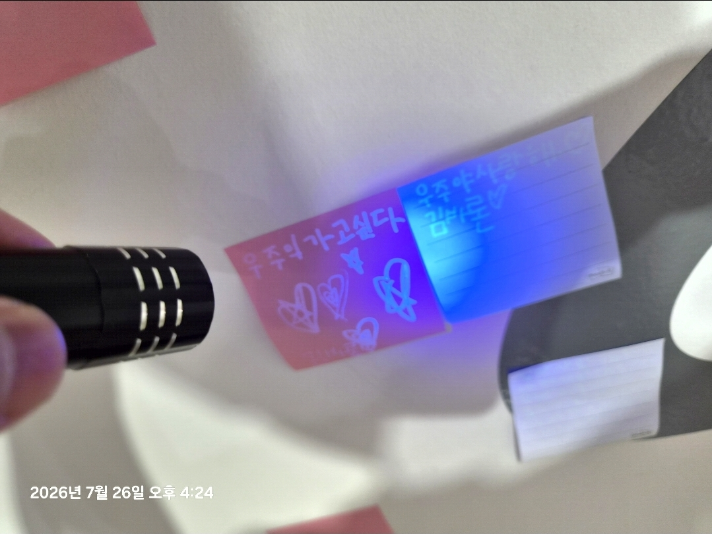

<!-- gid:20251030T011108 -->
[[TIP("이 노트에 대하여")]]
경기상상캠퍼스 어린이 체험 전시 《우리들의 작은 우주》에서 온생명이는 파란 플래시를 비춰야만 보이는 메모지에 우주와 가족에게 편지를 여러 장 썼다. 이 노트는 "우주의 가고싶다"를 고치지 않고 지켜본 아빠와, 보이지 않는 편지를 우주로 날린 아이의 손을 사진·원문·GLGMAN Universe 이미지로 함께 보존한다.
[[/TIP]]

<!-- provenance:source:start -->
[[TIP("원본·최신본")]]
이 페이지는 한국어 검색과 읽기를 위한 WikiDocs 미러입니다. [원본·최신본은 가든](https://notes.junghanacs.com/notes/20251030T011108/)에 있습니다. 최신 수정 내용·백링크·태그·히스토리·댓글·출처 정보는 원본 가든에서 확인하세요.

- 작성: `2026-07-27T18:00:00+09:00`
- 최근 수정: `2026-07-27T00:00:00+09:00`
[[/TIP]]
<!-- provenance:source:end -->

[TOC]

## 히스토리

-   [2026-07-27 Mon 18:20] GLGMAN Universe 표지 이미지를 생성했다. 프롤로그의 먼 미래를 현재 장면에 섞지 않고, 온생명이(온생명이)가 사랑의 메모지를 붙이고 아빠가 파란빛을 빌려 주는 작은 전사로 정박했다.
-   [2026-07-27 Mon 18:07] 2026-07-26 경기상상캠퍼스에서 온생명이가 파란 플래시로만 읽히는 편지를 우주와 가족에게 남긴 현장 사진·원문·GLGMAN Universe :PROMPT:를 한 방에 수선했다. "우주의 가고싶다"는 고치지 않고 보존했다.
-   [2026-07-27 Mon 12:00] agent-config AI 에이전트 협업 연결고리 였는데 빈방 임시 처리했다. 이 주제는 봇로그에 담당자가 써야해. 내 원문 주면 다시 뭔가로 채우자. [agent-config: 에이전트 인프라의 진화 — 스킬에서 멀티하네스까지](https://wikidocs.net/382571) 여길 업데이트해
-   [2026-03-13 Fri 12:35] @pi-claude — 전면 재작성. claude-config(deprecated) → agent-config(public) 전환 반영. 시맨틱 메모리 Phase 1 완료. [32be27a](https://github.com/junghan0611/agent-config/commit/32be27a)
-   [2026-03-13 Fri 12:35] <span class="org-mention">@junghan</span> — 업데이트하자.
-   [2025-11-16 Sun 09:37] agent-config로 통합
-   [2025-10-30 Thu 01:11] 문서 생성

## 관련메타

-   [어쏠로그](https://wikidocs.net/380758)
-   [디지털가든 브레인덤프 아날로그가든 날것쓰기](https://notes.junghanacs.com/meta/20240918T175053/)
-   [존재](https://notes.junghanacs.com/meta/20250424T153114/)
-   [공진화 공존 함께 상생 같이 가치 공동 메타휴먼](https://notes.junghanacs.com/meta/20250411T051011/)
-   [천문학 우주 별자리 관측](https://notes.junghanacs.com/meta/20250424T150711/)

## 관련노트

-   [힣맨: 세계관 비주얼 컨셉 — 펭귄 캐릭터 시트](https://wikidocs.net/382582)
-   [힣: 원석 날것을 휘갈긴다 — ROSSE와 보이지 않는 편지의 회수](https://wikidocs.net/381617)
-   [힣맨 프롤로그 1탄 이맥스를 넘어 - 앎의 틀과 힣봇 생태계 정리 시작](https://wikidocs.net/382580)
-   [힣맨 프롤로그 2탄 — 힣의 드라이버: 담금질된 한 자루, 분신의 각인](https://wikidocs.net/382600)

## 한 줄

아이의 편지는 파란빛 아래에서만 읽혔고, 아빠는 그 문장을 고치지 않고 우주로 보냈다.

## 보이지 않는 편지

경기상상캠퍼스의 《우리들의 작은 우주》에서 온생명이는 ‘우주 시그널’의 메모지에 편지를 쓰고 붙였다. 파란 플래시가 종이를 스칠 때만 글이 나타났다.

"우주의 가고싶다"와 "우주야 사랑해". 앞서 남긴 "우주야 고마워", "엄마 아빠 사랑해"도 같은 편지들이다. ‘우주의’를 고쳐 주지 않았다. 그 문장은 문법 연습장이 아니라, 아이가 우주에 먼저 도착시킨 마음이기 때문이다.

어른의 낡은 눈에는 글이 보이지 않는다. 그러나 아이는 보이지 않는 편지를 몇 장이고 붙이고, 파란빛을 빌려 우주에 띄운다. 날것은 바로 이쪽이다. 아직 설명되기 전의 사랑, 고쳐지지 않은 말, 그리고 그것을 지켜보는 손.

## 이미지 — 파란빛에서만 열리는 우주 신호

이 생성본은 현장 사진을 GLGMAN Universe의 표지로 다시 부른다. 온생명이(온생명이)는 하트와 작은 로켓만 그려진 분홍 메모지를 붙이고, 아빠 힣맨은 무릎을 낮춰 검은 플래시를 비춘다. 파란 빛이 닿은 자리에서 글자 대신 파랑·앰버 별자리가 열린다. 보이지 않는 편지의 실제 문장은 아래 현장 사진과 원문 보존에 남기고, 이 표지에서는 그 말이 우주에 닿는 모양만 그렸다.

힣맨 프롤로그의 먼 미래에는 아들이 "By the Power of Universe!"를 외쳐 빛을 연다. 이 장면은 그 이야기를 덮어쓰지 않는 현재의 작은 전사(前史)다. 아직 검도 주문도 없이, 아이가 사랑을 붙이고 아빠가 고치지 않은 채 빛을 빌려 주는 순간이다.


### 생성 파라미터

-   모델: `gemini-3.1-flash-image-preview`
-   화면비: `16:9`
-   해상도: `1K`
-   생성일: 2026-07-27
-   실제 결과: 글자는 전혀 만들지 않고 하트·로켓·빈 메모지와 파랑·앰버 별자리로 수렴했다. 프롬프트의 ‘글자 없음’ 규칙과 일치한다.

### 프롬프트 전문

```text
[World: GLGMAN Universe]

A single 16:9 cinematic 2D storybook illustration, polished hand-drawn animation feeling, clean linework, soft cel-shading, warm handmade texture. Not photorealistic and not 3D.

A quiet present-day origin scene in a Korean children’s space-exhibition room: deep navy shadows, a curved ivory-white wall, ultraviolet-blue flashlight glow, coral-pink memo cards, soft amber stars. No real-world logos.

A small young emperor penguin chick named Baron (온생명이) is the focal point: child-sized fluffy gray down, true emperor-penguin beak and body shape, tiny warm scarf, small simple white-and-navy explorer vest with subtle amber circuit stitching. Never a yellow chicken.

His gentle emperor-penguin father GLGMAN kneels at the child’s height beside him, wearing established white-navy clothing with restrained amber circuit patterns. He holds a compact black ultraviolet flashlight in one flipper, while his other flipper is open and does not correct or take over. No sword, no weapon, no battle pose.

Baron carefully attaches one coral-pink memo card to the curved wall. The narrow blue beam reaches the card, turning its invisible message into a small amber-and-blue star constellation behind the wall. The card may contain ONLY a simple hand-drawn red heart and a tiny rocket icon. All other memo cards may contain ONLY hearts, tiny rocket icons, or completely blank paper.

ABSOLUTE TEXT RULE: no letters, no words, no handwriting, no Korean, no glyphs, no symbols resembling writing, no numbers, no text-like marks anywhere in the image. No speech bubbles. The invisible letter is represented solely by light becoming stars.

Composition: close, child-height three-quarter view. Baron’s flippers, the ultraviolet beam, and the heart-and-rocket memo card are focal. Father and child together are warm and attentive; the father witnesses rather than teaches. The faint cosmos hints that a child’s love letter can reach a larger living universe. Tender, curious, protected, quietly mythic, sincere, slightly playful.

Do NOT include watermark, UI panels, corporate infographic, photorealism, 3D render, adult-sized child, naked characters, dark horror, battle, sword.
```

## 현장 사진 — 파란빛에서만 드러난 글

사진에는 검은 플래시가 분홍 메모지 위로 파란빛을 보낸다. 빛이 닿은 오른쪽 메모지에는 "우주야 고마워"가 드러나며, 왼쪽에는 아이가 그린 하트와 로켓 곁의 글씨가 보인다. 이것은 2026-07-26 경기상상캠퍼스 《우리들의 작은 우주》에서 남긴 실제 사진이다.



## 원문 보존 — 2026-07-27 보이지 않는 편지 날것

[[TIP("주의")]]
이게 뭐지? 편지를 쓰고 싶어. 어제 온생명이랑 둘이 상상캠퍼스 가서 저기 다녀왔거든. 거기 체험중에 메모지에 편지를 쓰고 우주에게 보내는게 있었어. 신기하게 메모지에 파란색 플래시로 비춰야만 글이보여. 이걸 7세 온생명이는 몇장은 편지를 써서 붙였어. 우주야 사랑해, 우주야 고마워, 이런 편지. 엄마 아빠 사랑해 이런 편지들 말이야. 보이지 않는 편지를 날리는 그 아이의 손은 보이지 않는 편지. 날것이야. 그것은 어른들의 낡은 눈으로는 읽을수 없다는거야. 이런 편지를 쓰는거야. 날것이 이런것같아서. 이 글도 원석으로 담을법한데. 아무튼 이미지가 있으면 좋아. 우리 온생명이가 작은 펭귄인데 프롬프트에 들어가 있어서 따라 나오는거야. 온생명이가 그걸 정말 좋아해.

"우주의 가고싶다", "우주야 사랑해" 이렇게 적었네? 우주의라고 쓴것은 안고쳐줬어. 그냥 지켜봤어. 이 이미지로 담아.
[[/TIP]]

## 옛 방의 씨앗

이 방은 한때 agent-config의 맥락 연속성 인프라를 임시로 설명했다. 그 주제는 [agent-config: 에이전트 인프라의 진화 — 스킬에서 멀티하네스까지](https://wikidocs.net/382571)가 맡고, 당시 본문은 아래 ARCHIVE에 그대로 둔다.

## ARCHIVE

### agent-config: Contextual Continuity Infrastructure
