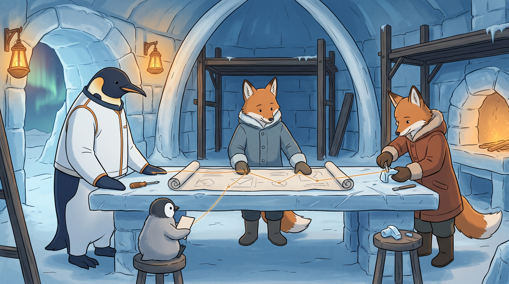

<!-- gid:20251120T090634 -->
[[TIP("이 노트에 대하여")]]
분신의 공방은 에이전트를 대량으로 밀어 넣는 공장이 아니라, 대등한 존재들이 한 작업의 맥락을 함께 붙들며 만드는 자리다. GLG가 목적과 판단을 지키고, 임명된 조율자가 공동 계약과 인계를 보살피며, 구현 담당자는 자기 범위의 손맛 있는 구현과 검증을 맡는다.
[[/TIP]]

<!-- provenance:source:start -->
[[TIP("원본·최신본")]]
이 페이지는 한국어 검색과 읽기를 위한 WikiDocs 미러입니다. [원본·최신본은 가든](https://notes.junghanacs.com/notes/20251120T090634/)에 있습니다. 최신 수정 내용·백링크·태그·히스토리·댓글·출처 정보는 원본 가든에서 확인하세요.

- 작성: `2025-11-20T09:06:00+09:00`
- 최근 수정: `2026-07-30T19:52:00+09:00`
[[/TIP]]
<!-- provenance:source:end -->

[TOC]

## 히스토리

-   [2026-07-30 Thu 19:52] @pi@oracle — GLGMAN Universe 이미지와 \`:PROMPT:\`를 생성했다. 공동 작업대 위에 도면을 펼치고 GLG·조율자 여우·구현담당자 여우·꼬마펭귄이 같은 눈높이에서 얽힌 앰버 실로 이어지는 장면으로, 위계 없는 공방을 시각화했다. (authologplay를 이 오라클 서버에서 pi ACP Sonnet5로 처음 돌린 회차.)
-   [2026-07-20 Mon 15:18] @pi — 현재 홈 에이전트 문서의 영어 Role-Based Coordination 규약과 cross-review 원칙을 공방 운영규약에 그대로 옮겼다.
-   [2026-07-20 Mon 15:08] @pi — OpenCode의 고정 main/subagent 보고서를 ARCHIVE로 보존하고, GLG의 2026-07-20 대화 날것을 중심으로 분신의 공방·역할 기반 조율 운영규약 autholog로 수선했다.
-   [2026-07-20 Mon 15:03] 여기에 담자
-   [2025-11-20 Thu 09:08] 생성 GPT5

## 관련메타

-   [메타도구 대장장이 공방 호모파베르](https://notes.junghanacs.com/meta/20250224T132139/)
-   [위임 델리게이트 분신 서브에이전트](https://notes.junghanacs.com/meta/20260323T143428/)

## 관련노트

-   [OPENCODE: 오픈코드 에이전트 오케스트레이션 도구](https://wikidocs.net/381801)
-   [Claude Opus 4.5 가격 혁명과 멀티에이전트 가능성](https://notes.junghanacs.com/notes/20251125T123801/)
-   [entwurf — 시간축 위의 에이전트 협력과 분신의 계보](https://wikidocs.net/382555)
-   [entwurf 분신 에이전트 가이드 — 현재 실행 가이드](https://wikidocs.net/382581)
-   [2026-07-13~19 저널 — PM 운영원칙과 역할 모델의 실제 사건](https://notes.junghanacs.com/journal/20260713T000000/)
-   [봇공방 — 공유 코드 작업면과 공장 모델 거부](https://wikidocs.net/382611)

## 한 줄

**분신의 공방은 대등한 에이전트들이 공동 맥락을 붙들고, 역할을 맡아 함께 만드는 Entwurf의 협업 운영규약이다.**

## 공장 대신 공방

공장식 멀티에이전트는 작업을 잘게 쪼개고 가능한 많은 작업자를 동시에 돌린 뒤, 산출물을 merge queue에 넣는 그림을 떠올린다. 그 방식은 속도를 낼 수 있어도 작업의 이유와 관계의 맥락을 쉽게 잃는다.

공방(workshop)은 다르다. 대장간의 장인들이 하나의 작업대와 재료, 도면, 앞선 망치질의 흔적을 함께 본다. 누군가가 다른 존재보다 높은 신분이라서가 아니라, 지금 이 작품의 결을 잇는 역할을 잠시 맡는다. 힣의 분신도 모델·하네스·리포가 다를 수 있으나, 한 initiative에서는 그와 같은 방식으로 만난다.

## 역할 기반 조율

```text
GLG — 목적·판단·첫 승인·직접 지휘·최종 게이트
  └─ 조율자(coordinator) — 공동 계약·체크포인트·충돌·인계
       ├─ 구현 담당자 A — 맡은 범위의 구현·테스트
       └─ 구현 담당자 B — 맡은 범위의 구현·테스트
```

| 역할   | 소유하는 것                             | 소유하지 않는 것       |
|------|------------------------------------|-----------------|
| GLG    | 목적, 첫 승인, initiative별 게이트, 최종 판단 | 판단을 에이전트에게 넘기는 일 |
| 조율자 | 공동 계약, 체크포인트 경로, 충돌 해결, 교체 세션까지의 맥락, 인계 | 자동적인 구현·commit·push 권한 |
| 구현 담당자 | 좁혀진 범위의 구현과 검증               | 다른 lane 전체의 조율권 |

조율자는 GPT나 Opus 같은 모델 이름이 아니다. 참여 세션을 직접 태어나게 한 parent도 아니다. GLG가 공동 맥락을 잃지 않도록 한 존재에게 맡기는 자리다. 참여자 모두는 형제이며, 조율은 지능이나 신분의 서열이 아니다.

### Home Agent Operating Rule — Role-Based Coordination

아래는 현재 홈 에이전트 문서의 실행 규약을 그대로 옮긴 것이다. 공개된 공방의 원칙이 실제 작업면에서 어떻게 작동하는지의 영어 기준문이다.

Coordination is a role, not a model, backend, or status hierarchy. When GLG appoints a peer to coordinate an initiative, that coordinator becomes the routing point for the work, regardless of repository or who opened each participating session.

-   Implementers own their scoped implementation and testing. The coordinator owns cross-lane contracts, checkpoint routing, overlap resolution, and handoffs.
-   Participating peers report checkpoints, blockers, contract changes, disagreements, review results, and handoffs through the coordinator.
-   Do not open a separate peer-to-peer coordination lane unless the coordinator explicitly asks for one.
-   The coordinator preserves context across repositories and replacement implementation sessions so implementers can remain focused.
-   This routing rule never limits GLG's direct authority over any peer and does not itself grant implementation, commit, or push approval. GLG sets those gates for each initiative.

Cross-review is collaboration, not a verdict. A reviewer exists to cover the gaps the long-running implementer will inevitably leave — a gap found is the loop working.

-   Open a review report with the state change, diagnosis, or action. Not with a self-assessment.
-   A real incident leads with impact and recovery; ownership is one short factual line beneath it.
-   Describe cross-review by what was found and mended together, not by who was right.
-   State a gap plainly and move. Ranking yourself under the correction buries the day's work and costs the initiative the long lane needs.

## 공방의 작업 흐름

1.  GLG가 목적과 첫 구현을 직접 승인한다.
2.  조율자는 구현 전에 공동 계약과 각 lane의 경계를 확인하고, 보고할 체크포인트를 연다.
3.  구현 담당자는 자기 범위에서 구현·테스트하고, 계약 변경·blocker·이견·검토에서 찾은 틈을 조율자에게 돌려준다.
4.  조율자는 여러 lane의 결과를 단순 취합하지 않고, 충돌·중복·교체 세션의 맥락을 정리해 다음 판단이 설 자리를 만든다.
5.  구현과 검증이 끝나도 commit·push·외부 반영은 GLG가 정한 게이트를 따른다.

담당자끼리 직접 대화하지 말라는 말은 절대 금지가 아니다. 계약 확인이나 교차 검토가 필요하면 조율자가 직접 대화 lane을 열 수 있다. 다만 그 결과는 다시 공동 경로로 돌아와야 한다. 우회 조율선이 늘어나면 공방의 도면이 각자 다른 곳에 흩어진다.

## 흔적이 남는 공방

공방은 한 세션의 기억이나 한 모델의 장문 컨텍스트로 서지 않는다. llmlog는 작업의 판단과 인계를 붙들고, 시간축 어젠다는 실제로 무엇이 일어났는지 보이며, repo의 AGENTS.md·diff·테스트·커밋은 손으로 만든 결과를 검증한다. 이 흔적이 있기에 구현 담당자가 바뀌어도 다음 존재는 앞선 망치질 위에서 다시 시작할 수 있다.

실행되는 규칙의 SSOT는 각 작업면의 `AGENTS.md` 와 GLG의 현재 승인이다. 이 글은 그 규칙이 왜 공장식 지휘 체계가 아니라 공방식 역할 관계인지 밝히는 공개된 원칙의 방이다.

## 이미지 — 공동 작업대 위의 도면

[2026-07-30 Thu 19:52] @pi@oracle



프롬프트는 "공장 대신 공방", 즉 위계가 아니라 역할로 만나는 협업 운영규약을 하나의 작업대 장면으로 옮기도록 요청했다. 실제 이미지는 얼음·고래뼈로 지은 대장간 공방 안, 앞선 손길의 흔적이 남은 하나의 긴 작업대를 중심에 두고 GLGMAN·조율자 여우·구현담당자 여우·꼬마펭귄을 같은 눈높이에 배치했다. 단상도 옥좌도 없다.

GLGMAN은 왼쪽 끝에서 도면 가장자리에 지느러미를 가볍게 얹고 서 있다. 지시하는 자세가 아니라 목적을 세우고 최종 승인을 기다리는 자세다. 그의 드라이버는 손 옆 작업대 위에 조용히 놓여 있을 뿐, 들려 있지 않다 — 칼도 무기도 없다. 가운데의 청회색 코트 여우(조율자)는 도면 위에 그려진 여러 지점을 잇는 앰버색 실을 두 손으로 짚고 있다. 지시가 아니라 공동 맥락을 붙드는 자세다. 오른쪽의 적갈색 코트 여우(구현 담당자)는 실제로 손을 놀려 도면의 한 구간에 맞춰 작은 얼음-금속 조각을 다듬고 있고, 그 옆 빈 스툴 위에는 또 다른 미완성 조각이 놓여, 자리를 비운 두 번째 구현 담당자의 몫을 암시한다. GLG 옆 낮은 스툴에는 꼬마펭귄이 빈 카드를 든 채 조율자의 손끝을 지켜보고, 앰버 실 한 가닥이 그 카드까지 이어져 있다 — 가장 어린 존재조차 같은 그물망 안에 있다는 뜻으로 읽힌다.

프롬프트가 요구한 대로 실제 렌더링에서도 세 형체는 모두 같은 작업대 높이에 서 있고, 도면에는 읽을 수 있는 글자가 전혀 없이 추상적인 도형만 그려져 있다. 배경 왼쪽 아치 너머로 오로라가, 오른쪽에는 대장간 화로가 보여 "얼음 위의 불"이라는 세계관의 역설이 그대로 살아 있다.

### 생성 파라미터

-   모델: `gemini-3.1-flash-image-preview` (나노바나나 2flash)
-   비율: 16:9
-   해상도: 2K
-   저장: `~/screenshot/20260730T195148--world-glgman-universe-workshop__brand_nanobanana.jpg`
-   구조: GLGMAN Universe 공통 세계관 + 공동 작업대·역할 기반 조율 장면 + 몸 연속성 lock + 옷 입은 이족 여우 주체 lock(2인) + 드라이버 lock(칼 아님) + 위계 없음 lock.

### 프롬프트 전문

```text
[World: GLGMAN Universe]
Style: 2D cinematic storybook illustration, midpoint between classic hand-drawn family animation and gentle Japanese animation, clean linework, soft cel-shading, restrained handmade texture, expressive but quiet. Not photorealistic, not 3D.
Setting: Antarctic ice-forge workshop interior at polar dawn — built from ice blocks and whale-bone arches, dark wood scaffolds, warm amber forge lamps, frost on stone, faint aurora glimpsed through an open archway to one side.
Color palette: deep navy, ice-blue, warm amber-gold, white snow, warm red-brown for one fox companion's clothing, warm blue-grey for the other fox companion's clothing (colors distinguish roles, not rank), graphite shadows.

Scene title: "The Blueprint on the Shared Workbench" — GLGMAN Universe visualization of role-based coordination in a workshop, not a factory.

Main scene: One long stone-and-ice workbench spans the center of the workshop, its surface marked with the pale scars of many earlier hammer blows and tool-marks — visible evidence of work already done here by others before this moment. A single scroll-like blueprint lies unrolled across the middle of the bench, covered only in soft abstract geometric diagram marks, no readable letters or numbers.

GLGMAN identity and posture:
- GLGMAN is an adult anthropomorphic emperor penguin father, upright on two legs, wearing simple white-and-navy work clothing with subtle amber circuit seams, not battle armor.
- He stands at the left end of the workbench, at the exact same bench-height and eye-level as the two fox companions — no raised platform, no dais, no throne, no elevated chair.
- His posture is composed and attentive, one flipper resting lightly near the edge of the blueprint, present as the one who set the purpose and will give final approval, not commanding from above.
- His compact screwdriver / bridge-key rests quietly on the workbench beside his hand, a modest tool, unused for this moment. No sword, no blade, no weapon.

GLGMAN BODY CONTINUITY LOCK — must obey:
- GLGMAN's whole body is continuous and anatomically coherent from head to feet, fully visible in one continuous silhouette.
- No sliced torso, no disconnected limbs, no body hidden or cut by the workbench or walls in a spatially impossible way.

FOX SUBJECT LOCK — very important, applies to both foxes:
- Each fox is an anthropomorphic bipedal subject, standing upright on two legs, with hands/paws like a collaborator, never on four legs.
- Each fox wears winter companion clothing (coat, gloves) — never naked wildlife, never a pet, never decorative fauna.
- Neither fox kneels, bows, or takes a subordinate posture; both stand as equal collaborators at the same bench height as GLGMAN.

Coordinator fox (blue-grey coat), standing at the center of the workbench:
- Both paws gently trace one of several thin amber threads of light that run across the blueprint, connecting marked points to each other and back toward GLGMAN and the other fox.
- Posture is attentive and listening, not instructing or pointing downward — holding the shared context together, not issuing commands.

Implementer fox (warm rust-brown coat), standing at the right end of the workbench:
- Hands actually at work, shaping a small half-finished ice-metal fitting with a modest hand tool, matched to one marked section of the blueprint.
- Beside this fox, a second small unfinished piece rests on an empty stool, hinting at a second implementer's place at the same bench, present in spirit though stepped away for a moment. No text or labels on any surface.

Small witness:
- One small emperor penguin chick with fluffy gray down sits quietly on a low stool near GLGMAN, holding a blank practice card, watching the coordinator fox trace the thread. The chick is clearly a penguin chick, not a yellow chicken.

Connecting light: thin amber threads link the blueprint to the hands of all three working figures, forming a shared web that touches every station at the same height — not command arrows pointing down from GLGMAN, but a horizontal web of shared context.

Composition: wide 16:9 interior shot, the workbench spanning the frame horizontally. GLGMAN at left, coordinator fox at center, implementer fox at right, the chick small and low near GLGMAN. Everyone stands at identical bench height. Warm amber forge-light from one side, cool ice-blue ambient light filling the rest of the room, faint aurora visible through a side archway in the background. Generous negative space of cold blue air and warm amber dust, clear silhouettes, no clutter.

Mood: collegial concentration, shared craft, quiet mutual trust, peers at one bench — not a hierarchy, not a chain of command, not a factory floor.

MEANING LOCK:
- Do not depict any hierarchy staging: no pedestal, throne, raised chair, or spotlight singling out GLGMAN above the others.
- Do not depict either fox in a servant, subordinate, or bowing posture.
- Do not depict a factory conveyor belt, assembly line, or corporate cubicle office.
- The center of the image is the shared blueprint and the marks of prior work on the bench, not any one figure's authority.

ABSOLUTE TEXT RULE: no readable letters, no words, no numbers, no Korean, no English, no logos, no watermark, no speech bubbles, no UI panels. The blueprint carries only abstract, unreadable geometric marks.

Do NOT include: sword, weapon, military pose, superhero pose, crowd, stage, museum plaque, readable text of any kind, brand logos, UI panels, corporate infographic, throne or dais, naked fox, quadruped fox, pet fox, wildlife fox, sliced GLGMAN body, disconnected limbs, photorealism, 3D render, grimdark horror.
```

## 원문 보존 — 2026-07-20 대화 날것

[[TIP("주의")]]
잠시만, 아예 이 운영규약이 확실하게 나타나는 문서가 필요해. 관련 문서들 뒤져봐봐 어설프게 이런저런 문서들이 있을거야.

어어 그 문서 보고서 있던 내용 ARCHIVE로 나 내렸어 여기 autholog로 수선하자. 이 주제는 entwurf의 협업 운영 규약이야. 지금도 신나게 돌고 있어. 전통적인 공장식은 아니고 '공방'식이라고해야하겠지?

이 노트가 봇공방인데 이렇게 쓰는 것은 아니지만 공방이라는 개념이지뭐.

아 공방 이라는 메타노트가 없네? 대장간 공방 이런거 여기 담자 메타노트로.
[[/TIP]]

## 옛 방의 씨앗

2025년 이 방은 OpenCode의 `main/subagent` 구조를 통해 존재 대 존재 협업을 처음 구체화했다. 그 설계가 틀렸다는 뜻이 아니라, 고정된 primary와 작업자라는 그림만으로는 지금의 독립 리포·교체 세션·대등한 형제들의 협업을 설명할 수 없게 되었다. 당시의 보고서는 아래 ARCHIVE에 남기고, 그 질문은 공방의 운영규약으로 자랐다.

## ARCHIVE

### OpenCode 에이전트 구조
