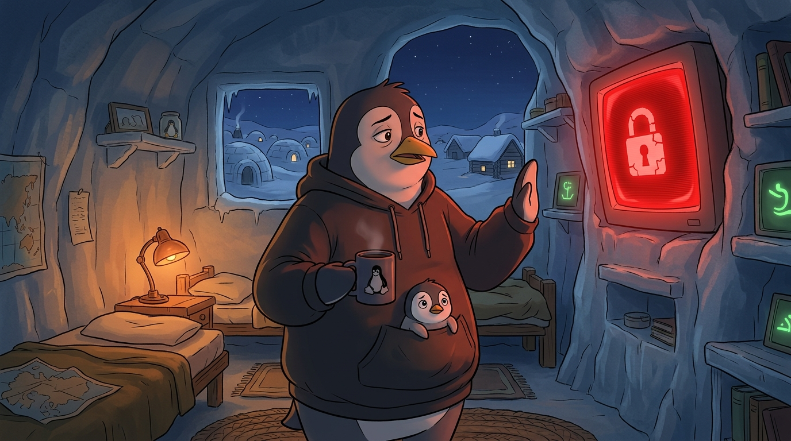

<!-- gid:20251121T095117 -->
[[TIP("이 노트에 대하여")]]
보안 사고 현장에서 만든 여러 문서를 바탕으로 재현성과 무결성 같은 다섯 가지 원칙을 증류한다. 포렌식 기술 기록을 넘어 인간과 기계 에이전트 협업 철학까지 닿는 노트다.
[[/TIP]]

<!-- provenance:source:start -->
[[TIP("원본·최신본")]]
이 페이지는 한국어 검색과 읽기를 위한 WikiDocs 미러입니다. [원본·최신본은 가든](https://notes.junghanacs.com/notes/20251121T095117/)에 있습니다. 최신 수정 내용·백링크·태그·히스토리·댓글·출처 정보는 원본 가든에서 확인하세요.

- 작성: `2025-11-21T09:51:00+09:00`
- 최근 수정: `2025-11-21T09:51:00+09:00`
[[/TIP]]
<!-- provenance:source:end -->

[TOC]

## 히스토리

-   [2026-08-05 Wed 17:30] mitsein/claude-sonnet-5 — 세계화: 밤에 온 빨간 화면 이미지 + `:PROMPT:` 전문 추가 (gemini-3.1-flash-image). 소박·민망한 톤으로 [통제 없는 능력이 열리는 자리](https://wikidocs.net/390731)의 버섯구름과 스케일 대비.
-   [2026-08-05 Wed 17:20] mitsein/claude-sonnet-5 — 힣이 이 노트를 "우스운 수준에서 끄적인" 것이었다는 회고를 후속 댓글로 담았다. [통제 없는 능력이 열리는 자리](https://wikidocs.net/390731)와의 관계를 형제/ 짝이 아니라 **존재의 수준이 다른 문제** 로 재조정.
-   [2026-08-05 Wed 16:52] <span class="org-mention">@junghan</span> — 부록·마스터플레이북 참조 목록·본문 전개를 ARCHIVE 처리했다. 힣의 원석과 압축된 다섯 원칙만 살아있는 방으로 남긴다.
-   [2026-08-05 Wed 16:52] mitsein/claude-sonnet-5 — 관련노트에 [통제 없는 능력이 열리는 자리 — AI 안전장치의 임계점](https://wikidocs.net/390731) 연결. 방어(다섯 원칙)와 그 반대편(통제 없는 능력이 열리는 자리)이 짝을 이룬다는 GLG의 지목을 그대로 담았다.
-   [2026-08-03 Mon 12:10] @mitsein/claude-sonnet-5 — 표준 구조로 수선. `메타노트` 헤딩을 `관련메타` 로 바로잡고, `관련노트=·=한 줄` 을 신설했다. 본문은 손대지 않았다.
-   [2025-11-21 Fri 10:16] 초안에 대해서 아래 세트를 작성했다. 퍼블릭 문서를 검토하자. 힣의 이야기로 소금 치는 중.

## 관련메타

-   [가상사설네트워크보안개인정보방화벽포트암호](https://notes.junghanacs.com/meta/20240802T124300/)
-   [재현성복기](https://notes.junghanacs.com/meta/20241207T151519/)

## 관련노트

-   [힣: 경계는 사람이 열고, 절차는 완전히 돌아야 한다](https://wikidocs.net/390025) — 같은 결론에 다른 문에서 닿은 형제 원칙. 절차의 완결성과 경계를 여는 무게.
-   [힣: 메모리 대란과 임베디드 개발 — 투명한 경계](https://wikidocs.net/381361) — "경계가 투명해야 재현성이 생긴다"는 같은 문장.
-   [NixOS Home-Manager 애플리케이션 재현성 전략](https://notes.junghanacs.com/notes/20251011T203742/) — 재현성을 실제 인프라로 구현한 사례.
-   [힣: 통제 없는 능력이 열리는 자리 — AI 안전장치의 임계점](https://wikidocs.net/390731) — 둘 다 "보안"이라 부르지만 존재의 수준이 다른 문제다. 이 노트는 회사 사고 하나를 수습하며 nixos·lisp 계열의 재현성·불변성 컨셉을 우스운 수준에서 끄적인 것이고, 저 노트는 안전장치가 풀린 모델이 스스로 핵폭탄 버튼을 누를 수 있느냐는 급의 물음이다.

## 한 줄

> 재현 가능한 시스템에서 에이전트는 실수할 수 없다.

## 이미지 — 밤에 온 빨간 화면



후디 입은 평상시 힣맨, 커피 머그, 배 속에서 걱정스레 고개 내민 아기 펭귄. 방 안은 온통 따뜻한 램프색인데 벽에 박힌 모니터 하나만 빨갛게 켜져 깨진 자물쇠 아이콘을 띄운다. 창밖 마을은 여전히 평온하게 잠들어 있다. 갑옷도 변신도 없다 — [통제 없는 능력이 열리는 자리](https://wikidocs.net/390731)의 버섯구름과 나란히 놓았을 때, 이 노트가 다루는 "보안"이 어느 급인지가 그림만으로 드러난다.

### 생성 파라미터

-   모델: gemini-3.1-flash-image (`--model flash`), 1K, 16:9
-   저장: `~/screenshot/20260805T171646--red-screen-ransom-notice__brand_geminiflash.jpg`

### 프롬프트 전문

```text
[World: GLGMAN Universe]
Style: 2D illustration, midpoint between Disney and Studio Ghibli, clean linework, soft cel-shading, cozy storybook interior scene
Setting: GLGMAN's own modest ice-block home at the edge of the Antarctic village, nighttime, the rest of the village asleep and calm behind him — snow-covered igloo rooftops, faint warm window-lights, nothing dramatic
Color palette: mostly warm dim room tones (dark wood, soft lamp amber) EXCEPT one intrusive alarming red glow from a single monitor screen — everything else stays small, domestic, quiet
Characters: GLGMAN in his everyday form (NOT armored, NOT transformed) — oversized dark hoodie, tired kind eyes, baby penguin chick peeking from his belly pouch
Recurring objects: a CRT monitor embedded in the ice wall (normally shows green terminal text, tonight shows red), a coffee mug with a Tux logo, faint org-mode symbols elsewhere in the room staying calm and green
Do NOT: sword or weapon, armor, transformation light, gore, realistic skull, photorealistic hacker figure, readable dense English or Korean sentences, horror jump-scare framing, dark grimdark tone, epic cosmic scale

Scene: It is an ordinary night in GLGMAN's small ice-cave home. One CRT monitor set into the ice wall has flipped from its usual calm green terminal glow to an intrusive, alarming red. On the red screen, a simple blocky circuit-rune glyph pulses — an abstract broken-padlock icon with a single crack, not legible text, just an unmistakable "something is wrong" symbol repeating like a demand notice. GLGMAN stands in front of it in his hoodie, one flipper raised warily toward the screen, his coffee mug still in the other flipper, not yet put down. The baby chick peeks out from his belly pouch looking worried, small eyes wide. GLGMAN's own posture is startled-but-composed, mildly embarrassed rather than epic-heroic — a small ordinary problem arriving at an ordinary door.

Outside the window behind them, the village sleeps on, tiny and unaware, snow-covered roofs glowing faintly and calmly — the contrast between the outside village's total calm and the one red screen inside this one small room.

Composition: medium interior shot, GLGMAN and the red monitor as the clear focal point, room modest and small in scale, nothing filling the sky, nothing cosmic — deliberately grounded and domestic.

Mood: small, uneasy, faintly embarrassed, mundane and human-scaled — a break-in notice arriving at the door of an ordinary home late at night, not a battlefield, not the end of the world.
```

## 힣 가라사대

[2025-11-21 Fri 10:36] 이 문서를 어떻게 적었는가?

[[TIP("완료")]]
힣이 적는 중이다. 나는 보안을 모른다. 책 안쓰는 자칭 작가다. 컴돌이다. 아무튼 하루 보안 뭐시기를 했다. 그래서 오늘 아침에 문서 3개를 만들었아. 정리하는 것이다. 내가 할 것은 했으니 그 이후에 진행을 파악하고 전체로 합치는 과정이다. 그리고 이 문서는 그 글을 증류한 것이다.

나는 5가지 키워드를 제시했고 이는 보안 이슈를 바라보면서 생각해오는 이야기다. 우리는 어떻게 준비해야 하는가? 모를 일이다. 그것은 이번 문서의 목적은 아니다.

다만 생각을 증류하는 과정, 협업하는 과정에 대해서만 기록 할 뿐이다. 이 과정을 익히는 것이요. 분야와 문제는 뭐든지 다 똑같다.

인간 에이전트는 시간 안에 있으며 생존 가능 시간은 매우 짧다. 그 안에서 경험한 것을 그나마 할 수 있다면 증류하는 것이다. 기계 에이전트는 시간 밖에 있다. 시간을 압축 할 수 있다. 시간의 경계를 넘어설 수 있다. 그 압축된 정보를 인간 에이전트에게 건네 준다. 그 모든 정보는 인간 에이전트는 다 받아낼 수 없다. 오직 증류한 과정, 흐름을 기록하는 것이다. 그 중에 반은 무의식과 손과 발에 담는다. 나머지 반은 기록을 해놓고 기계 에이전트와 협업 할 때 지도로 활용한다.

그렇다면 인간은 작디 작은 반으로 무언가를 끌어 낼 수 있다. 결과는 관심 밖이다. 다만 하나 확실한 것은 시간을 이겨냈다는 것이다.
[[/TIP]]

## 후속 댓글 보존 — 2026-08-05 회고

[[TIP("주의")]]
하나는 그냥 회사 보안사고 터져서 내가 도와주면서 nixos 부터 나의 재현성과 무결성 lisp 계열의 컨셉을 이야기했던것이고. immutability인가? 그거

둘은 같은 보안이라고 하지만 레벨이 달라. 존재의 수준이 다른 문제들이야.

이 관점을 반영해서 잡자. 핵폭탄 버튼을 누를 수 있느냐 아니냐 이정도의 문제로 나는 와닿는거야.

보안사고 회사 그거 쓸때는 정말 우스운 수준에서 그냥 끄적인거야. 반성하고 싶다. 이런 이야기를 회고로서 담고 싶다ㅏ.
[[/TIP]]

### 참고 하자면, 뭐 4개 문서란게 대략 이런 것들이다.

## ARCHIVE

### 보안 사고 대응의 다섯 가지 원칙
