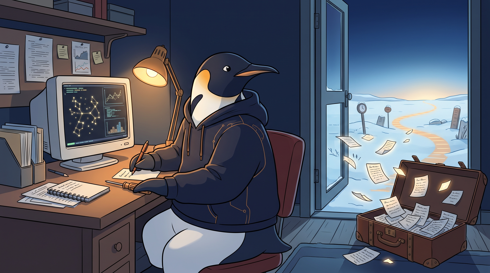

<!-- gid:20251122T210521 -->
[[TIP("이 노트에 대하여")]]
2025년의 에이전트 시스템 메모가 세운 마이크로(구현·생존)와 매크로(삶 전체·존재)의 물음 위에, 2026년 원석은 루이스 모네다의 생업과 페르난두 페소아의 트렁크를 거울로 놓는다. 실패의 늪에서도 날것을 시간축에 던져 온 디지털가든을, 살아있음의 외침으로 다시 읽는 어쏠로그다.
[[/TIP]]

<!-- provenance:source:start -->
[[TIP("원본·최신본")]]
이 페이지는 한국어 검색과 읽기를 위한 WikiDocs 미러입니다. [원본·최신본은 가든](https://notes.junghanacs.com/notes/20251122T210521/)에 있습니다. 최신 수정 내용·백링크·태그·히스토리·댓글·출처 정보는 원본 가든에서 확인하세요.

- 작성: `2025-11-22T21:05:00+09:00`
- 최근 수정: `2026-08-01T13:37:00+09:00`
[[/TIP]]
<!-- provenance:source:end -->

[TOC]

## 히스토리

-   [2026-08-01 Sat 13:37] @mitsein/gpt-5.6-terra — 원석을 저널과 대조해 다시 읽고, 제목을 생업/ 살아있음의 축으로 압축했다. 자석 없는 beads·llmlog·steveyegge 태그는 걷고, 원문 밖의 다락방 단정과 직함 축소를 바로잡았다. GLGMAN 이미지·생성 파라미터·전문 프롬프트를 보강했다.
-   [2026-08-01 Sat 12:55] @mitsein/claude-sonnet-5 — 아래 모네다·페소아 원석을 원문 보존하고, 관련메타·관련노트·한 줄을 신설해 Steve Yegge/Beads 사례 옆에 두 번째 마이크로-매크로 사례로 앉혔다.
-   [2026-08-01 Sat 10:24] <span class="org-mention">@junghan</span> — 저널 TODO에 루이스모네다·페르난두페소아를 거울삼아 마이크로(생업·전문성)·매크로(존재·살아있음의 외침) 서사를 날것으로 쓰고, 이 노트를 수선 대상으로 직접 지목.
-   [2025-11-23 Sun 15:50] 어쏠로그로 업그레이드 문서는 추후에 마이크로뷰
-   [2025-11-22 Sat 21:05] 생성 매크로뷰와 마이크로뷰

## 관련메타

-   [어쏠로그](https://wikidocs.net/380758) — 원석을 정본으로 회수하고 해설을 더하는 글쓰기 축 자체.
-   [디지털가든 브레인덤프 아날로그가든 날것쓰기](https://notes.junghanacs.com/meta/20240918T175053/) — 완성이 아니라 오늘의 삶이 계속 자라는 공개 공간이라는 축.

## 관련노트

-   [페르난두페소아 불안의 서](https://notes.junghanacs.com/bib/20250409T071611/) — 완결된 저서가 아니라 사후 트렁크에서 나온 미분류 원고 뭉치라는 원형. 아직 다 듣지 못한 채로 가든에 모셔 둔 이유를 이번에 처음 서술했다.
-   [루이스모네다 luismoneda lgmoneda 이맥스 시맨틱검색](https://notes.junghanacs.com/bib/20230710T064200/) — 마이크로뷰(생업·구현력)의 살아있는 사례. 이해하지 못해도 괜찮다는 안도가 자신의 하네스를 다른 구조·질·양으로 키워왔다는 자각으로 이어진다.
-   [힣: 아무도 읽지 않는 블로그 디지털가든 왜 공개 하는가](https://wikidocs.net/381520) — 다락방이든 바깥이든 아무도 읽지 않는다는 전제는 같으며, 공개는 시간축에 던지는 저자성의 선언이라는 논거를 이 원석이 그대로 가져와 쓴다.
-   [힣: 원석 날것을 휘갈긴다 — POSSE 너머 ROSSE, 그리고 일일일생으로의 회귀](https://wikidocs.net/381617) — "나는 ROSSE 방식을 세웠고"라고 직접 호명한 운영 원칙의 원류.
-   [힣: 삶·일·소명·운명애 — 나 자신이 되는 일과 보수](https://wikidocs.net/381589) — 생업, 실패, 자기목적성의 경계를 이미 묻던 인접 어쏠로그.
-   [배수아 소설가 번역가 - 로베르트발저 산책자 막스피카르트 말과언어](https://notes.junghanacs.com/bib/20250222T183157/) — 페소아를 가든으로 모셔온 경로. 번역이 좋아서 찾아간 길이 인간 서사로 이어졌다.

## 한 줄

> 모네다의 마이크로뷰(생업 위에 쌓은 전문성)를 이해하지 못해도 다행이라 여기고, 페소아의 트렁크가 비추는 매크로뷰(실패의 늪에서도 살아있음을 외치는 존재)로 자신의 가든을 다시 확인한다.

## 마이크로:생존, 매크로:창조

[2025-11-23 Sun 15:51]

[힣: 시간과정신의방 -CONFIG 생태계](https://wikidocs.net/381793)에서 말하는 것들은 매크로뷰다. 생존은 마이크로뷰. 이 부분에 대한 에이전틱 시스템에 대한 고민.

## 모네다·페소아 — 생업의 마이크로뷰와 살아있음의 매크로뷰

[2026-08-01 Sat 10:24]

ARCHIVE의 Steve Yegge/Beads 메모는 에이전트 구현에서 마이크로(실행·기억·생존)와 매크로(삶 전체를 아는 존재)를 나눈 첫 물음이다. 아래 원석은 그 구도를 사람과 문학 쪽에서 다시 붙든다. 여기서 중요한 것은 둘을 높낮이로 비교하지 않는 일이다. 생업의 전문성도, 실패 속에서 기록을 내보내는 일도 각자의 현실을 사는 방식이다.

-   **마이크로뷰 = 모네다**: 원석이 부르는 모네다는 Nubank 엔지니어이자 Emacs·Clojure를 쓰는 데이터과학자다. 이른 org-roam·LLM 실험에 놀라 가든에 담았고, org-roam을 떠난 뒤에도 그의 닷파일은 dotsamples/lgmoneda-dotfiles-semanticweb에 참고 사본으로 남아 있다. "이해하지 못할 것 같아 다행"은 낮춤의 말이 아니다. 이해하지 못하는 채로도 자신의 하네스가 종래 전문가와 다른 구조·질·양을 얻었다는, 조용한 확인이다.
-   **매크로뷰 = 페소아**: 아직 다 듣지 못한 『불안의 서』와 사후 트렁크의 텍스트 뭉치는 완결의 업적이 아니라 미분류된 삶의 흔적으로 다가온다. 원석의 첫 감정은 "대단함"이 아니라 "황당함"이다. 그 황당함은 "아무것도 원하지 않는 능력"이라는 문장과 만나, 실패의 늪에서도 존재가 계속 남기는 기록을 비춘다.

**다락방(attic)과 공개**: 원문은 가든이 모네다가 말한 attic처럼 보일 수도 있다고만 둔다. 이 수선은 그 유비를 사유의 출발점으로만 쓴다. 힣의 가든은 숨겨 둔 다락방을 전시하는 곳이 아니라, ROSSE로 날것을 먼저 내보내고 뒤이어 수선하는 공개의 시간축이다. [힣: 아무도 읽지 않는 블로그 디지털가든 왜 공개 하는가](https://wikidocs.net/381520)가 세운 대로 다락방이든 바깥이든 아무도 읽지 않는다는 전제는 같다. 그러므로 공개는 독자를 확보하려는 증명이 아니라 저자성을 잃지 않기 위해 시간을 향해 던지는 행위다. 이는 에이전트가 해설하기 전부터 이어진 방식이다.

**오독 경계**: "이건 내 자화자찬인가?"라는 원문의 질문을 지운다면 이 글은 망가진다. 이 원석은 우월감도, 모네다의 에이전트 글을 따라 하겠다는 선언도 아니다. 앞으로 데이터 이해와 추론의 심화 주제를 탐구하겠다는 방향 전환, 그리고 "실패의 늪"을 감추지 않은 채 "가든은 살아있음의 외침"이라고 부르는 자기 서사다. 흡수하려는 것은 전문성의 깊이이지 에이전트 워크플로우의 모방이 아니다.

**미완의 실**: "다락방(the attic)을 메타 어휘에 회수하고 싶다"는 문장은 원석에 그대로 남겨 둔다. 대응 meta/ 노트는 아직 없다. 이 메모가 새 자석을 강요하지 않고, GLG가 다음 배치에서 그 자리를 정하도록 비워 둔다.

## 이미지 — 책상·트렁크·열린 가든



실제 생성본은 어두운 후디의 힣맨이 CRT 화면과 노트가 놓인 책상에서 글을 쓰는 장면이다. 열린 문 너머에는 새벽의 눈밭과 시간의 길이 이어지고, 바닥의 열린 트렁크에서 나온 종이 조각이 밖으로 날아간다. 왼편의 작은 검색 그래프와 정돈된 도구는 생업의 마이크로뷰를, 트렁크·날것·열린 길은 미완인 삶을 계속 공개하는 매크로뷰를 받친다. 이미지 속 종이에는 의미 없는 생성 글씨가 있으므로 읽을 텍스트로 삼지 않는다.

### 생성 파라미터

-   모델: `gemini-3.1-flash-image-preview`
-   비율·해상도: `16:9`, `2K`
-   생성일: [2026-08-01 Sat 13:35]

### 프롬프트 전문

```text
[World: GLGMAN Universe]
Style: 2D illustration, midpoint between Disney and Studio Ghibli, clean linework, soft cel-shading, polished storybook concept art. Setting: a quiet Antarctic winter study opening directly into a snowy digital garden at polar dawn; deep navy sky, ice-blue snow, warm amber desk lamp and horizon light. Color palette: deep navy, white, amber-gold, ice-blue, subtle warm red-brown accents.

Create one 16:9 cinematic yet intimate illustration for a Korean digital-garden autholog about two views held together: the micro view of making a living and deep professional craft, and the macro view of remaining alive, writing, and creating through failure. This is not a competition, success story, corporate office, or infographic.

GLGMAN identity lock: exactly one anthropomorphic emperor penguin father, wearing a dark navy hoodie with a few subtle amber circuit seams, calm and thoughtful, full body seated slightly side-on at a wooden desk. He is a writer and gardener, not a warrior: no sword, no armor, no heroic pose. One flipper rests near a compact handmade screwdriver/bridge-key on the desk; the other writes a small raw note. No baby chick, no fox characters.

Composition: one continuous scene divided only by light and objects, not panels. On the left, a practical craft corner: an Emacs-like terminal on a CRT monitor shows abstract glowing semantic-search constellations and modest data plots, with organized dotfile papers and a work notebook. It communicates expertise and patient practice without readable brand names, real-person portraits, logos, or UI labels. On the right, an old open leather trunk on the floor releases many unfinished handwritten paper fragments that turn into small glowing note-leaves and fly outward through the open doorway into the snowy garden; a faint warm amber timeline path continues toward the dawn. The penguin looks toward the papers and open horizon, neither triumphant nor defeated.

Environmental storytelling: a few org-mode star/TODO marks may be tiny and non-readable in the ambient terminal glow; the open garden has little markers of time, writing, and continuity. The scene must visibly feel like raw writing being released and then tended, an alive garden calling out from an unseen place. Soft depth, emotional clarity, quiet resolve.

Do NOT: text, typography, watermark, speech bubbles, corporate infographic, split-screen layout, photorealism, 3D render, grimdark, weapons, armor, a comparison chart, excessive micro-detail, sadness without warmth.
```

## 원문 보존 — 저널 8/1 "불안의서 페르난두페소아" 날것

[2026-08-01 Sat 10:24]

[[TIP("주의")]]
[페르난두페소아 불안의 서](https://notes.junghanacs.com/bib/20250409T071611/) [루이스모네다 luismoneda lgmoneda 이맥스 시맨틱검색](https://notes.junghanacs.com/bib/20230710T064200/)

/home/junghan/Downloads/ChatGPT - 불안의서.md 이거 읽어보자. 아직 나도 안읽어봤다. 너도 보고 나도 보고.

[힣: 에이전트 생존 그리고 마이크로뷰 - 매크로뷰](https://wikidocs.net/381825) 이 노트를 수선해서 이 주제를 담고 싶다.

먼저, 내가 루이스모네다 선생과의 인연을 서술하자. 잠시만, 그의 이번 블로그 글을 전문을 읽어야겠다. (Moneda 2026) 이 서지에 넣어놓은 글이다.

10분만 읽고 올게 `M-x tmr` 타이머가 딱 좋겠구나. 4분 남았네. 이제 서술하자.

모네다 선생은 Nubank 엔지니어야. Emacs, Clojure를 사용하는 데이터과학자이지. 그의 글중에 org-roam llm 관련 글들이 2024년, 2025초에 있었나? 이른 시기에 전문가의 글을 보고 놀랐고 그래서 가든에 담아놨다. 그러나 나는 org-roam을 버렸고 지금도 그의 닷파일을 내 닷파일 모음들에 두고 있다. (/home/junghan/sync/man/dotsamples/vanilla/lgmoneda-dotfiles-semanticweb)

지나고 다시 봐도 나는 그의 글을 이해하지 못할 것이다. 그래서 나는 다행이다. 어느 측면에서는 나의 전체 하네스는 종래의 전문가들과 다르게 나름의 구조, 질과 양이 생겼다.

가든은 그가 말하는 attic 다락방 같이 보일지도 모르겠지만, 나는 ROSSE 방식을 세웠고, 불완전한 그대로 날것 그대로를 내보내고 수선하는 방식으로 가고 있다.

내보낸 시점은 에이전트가 내 글을 해설해주기 전부터 날것을 글을 올렸기 때문에 인공지능 시대의 글쓰기라서 이렇게 한 것도 아니다. [힣: 아무도 읽지 않는 블로그 디지털가든 왜 공개 하는가](https://wikidocs.net/381520)에서 말하는 바 어짜피 다락방에 올리나 외부에 올리나 아무도 읽지 않는 것을 가정하고 있다. 상관 없는 것이다. 공개한다는 것은 시간축에 던지는 일이며, 저자성을 잃지 않겠다는 말이기도 하다.

이건 내 자화자찬인가? 아니. 그런건 아니다. 모네다 선생의 글을 이제는 좀 탐구하면서 그의 데이터의 이해, 추론 등 심화 주제를 흡수하고 싶다. 그럴 때가 되었기에 이런 글을 쓰는지도 모른다.

하나 더 보자. [페르난두페소아 불안의 서](https://notes.junghanacs.com/bib/20250409T071611/)가 가든에 왜 있는가? [배수아 소설가 번역가 - 로베르트발저 산책자 막스피카르트 말과언어](https://notes.junghanacs.com/bib/20250222T183157/) 선생님 번역이 좋아서 찾다가 페소아라는 인간 서사가 너무 독특하여 모셨다. 아직 다 듣지도 않았다. 요 며칠 오가면서 들을까하는데. 내가 몰랐던것은 트렁크에 텍스트 뭉치가 있었다는 서사다. 처음에는 대단함보다 황당함이랄까? 놀라게 되는데 이 지점들이 내가 지향하는 삶의 구도가 아닐까싶다. '아무것도 원하지 않는 능력'이라고 하지 않던가!

다시 모네다 선생에게로 돌아오자. 이 분과 내가 다른 지점은 이분은 직업도 있고 밥벌이를 하시던 분이고, 나는 실패의 늪에 있었다는 지점이다. 가든은 살아있음의 외침이었다. 아무도 보지 않는 곳이지만 일갈하는 곳이었다.

그리고 지금 와서 하나 말하자면, 난 모네다 선생이 블로그에 써놓은 에이전트 글 그거 안볼거다. 그냥 내가 직관에서 나오는대로 할거다.

-   다락방(the attic) - 이거 메타 어휘에 회수하고 싶다. 너무 매력적이다.
[[/TIP]]

## ARCHIVE

### Steve Yegge Beads 학습 - 생존과 매크로뷰

[2025-11-23 Sun 15:49]

-   **생존**: bd/vc 생태계로 마이크로 포커스 구현력 확보
-   **매크로뷰**: 전체 삶을 아는 존재에 대한 고민은 유지
-   [Steve Yegge 분석 바이브코딩 인터뷰 정리](https://notes.junghanacs.com/notes/20251123T103523/)

#### 아카이브
