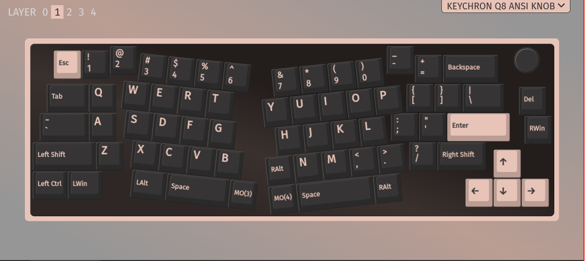
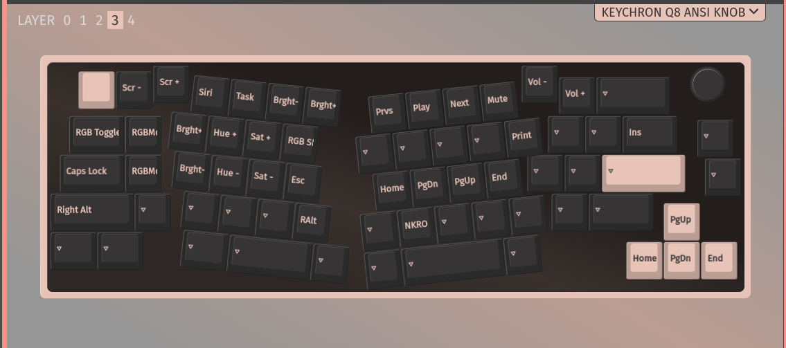
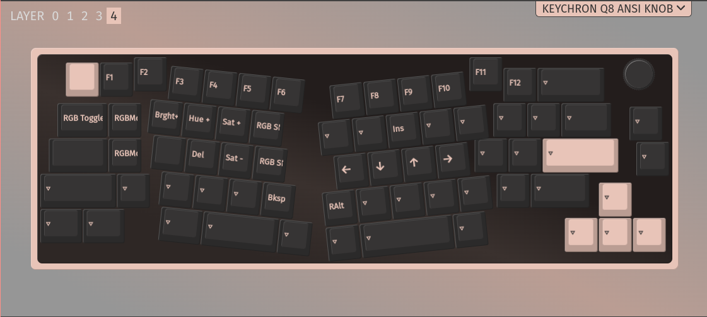

<!-- gid:20251130T091858 -->
[TOC]

[[TIP("이 노트에 대하여")]] 멀티 페어링과 가격, 재질과 사용감까지 고려하며 Alice 계열 키보드를 고르는 고민을 적는다. 키보드가 단순 하드웨어가 아니라 삶의 도구라는 감각이 드러나는 노트다. [[/TIP]] 히스토리 - [2026-06-16 Tue 07:59] 키보드 새로 구입했다. 키크론 V10 Pro 바나나축 택타일 스위치다. - [2026-06-12 Fri 08:33] Q8 갈축 엘리스 키보드가 고장이 났다. 한고무무 키보드를 꺼내서 다시 활용한다. - [2025-11-30 Sun 08:55] 문득 멀티 페어링 이슈로 엘리스 키보드 동향을 조금 알아보던 중에 노트가 없어서 생성. - [2025-06-04 Wed 10:32] 키보드 입력 관련메타 - [ 키보드](https://wikidocs.net/380531)

## 관련노트

-   [힣: 이맥스 학습 의미 - 도구 효율성 가치](https://wikidocs.net/381068)

## @힣 키보드 도구

[2025-11-30 Sun 09:42] 뭔가 남기고 싶은 말은 많지만 일에 쫒기다 보니... 아니다. 하고 싶은게 너무 많아. 그래서 뭐라 주저리 남길 여유가 없구나. 이런 것은 말로 떠드는게 좋아. 단 그렇게 되면 중언부언 헛소리가 될텐데. 그러면 어떤가? 좋다. 사유의 흐름이라고 할까. 텍스트는 가볍다.

[[TIP("질문")]]
| 선택지      | 가격 | 핵심           |
|----------|----|--------------|
| 현상 유지   | 0원  | 터미널 접속으로 해결 가능 |
| V10 Pro Max | 17만원 | 기능은 충분, 플라스틱 |
| Q10 Pro Max | 30만원 | 완전체, 알루미늄 |

V10 Pro Max가 가성비로는 합리적인 선택 같아요. 알루미늄 바디 없이도 기능은 다 되니까요. 13만원 차이는 "묵직함"의 가격인 셈이죠.
[[/TIP]]

## 2022 키크론 키보드 Keychron Q8 Knob

[2024-12-12 Thu 11:17] (“키크론 키보드 Keychron Q8 Knob 앨리스 레이아웃 갈매기” 2022)

-   Q8 Knob 갈축
-   엘리스 레이아웃 갈매기
-   묵직한 바디
-   게이트론 G Pro 갈축 - Tactile 텍타일

### Keychron Q8 VIA Configuration

-   [2025-06-25 Wed 16:21] tempel을 사용하고 있다.
-   [2023-10-16 Mon 06:17] 설정을 기록해 놓으려고 한다. 헷갈린다.이미지는 이렇게 넣으라. `M-/` hippie-expand

#### 설정 스크린샷

## 로그
