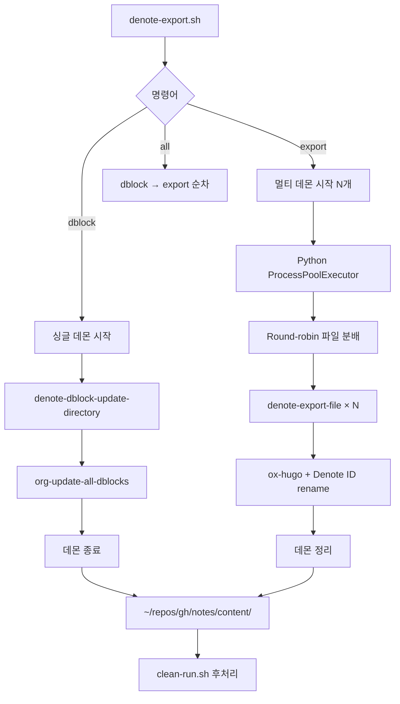

<!-- gid:20251221T120044 -->
<!-- provenance:source:start -->
[[TIP("원본·최신본")]]
이 페이지는 한국어 검색과 읽기를 위한 WikiDocs 미러입니다. [원본·최신본은 가든](https://notes.junghanacs.com/notes/20251221T120044/)에 있습니다. 최신 수정 내용·백링크·태그·히스토리·댓글·출처 정보는 원본 가든에서 확인하세요.

- 작성: `2025-12-21T12:00:00+09:00`
- 최근 수정: `2026-06-08T10:35:00+09:00`
[[/TIP]]
<!-- provenance:source:end -->

[TOC]

## 히스토리

-   [2026-06-08 Mon] Understanding 패스 — 호출 그래프/4분류 고정 (헤딩1 추가). 정리 작업 전 손대지 않고 지도부터.
-   [2026-06-08 Mon 10:35] 업데이트하자
-   [2025-12-21 Sun 12:00] 생성

## 관련노트

-   [힣: doomemacs-config 간결 실용 심플 텍스트 도구 닷파일: 이맥스 스타터키트](https://wikidocs.net/381314)

## 메타노트

-   [내보내기 업데이트 개정 갱신](https://wikidocs.net/380836)

## [2025-12-21 Sun 12:00] Denote 노트를 Hugo로 내보내는 통합 시스템

### Overview

Denote 노트를 Hugo로 내보내는 통합 시스템. dblock 업데이트와 export를 하나의 워크플로우로 관리.

#### 주요 기능

-   **통합 관리**: dblock 갱신 + Hugo export를 단일 스크립트로
-   **Daemon 기반**: 패키지 로딩 1회, 18x 성능 향상
-   **Unicode 완벽 지원**: NBSP(U+00A0), 한글, 특수문자 안전 처리
-   **Bibliography 통합**: Citar/org-cite로 인용 링크 자동 생성
-   **메모리 관리**: 주기적 GC로 2000+ 파일 안정 처리

#### 성능

| 작업                 | 파일 수 | 시간 | 속도          |
|--------------------|------|----|-------------|
| dblock (순차)        | 530   | ~11초 | 50 files/sec  |
| export (병렬 2 daemon) | 1,976 | ~33분 | 1.0 files/sec |
| export (병렬 4 daemon) | 1,976 | ~18분 | 1.8 files/sec |

#### 배포 파이프라인

```text
┌─────────────────────────────────────────────────────────────┐
│                    Digital Garden Pipeline                   │
├─────────────────────────────────────────────────────────────┤
│  1. dblock 갱신     ~/org/meta → denote-links 업데이트      │
│         ↓                                                    │
│  2. Hugo export     ~/org/{meta,bib,notes} → markdown       │
│         ↓                                                    │
│  3. 후처리          clean-run.sh (secretlint, sed)          │
│         ↓                                                    │
│  4. 배포            Quartz build → GitHub Pages              │
└─────────────────────────────────────────────────────────────┘
```

### Architecture

#### 파일 구조 (v2.0 - 통합)

```text
doomemacs-config/
├── bin/
│   ├── denote-export.sh          # 통합 wrapper (dblock + export)
│   ├── denote-export-parallel.py # Python 병렬 처리
│   ├── denote-export.el          # 통합 Elisp (daemon/dblock/export)
│   │
│   ├── [DELETED] denote-export-batch.el      # obsolete
│   ├── [DELETED] denote-export-server.el     # → denote-export.el
│   ├── [DELETED] denote-dblock-batch.el      # → denote-export.el
│   └── [DELETED] denote-dblock-update.sh     # → denote-export.sh
│
├── lisp/
│   └── denote-export.el          # Interactive export 설정
│
└── docs/
    ├── 20251221T120044--denote-export-unified-system.org  # 이 문서
    ├── [LEGACY] 20251027T092900--denote-export-system.org
    └── [LEGACY] 20251110T190854--denote-dblock-update-system.org
```

#### 통합 el 파일 구조

```elisp
;;; bin/denote-export.el --- Unified Denote Export System

;;;; 1. 초기화
;; - gc-cons-threshold (most-positive-fixnum → 16MB)
;; - UI 비활성화 (daemon용)
;; - package.el 비활성화 (ELPA 방지)

;;;; 2. Doom 패키지 로딩
;; - find-straight-build-dir (버전 무관)
;; - load-path + autoloads 설정

;;;; 3. 필수 패키지 require
;; Built-in: org, ox, cl-lib, seq, json, browse-url
;; Doom: dash, denote, ox-hugo, citar, parsebib
;; Org-cite: oc, oc-basic, oc-csl
;; Denote: denote-regexp → denote-org-extras → denote-explore

;;;; 4. 설정 로딩
;; - +user-info.el (config-bibfiles, user-hugo-blog-dir)
;; - lisp/denote-export.el
;; - Bibliography 초기화
;; - 매크로 확장 설정

;;;; 5. Helper 함수들
;; - extract-denote-id-from-filename
;; - get-org-hugo-section-from-path

;;;; 6. Dblock 함수들
;; - denote-dblock-update-file
;; - denote-dblock-update-directory

;;;; 7. Export 함수들
;; - denote-export-file
;; - denote-export-batch-files
;; - denote-export-directory

;;;; 8. 메모리 관리
;; - denote-export-file-counter
;; - denote-export-gc-interval (50 files)
;; - gc-cons-threshold 리셋 (16MB)

;;;; 9. Server 시작
;; - denote-export-server-ready = t
;; - (server-start)
```

#### 처리 흐름



### Usage

#### 명령어 구조

```bash
denote-export.sh <command> [options]

Commands:
  dblock [dir]           # dblock 업데이트 (싱글 데몬)
  export <target> [n]    # Hugo export (멀티 데몬)
  all [n]                # dblock + export 전체

Targets (export):
  all                    # meta, bib, notes 순차
  meta                   # ~/org/meta
  bib                    # ~/org/bib
  notes                  # ~/org/notes
  test                   # ~/org/test (빠른 검증)
  run <dir>              # 커스텀 디렉토리

Options:
  n                      # 데몬 개수 (기본: 2)
```

#### 기본 사용법

```bash
# 전체 배포 (권장)
./bin/denote-export.sh all

# dblock만 갱신 (meta)
./bin/denote-export.sh dblock
./bin/denote-export.sh dblock ~/org/meta

# export만 (특정 디렉토리)
./bin/denote-export.sh export meta 4
./bin/denote-export.sh export notes 2

# 커스텀 디렉토리
./bin/denote-export.sh export run ~/custom/path 4
```

#### 후처리

```bash
cd ~/repos/gh/notes/
./clean-run.sh

# 또는 개별 실행
./lint.sh              # secretlint 검증
./change-text.sh       # sed 치환
npx quartz build       # 정적 사이트 생성
```

### Technical Details

#### 패키지 로딩 (핵심)

Doom Emacs의 straight.el 패키지를 batch/daemon 모드에서 로딩하는 방법:

```elisp
;; 1. ELPA 완전 비활성화 (중요!)
(setq package-enable-at-startup nil)
(setq package-archives nil)
(fset 'package-initialize #'ignore)
(fset 'package-install (lambda (&rest _)
  (error "ELPA is disabled! Use Doom's straight packages only")))

;; 2. straight build 디렉토리 찾기 (버전 무관)
(defun find-straight-build-dir ()
  (let ((base (expand-file-name ".local/straight/" doom-emacs-dir)))
    (when (file-directory-p base)
      (car (sort (directory-files base t "^build-")
                 #'file-newer-than-file-p)))))

;; 3. 패키지 디렉토리 + autoloads 로딩
(let ((build-dir (find-straight-build-dir)))
  (dolist (pkg-dir (directory-files build-dir t "^[^.]" t))
    (add-to-list 'load-path pkg-dir)
    ;; autoloads 파일도 로딩 (중요!)
    (let ((autoload (expand-file-name
                     (concat (file-name-nondirectory pkg-dir)
                             "-autoloads.el")
                     pkg-dir)))
      (when (file-exists-p autoload)
        (load autoload nil t)))))
```

#### 필수 패키지 목록

| 카테고리 | 패키지               | 용도            |
|------|-------------------|---------------|
| Built-in | org, ox              | Org-mode export |
| Built-in | cl-lib, seq          | 리스트 처리     |
| Built-in | json, browse-url     | 유틸리티        |
| Doom     | dash                 | 함수형 유틸     |
| Doom     | denote               | Denote 코어     |
| Doom     | ox-hugo              | Hugo 변환       |
| Doom     | citar, parsebib      | 서지 관리       |
| Org-cite | oc, oc-basic, oc-csl | 인용 처리       |
| Denote   | denote-regexp        | 정규식 (의존성) |
| Denote   | denote-org-extras    | dblock 함수     |
| Denote   | denote-explore       | 매크로          |

#### dblock vs Export 차이

| 항목   | dblock        | export        |
|------|---------------|---------------|
| 파일 의존성 | 상호 참조 (스캔 필요) | 독립적        |
| 병목   | I/O (디렉토리 스캔) | CPU (마크다운 변환) |
| 병렬 효과 | 오히려 느려짐 | 4-8배 향상    |
| 권장 방식 | 순차 (싱글 데몬) | 병렬 (멀티 데몬) |
| 처리 속도 | 50 files/sec  | 1-2 files/sec |

#### Unicode 안전 처리

파일명에 NBSP(U+00A0) 등 특수문자가 있을 때 쉘 quoting 문제 발생:

```python
# ❌ 쉘 명령어로 파일 전달 시 깨짐
subprocess.run(['emacs', '--eval', f'(export "{filepath}")'])

# ✅ Python에서 파일 목록 생성, Elisp에서 직접 처리
org_files = sorted(directory.glob("*.org"))  # Python 유니코드 완벽 지원
for file in org_files:
    # emacsclient로 파일 경로 전달
    elisp_cmd = f'(denote-export-file "{file}")'
```

#### 메모리 관리

2000+ 파일 처리 시 메모리 누수 방지:

```elisp
;; 1. 초기화 시 GC 비활성화 (빠른 로딩)
(setq gc-cons-threshold most-positive-fixnum)

;; 2. 초기화 완료 후 GC 리셋 (16MB)
(setq gc-cons-threshold (* 16 1024 1024))
(garbage-collect)

;; 3. 주기적 GC (50 파일마다)
(defvar denote-export-gc-interval 50)
(defvar denote-export-file-counter 0)

(defun denote-export-file (file)
  (setq denote-export-file-counter (1+ denote-export-file-counter))
  (when (zerop (mod denote-export-file-counter denote-export-gc-interval))
    (garbage-collect))

  ;; 4. 버퍼 정리 (unwind-protect)
  (let ((buf (find-file-noselect file)))
    (unwind-protect
        (with-current-buffer buf
          ;; export 로직
          )
      ;; 항상 버퍼 정리
      (when (buffer-live-p buf)
        (kill-buffer buf)))))
```

#### 데몬 라이프사이클

```python
# 시작
subprocess.Popen(['emacs', '--quick',
                  f'--daemon={daemon_name}',
                  '--load', 'denote-export.el'])

# 준비 대기 (ready flag 체크)
while not ready:
    result = subprocess.run(
        ['emacsclient', '-s', daemon_name,
         '--eval', "(boundp 'denote-export-server-ready)"])
    if 't' in result.stdout:
        ready = True

# 종료
subprocess.run(['emacsclient', '-s', daemon_name,
                '--eval', '(kill-emacs)'])

# 강제 정리 (interrupt 시)
subprocess.run(['pkill', '-f', 'denote-export-daemon'])
```

### Configuration

#### .dir-locals.el 설정

```elisp
;; ~/org/meta/.dir-locals.el
((org-mode . ((org-hugo-section . "meta")
              (org-hugo-base-dir . "~/repos/gh/notes/"))))

;; ~/org/notes/.dir-locals.el
((org-mode . ((org-hugo-section . "notes")
              (org-hugo-base-dir . "~/repos/gh/notes/"))))

;; ~/org/bib/.dir-locals.el
((org-mode . ((org-hugo-section . "bib")
              (org-hugo-base-dir . "~/repos/gh/notes/"))))
```

#### +user-info.el 설정

```elisp
;; Bibliography 파일 경로
(defvar config-bibfiles
  '("~/org/bib/references.bib"
    "~/org/bib/books.bib"))

;; Hugo 블로그 디렉토리
(defvar user-hugo-blog-dir
  (expand-file-name "~/repos/gh/notes/"))

;; Org 디렉토리
(defvar user-org-directory
  (expand-file-name "~/org/"))
```

#### 데몬 개수 권장값

| 시스템 메모리 | 권장 데몬 수 | 비고  |
|---------|---------|-----|
| 8GB     | 2       | 기본값 |
| 16GB    | 4       | 안정적 |
| 32GB+   | 8       | 최대 성능 |

### Troubleshooting

#### 데몬 좀비 프로세스

```bash
# 상태 확인
ps aux | grep denote-export-daemon

# 강제 종료
pkill -f "denote-export-daemon"

# 소켓 정리
rm -f /tmp/emacs$(id -u)/denote-export-daemon-*
```

#### 패키지 로딩 실패

```bash
# 에러: "dash not found in Doom"
# 해결: Doom 패키지 재빌드
doom sync
doom build
```

#### dblock 업데이트 에러

```nil
에러: "Error during update of dynamic block"

원인:
- denote-org-extras 미로딩 (seq 누락 등)
- denote-directory 미설정

해결:
1. denote-export.el에서 (require 'seq) 확인
2. (setq denote-directory "~/org/") 확인
```

#### Export 실패 (개별 파일)

```elisp
;; 테스트
(find-file "~/org/notes/test.org")
(org-hugo-export-to-md)

;; 로그 확인
(switch-to-buffer "*Messages*")
```

#### Ctrl+C 인터럽트 후 정리

```bash
# Python 스크립트는 signal handler로 자동 정리
# 만약 남아있다면:
pkill -f "denote-export-daemon"
```

### Migration from Legacy

#### 기존 파일 매핑

| 기존 파일               | 새 파일          | 비고         |
|---------------------|---------------|------------|
| denote-export-server.el | denote-export.el | rename + 통합 |
| denote-dblock-batch.el  | denote-export.el | 함수 통합    |
| denote-export-batch.el  | (삭제)           | obsolete     |
| denote-dblock-update.sh | denote-export.sh | dblock 명령 통합 |

#### 명령어 매핑

| 기존 명령                              | 새 명령                            |
|------------------------------------|---------------------------------|
| `./denote-dblock-update.sh ~/org/meta` | `./denote-export.sh dblock`        |
| `./denote-export.sh meta 4`            | `./denote-export.sh export meta 4` |
| (수동 순차)                            | `./denote-export.sh all`           |

### Performance History

#### v1.0 → v2.0 개선

| 버전 | 방식         | 1962 파일 시간 | 속도           |
|----|------------|------------|--------------|
| v1.0 | Batch 순차   | ~10시간    | 0.05 files/sec |
| v1.3 | Daemon 순차  | ~2.5시간   | 0.22 files/sec |
| v1.4 | Daemon 병렬(4) | ~18분      | 1.8 files/sec  |
| v2.0 | 통합 + 최적화 | ~15분 (예상) | 2.0+ files/sec |

#### 개선 포인트 (v2.0)

-   패키지 로딩 통합 (dblock + export 동일 환경)
-   seq 패키지 누락 수정
-   데몬 라이프사이클 통합 관리
-   메모리 관리 일원화

### Changelog

#### [2025-12-21 Sun] v2.0.0 - Unified System

##### 주요 변경

-   denote-export.el 통합 (server + dblock)
-   denote-export.sh에 dblock 명령 추가
-   obsolete 파일 삭제 (batch.el, dblock-update.sh)
-   패키지 로딩 버그 수정 (seq 누락)

##### 파일 구조 개선

-   8개 → 4개 파일로 단순화
-   단일 el 파일로 관리 용이성 향상
-   문서 통합

#### [2025-12-17 Wed] v1.5.x - Memory Management

-   gc-cons-threshold 리셋 (16MB)
-   주기적 GC (50 파일마다)
-   기본 데몬 4 → 2개로 감소 (안정성)

#### [2025-10-29 Wed] v1.4.0 - Production Ready

-   server-start 누락 해결
-   Unicode 파일명 완벽 지원
-   1961 파일 100% 성공률

#### [2025-10-28 Tue] v1.3.0 - Server Mode

-   Daemon 방식 도입 (18x 성능 향상)
-   파일명 기반 Denote ID 추출
-   디렉토리 기반 Section 자동 결정

### References

-   [Denote Manual](https://protesilaos.com/emacs/denote)
-   [ox-hugo Documentation](https://ox-hugo.scripter.co/)
-   [denote-explore](https://github.com/pprevos/denote-explore)
-   [org-dblock Manual](https://orgmode.org/manual/Dynamic-Blocks.html)

### Legacy Documents

이 문서는 다음 문서들을 통합/대체합니다:

-   [Denote Export System (Legacy)]
-   [Denote dblock Update System (Legacy)]

## [2026-06-08 Mon] export 파이프라인 정리 패스 — Understanding 고정

이 시스템은 가든 export의 핵심이고, "잘 동작하지만 깨지기 쉬운" 로직이다. ox-hugo / org / denote가 바뀌면 터질 수 있다. 그래서 정리(리팩터/제거)에 들어가기 전, 손대지 않고 \*호출 그래프와 분류부터 고정\*한다. 이 패스는 read-only로 코드를 실측해 작성했다 (Claude Understanding + GPT 교차검토).

### 검증된 LIVE 호출 그래프

자동 export의 실제 경로는 `run.sh` 중심이다 (아래 Architecture 섹션의 옛 `denote-export.sh` 중심 서술은 stale — 이 헤딩 마지막 참조).

```text
run.sh export
  └─ cmd_export_all()                       # 폴더 루프: meta bib notes botlog
       └─ python3 bin/denote-export-parallel.py export <dir> <jobs> [--force]
            ├─ emacs --quick --daemon=denote-export-daemon-N --load bin/denote-export.el
            ├─ (boundp 'denote-export-server-ready) 폴링 대기
            └─ emacsclient --eval 로 export 잡 디스패치
                 └─ bin/denote-export.el (데몬 서버)
                      └─ (load "lisp/denote-export-config.el")   # 핵심 로직 1045줄
  └─ trap cleanup: pkill -f denote-export-daemon                 # cleanup은 run.sh가 담당
```

N개 배치 프로세스가 아니라 persistent emacs 데몬에 emacsclient로 잡을 밀어넣는 구조. cleanup 책임은 run.sh의 trap에 있다.

### 4분류 — 정리 대상 식별

| 분류                            | 대상                                                                                                  | 근거 (<line>)                                                                                                                                                                                        |
|-------------------------------|-----------------------------------------------------------------------------------------------------|----------------------------------------------------------------------------------------------------------------------------------------------------------------------------------------------------|
| **자동경로 (LIVE)**             | `run.sh`, `bin/denote-export-parallel.py`, `bin/denote-export.el`, `lisp/denote-export-config.el` 대부분 | 위 호출 그래프                                                                                                                                                                                       |
| **manual legacy / 자동경로 고아** | `bin/denote-export.sh`                                                                                | self-doc "py를 쉽게 실행하는 wrapper". run.sh는 py를 직접 호출. trap도 run.sh가 중복 보유. repo에서 유일 참조처는 `tests/test_bash_cleanup.sh`                                                       |
| **stale reference (LIVE 파일 안)** | `my/update-dblock-export-garden-all-parallel`                                                         | `denote-export-config.el:970` 이 존재하지 않는 `bin/denote-export-parallel.sh` 를 찾음. interactive M-x surface지만 실행 시 sequential export로 fallback. 옛 .sh 병렬 모델 잔재                      |
| **Tier C (test)**               | `tests/test-denote-export.el`                                                                         | dead-path `../+denote-export.el` 로드 시도 → 실제 함수 `my/denote-link-ol-export` 는 `denote-export-config.el:461`. 그 파일은 top-level에서 `(require 'ox-hugo)` 하므로 `emacs -Q` 로 못 띄움 → 핵심 link-export 테스트 5개 SKIP |

**manual legacy 처리 분기** (바로 삭제 아님): GLG가 손으로 `bin/denote-export.sh` 를 돌리는가? → 안 쓰면 deprecated 표기 후 제거 후보 (+ `test_bash_cleanup.sh`). 가끔 쓰면 `run.sh export` 로 위임하는 얇은 wrapper로 축소.

**Tier C 처리 분기**: `emacs -Q` 에 ox-hugo를 억지로 끌어오면 "Tier A = vanilla" 불변식이 깨진다. → (1) broken-link fallback 순수 분기를 작은 helper로 추출해 Tier A 테스트, 또는 (2) ox-hugo/denote/straight를 로드하는 별도 integration runner(Tier C)에서 in-place 테스트. 목표는 SKIP 0개가 아니라 SKIP 의미의 정확한 분류.

### 이 문서(가이드) 자체의 stale 지점

위 Architecture 섹션(v2.0)은 현재 `run.sh` 중심 파이프라인 이전 시점이라 다음이 어긋난다 — 정리 시 같이 갱신할 후보:

-   `bin/denote-export.sh` 를 통합 진입점으로 서술 (실제 진입점은 `run.sh export`).
-   파일명 `lisp/denote-export.el` 로 표기 — 실제는 `lisp/denote-export-config.el`.
-   노트 위치를 `docs/` 로 표기 — 실제는 Denote `~/org/notes` 코퍼스.
-   처리 흐름 mermaid가 `denote-export.sh` 진입으로 시작, `run.sh` 미언급.

### 다음 작업

작업 항목은 `doomemacs-config/NEXT.md` 에 나열한다. 이 헤딩은 "왜/ 무엇을"의 지도이고, NEXT는 "다음 한 걸음"의 체크리스트다. 핵심 원칙: 리팩터 전 characterization test 선행, 자동경로 로직은 동작 보존, 분류부터 문서로 고정.
