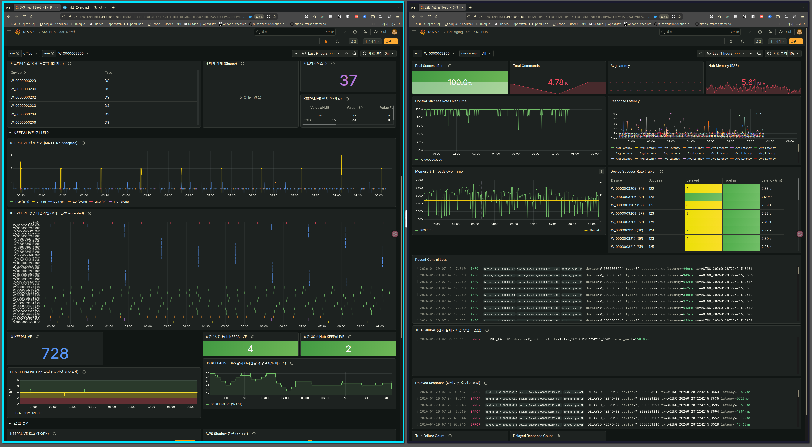

<!-- gid:20260117T182104 -->
[[TIP("이 노트에 대하여")]] Grafana와 Loki 무료 티어를 이용해 허브 디바이스 로그를 수집·시각화하는 구조를 정리한다. 관측 가능성과 운영 가시성을 확보하는 실전 로깅 노트다. [[/TIP]] 히스토리 - [2026-02-03 Tue 10:31] 잘쓰고 있다. 아래 에이징 결과 이미지 첨부 - [2026-01-21 Wed 22:29] 잘된다. 매우 좋구나. - [2026-01-17 Sat] Grafana Cloud Loki 무료 티어로 허브 디바이스 로깅 시스템 구축 완료 <span class="org-todo done DONE">DONE</span> 09:20 에이징 9시간 결과  관련노트 - [힣: 나는허브다 - 상태머신과 에이전트 협업](https://notes.junghanacs.com/notes/20251212T162004/)
-   [¤prometheus ¤grafana 클러스터 통합 인프라 모니터링 허브 - 시각화 대시보드]

### Grafana Server | Smithery

(“Grafana Server” n.d.)

## Grafana Cloud Loki 허브 디바이스 로깅 시스템

### 들어가며: 왜 Grafana Cloud Loki인가

IoT 허브 디바이스가 현장에 배포되면, 원격 로그 수집과 분석이 필수다. 별도 서버 구축 없이 무료로 시작할 수 있는 Grafana Cloud Loki를 선택했다.

#### 요구사항

1.  **원격 로그 수집** — 현장 배포 디바이스의 실시간 로그
2.  **체계 보고 시스템** — 상태머신 이벤트 추적 가능
3.  **무료 티어** — 초기 비용 없이 시작
4.  **통합 시각화** — Grafana 대시보드로 한눈에 파악

### Grafana Cloud 무료 티어 제한사항

#### 핵심 제한

| 항목   | 무료 티어 제공량 | 비고               |
|------|-----------|------------------|
| 로그 수집량 | **월 50GB** | 초과 시 0.50 달러/GB |
| 보존 기간 | **14일**   | 오래된 로그 자동 삭제 |
| 팀 멤버 | 최대 3명   |                    |
| 메트릭 | 10K 시계열 | Prometheus 메트릭  |
| 트레이스 | 50GB       | OpenTelemetry 트레이스 |

#### 50GB/월 커버 가능 규모

| 디바이스 타입 | 로그 크기/빈도   | 하루 사용량 | 월 사용량 | 커버 대수 |
|---------|------------|--------|-------|-------|
| 저용량 센서 | 1KB/로그, 초당 1개 | ~86MB  | ~2.6GB | 15~20대 |
| 중용량 허브 | 10KB/로그, 분당 1개 | ~14MB  | ~420MB | ~100대 |
| 고용량 게이트웨이 | 100KB/로그, 분당 10개 | ~1.4GB | ~42GB  | 1~2대  |

#### 권장 전략

1.  **로그 필터링** — ERROR, WARN, 핵심 INFO만 수집
2.  **샘플링** — 반복 로그는 주기적 샘플링
3.  **보존 기간** — 14일 제한 고려, 중요 로그는 별도 아카이빙
4.  **사용량 모니터링** — Grafana Cloud 대시보드에서 실시간 추적

### 구축 결과: 로그 전송 성공

#### 확인된 로그 (2026-01-17 17:30~17:51)

```text
📊 확인 결과
- 데이터소스: grafanacloud-jhkim2tbdhny-logs (Loki)
- 쿼리: {source="fxf-uho-mvt"}
- 총 로그 건수: 5 lines
- 처리된 데이터: 387 B
- 시간 범위: Last 1 hour
```

#### 수신된 로그 패턴

```text
2026-01-17 17:51:08.000 - [>>] TEST: Grafana Loki Japan 연동 테스트
2026-01-17 17:30:00.305 - [<<] SHADOW publish control txn=abc result=success
2026-01-17 17:30:00.300 - [<-] ZIGBEE callback mac=00:11:22 on=true rssi=-45
2026-01-17 17:30:00.150 - [->] ZIGBEE send mac=00:11:22 cmd=on
2026-01-17 17:30:00.123 - [>>] SHADOW delta cmd=action device=W_123 txn=abc
```

#### 로그 패턴 분석

"나는허브다" 아키텍처의 로그 지침에서 정의한 패턴이 모두 확인되었다:

| 패턴   | 의미                     | 확인 |
|------|------------------------|----|
| `[>>]` | SHADOW delta 명령 수신   | ✅ |
| `[->]` | ZIGBEE 전송 (허브 → 하위 디바이스) | ✅ |
| `[<-]` | ZIGBEE 콜백 (하위 디바이스 → 허브) | ✅ |
| `[<<]` | SHADOW 퍼블리시 결과 전송 | ✅ |

#### Common Labels

```text
env=dev
hub_id=test-laptop
service_name=unknown_service
```

### 쿼리 문법 및 주의사항

#### 성공한 쿼리

```logql
{source="fxf-uho-mvt"}
```

#### 실패한 쿼리

```logql
{hub_id="test-laptop"}  # label selector 오류
```

**주의**: Loki는 label 기반 필터링이므로, 전송 시 올바른 label을 설정해야 한다.

### 허브 아키텍처와의 통합

#### 로그 전송 파이프라인

```text
┌─────────────────────────────────────────────────────────────────────┐
│                     허브 로깅 파이프라인                             │
├─────────────────────────────────────────────────────────────────────┤
│                                                                     │
│  ┌──────────────┐    ┌──────────────┐    ┌──────────────┐          │
│  │  HubState    │───►│ transition() │───►│   Event      │          │
│  │              │    │              │    │   Queue      │          │
│  └──────────────┘    └──────────────┘    └──────┬───────┘          │
│                                                  │                  │
│                                                  ▼                  │
│                                          ┌───────────────┐          │
│                                          │  Log Emit     │          │
│                                          │  [>>][->][<-] │          │
│                                          └───────┬───────┘          │
│                                                  │                  │
│                                                  ▼                  │
│                                          ┌───────────────┐          │
│                                          │  Grafana      │          │
│                                          │  Cloud Loki   │          │
│                                          │  (50GB/월)    │          │
│                                          └───────────────┘          │
│                                                                     │
└─────────────────────────────────────────────────────────────────────┘
```

#### 상태머신 이벤트와 로그 매핑

| 상태머신 이벤트 | 로그 패턴     | 예시                                     |
|----------|-----------|----------------------------------------|
| Shadow delta 수신 | `[>>] SHADOW` | `[>>] SHADOW delta cmd=action`           |
| Zigbee 명령 전송 | `[->] ZIGBEE` | `[->] ZIGBEE send mac=AA:BB cmd=on`      |
| Zigbee 콜백 수신 | `[<-] ZIGBEE` | `[<-] ZIGBEE callback mac=AA:BB on=true` |
| Shadow 퍼블리시 | `[<<] SHADOW` | `[<<] SHADOW publish control result=ok`  |
| OTA 시작        | `[INFO]`      | `[INFO] OTA download started`            |
| 에러 발생       | `[ERROR]`     | `[ERROR] MQTT connection failed`         |

#### 핵심 장점: 결정론적 로그

"나는허브다" 아키텍처는 순수 함수 기반 상태머신이므로:

1.  **재현 가능** — 같은 Event 시퀀스면 같은 로그
2.  **추적 가능** — 로그만으로 상태 전이 재구성 가능
3.  **디버깅 용이** — 타임스탬프 + Event로 문제 지점 특정

<!--listend-->

```zig
// core/transition.zig
pub fn transition(state: HubState, event: Event) TransitionResult {
    // 부작용 없음 — 로그도 Output으로 발행
    log.info("[>>] SHADOW delta cmd={s}", .{event.shadow.command});

    return .{
        .next_state = calculateNextState(state, event),
        .actions = determineActions(state, event),
    };
}
```

### 대시보드 구성 (예정)

#### 필수 대시보드

1.  **디바이스 상태** — 각 허브의 연결 상태, 배터리, RSSI
2.  **이벤트 타임라인** — Shadow delta, Zigbee 명령 시퀀스
3.  **에러 집계** — ERROR/WARN 로그 통계
4.  **OTA 진행도** — 펌웨어 업데이트 현황

#### LogQL 쿼리 예시

```logql
# 최근 1시간 에러 로그
{source="fxf-uho-mvt"} |= "ERROR"

# 특정 허브의 Zigbee 명령
{source="fxf-uho-mvt", hub_id="W_0000003100"} |= "ZIGBEE"

# Shadow 퍼블리시 실패 건수
sum(count_over_time({source="fxf-uho-mvt"} |= "SHADOW" |= "failed" [1h]))
```

### 보안 및 인증

#### 네트워크 보안

-   **TLS 필수** — Loki 전송은 HTTPS만 허용
-   **토큰 보호** — 디바이스 펌웨어에 암호화 저장
-   **Rate Limiting** — 과도한 로그 전송 시 자동 차단

### 확장 계획

#### 단계별 확장 시나리오

| 단계    | 디바이스 수 | 월 로그량 | 예상 비용 | 대응 방안           |
|-------|--------|-------|-------|-----------------|
| Phase 1 | 1~10대  | ~5GB    | 무료    | 현재 구성           |
| Phase 2 | 10~50대 | ~25GB   | 무료    | 로그 필터링 강화    |
| Phase 3 | 50~100대 | 50~70GB | 10 달러/월 | 샘플링 + 종량제     |
| Phase 4 | 100대+  | 100GB+  | 50 달러/월 | Self-hosted Loki 검토 |

#### Self-hosted Loki 전환 시점

무료 티어를 초과하는 시점에:

1.  **비용 분석** — Grafana Cloud vs AWS EC2 비용 비교
2.  **운영 부담** — 서버 관리 인력 고려
3.  **데이터 보존** — 14일 이상 장기 보관 필요 시

> "초기에는 무료 티어로 빠르게 시작하고, 스케일 증가 시 Self-hosted로 전환하는 것이 합리적이다."

### 결론: 체계 보고 시스템 완성

Grafana Cloud Loki 무료 티어로:

1.  ✅ **원격 로그 수집** — 현장 디바이스 로그 실시간 확인
2.  ✅ **상태머신 추적** — Event 시퀀스 재구성 가능
3.  ✅ **비용 제로** — 월 50GB 무료 범위 내 운영
4.  ✅ **시각화 준비** — 대시보드 구축 기반 마련

"나는허브다" 아키텍처의 결정론적 로그는 Loki와 완벽하게 매칭된다. 상태머신의 모든 전이가 로그로 남고, 이를 쿼리하여 디버깅과 모니터링이 가능하다.

> "로그는 단순한 디버그 출력이 아니다. 시스템의 상태 전이를 기록하는 영구 타임라인이다." — 나는허브다

---

_작성: Claude Code_ _날짜: 2026-01-17_ _프로젝트: SKS Hub Device (Zig + AWS IoT)_
